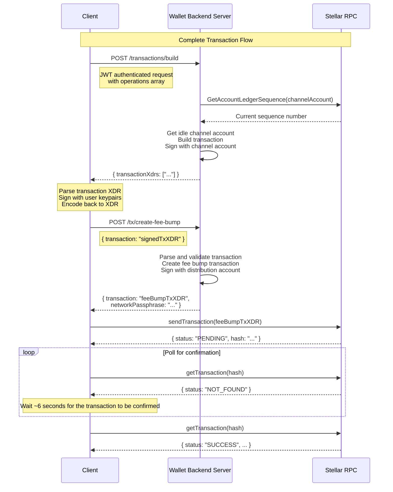

# Wallet-Backend

[](https://petstore.swagger.io/?url=https://raw.githubusercontent.com/stellar/wallet-backend/refs/heads/main/openapi/main.yaml)
[](https://deepwiki.com/stellar/wallet-backend)
[](https://hub.docker.com/r/stellar/wallet-backend/tags)

The wallet-backend serves as a backend service for Stellar wallet applications, providing transaction submission,
account management, and payment tracking capabilities.

## Table of Contents

- [Wallet-Backend](#wallet-backend)
  - [Table of Contents](#table-of-contents)
  - [Overview](#overview)
  - [Usage](#usage)
    - [Transaction Building and Fee Bump](#transaction-building-and-fee-bump)
      - [Complete Transaction Flow](#complete-transaction-flow)
    - [State Changes Indexer and History API](#state-changes-indexer-and-history-api)
    - [GraphQL API](#graphql-api)
      - [Getting Started](#getting-started)
      - [Queries](#queries)
      - [Mutations](#mutations)
      - [Pagination](#pagination)
      - [State Changes](#state-changes)
      - [Error Handling](#error-handling)
      - [Performance Features](#performance-features)
  - [Local Development Setup](#local-development-setup)
    - [Prerequisites](#prerequisites)
    - [Running the Server](#running-the-server)
      - [Docker Compose (Quickstart)](#docker-compose-quickstart)
      - [Local + Docker (Active Development)](#local--docker-active-development)
    - [Testing](#testing)
      - [Unit Tests](#unit-tests)
      - [Integration Tests](#integration-tests)
  - [Authentication](#authentication)
    - [JWT Signature](#jwt-signature)
    - [JWT Claims](#jwt-claims)
  - [Docker Hub Publishing](#docker-hub-publishing)
    - [Push to `develop`](#push-to-develop)
    - [GitHub Release](#github-release)
    - [Pre-release](#pre-release)

## Overview

The wallet-backend service provides several key functionalities:

- **Account Management**: Registration, deregistration, and sponsored account creation
- **Transaction Submission**: Reliable transaction building, submission, and status tracking
- **Payment History**: Tracking and querying of payment records
- **Channel Account Management**: Creation and management of channel accounts for transaction signing
- **Security**: Request authentication and signature verification

## Usage

The wallet-backend provides two core services that simplify Stellar transaction management for wallet applications:

### Transaction Building and Fee Bump

1. **Transaction Building** (`POST /transactions/build`):
   - Uses pre-funded channel accounts to handle sequence numbers automatically
   - Provides high throughput by eliminating client-side sequence number management
   - Returns signed transaction XDRs ready for client signature

2. **Fee Bump Transactions** (`POST /tx/create-fee-bump`):
   - Automatically creates and signs fee bump transactions
   - Uses a distribution account to cover transaction fees
   - Returns a complete fee bump transaction ready for submission

#### Complete Transaction Flow

The following diagram illustrates the complete transaction lifecycle:



### State Changes Indexer and History API

🚧 This is a work in progress.

### GraphQL API

The wallet-backend provides a powerful GraphQL API that enables flexible querying of blockchain data including transactions, operations, accounts, and state changes. The GraphQL API is designed for applications that need efficient, customizable data retrieval with strong typing and introspection capabilities.

**Key Benefits:**
- **Flexible Queries**: Request exactly the data you need, nothing more
- **Strong Typing**: Full type safety with schema introspection
- **Efficient Data Loading**: Built-in DataLoaders prevent N+1 queries
- **Cursor-based Pagination**: Relay-style pagination for all list queries
- **Rich Relationships**: Easily traverse relationships between accounts, transactions, operations, and state changes

#### Getting Started

**Endpoint**: `POST /graphql`

**Authentication**: All GraphQL requests require JWT authentication. See the [Authentication](#authentication) section for details.

**Quick Example:**

```bash
curl -X POST http://localhost:8080/graphql \
  -H "Content-Type: application/json" \
  -H "Authorization: Bearer YOUR_JWT_TOKEN" \
  -d '{
    "query": "{ transactionByHash(hash: \"abc123...\") { hash ledgerNumber envelopeXdr } }"
  }'
```

**Schema Introspection:**

You can explore the full schema using GraphQL introspection:

```graphql
query {
  __schema {
    types {
      name
      description
    }
  }
}
```

#### Queries

The GraphQL API provides six root queries for accessing blockchain data:

##### 1. Get Transaction by Hash

Retrieve a specific transaction by its hash.

```graphql
query GetTransaction {
  transactionByHash(hash: "abc123...") {
    hash
    envelopeXdr
    resultXdr
    metaXdr
    ledgerNumber
    ledgerCreatedAt
    ingestedAt

    # Related data
    accounts {
      address
    }

    operations(first: 10) {
      edges {
        node {
          id
          operationType
        }
      }
    }
  }
}
```

##### 2. List All Transactions

Query transactions with cursor-based pagination.

```graphql
query ListTransactions {
  transactions(first: 10, after: "cursor123") {
    edges {
      node {
        hash
        ledgerNumber
        ledgerCreatedAt
      }
      cursor
    }
    pageInfo {
      hasNextPage
      hasPreviousPage
      startCursor
      endCursor
    }
  }
}
```

**Pagination Parameters:**
- `first: Int` - Return the first N items (forward pagination)
- `after: String` - Return items after this cursor
- `last: Int` - Return the last N items (backward pagination)
- `before: String` - Return items before this cursor

Note that you can only use `first/after` and `last/before`. Any other combination will result in an error.

##### 3. Get Account by Address

Retrieve account information and related data.

```graphql
query GetAccount {
  accountByAddress(address: "GABC...") {
    address

    # Related transactions
    transactions(first: 10) {
      edges {
        node {
          hash
          ledgerNumber
        }
      }
      pageInfo {
        hasNextPage
      }
    }

    # Related operations
    operations(first: 20) {
      edges {
        node {
          id
          operationType
          operationXdr
        }
      }
    }

    # Related state changes
    stateChanges(first: 50) {
      edges {
        node {
          ... on StandardBalanceChange {
            type
            reason
            tokenId
            amount
            ledgerNumber
          }
          ... on SignerChange {
            type
            reason
            signerAddress
            signerWeights
          }
        }
      }
    }
  }
}
```

##### 4. List All Operations

Query operations across all transactions.

```graphql
query ListOperations {
  operations(first: 20) {
    edges {
      node {
        id
        operationType
        operationXdr
        ledgerNumber
        ledgerCreatedAt

        # Parent transaction
        transaction {
          hash
          envelopeXdr
        }

        # Related accounts
        accounts {
          address
        }
      }
      cursor
    }
    pageInfo {
      hasNextPage
      endCursor
    }
  }
}
```

**Operation Types:**

The `operationType` field supports all Stellar operation types:
- `CREATE_ACCOUNT`, `PAYMENT`, `PATH_PAYMENT_STRICT_RECEIVE`, `PATH_PAYMENT_STRICT_SEND`
- `MANAGE_SELL_OFFER`, `CREATE_PASSIVE_SELL_OFFER`, `MANAGE_BUY_OFFER`
- `SET_OPTIONS`, `CHANGE_TRUST`, `ALLOW_TRUST`, `ACCOUNT_MERGE`
- `MANAGE_DATA`, `BUMP_SEQUENCE`
- `CREATE_CLAIMABLE_BALANCE`, `CLAIM_CLAIMABLE_BALANCE`
- `BEGIN_SPONSORING_FUTURE_RESERVES`, `END_SPONSORING_FUTURE_RESERVES`, `REVOKE_SPONSORSHIP`
- `CLAWBACK`, `CLAWBACK_CLAIMABLE_BALANCE`, `SET_TRUST_LINE_FLAGS`
- `LIQUIDITY_POOL_DEPOSIT`, `LIQUIDITY_POOL_WITHDRAW`
- `INVOKE_HOST_FUNCTION`, `EXTEND_FOOTPRINT_TTL`, `RESTORE_FOOTPRINT` (Soroban)

##### 5. Get Operation by ID

Retrieve a specific operation by its ID.

```graphql
query GetOperation {
  operationById(id: 12345) {
    id
    operationType
    operationXdr
    ledgerNumber
    ledgerCreatedAt

    transaction {
      hash
      ledgerNumber
    }

    accounts {
      address
    }

    stateChanges(first: 10) {
      edges {
        node {
          ... on StandardBalanceChange {
            tokenId
            amount
          }
        }
      }
    }
  }
}
```

##### 6. List State Changes

Query all state changes.

```graphql
query ListStateChanges {
  stateChanges(first: 50) {
    edges {
      node {
        # Common fields (available on all state change types)
        type
        reason
        ledgerNumber
        ledgerCreatedAt
        ingestedAt

        account {
          address
        }

        operation {
          id
          operationType
        }

        transaction {
          hash
        }

        # Type-specific fields using fragments
        ... on StandardBalanceChange {
          tokenId
          amount
        }

        ... on AccountChange {
          tokenId
          amount
        }

        ... on SignerChange {
          signerAddress
          signerWeights
        }

        ... on SignerThresholdsChange {
          thresholds
        }

        ... on MetadataChange {
          keyValue
        }

        ... on FlagsChange {
          flags
        }

        ... on TrustlineChange {
          limit
        }

        ... on ReservesChange {
          sponsoredAddress
          sponsorAddress
        }

        ... on BalanceAuthorizationChange {
          flags
          keyValue
        }
      }
      cursor
    }
    pageInfo {
      hasNextPage
      endCursor
    }
  }
}
```

#### Mutations

The GraphQL API provides four mutations for managing accounts and transactions:

##### 1. Register Account

Register an account to start tracking its state changes.

```graphql
mutation RegisterAccount {
  registerAccount(input: { address: "GABC..." }) {
    success
    account {
      address
    }
  }
}
```

**Error Codes:**
- `ACCOUNT_ALREADY_EXISTS` - Account is already registered
- `INVALID_ADDRESS` - Invalid Stellar address format
- `ACCOUNT_REGISTRATION_FAILED` - Registration failed

##### 2. Deregister Account

Remove an account from tracking.

```graphql
mutation DeregisterAccount {
  deregisterAccount(input: { address: "GABC..." }) {
    success
    message
  }
}
```

**Error Codes:**
- `ACCOUNT_NOT_FOUND` - Account does not exist
- `ACCOUNT_DEREGISTRATION_FAILED` - Deregistration failed

##### 3. Build Transaction

Build and sign a transaction using channel accounts.

```graphql
mutation BuildTransaction {
  buildTransaction(
    input: {
      transactionXdr: "AAAAA..."
      simulationResult: {
        transactionData: "AAA..."
        minResourceFee: "100"
        latestLedger: 12345
        events: ["event1", "event2"]
        results: ["result1"]
      }
    }
  ) {
    success
    transactionXdr
  }
}
```

**Input Fields:**
- `transactionXdr` (required): Base64-encoded transaction envelope XDR
- `simulationResult` (optional): For Soroban transactions, include simulation results
  - `transactionData`: Base64-encoded Soroban transaction data
  - `minResourceFee`: Minimum resource fee as string
  - `latestLedger`: Latest ledger number from simulation
  - `events`: Array of event XDRs
  - `results`: Array of result XDRs
  - `error`: Error message if simulation failed

**Error Codes:**
- `INVALID_TRANSACTION_XDR` - Cannot parse transaction XDR
- `INVALID_OPERATION_STRUCTURE` - Invalid operation structure (timeout, missing source, etc.)
- `INVALID_SOROBAN_TRANSACTION` - Invalid Soroban transaction (operation count, simulation issues)
- `CHANNEL_ACCOUNT_UNAVAILABLE` - No idle channel accounts available
- `FORBIDDEN_SIGNER` - Unauthorized signer for transaction
- `TRANSACTION_BUILD_FAILED` - General build failure

##### 4. Create Fee Bump Transaction

Wrap a signed transaction in a fee bump transaction and sign it using the wallet backend's distribution account.

```graphql
mutation CreateFeeBump {
  createFeeBumpTransaction(input: { transactionXdr: "AAAAA..." }) {
    success
    transaction
    networkPassphrase
  }
}
```

**Error Codes:**
- `INVALID_TRANSACTION_XDR` - Cannot parse transaction XDR
- `FEE_BUMP_TX_NOT_ALLOWED` - Cannot wrap an existing fee bump transaction
- `INVALID_TRANSACTION` - Invalid transaction structure
- `FEE_EXCEEDS_MAXIMUM` - Fee exceeds maximum allowed (includes `maximumBaseFee` in extensions)
- `NO_SIGNATURES_PROVIDED` - Transaction has no signatures
- `ACCOUNT_NOT_ELIGIBLE_FOR_BEING_SPONSORED` - Account cannot be sponsored
- `FEE_BUMP_CREATION_FAILED` - General creation failure

#### Pagination

The API uses **Relay-style cursor-based pagination** for all list queries. This provides stable pagination even when data changes.

**Forward Pagination:**

```graphql
# Get first page
query {
  transactions(first: 10) {
    edges {
      node { hash }
      cursor
    }
    pageInfo {
      hasNextPage
      endCursor
    }
  }
}

# Get next page
query {
  transactions(first: 10, after: "endCursorFromPreviousPage") {
    edges {
      node { hash }
      cursor
    }
    pageInfo {
      hasNextPage
      endCursor
    }
  }
}
```

**Backward Pagination:**

```graphql
# Get last page
query {
  transactions(last: 10) {
    edges {
      node { hash }
      cursor
    }
    pageInfo {
      hasPreviousPage
      startCursor
    }
  }
}

# Get previous page
query {
  transactions(last: 10, before: "startCursorFromCurrentPage") {
    edges {
      node { hash }
      cursor
    }
    pageInfo {
      hasPreviousPage
      startCursor
    }
  }
}
```

**PageInfo Fields:**
- `hasNextPage: Boolean!` - True if more items exist after the current page
- `hasPreviousPage: Boolean!` - True if more items exist before the current page
- `startCursor: String` - Cursor of the first item in the page
- `endCursor: String` - Cursor of the last item in the page

#### State Changes

State changes represent modifications to an account's state. The API uses an **interface-based design** where all state changes implement the `BaseStateChange` interface.

**State Change Categories:**

| Category | Types | Description |
|----------|-------|-------------|
| `BALANCE` | `StandardBalanceChange` | Changes to an account's balance (payments, mints, burns, clawbacks) |
| `ACCOUNT` | `AccountChange` | Account creation or merge operations |
| `SIGNER` | `SignerChange` | Signer additions/removals |
| `SIGNATURE_THRESHOLD` | `SignerThresholdsChange` | Threshold changes (low/medium/high) |
| `METADATA` | `MetadataChange` | Account metadata/data entries |
| `FLAGS` | `FlagsChange` | Account flag changes |
| `TRUSTLINE` | `TrustlineChange` | Trustline limit changes |
| `RESERVES` | `ReservesChange` | Sponsorship relationships for an account's base reserves |
| `BALANCE_AUTHORIZATION` | `BalanceAuthorizationChange` | Balance authorization for trustlines and contract accounts |

**State Change Reasons:**

Reasons provide context for why a state change occurred:
- `CREATE`, `MERGE` - Account lifecycle
- `DEBIT`, `CREDIT` - Balance decreases/increases
- `MINT`, `BURN` - Token creation/destruction
- `ADD`, `REMOVE` - Adding/removing signers, trustlines
- `UPDATE` - Updates to the state. Could be account flags, reserves etc...
- `LOW`, `MEDIUM`, `HIGH` - Threshold levels
- `HOME_DOMAIN` - Home domain changes
- `SET`, `CLEAR` - Setting/clearing values
- `DATA_ENTRY` - Data entry operations
- `SPONSOR`, `UNSPONSOR` - Sponsorship relationship changes

**Example: Querying Specific State Change Types:**

```graphql
query GetBalanceChanges {
  stateChanges(first: 100) {
    edges {
      node {
        type
        reason

        ... on StandardBalanceChange {
          tokenId
          amount
          account {
            address
          }
          transaction {
            hash
          }
        }
      }
    }
  }
}
```

**Example: Querying state changes for a specific account:**

```graphql
query GetAccountStateChanges {
  accountByAddress(address: "GABC...") {
    stateChanges(first: 50) {
      edges {
        node {
          type
          reason
          ledgerNumber

          ... on StandardBalanceChange {
            tokenId
            amount
          }

          ... on SignerChange {
            signerAddress
            signerWeights
          }
        }
      }
    }
  }
}
```

**Field Structure Details:**

Several state change fields return JSON-formatted strings containing old and new values. Here are the structures:

1. **signerWeights** (SignerChange):
   - For new signers: `{"new": 1}`
   - For updated signers: `{"old": 1, "new": 2}`
   - For removed signers: `{"old": 1}`

2. **thresholds** (SignerThresholdsChange):
   - Format: `{"old": "10", "new": "20"}`
   - Values represent threshold weights as strings

3. **trustlineLimit** (TrustlineChange):
   - For new trustlines: `{"limit": {"new": "1000"}}`
   - For updated trustlines: `{"limit": {"old": "1000", "new": "2000"}}`

4. **keyValue** (MetadataChange and BalanceAuthorizationChange):
   - For MetadataChange (home domain): `{"home_domain": "example.com"}`
   - For MetadataChange (data entry): `{"entry_name": {"old": "base64OldValue", "new": "base64NewValue"}}`
   - For BalanceAuthorizationChange (liquidity pools): `{"liquidity_pool_id": "pool_id"}`

5. **flags** (FlagsChange and BalanceAuthorizationChange):
   - Array of flag names that were set or cleared
   - See Flag Values Reference below for possible values

**Flag Values Reference:**

*Account Flags (FlagsChange):*
- `auth_required_flag` - Authorization required for accounts to hold assets
- `auth_revocable_flag` - Issuer can revoke authorization
- `auth_immutable_flag` - Authorization flags cannot be changed
- `auth_clawback_enabled_flag` - Issuer can clawback assets

*Trustline/Balance Authorization Flags (BalanceAuthorizationChange):*
- `authorized` - Trustline is authorized to hold assets
- `authorized_to_maintain_liabilites` - Can maintain liabilities but not increase balance
- `clawback_enabled_flag` - Asset issuer can clawback this balance
- `auth_revocable_flag` - Authorization can be revoked
- `auth_immutable_flag` - Authorization flags are immutable

#### Error Handling

The GraphQL API returns structured errors with detailed information:

**Error Response Format:**

```json
{
  "errors": [
    {
      "message": "Account already exists",
      "extensions": {
        "code": "ACCOUNT_ALREADY_EXISTS"
      },
      "path": ["registerAccount"]
    }
  ],
  "data": null
}
```

**Error with Additional Context (Extensions):**

Some errors include additional context in the `extensions` field. For example, when a fee exceeds the maximum:

```json
{
  "errors": [
    {
      "message": "Transaction fee exceeds maximum allowed",
      "extensions": {
        "code": "FEE_EXCEEDS_MAXIMUM",
        "maximumBaseFee": "10000"
      },
      "path": ["createFeeBumpTransaction"]
    }
  ],
  "data": null
}
```

#### Performance Features

The GraphQL API is optimized for production use with several performance enhancements:

**1. DataLoader Pattern**

Prevents N+1 query problems by batching and caching database requests. When querying related data across multiple nodes, DataLoaders automatically:
- Batch multiple requests into a single database query
- Cache results within a single request
- Reduce database roundtrips

For example, without dataloader, the following query would:
1. First fetch first 5 transactions
2. For each transaction, make an individual DB call to get the operations

However, with dataloader, the individual DB calls to get operations get converted to a single DB call for all batched operations for all transactions.
```graphql
query ListTransactions {
  transactions(first: 5, after: "cursor123") {
    edges {
      node {
        operations {
          id
          operationType
          operationXdr
          ledgerNumber
          ledgerCreatedAt
        }
      }
    }
  }
}
```

**2. Complexity Limits**

Queries are limited by a configurable complexity score (default: **1000**) to prevent resource exhaustion. Complexity is calculated based on:
- Number of fields requested
- Pagination parameters (`first`/`last` multiplied by field complexity)

The complexity limit can be configured via the `--graphql-complexity-limit` flag or the `GRAPHQL_COMPLEXITY_LIMIT` environment variable.

If a query exceeds the limit, you'll receive an error:
```json
{
  "errors": [
    {
      "message": "operation has complexity 1100, which exceeds the limit of 1000"
    }
  ]
}
```

**3. Automatic Persisted Queries (APQ)**

Reduces bandwidth by allowing clients to send query hashes instead of full query strings:

```bash
# First request: Send full query with hash
POST /graphql
{
  "query": "{ transactions(first: 10) { ... } }",
  "extensions": {
    "persistedQuery": {
      "version": 1,
      "sha256Hash": "abc123..."
    }
  }
}

# Subsequent requests: Send only hash
POST /graphql
{
  "extensions": {
    "persistedQuery": {
      "version": 1,
      "sha256Hash": "abc123..."
    }
  }
}
```

**4. Field Selection Optimization**

The API only queries database columns that are requested in the GraphQL query, reducing unnecessary data transfer:

```graphql
# Only queries 'hash' and 'ledgerNumber' columns
query {
  transactions(first: 10) {
    edges {
      node {
        hash
        ledgerNumber
      }
    }
  }
}
```

**Best Practices:**

1. **Request only needed fields** - Don't query `envelopeXdr`, `resultXdr`, `metaXdr` unless required
2. **Use reasonable pagination limits** - Start with `first: 10-50` and increase if needed
3. **Leverage DataLoaders** - Query related data in a single request rather than multiple sequential queries
4. **Consider APQ for production** - Reduces bandwidth for frequently-executed queries
5. **Monitor complexity** - Break complex queries into multiple smaller queries if needed

## Local Development Setup

Follow these steps to start the wallet-backend server for local development and contribution.

### Prerequisites

- Go 1.23.2 or later
- Docker and Docker Compose

### Running the Server

1. Clone the repository:

   ```bash
   git clone https://github.com/stellar/wallet-backend.git
   cd wallet-backend
   ```

2. Copy the example `.env.example` file and fill in the required environment variables:

   ```bash
   cp .env.example .env
   ```

3. Set environment variables (refer to `.env.example` for details):

   ```bash
   DATABASE_URL=postgres://postgres@localhost:5432/wallet-backend?sslmode=disable
   NETWORK=testnet
   STELLAR_ENVIRONMENT=development

   # The CHANNEL_ACCOUNT_ENCRYPTION_PASSPHRASE is used to encrypt/decrypt the channel accounts private keys. A strong passphrase is recommended.
   CHANNEL_ACCOUNT_ENCRYPTION_PASSPHRASE=<your_passphrase>

   # The DISTRIBUTION_ACCOUNT is used to sponsor fees and reserves for the client transactions. It must be an existing account with XLM balance.
   DISTRIBUTION_ACCOUNT_PRIVATE_KEY=<your_private_key>
   DISTRIBUTION_ACCOUNT_PUBLIC_KEY=<your_public_key>

   # CLIENT_AUTH_PUBLIC_KEYS is a comma-separated list of Stellar public keys whose private key(s) are authorized to sign the authentication header. They must be Stellar addresses.
   CLIENT_AUTH_PUBLIC_KEYS=<your_public_keys>
   ```

4. Start the server and its dependencies using one of the following methods:

#### Docker Compose (Quickstart)

This is the simplest way to start the wallet-backend server. All services will run in Docker containers as defined in the `docker-compose.yaml` file.

1. Start the containers:

   ```bash
   docker compose up
   ```

   This will start the `api`, `db`, `ingest`, and `stellar-rpc` services.

#### Local + Docker (Active Development)

This setup is ideal for active development, allowing you to add debug points to the code.

1. Start the `db` and `stellar-rpc` containers:

   ```bash
   docker compose up -d db stellar-rpc
   ```

2. Run `api` and `ingest` locally:

   - **API**
      1. Source the `.env` file:

         ```bash
         source .env
         ```

      2. Run migrations:

         ```bash
         go run main.go migrate up
         ```

      3. Generate channel accounts:

         ```bash
         go run main.go channel-account ensure 5
         ```

      4. Start the API server:

         ```bash
         go run main.go serve
         ```

   - **Ingest**
     1. In a separate terminal, source the `.env` file and run the ingestion service:

        ```bash
        source .env
        go run main.go ingest
        ```

This allows us to establish a dev cycle where you can make changes to the code and restart the `api` and `ingest`
services to test them. Based on the IDE you are using, you can add the build configurations for these services, along
with the environment variables to add breakpoints to your code.

### Testing

The wallet-backend includes both unit and integration tests to ensure comprehensive coverage.

#### Unit Tests

Unit tests can be run using the following command:

```bash
go test ./...
```

**Dependencies:**

- A `db` needs to be available and configured through the `DATABASE_URL` environment variable.

#### Integration Tests

Integration tests can be executed with the following command:

```bash
go run main.go integration-tests
```

**Dependencies:**

- Ensure your environment is configured as described in the setup section.
- Both `db` and `stellar-rpc` services should be running, either in Docker containers or locally.

This setup allows you to verify both the isolated functionality of components (unit tests) and their interactions (integration tests) within the wallet-backend.

## Authentication

The wallet-backend uses JSON Web Tokens (JWT) with Ed25519 signatures for request authentication.

### JWT Signature

The JWT is signed using an Ed25519 private key derived from a Stellar secret seed. You can generate Stellar keypairs at the [Stellar Laboratory](https://lab.stellar.org/account/create?$=network$id=testnet&label=Testnet&horizonUrl=https:////horizon-testnet.stellar.org&rpcUrl=https:////soroban-testnet.stellar.org&passphrase=Test%20SDF%20Network%20/;%20September%202015;;).

The server can be configured to accept multiple (comma-separated) public keys through the `CLIENT_AUTH_PUBLIC_KEYS` environment variable.

### JWT Claims

The JWT payload field should contain the following fields:

- (default) `exp` – The expiration time on and after which the JWT must not be accepted for processing, in seconds since Epoch. (Must be less than `iat`+15sec.)
- (default) `iat` - The time at which the JWT was issued, in seconds since Epoch.
- (default) `sub` – The subject of the JWT, which is the public key of the Stellar account that is being authenticated.
- (custom) `methodAndPath` – The HTTP method and path of the request (e.g., `GET /transactions/b9d0b2292c4e09e8eb22d036171491e87b8d2086bf8b265874c8d182cb9c9020`).
- (custom) `bodyHash`, a hex-encoded SHA-256 hash of the raw HTTP request body, present even when the body is empty:
   ```go
   func HashBody(body []byte) string {
      hashedBodyBytes := sha256.Sum256(body)
      return hex.EncodeToString(hashedBodyBytes[:])
   }
   ```

For more details on the JWT implementation, please see [`jwt_manager.go`](./pkg/wbclient/auth/jwt_manager.go).

## Docker Hub Publishing

The CI/CD workflow, defined in [`publish_to_docker_hub.yaml`](./.github/workflows/publish_to_docker_hub.yaml) automates the process of building and publishing Docker images to Docker Hub. This workflow is triggered under two conditions:

### Push to `develop`

Whenever updates are made to the `develop` branch, the workflow creates and uploads a Docker image with two specific tags:

- `testing`
- `testing-{DATE}-{SHA}`

### GitHub Release

When a new release is published on GitHub, the workflow generates and uploads a Docker image with the following tags:

- The release tag, e.g. `x.y.z`
- `latest` (applied only if the release is not marked as a pre-release)

### Pre-release

When a pre-release is published on GitHub, the workflow generates and uploads a Docker image with the pre-release tag preceded by `rc-`, e.g. `rc-x.y.z`
