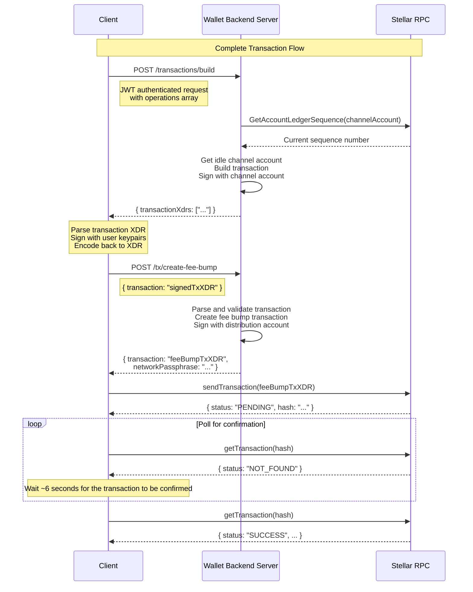

# Wallet-Backend

[](https://petstore.swagger.io/?url=https://raw.githubusercontent.com/stellar/wallet-backend/refs/heads/main/openapi/main.yaml)
[](https://deepwiki.com/stellar/wallet-backend)
[](https://hub.docker.com/r/stellar/wallet-backend/tags)

The wallet-backend serves as a backend service for Stellar wallet applications, providing transaction submission,
account management, and payment tracking capabilities.

## Table of Contents

- [Wallet-Backend](#wallet-backend)
  - [Table of Contents](#table-of-contents)
  - [Overview](#overview)
  - [Usage](#usage)
    - [Transaction Building and Fee Bump](#transaction-building-and-fee-bump)
      - [Complete Transaction Flow](#complete-transaction-flow)
    - [State Changes Indexer and History API](#state-changes-indexer-and-history-api)
  - [Local Development Setup](#local-development-setup)
    - [Prerequisites](#prerequisites)
    - [Running the Server](#running-the-server)
      - [Docker Compose (Quickstart)](#docker-compose-quickstart)
      - [Local + Docker (Active Development)](#local--docker-active-development)
    - [Testing](#testing)
      - [Unit Tests](#unit-tests)
      - [Integration Tests](#integration-tests)
  - [Authentication](#authentication)
    - [JWT Signature](#jwt-signature)
    - [JWT Claims](#jwt-claims)
  - [Docker Hub Publishing](#docker-hub-publishing)
    - [Push to `develop`](#push-to-develop)
    - [GitHub Release](#github-release)
    - [Pre-release](#pre-release)

## Overview

The wallet-backend service provides several key functionalities:

- **Account Management**: Registration, deregistration, and sponsored account creation
- **Transaction Submission**: Reliable transaction building, submission, and status tracking
- **Payment History**: Tracking and querying of payment records
- **Channel Account Management**: Creation and management of channel accounts for transaction signing
- **Security**: Request authentication and signature verification

## Usage

The wallet-backend provides two core services that simplify Stellar transaction management for wallet applications:

### Transaction Building and Fee Bump

1. **Transaction Building** (`POST /transactions/build`):
   - Uses pre-funded channel accounts to handle sequence numbers automatically
   - Provides high throughput by eliminating client-side sequence number management
   - Returns signed transaction XDRs ready for client signature

2. **Fee Bump Transactions** (`POST /tx/create-fee-bump`):
   - Automatically creates and signs fee bump transactions
   - Uses a distribution account to cover transaction fees
   - Returns a complete fee bump transaction ready for submission

#### Complete Transaction Flow

The following diagram illustrates the complete transaction lifecycle:



### State Changes Indexer and History API

🚧 This is a work in progress.

## Local Development Setup

Follow these steps to start the wallet-backend server for local development and contribution.

### Prerequisites

- Go 1.23.2 or later
- Docker and Docker Compose

### Running the Server

1. Clone the repository:

   ```bash
   git clone https://github.com/stellar/wallet-backend.git
   cd wallet-backend
   ```

2. Copy the example `.env.example` file and fill in the required environment variables:

   ```bash
   cp .env.example .env
   ```

3. Set environment variables (refer to `.env.example` for details):

   ```bash
   DATABASE_URL=postgres://postgres@localhost:5432/wallet-backend?sslmode=disable
   NETWORK=testnet
   STELLAR_ENVIRONMENT=development

   # The CHANNEL_ACCOUNT_ENCRYPTION_PASSPHRASE is used to encrypt/decrypt the channel accounts private keys. A strong passphrase is recommended.
   CHANNEL_ACCOUNT_ENCRYPTION_PASSPHRASE=<your_passphrase>

   # The DISTRIBUTION_ACCOUNT is used to sponsor fees and reserves for the client transactions. It must be an existing account with XLM balance.
   DISTRIBUTION_ACCOUNT_PRIVATE_KEY=<your_private_key>
   DISTRIBUTION_ACCOUNT_PUBLIC_KEY=<your_public_key>

   # CLIENT_AUTH_PUBLIC_KEYS is a comma-separated list of Stellar public keys whose private key(s) are authorized to sign the authentication header. They must be Stellar addresses.
   CLIENT_AUTH_PUBLIC_KEYS=<your_public_keys>
   ```

4. Start the server and its dependencies using one of the following methods:

#### Docker Compose (Quickstart)

This is the simplest way to start the wallet-backend server. All services will run in Docker containers as defined in the `docker-compose.yaml` file.

1. Start the containers:

   ```bash
   docker compose up
   ```

   This will start the `api`, `db`, `ingest`, and `stellar-rpc` services.

#### Local + Docker (Active Development)

This setup is ideal for active development, allowing you to add debug points to the code.

1. Start the `db` and `stellar-rpc` containers:

   ```bash
   docker compose up -d db stellar-rpc
   ```

2. Run `api` and `ingest` locally:

   - **API**
      1. Source the `.env` file:

         ```bash
         source .env
         ```

      2. Run migrations:

         ```bash
         go run main.go migrate up
         ```

      3. Generate channel accounts:

         ```bash
         go run main.go channel-account ensure 5
         ```

      4. Start the API server:

         ```bash
         go run main.go serve
         ```

   - **Ingest**
     1. In a separate terminal, source the `.env` file and run the ingestion service:

        ```bash
        source .env
        go run main.go ingest
        ```

This allows us to establish a dev cycle where you can make changes to the code and restart the `api` and `ingest`
services to test them. Based on the IDE you are using, you can add the build configurations for these services, along
with the environment variables to add breakpoints to your code.

### Testing

The wallet-backend includes both unit and integration tests to ensure comprehensive coverage.

#### Unit Tests

Unit tests can be run using the following command:

```bash
go test ./...
```

**Dependencies:**

- A `db` needs to be available and configured through the `DATABASE_URL` environment variable.

#### Integration Tests

Integration tests can be executed with the following command:

```bash
go run main.go integration-tests
```

**Dependencies:**

- Ensure your environment is configured as described in the setup section.
- Both `db` and `stellar-rpc` services should be running, either in Docker containers or locally.

This setup allows you to verify both the isolated functionality of components (unit tests) and their interactions (integration tests) within the wallet-backend.

## Authentication

The wallet-backend uses JSON Web Tokens (JWT) with Ed25519 signatures for request authentication.

### JWT Signature

The JWT is signed using an Ed25519 private key derived from a Stellar secret seed. You can generate Stellar keypairs at the [Stellar Laboratory](https://lab.stellar.org/account/create?$=network$id=testnet&label=Testnet&horizonUrl=https:////horizon-testnet.stellar.org&rpcUrl=https:////soroban-testnet.stellar.org&passphrase=Test%20SDF%20Network%20/;%20September%202015;;).

The server can be configured to accept multiple (comma-separated) public keys through the `CLIENT_AUTH_PUBLIC_KEYS` environment variable.

### JWT Claims

The JWT payload field should contain the following fields:

- (default) `exp` – The expiration time on and after which the JWT must not be accepted for processing, in seconds since Epoch. (Must be less than `iat`+15sec.)
- (default) `iat` - The time at which the JWT was issued, in seconds since Epoch.
- (default) `sub` – The subject of the JWT, which is the public key of the Stellar account that is being authenticated.
- (custom) `methodAndPath` – The HTTP method and path of the request (e.g., `GET /transactions/b9d0b2292c4e09e8eb22d036171491e87b8d2086bf8b265874c8d182cb9c9020`).
- (custom) `bodyHash`, a hex-encoded SHA-256 hash of the raw HTTP request body, present even when the body is empty:
   ```go
   func HashBody(body []byte) string {
      hashedBodyBytes := sha256.Sum256(body)
      return hex.EncodeToString(hashedBodyBytes[:])
   }
   ```

For more details on the JWT implementation, please see [`jwt_manager.go`](./pkg/wbclient/auth/jwt_manager.go).

## Docker Hub Publishing

The CI/CD workflow, defined in [`publish_to_docker_hub.yaml`](./.github/workflows/publish_to_docker_hub.yaml) automates the process of building and publishing Docker images to Docker Hub. This workflow is triggered under two conditions:

### Push to `develop`

Whenever updates are made to the `develop` branch, the workflow creates and uploads a Docker image with two specific tags:

- `testing`
- `testing-{DATE}-{SHA}`

### GitHub Release

When a new release is published on GitHub, the workflow generates and uploads a Docker image with the following tags:

- The release tag, e.g. `x.y.z`
- `latest` (applied only if the release is not marked as a pre-release)

### Pre-release

When a pre-release is published on GitHub, the workflow generates and uploads a Docker image with the pre-release tag preceded by `rc-`, e.g. `rc-x.y.z`
