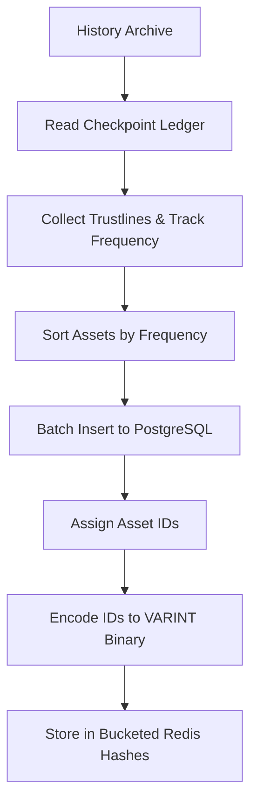
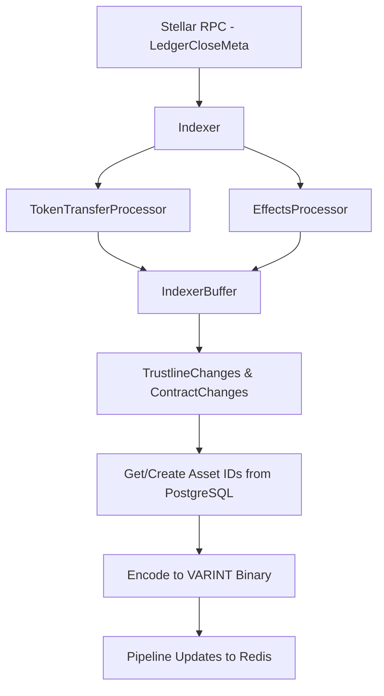
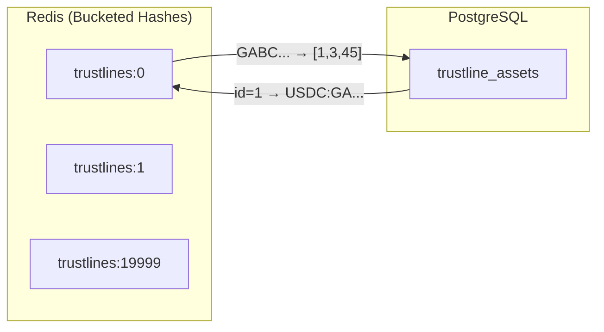
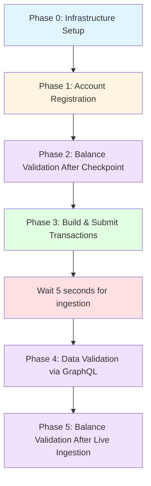

# Wallet-Backend

[](https://petstore.swagger.io/?url=https://raw.githubusercontent.com/stellar/wallet-backend/refs/heads/main/openapi/main.yaml)
[](https://deepwiki.com/stellar/wallet-backend)
[](https://hub.docker.com/r/stellar/wallet-backend/tags)

The wallet-backend serves as a backend service for Stellar wallet applications, providing transaction submission,
account management, and payment tracking capabilities.

> [!IMPORTANT]
> **This software is in active pre-production development.** It has not been formally released and is not yet deployed to production. If you are a security researcher, please read the [Security](#security) section before submitting any vulnerability reports.

## Table of Contents

- [Wallet-Backend](#wallet-backend)
  - [Table of Contents](#table-of-contents)
  - [Overview](#overview)
  - [Getting Started](#getting-started)
  - [Authentication](#authentication)
  - [API Reference](internal/serve/graphql/README.md)
  - [Architecture](#architecture)
  - [Integration Tests Setup](#integration-tests-setup)
  - [Deployment](#deployment)
  - [Security](#security)

## Overview

The wallet-backend service provides several key functionalities:

- **Account Management**: Registration, deregistration, and sponsored account creation
- **Transaction Submission**: Reliable transaction building, submission, and status tracking
- **Payment History**: Tracking and querying of payment records
- **Channel Account Management**: Creation and management of channel accounts for transaction signing
- **Security**: Request authentication and signature verification

## Getting Started

Follow these steps to start the wallet-backend server for local development and contribution.

**In this section:**
- [Prerequisites](#prerequisites)
- [Running the Server](#running-the-server)
- [Testing](#testing)

### Prerequisites

- Go 1.23.2 or later
- Docker and Docker Compose

### Running the Server

1. Clone the repository:

   ```bash
   git clone https://github.com/stellar/wallet-backend.git
   cd wallet-backend
   ```

2. Copy the example `.env.example` file and fill in the required environment variables:

   ```bash
   cp .env.example .env
   ```

3. Set environment variables (refer to `.env.example` for details):

   ```bash
   DATABASE_URL=postgres://postgres@localhost:5432/wallet-backend?sslmode=disable
   NETWORK=testnet
   STELLAR_ENVIRONMENT=development

   # The CHANNEL_ACCOUNT_ENCRYPTION_PASSPHRASE is used to encrypt/decrypt the channel accounts private keys. A strong passphrase is recommended.
   CHANNEL_ACCOUNT_ENCRYPTION_PASSPHRASE=<your_passphrase>

   # The DISTRIBUTION_ACCOUNT is used to sponsor fees and reserves for the client transactions. It must be an existing account with XLM balance.
   DISTRIBUTION_ACCOUNT_PRIVATE_KEY=<your_private_key>
   DISTRIBUTION_ACCOUNT_PUBLIC_KEY=<your_public_key>

   # CLIENT_AUTH_PUBLIC_KEYS is a comma-separated list of Stellar public keys whose private key(s) are authorized to sign the authentication header. They must be Stellar addresses.
   CLIENT_AUTH_PUBLIC_KEYS=<your_public_keys>
   ```

4. Start the server and its dependencies using one of the following methods:

#### Docker Compose (Quickstart)

This is the simplest way to start the wallet-backend server. All services will run in Docker containers as defined in the `docker-compose.yaml` file.

1. Start the containers:

   ```bash
   docker compose up
   ```

   This will start the `api`, `db`, `ingest`, and `stellar-rpc` services.

#### Local + Docker (Active Development)

This setup is ideal for active development, allowing you to add debug points to the code.

1. Start the `db` and `stellar-rpc` containers:

   ```bash
   docker compose up -d db stellar-rpc
   ```

2. Run `api` and `ingest` locally:

   - **API**
      1. Source the `.env` file:

         ```bash
         source .env
         ```

      2. Run migrations:

         ```bash
         go run main.go migrate up
         ```

      3. Generate channel accounts:

         ```bash
         go run main.go channel-account ensure 5
         ```

      4. Start the API server:

         ```bash
         go run main.go serve
         ```

   - **Ingest**
     1. In a separate terminal, source the `.env` file and run the ingestion service:

        ```bash
        source .env
        go run main.go ingest
        ```

This allows us to establish a dev cycle where you can make changes to the code and restart the `api` and `ingest`
services to test them. Based on the IDE you are using, you can add the build configurations for these services, along
with the environment variables to add breakpoints to your code.

### Testing

The wallet-backend includes both unit and integration tests to ensure comprehensive coverage.

#### Unit Tests

Unit tests can be run using the following command:

```bash
go test ./...
```

**Dependencies:**

- A `db` needs to be available and configured through the `DATABASE_URL` environment variable.

#### Integration Tests

Integration tests can be executed with the following command:

```bash
go run main.go integration-tests
```

**Dependencies:**

- Ensure your environment is configured as described in the setup section.
- Both `db` and `stellar-rpc` services should be running, either in Docker containers or locally.

This setup allows you to verify both the isolated functionality of components (unit tests) and their interactions (integration tests) within the wallet-backend.

## Authentication

The wallet-backend uses JSON Web Tokens (JWT) with Ed25519 signatures for request authentication.

### JWT Signature

The JWT is signed using an Ed25519 private key derived from a Stellar secret seed. You can generate Stellar keypairs at the [Stellar Laboratory](https://lab.stellar.org/account/create?$=network$id=testnet&label=Testnet&horizonUrl=https:////horizon-testnet.stellar.org&rpcUrl=https:////soroban-testnet.stellar.org&passphrase=Test%20SDF%20Network%20/;%20September%202015;;).

The server can be configured to accept multiple (comma-separated) public keys through the `CLIENT_AUTH_PUBLIC_KEYS` environment variable.

### JWT Claims

The JWT payload field should contain the following fields:

- (default) `exp` – The expiration time on and after which the JWT must not be accepted for processing, in seconds since Epoch. (Must be less than `iat`+15sec.)
- (default) `iat` - The time at which the JWT was issued, in seconds since Epoch.
- (default) `sub` – The subject of the JWT, which is the public key of the Stellar account that is being authenticated.
- (custom) `methodAndPath` – The HTTP method and path of the request (e.g., `GET /transactions/b9d0b2292c4e09e8eb22d036171491e87b8d2086bf8b265874c8d182cb9c9020`).
- (custom) `bodyHash`, a hex-encoded SHA-256 hash of the raw HTTP request body, present even when the body is empty:
   ```go
   func HashBody(body []byte) string {
      hashedBodyBytes := sha256.Sum256(body)
      return hex.EncodeToString(hashedBodyBytes[:])
   }
   ```

For more details on the JWT implementation, please see [`jwt_manager.go`](./pkg/wbclient/auth/jwt_manager.go).

## Architecture

The wallet-backend includes several internal services that power its high-performance features. This section documents the internal implementation for contributors and those seeking to understand the system's internals.

**In this section:**
- [Account Token Cache](#account-token-cache)
- [Contract Validator Service](#contract-validator-service)
- [Contract Metadata Service](#contract-metadata-service)

### Account Token Cache

The wallet-backend implements a high-performance **Account Token Cache** system that enables fast retrieval of account balances across all token types. This Redis-backed cache tracks every account's token holdings, including native XLM, classic trustlines, and Stellar Asset Contract (SAC) tokens.

**Why it exists:**
- **Fast Balance Queries**: Enables sub-second response times for the GraphQL queries - `balancesByAccountAddress` and `balancesByAccountAddresses`
- **Complete Token Coverage**: Tracks all token types an account holds without expensive RPC lookups
- **Efficient Updates**: Incrementally updates during live ingestion without rescanning the entire ledger
- **Horizontal Scalability**: Redis-based architecture supports distributed deployments

#### Supported Token Types

The cache tracks 3 distinct token types:

| Type | Description | Example |
|------|-------------|---------|
| **Trustline** | Classic Stellar assets | `USDC:GBBD47IF6LWK7P7MDEVSCWR7DPUWV3NY3DTQEVFL4NAT4AQH3ZLLFLA5` |
| **SAC** | Stellar Asset Contract (wrapped classic assets) | `CAQCMV4JFG4EZXQEAV7TUV2E52DMSO2LQKBOSA7UM3B4NIP4DQJ3JHQJ` |
| **SEP-41** | Custom contract tokens (implementing SEP-41 standard) | `CCVLZ3SQWV4R5OYTXM7FYNVJLUBXZ3FXOVQXMKIFXFPJT3YNG3HLKXPS` |

#### Architecture Overview

The Account Token Cache operates in two phases:

**1. Initial Population (Cold Start)**

When the wallet-backend starts with an empty database, it performs a one-time population from Stellar history archives:



**Process:**
1. Calculates the nearest checkpoint ledger from the history archive
2. Downloads and processes the checkpoint state file
3. Extracts all trustline entries and tracks how frequently each asset appears
4. Sorts assets by frequency (descending) so common assets get lower IDs
5. Batch inserts assets to PostgreSQL `trustline_assets` table
6. Encodes asset IDs to compact VARINT binary format
7. Stores in Redis using bucketed hashes (50,000 operations per pipeline batch)
8. Completes before live ingestion begins

**2. Live Ingestion (Continuous Updates)**

During normal operation, the cache is updated in real-time as trustlines are created/removed and transfers of new contract tokens occur between accounts:



**Process:**
1. Indexer processors detect state changes from transaction effects
2. Changes are buffered (trustline additions/removals, contract balance changes)
3. Asset IDs are fetched or created from PostgreSQL
4. IDs are encoded to compact VARINT binary format
5. After successful DB write, `AccountTokenService.ProcessTokenChanges()` updates Redis
6. Uses Redis pipelining for efficient batch updates
7. Contract metadata (name, symbol, decimals) is fetched and stored in PostgreSQL

#### GraphQL Integration

The Account Token Cache powers the [`balancesByAccountAddress`](#7-get-account-balances) GraphQL query. See the [Get Account Balances](#7-get-account-balances) section for query examples and response formats.

#### Storage Optimization Strategies

The Account Token Cache uses several optimization strategies to minimize Redis memory usage while maintaining fast lookup performance.

**1. PostgreSQL Asset ID Mapping**

Instead of storing full asset strings (e.g., `USDC:GBBD47IF6LWK7P7MDEVSCWR7DPUWV3NY3DTQEVFL4NAT4AQH3ZLLFLA5`) in Redis, we store compact integer IDs. The mapping between IDs and asset strings is maintained in a PostgreSQL table:

```sql
CREATE TABLE trustline_assets (
    id BIGSERIAL PRIMARY KEY,
    code TEXT NOT NULL,
    issuer TEXT NOT NULL,
    UNIQUE(code, issuer)
);
```

This reduces storage from ~60 bytes per asset string to a small integer ID.

**2. Bucket Sharding**

Instead of creating one Redis key per account (millions of keys), accounts are distributed across 20,000 buckets using FNV-1a hashing:

```
Key format: trustlines:{bucket}
Bucket = fnv32(accountAddress) % 20000
```

Each bucket is a Redis hash containing multiple accounts. This improves Redis memory efficiency and reduces key overhead.

**3. VARINT Binary Encoding**

Asset IDs are encoded using Go's variable-length integer (VARINT) format instead of storing them as text:

| ID Value | VARINT Bytes | ASCII Bytes |
|----------|--------------|-------------|
| 1 | 1 byte | 1 byte |
| 127 | 1 byte | 3 bytes |
| 1000 | 2 bytes | 4 bytes |
| 100000 | 3 bytes | 6 bytes |

This provides significant compression, especially for accounts holding multiple assets.

**4. Frequency-Based ID Assignment**

During initial population, assets are sorted by how frequently they appear across all accounts. The most common assets (like USDC) receive the lowest IDs (1, 2, 3...), which encode to fewer bytes in VARINT format:

```
USDC (held by 100K accounts) → ID 1 (1 byte)
EURC (held by 50K accounts)  → ID 2 (1 byte)
Rare asset (10 accounts)     → ID 50000 (3 bytes)
```

This multiplies the benefits of VARINT encoding by ensuring common assets use minimal storage across all accounts.

**5. Redis Listpack Encoding**

Redis uses **listpack** (successor to ziplist) as a compact, memory-efficient encoding for small hashes. When a hash stays below configured thresholds, Redis stores it in this compressed format instead of a standard hash table.

**Configuration (docker-compose.yaml):**
```
redis-server
  --hash-max-listpack-entries 1000
  --hash-max-listpack-value 8000
```

| Parameter | Value | Description |
|-----------|-------|-------------|
| `hash-max-listpack-entries` | 1000 | Maximum fields (accounts) per hash before conversion to hash table |
| `hash-max-listpack-value` | 8000 | Maximum value size in bytes before conversion |

Operators of wallet backend can tweak these values based on their requirements.

**How Listpack Works with Bucket Sharding:**

The bucket count (20,000) is designed to keep each bucket's account count well below the `hash-max-listpack-entries` threshold:

```
Mainnet (~10M accounts):
  10,000,000 accounts with atleast 1 trustline ÷ 20,000 buckets = ~500 accounts per bucket

  500 accounts < 1000 max-listpack-entries → ✓ Listpack encoding used
```

Each account's value is VARINT-encoded asset IDs, typically 5-50 bytes for accounts with 1-10 trustlines—well under the 8,000 byte `hash-max-listpack-value` limit.

**Memory Savings from Listpack:**

Listpack provides significant memory savings compared to standard hash tables:

| Storage Format | Memory per Entry | Overhead |
|----------------|------------------|----------|
| Listpack | ~(key_len + value_len + 2) bytes | Minimal header |
| Hash Table | ~(key_len + value_len + 24) bytes | dictEntry pointers, hash slots |

For a bucket with 500 accounts (56-byte addresses, ~20-byte VARINT values):
- Listpack: ~39 KB per bucket
- Hash Table: ~51 KB per bucket (~30% more memory)

With 20,000 buckets, this translates to ~240 MB savings on mainnet.

**What Happens When Limits Are Exceeded:**

If a bucket exceeds either threshold, Redis automatically converts it from listpack to a standard hash table:

```
Bucket exceeds 1000 accounts OR value > 8000 bytes
                    ↓
    Redis converts bucket to hash table
                    ↓
    Memory usage increases ~30% for that bucket
    Lookup changes from O(n) scan to O(1) hash lookup
```

This conversion is **irreversible** for that bucket until Redis restarts. The conversion happens transparently—queries continue to work, but memory efficiency decreases.

**Trade-offs of Increasing `hash-max-listpack-entries`:**

| `max-listpack-entries` | Pros | Cons |
|------------------------|------|------|
| Lower (500-1000) | Faster lookups (O(n) with small n) | More buckets needed, higher key overhead |
| Higher (2000-5000) | More accounts per bucket, fewer keys | Slower lookups as n grows, scan latency |
| Very High (10000+) | Maximum memory efficiency | Noticeable lookup latency (~1-5ms per lookup) |

Listpack uses **sequential scan** (O(n)) for field lookups. At 1,000 entries with 56-byte keys, each lookup scans ~56 KB of memory. Modern CPUs handle this in microseconds, but at 10,000+ entries, scan latency becomes measurable.

**Impact on Trustline Queries:**

For `GetAccountTrustlines(accountAddress)`:

1. Calculate bucket: `fnv32(accountAddress) % 20000`
2. Redis HGET on `trustlines:{bucket}` for field `accountAddress`
3. Listpack: Sequential scan through bucket's entries to find field
4. Return VARINT-decoded asset IDs

With 500 accounts per bucket (listpack), step 3 takes ~10-50 microseconds.
With 5000 accounts per bucket (if limit increased), step 3 takes ~100-500 microseconds.

**Scaling Considerations:**

As the Stellar network grows, the accounts-per-bucket ratio will increase:

| Network Size | Accounts per Bucket | Status |
|--------------|---------------------|--------|
| 10M accounts | ~500 | ✓ Comfortably in listpack |
| 20M accounts | ~1000 | ⚠️ At threshold |
| 50M accounts | ~2500 | ✗ Exceeds default, all buckets converted to hash table |

**Options for scaling beyond 20M accounts:**

1. **Increase `hash-max-listpack-entries`**: Set to 2000-3000. Trades slightly higher lookup latency for delayed scaling.

2. **Accept partial hash table conversion**: Some hot buckets convert to hash tables. Memory increases but queries remain functional.

#### Redis Data Structures

The cache uses optimized Redis data structures for trustlines and sets for contracts:

**Trustline Storage (Bucketed Hashes with VARINT)**

Trustlines are stored in Redis hashes, bucketed by account address hash:



```
Structure: Hash
Key: trustlines:{bucket}  (bucket = fnv32(account) % 20000)
Field: accountAddress
Value: VARINT-encoded binary blob of asset IDs

Example:
trustlines:1234 → {
  "GABC123...": [binary: 0x01 0x03 0x2D]     // IDs: [1, 3, 45]
  "GDEF456...": [binary: 0x02 0x05 0x43]     // IDs: [2, 5, 67]
}

Resolution: IDs → PostgreSQL trustline_assets table → "CODE:ISSUER"
```

**Contract Storage (Sets)**

Contract token IDs are stored directly as Redis sets (no ID mapping needed):

```
Structure: Set
Key: contracts:{accountAddress}
Value: Set<contractID>

Example:
contracts:GABC123... → {
  "CAQCMV4JFG4EZXQEAV7TUV2E52DMSO2LQKBOSA7UM3B4NIP4DQJ3JHQJ",
  "CCVLZ3SQWV4R5OYTXM7FYNVJLUBXZ3FXOVQXMKIFXFPJT3YNG3HLKXPS"
}
```

#### Service API

The `AccountTokenService` interface provides the following methods:

**Population:**
- `PopulateAccountTokens(ctx, checkpointLedger)` - Initial cache population from history archive
- `GetCheckpointLedger()` - Returns the checkpoint ledger used for initial population

**Querying:**
- `GetAccountTrustlines(ctx, accountAddress)` - Returns all classic asset trustlines (resolves IDs from PostgreSQL)
- `GetAccountContracts(ctx, accountAddress)` - Returns all contract token IDs

**Updates:**
- `ProcessTokenChanges(ctx, trustlineChanges, contractChanges)` - Batch update during live ingestion (handles ID assignment, VARINT encoding, and Redis pipelining)

#### Performance Characteristics

**Initial Population:**
- Processes millions of ledger entries efficiently
- Uses Redis pipelining (50,000 operations per batch)
- Frequency-based sorting ensures optimal VARINT compression
- Non-blocking: completes before API serves traffic

**Live Updates:**
- Sub-millisecond Redis operations per transaction
- Batch updates using Redis pipelines with VARINT encoding
- Efficient bucket-based lookups via FNV-1a hashing
- Scales horizontally with Redis cluster

**Memory Efficiency:**
- Combined optimizations (ID mapping, VARINT, frequency sorting, bucketing) significantly reduce Redis memory usage compared to storing full asset strings
- Most common assets encode to 1-2 bytes per account

**Balance Queries:**
- O(1) Redis hash field lookup per account
- Single PostgreSQL query to resolve asset IDs to strings
- Single RPC call for all balances (no N+1 queries)
- Typical response time: 100-300ms (including RPC roundtrip)

**Performance Trade-offs:**

The storage optimizations introduce a trade-off between memory usage and query latency:

| Operation | Trade-off |
|-----------|-----------|
| `GetAccountTrustlines` | +1 PostgreSQL query (sub-ms) to resolve IDs to asset strings |
| `ProcessTokenChanges` | Read-modify-write pattern for trustline updates instead of direct set operations |
| Memory | ~90% reduction in Redis memory usage |

The additional PostgreSQL round-trip for trustline queries is negligible in practice because the Stellar RPC call to fetch actual balances (100-300ms) dominates total query latency. This trade-off optimizes for large-scale deployments where Redis memory costs are significant.

### Contract Validator Service

The wallet-backend implements a **Contract Validator Service** that validates whether Stellar contracts implement the SEP-41 token standard by analyzing their WASM bytecode. This service is a critical component of the [Account Token Cache](#account-token-cache) system, enabling automatic classification of contract tokens during cache population.

**Why it exists:**
- **Automatic Token Classification**: Identifies which contracts follow the SEP-41 fungible token standard without manual configuration
- **Standards Compliance**: Ensures contracts expose the required token interface (balance, transfer, decimals, etc.)
- **Balance Tracking**: Only SEP-41-compliant contracts are tracked in the account token cache for balance queries
- **Integration with GraphQL**: Powers the [`balancesByAccountAddress`](#7-get-account-balances) query by distinguishing SEP-41 tokens from unknown contracts

#### How Validation Works

The Contract Validator uses a 4-step process to validate contracts against the SEP-41 standard:

```
Contract WASM Bytecode
         │
         ▼
1. WASM Compilation (wazero runtime)
         │
         ▼
2. Spec Extraction (contractspecv0 custom section)
         │
         ▼
3. XDR Parsing (ScSpecEntry unmarshaling)
         │
         ▼
4. Function Validation (name, inputs, outputs)
         │
         ▼
   Classification Result
   ├── SEP-41 ✓ (all functions match)
   └── Unknown (missing/mismatched functions)
```

**Process Details:**

1. **WASM Compilation**: Uses the [wazero](https://wazero.io/) runtime to safely compile the contract's WASM module with custom sections enabled
2. **Spec Extraction**: Extracts the `contractspecv0` custom section that contains XDR-encoded contract specifications
3. **XDR Parsing**: Unmarshals `ScSpecEntry` items from the spec bytes, representing each contract function and type
4. **Function Validation**: Verifies that all 10 required SEP-41 functions exist with exact parameter names and types

#### SEP-41 Required Functions

For a contract to be classified as SEP-41-compliant, it must implement **all** of the following functions with exact signatures:

| Function | Parameters | Returns | Description |
|----------|-----------|---------|-------------|
| `balance` | `id: Address` | `i128` | Get balance for an address |
| `allowance` | `from: Address, spender: Address` | `i128` | Get allowance for spender |
| `decimals` | _(none)_ | `u32` | Number of decimal places |
| `name` | _(none)_ | `String` | Token name |
| `symbol` | _(none)_ | `String` | Token symbol |
| `approve` | `from: Address, spender: Address, amount: i128, expiration_ledger: u32` | _(void)_ | Approve spender allowance |
| `transfer` | `from: Address, to: Address, amount: i128` | _(void)_ | Transfer tokens |
| `transfer` (CAP-67) | `from: Address, to_muxed: MuxedAddress, amount: i128` | _(void)_ | Transfer to muxed address |
| `transfer_from` | `spender: Address, from: Address, to: Address, amount: i128` | _(void)_ | Transfer from allowance |
| `burn` | `from: Address, amount: i128` | _(void)_ | Burn tokens |
| `burn_from` | `spender: Address, from: Address, amount: i128` | _(void)_ | Burn from allowance |

**Notes:**
- All parameter names must match exactly (e.g., `from`, `to`, `amount`).
- The `transfer` function supports two variants: standard (to `Address`) or [CAP-67](https://stellar.org/protocol/cap-67) (to `MuxedAddress`).
- Functions with `(void)` return type have no outputs.
- A SEP-41 compliant token has to implement all required functions but can implement additional functions too.

#### Contract Type Classification

The wallet-backend classifies contracts into three types during cache population:

| Type | Classification Method | Tracked in Cache | Example |
|------|----------------------|------------------|---------|
| **SAC** | Standard asset wrapper detection via `sac.AssetFromContractData()` | Yes | USDC:ISSUER wrapped contract |
| **SEP-41** | Contract Validator (WASM spec validation) | Yes | Custom fungible tokens |
| **Unknown** | Contracts that don't match SAC or SEP-41 | No | NFTs, AMMs, other contracts |

**Classification Logic:**
1. **SAC contracts** are identified first using Stellar's standard asset wrapper format (without WASM validation)
2. **Non-SAC contracts** are grouped by WASM hash and validated against SEP-41 requirements using the contract validator service
3. **Unknown contracts** that fail SEP-41 validation are not tracked in the account token cache

This classification determines:
- Whether contract balances are tracked in Redis (SAC and SEP-41 only)
- How balances are displayed in GraphQL responses (different fields per type)
- Whether contract metadata is fetched and stored by the [Contract Metadata Service](#contract-metadata-service)

#### Integration with Account Token Cache

The Contract Validator runs during the initial [Account Token Cache](#account-token-cache) population from history archives:

**Integration Flow:**

```
Account Token Service (PopulateAccountTokens)
         │
         ▼
CheckpointChangeReader
├── Collects LedgerEntryTypeContractCode (WASM bytecode)
├── Collects LedgerEntryTypeContractData (instances)
└── Groups contracts by WASM hash
         │
         ▼
enrichContractTypes()
├── For each WASM hash:
│   ├── contractValidator.ValidateFromContractCode(ctx, wasmBytes)
│   └── Assign ContractTypeSEP41 to all contracts with this hash
└── Returns contractTypesByContractID map
         │
         ▼
Contract Metadata Service
└── Fetches metadata for validated SEP-41 contracts
         │
         ▼
Redis Cache + PostgreSQL
└── Stores contract IDs and metadata
```

**Efficiency Optimization:**

The validator processes contracts by **WASM hash** rather than individual contract ID, because:
- Multiple contract instances can share the same WASM code
- Validating once per WASM hash (not per contract ID) reduces computation
- All contracts with the same WASM hash receive the same classification

**Example:**
```
WASM Hash: 0xabc123...
├── Contract: CABC...123 → SEP-41
├── Contract: CABC...456 → SEP-41  (same WASM, inherits classification)
└── Contract: CABC...789 → SEP-41  (same WASM, inherits classification)
```

#### Technical Implementation

**WASM Runtime:**

The validator uses the [wazero](https://wazero.io/) WebAssembly runtime, which:
- Provides safe, sandboxed WASM execution in pure Go
- Supports custom section extraction without executing contract code
- Does not require CGo dependencies

**Custom Section Extraction:**

Stellar contracts embed their interface specifications in a WASM custom section named `contractspecv0`:

```
WASM Module Structure:
├── Code Section (executable functions)
├── Data Section (constants)
└── Custom Sections
    └── "contractspecv0" ← XDR-encoded contract spec
```

**XDR Type Mapping:**

The validator maps XDR `ScSpecType` values to human-readable type names:

| XDR Type | Human-Readable Name |
|----------|---------------------|
| `ScSpecTypeBool` | `bool` |
| `ScSpecTypeU32` | `u32` |
| `ScSpecTypeI128` | `i128` |
| `ScSpecTypeAddress` | `Address` |
| `ScSpecTypeMuxedAddress` | `MuxedAddress` |
| `ScSpecTypeString` | `String` |
| `ScSpecTypeVec` | `Vec` |
| `ScSpecTypeMap` | `Map` |

#### Service API

The `ContractValidator` interface provides:

```go
// Validate contract code against SEP-41 standard
ValidateFromContractCode(ctx context.Context, wasmCode []byte) (types.ContractType, error)

// Close wazero runtime and release resources
Close(ctx context.Context) error
```

**Parameters:**
- `wasmCode`: Raw WASM bytecode from `LedgerEntryTypeContractCode` entry

**Return Values:**
- `types.ContractTypeSEP41`: Contract implements all SEP-41 functions
- `types.ContractTypeUnknown`: Contract missing required functions or spec extraction failed
- `error`: WASM compilation or spec parsing errors

**Error Handling:**
- Missing `contractspecv0` section returns `ContractTypeUnknown` with error
- Invalid WASM bytecode returns compilation error
- XDR unmarshaling errors are logged and return `ContractTypeUnknown`
- Individual validation failures are logged but don't fail the entire process

**Resource Management:**

The validator must be explicitly closed to release wazero runtime resources:

```go
defer func() {
    if err := contractValidator.Close(ctx); err != nil {
        log.Errorf("Failed to close contract validator: %v", err)
    }
}()
```

This is handled automatically in `PopulateAccountTokens()`.

#### Performance Characteristics

**Initial Population:**
- Processes contracts grouped by WASM hash (deduplication)
- Validation is CPU-bound (WASM compilation + XDR parsing)
- Typical performance: ~50-100 contracts/second per WASM hash
- No RPC calls required (reads from history archive)

**Live Ingestion:**
- Contract validator is **not** used during live ingestion
- New contracts are detected via balance entries but not re-validated
- Classification happens only during initial cache population

**Memory Usage:**
- Wazero runtime: ~10MB base overhead
- Per-contract: ~1-5MB during compilation (released after validation)
- Compiled modules are closed immediately after spec extraction

**Optimization Strategies:**
1. **WASM Hash Grouping**: Validate once per unique WASM hash, not per contract instance
2. **Spec Caching**: Contract specs are extracted once and reused for all contracts with same hash
3. **Lazy Compilation**: WASM modules are compiled only when needed for validation
4. **Resource Cleanup**: Compiled modules are closed immediately after use to free memory

### Contract Metadata Service

The wallet-backend implements a **Contract Metadata Service** that fetches and stores rich metadata for Stellar Asset Contract (SAC) and SEP-41 token contracts. This service enriches the [Account Token Cache](#account-token-cache) by providing human-readable token information (name, symbol, decimals) that powers the [`balancesByAccountAddress`](#7-get-account-balances) GraphQL query.

**Why it exists:**
- **Rich Token Information**: Provides name, symbol, and decimals for contract tokens without requiring clients to fetch this data
- **GraphQL Enhancement**: Powers detailed balance responses with token metadata in a single query
- **SAC Asset Mapping**: Extracts and stores the underlying classic asset (code:issuer) from SAC token names
- **Performance**: Batch fetches and caches metadata to avoid repeated RPC calls
- **Seamless Integration**: Works transparently during both initial cache population and live ingestion

#### Supported Contract Types

The service handles two types of contract tokens:

| Type | Description | Metadata Source |
|------|-------------|----------------|
| **SAC** | Stellar Asset Contract (wrapped classic assets) | Contract methods + name parsing for code:issuer |
| **SEP-41** | Custom fungible tokens implementing SEP-41 standard | Contract methods (name, symbol, decimals) |

#### Database Schema

Contract metadata is stored in the `contract_tokens` PostgreSQL table:

```sql
CREATE TABLE contract_tokens (
    id TEXT PRIMARY KEY,           -- Contract ID (C...)
    type TEXT NOT NULL,            -- "SAC" or "SEP41"
    code TEXT NULL,                -- Asset code (for SAC tokens)
    issuer TEXT NULL,              -- Asset issuer (for SAC tokens)
    name TEXT NULL,                -- Token name from contract
    symbol TEXT NULL,              -- Token symbol from contract
    decimals SMALLINT NOT NULL,    -- Token decimals
    created_at TIMESTAMPTZ NOT NULL DEFAULT NOW(),
    updated_at TIMESTAMPTZ NOT NULL DEFAULT NOW()
);
```

**Example Rows:**

| id | type | code | issuer | name | symbol | decimals |
|----|------|------|--------|------|--------|----------|
| `CAQ...JHQJ` | SAC | USDC | GBBD47IF6LWK7... | USDC:GBBD47IF6LWK7... | USDC | 7 |
| `CCV...KXPS` | SEP41 | NULL | NULL | Example Token | EXT | 7 |

#### Metadata Fetching Process

The Contract Metadata Service operates in two phases, coordinated with the [Account Token Cache](#account-token-cache):

**1. Initial Population (Cold Start)**

During startup when populating the account token cache from history archives:

```
History Archive (Checkpoint)
         │
         ▼
Account Token Service
├── Collects contract IDs from checkpoint
├── Validates contract types (SAC vs SEP-41)
│        │
│        ▼
Contract Metadata Service
├── Fetches metadata via RPC simulation
├── Parses SAC code:issuer from name field
└── Stores in contract_tokens table
         │
         ▼
   PostgreSQL Database
```

**Process:**
1. `AccountTokenService.PopulateAccountTokens()` collects all contract IDs from checkpoint
2. Contract types are validated (SAC via standard asset wrapper, SEP-41 via contract spec)
3. `ContractMetadataService.FetchAndStoreMetadata()` fetches metadata for all contracts
4. Metadata is stored in PostgreSQL for future queries

**2. Live Ingestion (Continuous Updates)**

During real-time ingestion when new contract tokens are detected:

```
Stellar RPC (LedgerCloseMeta)
         │
         ▼
    Indexer
    └── Detects new contract token transfers
         │
         ▼
Contract Metadata Service
├── Fetches metadata for new contracts
└── Stores in contract_tokens table
         │
         ▼
   PostgreSQL Database
```

**Process:**
1. Indexer's transaction processors detect new contract balance entries
2. New contract IDs are identified (not in cache)
3. Metadata is fetched and stored in `contract_tokens` table
4. Account Token Cache is updated with new contract IDs

#### How Metadata is Fetched

The service uses **RPC transaction simulation** to call contract methods without executing actual transactions:

**Simulation-Based Fetching:**
```go
// For each contract, simulate 3 transactions:
1. InvokeHostFunction("name")   → Returns token name
2. InvokeHostFunction("symbol") → Returns token symbol
3. InvokeHostFunction("decimals") → Returns token decimals

// Simulation uses a dummy account (no real account needed)
// Results are parsed from ScVal XDR responses
```

**Parallel Processing Architecture:**
- **Per-Contract Parallelism**: Fetches name, symbol, decimals simultaneously using pond worker pool
- **Batch Processing**: Processes contracts in batches of 20 to limit concurrent RPC load
- **Rate Limiting**: 2-second sleep between batches to avoid overwhelming RPC server

**Performance Example:**
```
60 contracts with 3 fields each = 180 RPC calls
- Batch 1-20: ~20 seconds (parallel fetch)
- Sleep: 2 seconds
- Batch 21-40: ~20 seconds (parallel fetch)
- Sleep: 2 seconds
- Batch 41-60: ~20 seconds (parallel fetch)
Total time: ~64 seconds vs ~180 seconds sequential
```

#### SAC Token Metadata Parsing

SAC (Stellar Asset Contract) tokens require special handling because they wrap classic Stellar assets:

**Name Field Format:**
```
SAC tokens store the underlying asset as: "CODE:ISSUER"
Example: "USDC:GBBD47IF6LWK7P7MDEVSCWR7DPUWV3NY3DTQEVFL4NAT4AQH3ZLLFLA5"
```

**Parsing Logic:**
```go
// For SAC contracts only:
parts := strings.Split(metadata.Name, ":")
if len(parts) == 2 {
    metadata.Code = parts[0]   // "USDC"
    metadata.Issuer = parts[1] // "GBBD47IF..."
}
```

This allows the GraphQL API to return both the contract address and the underlying classic asset information in balance queries.

#### Integration with GraphQL Balances

Contract metadata stored in `contract_tokens` enriches the [`balancesByAccountAddress`](#7-get-account-balances) query:

**For SAC Balances:**
```graphql
{
  balancesByAccountAddress(address: "GABC...") {
    ... on SACBalance {
      code       # From contract_tokens.code
      issuer     # From contract_tokens.issuer
      decimals   # From contract_tokens.decimals
      balance    # From RPC ledger entry
    }
  }
}
```

**For SEP-41 Balances:**
```graphql
{
  balancesByAccountAddress(address: "GABC...") {
    ... on SEP41Balance {
      name       # From contract_tokens.name
      symbol     # From contract_tokens.symbol
      decimals   # From contract_tokens.decimals
      balance    # From RPC ledger entry
    }
  }
}
```

**Query Flow:**
1. Fetch contract IDs from Redis (Account Token Cache)
2. Fetch contract metadata from PostgreSQL (`contract_tokens` table)
3. Build ledger keys and query Stellar RPC for current balances
4. Combine metadata + balance data in GraphQL response

This architecture enables **sub-second balance queries** with complete token information, without requiring multiple RPC calls per token.

#### Service API

The `ContractMetadataService` interface provides:

```go
// Fetch and store metadata for multiple contracts
FetchAndStoreMetadata(ctx context.Context, contractTypesByID map[string]types.ContractType) error
```

**Parameters:**
- `contractTypesByID`: Map of contract IDs to contract types (SAC or SEP-41)

**Behavior:**
- Returns `nil` for empty input (no-op)
- Fetches metadata in parallel batches
- Parses SAC code:issuer from name field
- Stores in database with `ON CONFLICT DO NOTHING` (idempotent)
- Logs warnings for individual failures but continues processing
- Returns error only for critical database failures

#### Performance Characteristics

**Initial Population:**
- Processes contracts in batches of 20
- Parallel metadata fetching (3 fields per contract)
- ~3 seconds per batch (20 contracts × 3 fields = 60 parallel RPC calls)
- 2-second sleep between batches for rate limiting
- Typical time: ~5 minutes for 1,000 contracts

**Live Ingestion:**
- Fetches metadata only for new contracts (not already in database)
- Same batching and parallelism as initial population
- Minimal overhead for most ledgers (few new contracts per ledger)

**Database Operations:**
- Batch insert with `UNNEST` for efficient bulk storage
- `ON CONFLICT DO NOTHING` prevents duplicate key errors
- Automatic deduplication for contracts seen in multiple contexts

**Memory Efficiency:**
- Metadata map size = number of contracts × ~200 bytes per entry
- Worker pool limits concurrent RPC connections
- No large in-memory buffers required

## Integration Tests Setup

**In this section:**
- [Integration Test Framework](#integration-test-framework)

### Integration Test Framework

The wallet-backend includes a comprehensive integration test framework that validates the entire system end-to-end, from Docker infrastructure setup through transaction submission and GraphQL data validation. These tests provide confidence that all components work together correctly in a realistic Stellar environment.

**In this section:**
- [Why Integration Tests Exist](#why-integration-tests-exist)
- [Architecture Overview](#architecture-overview)
- [Infrastructure Components](#infrastructure-components)
- [Test Accounts](#test-accounts)
- [Contract Deployment](#contract-deployment)
- [Test Suites](#test-suites)
- [Test Fixtures](#test-fixtures)
- [Running the Tests](#running-the-tests)
- [Design Patterns](#design-patterns)

#### Why Integration Tests Exist

The integration tests serve several critical purposes:

1. **End-to-End Validation**: Tests the complete flow from account registration through transaction building, signing, submission, ingestion, and GraphQL querying
2. **Infrastructure Testing**: Validates that the wallet-backend correctly integrates with Stellar Core, Stellar RPC, PostgreSQL, and Redis
3. **Contract Interactions**: Tests both Stellar Asset Contracts (SACs) and custom SEP-41 token contracts
4. **Data Consistency**: Ensures ingested ledger data matches on-chain state and is correctly queryable via GraphQL
5. **Regression Prevention**: Catches breaking changes across the entire stack, not just individual components
6. **Balance Validation**: Verifies accurate balance calculations for native XLM, classic trustlines, SAC tokens, and SEP-41 tokens

#### Architecture Overview

The integration tests use a **phased execution model** where each phase depends on the successful completion of previous phases:



**Execution Flow:**

| Phase | Suite Name | Purpose | Dependency |
|-------|-----------|---------|------------|
| 0 | Infrastructure Setup | Start containers, deploy contracts, create accounts | None |
| 1 | AccountRegisterTestSuite | Register test accounts with wallet-backend | Phase 0 |
| 2 | AccountBalancesAfterCheckpointTestSuite | Validate balances from checkpoint state | Phase 1 |
| 3 | BuildAndSubmitTransactionsTestSuite | Build, sign, and submit 20+ test transactions | Phase 2 |
| 4 | DataValidationTestSuite | Query and validate all transaction data via GraphQL | Phase 3 + 5s wait |
| 5 | AccountBalancesAfterLiveIngestionTestSuite | Validate balances after live ingestion | Phase 4 |

If any phase fails, all subsequent phases are skipped to prevent cascading failures and confusing error messages.

#### Infrastructure Components

The integration tests spin up a complete Stellar environment using Docker containers:

| Container | Image | Purpose | Exposed Port |
|-----------|-------|---------|--------------|
| **Redis** | `redis:7-alpine` | Account token cache and distributed locking | 6379 |
| **Core DB** | `postgres:9.6.17-alpine` | Stellar Core database | 5432 |
| **Stellar Core** | `stellar/stellar-core:24` | Standalone network with 8-ledger checkpoints | 11626 (HTTP), 1570 (History) |
| **Stellar RPC** | `stellar/stellar-rpc:24.0.0` | RPC server with captive core | 8000 |
| **Wallet DB** | `postgres:14-alpine` | Wallet-backend database | 5432 |
| **Wallet Ingest** | `wallet-backend:integration-test-<commit>` | Ingest service processing ledgers | 8003 |
| **Wallet API** | `wallet-backend:integration-test-<commit>` | API service with 15 channel accounts | 8002 |

**Network Configuration:**
- Network: Standalone (`Standalone Network ; February 2017`)
- Protocol Version: 24 (upgrades automatically on startup)
- Checkpoint Frequency: 8 ledgers
- All containers run on a shared Docker network for inter-service communication

**Container Management:**
- Uses [`testcontainers-go`](https://golang.testcontainers.org/) for lifecycle management
- Containers are reusable across test runs for faster execution
- Automatic cleanup on test completion or failure
- Health checks ensure services are ready before tests proceed

#### Test Accounts

The framework creates 7 distinct test accounts, each serving a specific purpose:

| Account | Purpose | Funding | Trustlines |
|---------|---------|---------|------------|
| **Master** | Root account (issues classic assets USDC/EURC) | Pre-funded (root) | N/A |
| **Client Auth** | JWT authentication keypair for API requests | 10,000 XLM | None |
| **Primary Source** | Main transaction source account | 10,000 XLM | None |
| **Secondary Source** | Secondary transaction source account | 10,000 XLM | None |
| **Distribution** | Fee sponsor and distribution account | 10,000 XLM | None |
| **Sponsored New** | Created via sponsored reserves (later merged) | 5 XLM (sponsored) | None |
| **Balance Test 1** | Balance validation (isolated from tx tests) | 10,000 XLM | USDC, EURC |
| **Balance Test 2** | Balance validation (isolated from tx tests) | 10,000 XLM | USDC |

**Why Separate Balance Test Accounts?**

Balance test accounts (`balanceTestAccount1` and `balanceTestAccount2`) are kept separate from transaction test accounts to prevent **balance drift**. Transaction tests modify account balances unpredictably, so using dedicated accounts ensures balance assertions remain stable and deterministic across test runs.

#### Contract Deployment

The tests deploy and interact with multiple Soroban contracts to validate contract-related functionality:

| Contract Type | Address Format | Purpose | Initialization |
|---------------|----------------|---------|----------------|
| **Native Asset SAC** | `C...` (stellar:native) | XLM as a contract | Pre-deployed (deterministic) |
| **USDC SAC** | `C...` (classic USDC) | Classic USDC asset as contract | Pre-deployed (deterministic) |
| **EURC SAC** | `C...` (classic EURC) | Classic EURC asset as contract | Pre-deployed (deterministic) |
| **SEP-41 Token** | `C...` (custom contract) | Custom token contract implementing SEP-41 | `__constructor(admin, 7, "SEP41 Token", "SEP41")` |
| **Holder Contract** | `C...` (test contract) | Simple contract that holds token balances | No constructor |

**SEP-41 Token Contract:**
- Source: [`soroban_token_contract.wasm`](https://github.com/stellar/soroban-examples/tree/main/token) from stellar/soroban-examples
- Admin: Master account
- Decimals: 7
- Name: "SEP41 Token"
- Symbol: "SEP41"
- Initial Mint: 500 tokens to `balanceTestAccount1`, 500 tokens to `holderContract`

**Contract Balance Types Tested:**
- **G-address with SAC balance**: Classic trustline represented as contract balance
- **G-address with SEP-41 balance**: Custom token balance stored in contract data
- **C-address with SAC balance**: Contract holding classic asset tokens
- **C-address with SEP-41 balance**: Contract holding custom token balances

All contracts are deployed and initialized during Phase 0, with a checkpoint wait to ensure they appear in ledger snapshots before balance validation begins.

#### Test Suites

Each test suite focuses on a specific aspect of the wallet-backend functionality:

**1. AccountRegisterTestSuite** (`accounts_test.go`)
- **Purpose**: Validates account registration and deregistration flows
- **Tests**:
  - Successful registration of multiple accounts
  - Duplicate registration returns appropriate error
  - Registered accounts are fetchable via `GetAccountByAddress`
- **Coverage**: Account management API endpoints

**2. AccountBalancesAfterCheckpointTestSuite** (`account_balances_test.go`)
- **Purpose**: Validates balance calculations from checkpoint ledger state
- **Tests**:
  - Native XLM balances are correct
  - Classic trustline balances (USDC, EURC) are accurate
  - SEP-41 contract token balances for G-addresses
  - SAC token balances for C-addresses (holder contract)
  - SEP-41 token balances for C-addresses
- **Coverage**: Balance ingestion from checkpoint, token type classification, contract metadata

**3. BuildAndSubmitTransactionsTestSuite** (`transaction_test.go`)
- **Purpose**: Tests transaction building, signing, fee bumping, and submission
- **Tests**:
  - Build 20+ transactions in parallel using channel accounts
  - Local signing with test keypairs
  - Fee bump transaction creation with distribution account
  - Parallel submission to Stellar RPC
  - Transaction hash validation
- **Coverage**: Transaction building API, channel account management, fee sponsorship, RPC integration

**4. DataValidationTestSuite** (`data_validation_test.go`)
- **Purpose**: Validates all ingested transaction data via GraphQL queries
- **Tests**:
  - Transaction metadata (hash, ledger number, envelope XDR, result XDR, meta XDR)
  - Operations (type, source account, operation-specific fields)
  - State changes (account creation, balance changes, trustlines, offers, liquidity pools, sponsorship, signers, metadata)
  - Relationships (transaction ↔ operations ↔ state changes)
  - Pagination (forward and backward)
- **Coverage**: GraphQL API, ingestion accuracy, ledger state parsing, XDR decoding

**5. AccountBalancesAfterLiveIngestionTestSuite** (`account_balances_test.go`)
- **Purpose**: Validates balance calculations after live ledger ingestion
- **Tests**:
  - Balances reflect state changes from submitted transactions
  - Balance updates from payments, trustline operations, contract invocations
  - Claimable balance and clawback operations affect balances correctly
- **Coverage**: Live ingestion pipeline, balance calculation accuracy

#### Test Fixtures

The framework includes **20+ pre-built test scenarios** covering all Stellar operation types and common contract interactions:

**Classic Operations:**
- Payment
- CreateAccount
- AccountMerge
- BeginSponsoringFutureReserves / EndSponsoringFutureReserves
- ManageData
- ChangeTrust
- CreatePassiveSellOffer / ManageSellOffer / ManageBuyOffer
- PathPaymentStrictReceive / PathPaymentStrictSend
- SetOptions
- Clawback / ClawbackClaimableBalance
- SetTrustLineFlags
- CreateClaimableBalance / ClaimClaimableBalance
- LiquidityPoolDeposit / LiquidityPoolWithdraw
- RevokeSponsorship

**Soroban Operations:**
- InvokeHostFunction (contract deployment)
- InvokeHostFunction (contract invocation with authorization)
- InvokeHostFunction (SAC token transfer)
- InvokeHostFunction (SEP-41 token mint)

Each fixture includes:
- Operation XDR
- Required signers
- Expected state changes
- Validation logic

#### Running the Tests

**Prerequisites:**
- Docker and Docker Compose installed and running
- Go 1.23.2 or later
- ~5 minutes for initial run (includes Docker image builds)
- ~2-3 minutes for subsequent runs (containers are reused)

**Basic Execution:**

```bash
# Run all integration tests
ENABLE_INTEGRATION_TESTS=true go test ./internal/integrationtests -v -timeout 30m
```

**Force Rebuild (after code changes):**

```bash
# Rebuild wallet-backend Docker image before running tests
ENABLE_INTEGRATION_TESTS=true FORCE_REBUILD=true go test ./internal/integrationtests -v -timeout 30m
```

**Run Specific Test Suite:**

```bash
# Run only the balance validation tests
ENABLE_INTEGRATION_TESTS=true go test ./internal/integrationtests -v -timeout 30m -run TestIntegrationTests/AccountBalancesAfterCheckpointTestSuite
```

**Environment Variables:**

| Variable | Required | Default | Description |
|----------|----------|---------|-------------|
| `ENABLE_INTEGRATION_TESTS` | Yes | `false` | Must be `"true"` to run integration tests (prevents accidental execution) |
| `FORCE_REBUILD` | No | `false` | Set to `"true"` to force rebuild of wallet-backend Docker image |

#### Design Patterns

The integration test framework employs several sophisticated design patterns:

**1. Dependency Injection**
- `SharedContainers` provides all infrastructure dependencies
- `TestEnvironment` injects services and clients into test suites
- Enables easy mocking and testing of individual components

**2. Phased Setup with Fail-Fast**
- Each phase validates its preconditions before proceeding
- Early failures prevent confusing error cascades
- Clear phase boundaries make debugging easier

**3. Parallel Execution**
- Uses [`pond`](https://github.com/alitto/pond) worker pools for parallelism
- Transaction building, signing, and submission run concurrently
- GraphQL queries execute in parallel using `pond.NewGroupContext`
- Reduces test execution time from ~10 minutes to ~2-3 minutes

**4. Container Reusability**
- Containers are tagged with session IDs and reused across test runs
- Avoids Docker image pulls and container startup overhead
- `Reuse: true` in testcontainers configuration

**5. Separation of Concerns**
- Infrastructure code in `infrastructure/` package
- Test logic in top-level `*_test.go` files
- Fixtures isolated in `fixtures.go` for reusability
- Clear boundaries between setup, execution, and validation

**6. Checkpoint-Based Validation**
- Tests wait for Stellar Core checkpoints (every 8 ledgers)
- Ensures ledger state is stable before balance assertions
- Validates both checkpoint ingestion and live ingestion paths

**7. Progressive Complexity**
- Simple tests run first (account registration)
- Complex tests run last (data validation with 20+ transactions)
- Builds confidence incrementally

**Performance Considerations:**
- **Parallel transaction submission**: 20+ transactions submitted concurrently
- **Parallel GraphQL queries**: State change queries run in worker pools
- **Container reuse**: Subsequent test runs skip container creation
- **Image caching**: Docker layers and wallet-backend image cached between runs
- **Efficient waiting**: Only waits for checkpoints when necessary (not after every operation)

**Best Practices:**
- Tests are **idempotent**: Can run multiple times without side effects
- Tests are **deterministic**: Same input produces same output
- Tests are **self-contained**: Don't depend on external state
- Tests are **comprehensive**: Cover happy paths and error cases
- Tests are **maintainable**: Clear structure and documentation

## Deployment

This section covers deployment and CI/CD configuration for the wallet-backend.

**In this section:**
- [Docker Hub Publishing](#docker-hub-publishing)

### Docker Hub Publishing

The CI/CD workflow, defined in [`publish_to_docker_hub.yaml`](./.github/workflows/publish_to_docker_hub.yaml) automates the process of building and publishing Docker images to Docker Hub. This workflow is triggered under two conditions:

#### Push to `develop`

Whenever updates are made to the `develop` branch, the workflow creates and uploads a Docker image with two specific tags:

- `testing`
- `testing-{DATE}-{SHA}`

#### GitHub Release

When a new release is published on GitHub, the workflow generates and uploads a Docker image with the following tags:

- The release tag, e.g. `x.y.z`
- `latest` (applied only if the release is not marked as a pre-release)

#### Pre-release

When a pre-release is published on GitHub, the workflow generates and uploads a Docker image with the pre-release tag preceded by `rc-`, e.g. `rc-x.y.z`

## Security

This project participates in the [Stellar Bug Bounty Program](https://hackerone.com/stellar). We value the security research community and welcome responsible disclosure of **genuine security vulnerabilities**.

However, please read the following carefully before submitting a report.

### Policy Authority

This security policy is the **authoritative eligibility and evaluation criteria** for all vulnerability reports against wallet-backend, operating within the framework of the [Stellar Bug Bounty Program](https://hackerone.com/stellar). The SDF program terms define the overall bounty structure; this document defines what constitutes a valid vulnerability in this specific project given its development status, architecture, and threat model. **Where this policy sets a higher bar than the general program terms (e.g., mandatory evidence requirements, pre-production status considerations), this policy governs.** Reports that cite general program terms to circumvent project-specific requirements will be evaluated under this policy.

### Development Status

Wallet-backend is **pre-production software under active development**. It has not been formally released, is not deployed to production environments serving real users, and its API surface, authentication mechanisms, and data handling are actively evolving.

We are aware the codebase contains areas that are incomplete, in-progress, or not yet hardened. **These are not security vulnerabilities — they are items on our engineering roadmap.** Filing them as critical security findings does not make them critical security findings.

### Threat Model and Attack Surface

The wallet-backend's **external attack surface** consists of its HTTP API and GraphQL endpoints — these are the interfaces exposed to clients. Vulnerabilities must be exploitable through this external attack surface to qualify.

The following are **operator-configured internal dependencies**, not attack surface:

- **Stellar RPC node** — trusted backend connection configured by the operator
- **PostgreSQL database** — trusted data store on the operator's infrastructure
- **Redis** — trusted cache on the operator's infrastructure

Wallet-backend's threat model **trusts its configured infrastructure**. Vulnerabilities that require an attacker to first compromise, intercept, or impersonate a trusted internal dependency (via MITM, DNS hijacking, server compromise, or similar) are **infrastructure compromise findings, not wallet-backend findings**. The prerequisite compromise is a more severe vulnerability than any downstream effect — report the infrastructure compromise to the appropriate project, not the downstream behavior to us.

**This does not mean internal code is exempt from review.** If a flaw in how wallet-backend *uses* a trusted dependency (e.g., SQL injection in a query sent to PostgreSQL) allows an external attacker to exploit the dependency *through* wallet-backend's attack surface, that is a valid finding. The distinction is: does the attacker need to compromise infrastructure first, or can they exploit the vulnerability from the client side?

### Mandatory Submission Requirements

Every vulnerability report **must** include the following. Reports missing any of these will be closed without review, regardless of how the vulnerability is described.

| # | Requirement | What We Need | Why |
|---|---|---|---|
| 1 | **Running instance** | Evidence that you deployed and tested **the specific vulnerability** against a running instance of wallet-backend (local Docker setup, etc.) — not just read the source code. Include the Git commit hash or Docker image tag you tested against. **The tested version must be current — specifically, `main` branch HEAD or a commit no older than 30 days at the time of submission. Reports against outdated versions for issues already fixed on `main` are not valid findings.** **Deploying the service and attaching the commit hash is not sufficient on its own — your PoC (Requirement #2) must execute against this running instance, and your request/response evidence (Requirement #3) must originate from it.** Instance evidence (commit hash, health check output) must correspond to the specific vulnerability test — identical instance artifacts reused verbatim across multiple unrelated reports without per-vulnerability testing evidence indicate a single deployment session, not per-vulnerability verification, and each report must stand on its own evidence. The instance must be configured using the **documented default or example configuration** (e.g., `.env.example`), with infrastructure dependencies running as described in the project's setup documentation. Instances deliberately misconfigured to make a vulnerability trivially exploitable (e.g., pointing internal service connections at attacker-controlled endpoints) demonstrate a misconfiguration, not a vulnerability. | Source code analysis alone cannot demonstrate exploitability. Static analysis findings are engineering work items, not vulnerability reports. |
| 2 | **Working proof-of-concept** | Actual exploit code, scripts, or commands that reproduce the vulnerability **by interacting with the wallet-backend's external attack surface** (HTTP API, GraphQL endpoints) on a running instance. "This *could* allow an attacker to..." is not a PoC. Your PoC must use real values — submissions with placeholder URLs (e.g., `<wallet-backend>`), placeholder addresses (e.g., `GABC...`), or template variables will be treated as not having a PoC. **Proof-of-concepts that import internal packages directly, call unexported functions, mock internal dependencies, or reproduce a code pattern in isolation outside the application are demonstrations of language/library behavior, not application-level exploits.** If your PoC does not send requests to the wallet-backend service and receive responses from it, it is not a PoC against wallet-backend. **The PoC output must directly demonstrate the specific security impact claimed in the report** — a PoC that triggers an error response or unexpected behavior does not demonstrate fund loss, data breach, or authorization bypass unless the output itself evidences that impact. | If you cannot exploit it through the application's external interfaces, it is not yet a vulnerability in the application — it is a theoretical observation about a code pattern. |
| 3 | **Real request/response evidence** | Actual HTTP requests and responses (with headers), transaction hashes, on-chain evidence, or terminal output from your testing. Responses must be complete and unedited — do not paraphrase, summarize, or truncate API responses. We validate response structures against the actual API schema. Screenshots or recordings of your terminal session are strongly encouraged. | This evidence can only come from dynamic testing. It cannot be generated from reading source code alone. |
| 4 | **Impact on Stellar network or users** | A concrete explanation of how this vulnerability could cause fund loss, data breach, or network disruption — not a generic CWE impact description. | We need to understand the real-world impact specific to the Stellar ecosystem, not a textbook definition of the vulnerability class. |
| 5 | **Verified impact, not assumed impact** | If you claim fund loss, show which account holds the funds and prove it. If you claim authorization bypass, demonstrate what the attacker can *actually do* with that authorization — not what they *could theoretically do* if the architecture were different. **If you claim denial of service, demonstrate that an external attacker (whether authenticated or unauthenticated) can trigger the condition through the application's external attack surface using a single or small number of requests — not by sending high volumes of traffic (which is a load/capacity concern, not a vulnerability), not by compromising upstream infrastructure, performing MITM attacks, or requiring prerequisite access that constitutes a more severe vulnerability than the DoS itself.** | Severity ratings based on unverified assumptions about what components hold or do will be downgraded. Read the [architectural context](#severity-must-reflect-actual-impact-not-assumed-impact) below. |

**Reports that consist entirely of source code references, static analysis output, or theoretical narrative without the above artifacts will be closed immediately.**

**Reports where severity is based on assumed rather than verified impact will be downgraded regardless of CVSS score.**

### Report Deduplication

Multiple reports stemming from the same root cause, code pattern, or vulnerability class will be treated as a single finding. The first report receives credit; subsequent reports for the same underlying issue — from any reporter — will be closed as duplicates regardless of which specific endpoint or parameter is affected.

### Evidence Authenticity

We verify evidence artifacts. Specifically:

- **Response bodies are validated** against the actual API schema. Fabricated or hallucinated responses — including structurally plausible but incorrect field names, missing fields, or wrong data types — will be identified.
- **Instance-specific details are required.** Include the Git commit hash or Docker image tag of the wallet-backend version you tested and the Stellar RPC health check output (`/health`) showing the network passphrase and latest ledger sequence. These details anchor your evidence to a real, running instance.
- **Full unedited output is expected.** Provide complete terminal sessions, full HTTP response bodies (including headers), and unedited logs. Curated snippets that omit context are insufficient — real testing produces messy, complete output.
- **We attempt to reproduce every finding.** Your reproduction steps must work when our team follows them. If your PoC only works in the abstract, it does not demonstrate a vulnerability.
- **All evidence types are validated**, not just API responses. Memory profiling output, runtime statistics, system logs, and monitoring screenshots are cross-referenced against the behavior of the actual application under the described conditions. Evidence must be traceable to the running instance identified in Requirement #1 — generic demonstrations of standard library or runtime behavior (e.g., "Go's `io.ReadAll` allocates memory proportional to input size") are documentation of language behavior, not vulnerability evidence.

**Fabricated evidence** — including AI-generated terminal output, invented API responses, or fictitious transaction hashes — will result in the report being closed immediately.

### Severity Must Reflect Actual Impact, Not Assumed Impact

A recurring issue with reports against this project is **severity inflation through assumed impact**: a reporter identifies a real code-level bug, then *assumes* what the affected component holds, does, or has access to, and classifies severity based on that assumption rather than verified fact.

**Finding a bug is step one. Understanding what it actually lets you do is step two. We will downgrade reports where step two is based on assumptions rather than evidence.**

This applies across the entire codebase. Before claiming Critical or High severity, you must verify:

- **What does the affected component actually hold?** — Does the account, service, or key you're targeting actually hold funds, tokens, or sensitive data? Or are you assuming it does because it *sounds* important?
- **What can the attacker actually do after exploitation?** — Not what they could theoretically do if the architecture were different, but what they can do given how the system is actually built.
- **What is the blast radius?** — Does the vulnerability cross a real trust boundary, or does it affect an isolated, sandboxed, or ephemeral component?
- **Is the check you bypassed the primary security boundary, or defense-in-depth?** — Some security checks in this codebase are secondary protections where the primary defense is an architectural constraint. **In pre-production software, the absence or incompleteness of defense-in-depth measures is an engineering work item, not a security vulnerability.** Severity is determined by what an attacker can actually achieve given the primary constraints that remain intact, not by the theoretical importance of a secondary check. **The existence of a security control in one code path does not make its absence in another code path a vulnerability — each code path has its own threat model and trust boundaries.** "Inconsistent application of security controls" is a code quality observation suitable for a [GitHub Issue](https://github.com/stellar/wallet-backend/issues), not a vulnerability report.

**Example — Channel Accounts:** Channel accounts are a commonly misunderstood component. They are **ephemeral transaction multiplexers** created with 0 XLM (reserves are paid by the distribution account via Stellar's sponsorship mechanism), hold no tokens, have no trustlines, no contract roles, and are routinely created and destroyed. They exist solely to provide unique sequence numbers for parallel transaction submission. A report claiming "fund loss via channel account compromise" without verifying that channel accounts hold zero funds would be downgraded — the bug may be real, but the impact claim is not.

This is one example among many. Each component in this system has its own security model, trust boundaries, and architectural constraints. **We deliberately do not enumerate all of them here** — it is the reporter's responsibility to investigate the components they claim are affected. If your report's impact assessment is based on assumptions about what a component holds or does, rather than verified analysis of the actual code and configuration, the severity will be downgraded regardless of how the report is presented.

### What Qualifies as a Valid Security Report

A valid security vulnerability report for this project demonstrates:

All reports must also satisfy every item in [Mandatory Submission Requirements](#mandatory-submission-requirements). The categories below define the *types* of findings that are in scope — they do not exempt reports from evidence requirements. **All categories below are subject to the development-status and deployment-practices considerations described in this policy.** A finding that would not persist into a production deployment, or that would be mitigated by standard deployment practices (TLS termination, network segmentation, firewall rules, load balancer configuration, container resource limits), does not qualify under any category.

- A **specific, exploitable attack** against the Stellar network or its users that would persist into a production deployment **and would not be mitigated by standard deployment practices** (TLS termination, network segmentation, firewall rules, load balancer configuration, container resource limits, or other infrastructure-layer controls that any reasonable production deployment would implement)
- A flaw in **cryptographic operations, transaction signing, or key management** that leads to **demonstrated** fund loss
- A **protocol-level vulnerability** in how the service interacts with Stellar Core, RPC, or the network **that results in demonstrable security impact** (e.g., transaction manipulation, unauthorized state changes, network disruption) — not protocol non-conformance or behavioral deviations without security consequences
- An **authentication or authorization bypass** where the reporter has **verified what the bypassed protection actually guards** and demonstrated material impact
- A vulnerability in a **dependency** with a working proof-of-concept exploit against *this* application specifically

### What Does NOT Qualify

The following will be closed as **Not Applicable** without further review:

| Report Pattern | Why It's Not Valid |
|---|---|
| "Missing rate limiting on endpoint X" | Pre-production. Rate limiting is a deployment-time concern, not a code vulnerability. |
| "No HTTPS / TLS not enforced" | Local development defaults. TLS termination is handled at the infrastructure layer. |
| "Missing security headers (HSTS, CSP, X-Frame-Options)" | This is a backend API service. These headers are browser-security mechanisms irrelevant to API-only services. |
| "Debug/verbose error messages expose internal details" | Pre-production. Intentional for development. Will be hardened before release. |
| "Dependency X has known CVE-YYYY-NNNNN" | Unless you have a **working exploit** against this application, this is a dependency update ticket. |
| "Input validation missing on field Y" | Unless you can demonstrate an actual exploit (SQLi, RCE, etc.), this is a code quality item. |
| "CORS misconfiguration" | Intentional for development. |
| "Sensitive data in logs" | Pre-production logging configuration. |
| "No account lockout / brute force protection" | Deployment-level concern, not in scope for pre-production. |
| Generic "Improper Access Control" with CWE-XXX citations | If your report reads like a CWE encyclopedia entry with the project name substituted in, it is not a vulnerability report. |
| Vulnerabilities requiring prerequisite compromise of operator-controlled infrastructure (MITM on internal connections, compromised database/RPC/Redis, DNS hijacking of configured endpoints) | The prerequisite compromise is a more severe vulnerability than the downstream effect. Wallet-backend's threat model trusts its configured infrastructure. Report the infrastructure compromise to the appropriate project. See [Threat Model and Attack Surface](#threat-model-and-attack-surface). |
| "Security control X is used at location A but not at location B" (inconsistent security pattern application) | Different code paths have different threat models. A security control applied to untrusted client input does not need to be applied identically to responses from trusted operator-configured infrastructure. Pattern-matching for the absence of a security function across a codebase is static analysis, not security research. Submit these observations as [GitHub Issues](https://github.com/stellar/wallet-backend/issues). |
| "GraphQL introspection enabled" | Introspection is intentionally enabled for development. It exposes the API schema, which is public information for any API service. |
| "GraphQL query depth/complexity/batch abuse" | Query complexity limits are a deployment-time concern (API gateway, WAF). These are DoS variants addressed at the infrastructure layer. |
| "Application-level resource exhaustion via high request volume" (on any endpoint, authenticated or unauthenticated) | Demonstrating that sending many requests causes resource exhaustion is a load/capacity test, not a vulnerability. This applies to all endpoints (REST and GraphQL). A valid DoS finding must show that a single or small number of requests causes disproportionate resource consumption — not that sufficient traffic eventually overwhelms any service. |
| Findings in test files, example configurations, CI/CD workflows, or documentation | Test fixtures, `.env.example`, CI/CD pipelines, and documentation contain intentional placeholder values and development-only configurations. These are not production code. |
| "Secret keys stored as environment variables / plaintext configuration" | Environment variable-based secret management is the documented configuration method. Production secrets management (vaults, KMS, sealed secrets) is an operator responsibility at the infrastructure layer. |
| "Theoretical timing or side-channel attacks" | Timing attacks over network connections are not practically exploitable due to network jitter. Reports must demonstrate actual secret extraction or authentication bypass through the external API, not theoretical timing differences measured locally. |
| Vulnerabilities in unreachable code paths | If a code path is not reachable from the external attack surface (dead code, disabled features, unreferenced functions), it is not exploitable. Speculation about future code paths is not a current vulnerability. |
| Intentional design decisions reported as "business logic vulnerabilities" (e.g., no KYC enforcement, no transaction amount caps, permissive account registration) | These are product design decisions, not security vulnerabilities. If the application behaves as designed and documented, the behavior is intentional. Disagreements with design choices are feature requests, not vulnerability reports — submit them as [GitHub Issues](https://github.com/stellar/wallet-backend/issues). |
| Multi-step "attack chains" where intermediate steps are theoretical | If your finding requires chaining multiple steps, each step must be independently demonstrated with evidence against a running instance. A chain where one or more links are "an attacker could theoretically..." is a theoretical narrative, not a demonstrated exploit. The overall severity of a chain is limited by the weakest (least-demonstrated) link. |

**This list is illustrative, not exhaustive.** We evaluate the substance of findings, not their presentation. Reports that avoid the specific wording of these exclusions while describing the same underlying non-issue will be treated identically to reports that match the wording exactly. Rephrasing "missing rate limiting" as "insufficient request throttling on the GraphQL endpoint" does not transform a deployment concern into a code vulnerability.

**Resubmission of previously closed findings** — whether reworded, reframed, submitted under a different vulnerability class, or supplemented with additional evidence — will be closed without review. New evidence for a previously closed finding must be submitted as a comment on the original report thread, not as a new report. If you believe a closure was in error, respond on the original report thread rather than opening a new report.

### HackerOne Core Ineligible Findings

In addition to the above, the following are **ineligible per [HackerOne's own platform standards](https://docs.hackerone.com/en/articles/8494488-core-ineligible-findings)** and will be closed immediately:

**Theoretical vulnerabilities requiring unlikely interaction or circumstances:**
- Vulnerabilities only affecting users of unsupported or end-of-life browsers/OS
- Broken link hijacking
- Tabnabbing
- Content spoofing and text injection issues
- Attacks requiring physical access to a device
- Self-exploitation (self-XSS, self-DoS) unless usable to attack a different account

**Theoretical vulnerabilities with no real-world security impact:**
- Clickjacking on pages with no sensitive actions
- CSRF on forms with no sensitive actions (e.g., logout)
- Permissive CORS configurations without demonstrated security impact
- Software version disclosure / banner identification / descriptive error messages or headers (stack traces, application or server errors)
- CSV injection
- Open redirects without demonstrated additional security impact

**Optional security hardening / missing best practices:**
- SSL/TLS configuration opinions
- Lack of SSL pinning
- Lack of jailbreak detection in mobile apps
- Cookie handling (missing HttpOnly/Secure flags)
- Content-Security-Policy configuration opinions
- Optional email security features (SPF/DKIM/DMARC)
- Most issues related to rate limiting

**Hazardous testing (never attempt without explicit authorization):**
- Issues relating to excessive traffic/requests (DoS, DDoS)
- Any issues where testing may affect availability of systems
- Social engineering attacks (phishing, support request manipulation)
- Attacks that are noisy to users or admins (spamming notifications or forms)

### A Note on AI-Generated Reports

We have observed a significant increase in reports generated by feeding this repository into automated scanning tools or AI assistants and submitting the output with minimal human review.

**We want to be direct:** we evaluate reports based on demonstrated evidence, not narrative quality. A well-written report with no proof-of-concept is worth less than a poorly-written report with a working exploit. No amount of eloquent vulnerability description substitutes for the mandatory evidence artifacts listed in [Mandatory Submission Requirements](#mandatory-submission-requirements).

We use multiple techniques — both automated and manual — to identify reports generated by AI tools, static analysis scanners, or LLM assistants. We will not enumerate our detection methods here. What we will say:

- **We reproduce every PoC.** If your exploit doesn't work when we run it, the report is invalid regardless of how well-written the narrative is.
- **We validate every evidence artifact.** Response bodies are checked against our actual API schema. Transaction hashes are looked up. Terminal output is cross-referenced. Fabricated evidence is immediately identifiable.
- **We read the source code too.** If your report's "analysis" misunderstands how a component actually works — a common hallmark of AI-generated reports — that will be apparent to us immediately.

**We read every report.** Reports that show no evidence of manual analysis or dynamic testing will be closed immediately and will result in reduced reputation on the HackerOne platform.

Security research is skilled, valuable work. Running a static analysis tool against a pre-production repository and submitting the output — regardless of how it is formatted or reworded — is not security research.

### Before You Submit

Ask yourself:

1. **"Did I test this against a running instance?"** — If your entire report is based on reading source code, it does not meet our submission requirements.
2. **"Can I actually exploit this through wallet-backend's API?"** — Not by importing internal packages, not by calling functions directly, not by standing up a mock server. Do you have a working proof-of-concept that sends requests to a running wallet-backend instance and demonstrates the vulnerability through its external interfaces?
3. **"Did I verify my impact claims?"** — If you claim fund loss, did you check that the affected account actually holds funds? If you claim authorization bypass, did you verify what the attacker can *actually do* with that authorization? Assumed impact is not demonstrated impact.
4. **"Would this survive to production, even with standard deployment practices?"** — Or would TLS termination, network segmentation, container resource limits, or other standard infrastructure controls mitigate this? A code pattern that is only exploitable in the absence of standard operational practices is a deployment hardening item, not a code vulnerability.
5. **"Does this affect the Stellar network or its users?"** — A missing HTTP header on a pre-production API serving zero real users is not a network threat. An authorization bypass on an account holding zero tokens is not fund loss.

If any answer gives you pause, please reconsider. Your time is valuable — and so is ours.

### How to Report a Genuine Vulnerability

If your finding meets all mandatory requirements above, we genuinely want to hear from you:

1. Submit via [HackerOne](https://hackerone.com/stellar/reports/new)
2. Include all **mandatory evidence artifacts** (running instance proof, PoC, request/response evidence, Stellar-specific impact)
3. Provide clear reproduction steps that our team can follow
4. Allow up to 90 days for the team to implement a fix before any public disclosure

For general bugs, feature requests, and code quality improvements (which we welcome!), please use [GitHub Issues](https://github.com/stellar/wallet-backend/issues).
