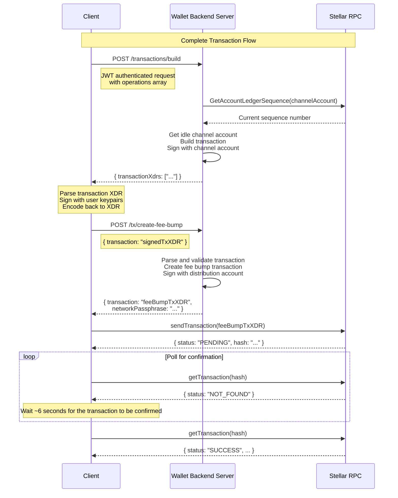
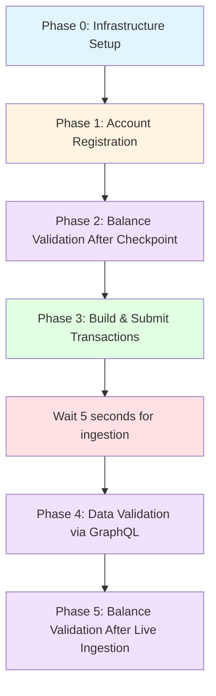

# Wallet-Backend

[](https://petstore.swagger.io/?url=https://raw.githubusercontent.com/stellar/wallet-backend/refs/heads/main/openapi/main.yaml)
[](https://deepwiki.com/stellar/wallet-backend)
[](https://hub.docker.com/r/stellar/wallet-backend/tags)

The wallet-backend serves as a backend service for Stellar wallet applications, providing transaction submission,
account management, and payment tracking capabilities.

## Table of Contents

- [Wallet-Backend](#wallet-backend)
  - [Table of Contents](#table-of-contents)
  - [Overview](#overview)
  - [Getting Started](#getting-started)
  - [Authentication](#authentication)
  - [API Reference](#api-reference)
  - [Architecture](#architecture)
  - [Integration Tests Setup](#integration-tests-setup)
  - [Deployment](#deployment)

## Overview

The wallet-backend service provides several key functionalities:

- **Account Management**: Registration, deregistration, and sponsored account creation
- **Transaction Submission**: Reliable transaction building, submission, and status tracking
- **Payment History**: Tracking and querying of payment records
- **Channel Account Management**: Creation and management of channel accounts for transaction signing
- **Security**: Request authentication and signature verification

## Getting Started

Follow these steps to start the wallet-backend server for local development and contribution.

**In this section:**
- [Prerequisites](#prerequisites)
- [Running the Server](#running-the-server)
- [Testing](#testing)

### Prerequisites

- Go 1.23.2 or later
- Docker and Docker Compose

### Running the Server

1. Clone the repository:

   ```bash
   git clone https://github.com/stellar/wallet-backend.git
   cd wallet-backend
   ```

2. Copy the example `.env.example` file and fill in the required environment variables:

   ```bash
   cp .env.example .env
   ```

3. Set environment variables (refer to `.env.example` for details):

   ```bash
   DATABASE_URL=postgres://postgres@localhost:5432/wallet-backend?sslmode=disable
   NETWORK=testnet
   STELLAR_ENVIRONMENT=development

   # The CHANNEL_ACCOUNT_ENCRYPTION_PASSPHRASE is used to encrypt/decrypt the channel accounts private keys. A strong passphrase is recommended.
   CHANNEL_ACCOUNT_ENCRYPTION_PASSPHRASE=<your_passphrase>

   # The DISTRIBUTION_ACCOUNT is used to sponsor fees and reserves for the client transactions. It must be an existing account with XLM balance.
   DISTRIBUTION_ACCOUNT_PRIVATE_KEY=<your_private_key>
   DISTRIBUTION_ACCOUNT_PUBLIC_KEY=<your_public_key>

   # CLIENT_AUTH_PUBLIC_KEYS is a comma-separated list of Stellar public keys whose private key(s) are authorized to sign the authentication header. They must be Stellar addresses.
   CLIENT_AUTH_PUBLIC_KEYS=<your_public_keys>
   ```

4. Start the server and its dependencies using one of the following methods:

#### Docker Compose (Quickstart)

This is the simplest way to start the wallet-backend server. All services will run in Docker containers as defined in the `docker-compose.yaml` file.

1. Start the containers:

   ```bash
   docker compose up
   ```

   This will start the `api`, `db`, `ingest`, and `stellar-rpc` services.

#### Local + Docker (Active Development)

This setup is ideal for active development, allowing you to add debug points to the code.

1. Start the `db` and `stellar-rpc` containers:

   ```bash
   docker compose up -d db stellar-rpc
   ```

2. Run `api` and `ingest` locally:

   - **API**
      1. Source the `.env` file:

         ```bash
         source .env
         ```

      2. Run migrations:

         ```bash
         go run main.go migrate up
         ```

      3. Generate channel accounts:

         ```bash
         go run main.go channel-account ensure 5
         ```

      4. Start the API server:

         ```bash
         go run main.go serve
         ```

   - **Ingest**
     1. In a separate terminal, source the `.env` file and run the ingestion service:

        ```bash
        source .env
        go run main.go ingest
        ```

This allows us to establish a dev cycle where you can make changes to the code and restart the `api` and `ingest`
services to test them. Based on the IDE you are using, you can add the build configurations for these services, along
with the environment variables to add breakpoints to your code.

### Testing

The wallet-backend includes both unit and integration tests to ensure comprehensive coverage.

#### Unit Tests

Unit tests can be run using the following command:

```bash
go test ./...
```

**Dependencies:**

- A `db` needs to be available and configured through the `DATABASE_URL` environment variable.

#### Integration Tests

Integration tests can be executed with the following command:

```bash
go run main.go integration-tests
```

**Dependencies:**

- Ensure your environment is configured as described in the setup section.
- Both `db` and `stellar-rpc` services should be running, either in Docker containers or locally.

This setup allows you to verify both the isolated functionality of components (unit tests) and their interactions (integration tests) within the wallet-backend.

## Authentication

The wallet-backend uses JSON Web Tokens (JWT) with Ed25519 signatures for request authentication.

### JWT Signature

The JWT is signed using an Ed25519 private key derived from a Stellar secret seed. You can generate Stellar keypairs at the [Stellar Laboratory](https://lab.stellar.org/account/create?$=network$id=testnet&label=Testnet&horizonUrl=https:////horizon-testnet.stellar.org&rpcUrl=https:////soroban-testnet.stellar.org&passphrase=Test%20SDF%20Network%20/;%20September%202015;;).

The server can be configured to accept multiple (comma-separated) public keys through the `CLIENT_AUTH_PUBLIC_KEYS` environment variable.

### JWT Claims

The JWT payload field should contain the following fields:

- (default) `exp` – The expiration time on and after which the JWT must not be accepted for processing, in seconds since Epoch. (Must be less than `iat`+15sec.)
- (default) `iat` - The time at which the JWT was issued, in seconds since Epoch.
- (default) `sub` – The subject of the JWT, which is the public key of the Stellar account that is being authenticated.
- (custom) `methodAndPath` – The HTTP method and path of the request (e.g., `GET /transactions/b9d0b2292c4e09e8eb22d036171491e87b8d2086bf8b265874c8d182cb9c9020`).
- (custom) `bodyHash`, a hex-encoded SHA-256 hash of the raw HTTP request body, present even when the body is empty:
   ```go
   func HashBody(body []byte) string {
      hashedBodyBytes := sha256.Sum256(body)
      return hex.EncodeToString(hashedBodyBytes[:])
   }
   ```

For more details on the JWT implementation, please see [`jwt_manager.go`](./pkg/wbclient/auth/jwt_manager.go).

## API Reference

The wallet-backend provides two core API services that simplify Stellar transaction management for wallet applications.

**In this section:**
- [Transaction Building and Fee Bump](#transaction-building-and-fee-bump)
- [GraphQL API](#graphql-api)

### Transaction Building and Fee Bump

1. **Transaction Building** (`POST /transactions/build`):
   - Uses pre-funded channel accounts to handle sequence numbers automatically
   - Provides high throughput by eliminating client-side sequence number management
   - Returns signed transaction XDRs ready for client signature

2. **Fee Bump Transactions** (`POST /tx/create-fee-bump`):
   - Automatically creates and signs fee bump transactions
   - Uses a distribution account to cover transaction fees
   - Returns a complete fee bump transaction ready for submission

#### Complete Transaction Flow

The following diagram illustrates the complete transaction lifecycle:



## Architecture

The wallet-backend includes several internal services that power its high-performance features. This section documents the internal implementation for contributors and those seeking to understand the system's internals.

**In this section:**
- [Account Token Cache](#account-token-cache)
- [Contract Validator Service](#contract-validator-service)
- [Contract Metadata Service](#contract-metadata-service)

### Account Token Cache

The wallet-backend implements a high-performance **Account Token Cache** system that enables fast retrieval of account balances across all token types. This Redis-backed cache tracks every account's token holdings, including native XLM, classic trustlines, and Stellar Asset Contract (SAC) tokens.

**Why it exists:**
- **Fast Balance Queries**: Enables sub-second response times for the GraphQL `balancesByAccountAddress` query
- **Complete Token Coverage**: Tracks all token types an account holds without expensive RPC lookups
- **Efficient Updates**: Incrementally updates during live ingestion without rescanning the entire ledger
- **Horizontal Scalability**: Redis-based architecture supports distributed deployments

#### Supported Token Types

The cache tracks 3 distinct token types:

| Type | Description | Example |
|------|-------------|---------|
| **Trustline** | Classic Stellar assets | `USDC:GBBD47IF6LWK7P7MDEVSCWR7DPUWV3NY3DTQEVFL4NAT4AQH3ZLLFLA5` |
| **SAC** | Stellar Asset Contract (wrapped classic assets) | `CAQCMV4JFG4EZXQEAV7TUV2E52DMSO2LQKBOSA7UM3B4NIP4DQJ3JHQJ` |
| **SEP-41** | Custom contract tokens (implementing SEP-41 standard) | `CCVLZ3SQWV4R5OYTXM7FYNVJLUBXZ3FXOVQXMKIFXFPJT3YNG3HLKXPS` |

#### Architecture Overview

The Account Token Cache operates in two phases:

**1. Initial Population (Cold Start)**

When the wallet-backend starts with an empty database, it performs a one-time population from Stellar history archives:

```
History Archive (Checkpoint Ledger)
         │
         ▼
CheckpointChangeReader ──► Processes ledger state
         │
         ├──► Trustlines: account → [CODE:ISSUER, ...]
         └──► Contracts: account → [ContractID, ...]
                     │
                     ▼
            Redis Cache (Populated)
            ├── trustlines:{account} → Set<"CODE:ISSUER">
            └── contracts:{account} → Set<contractID>
```

**Process:**
1. Calculates the nearest checkpoint ledger from the history archive
2. Downloads and processes the checkpoint state file
3. Extracts all trustline and contract balance entries
4. Populates Redis using batch operations (50,000 items per pipeline)
5. Completes before live ingestion begins

**2. Live Ingestion (Continuous Updates)**

During normal operation, the cache is updated in real-time as trustlines are created/removed and transfers of new contract tokens occurs between accounts:

```
Stellar RPC (LedgerCloseMeta)
         │
         ▼
    Indexer
    ├── TokenTransferProcessor (balance changes detects new SEP41 token updates)
    └── EffectsProcessor (trustline changes detects new trustline additions or removal of old trustlines)
         │
         ▼
   IndexerBuffer
   ├── TrustlineChanges
   └── ContractChanges
         │
         ▼
AccountTokenService.ProcessTokenChanges()
         │
         ▼
   Redis Cache (Updated)
```

**Process:**
1. Indexer processors detect state changes from transaction effects
2. Changes are buffered (trustline additions/removals, contract balance changes)
3. After successful DB write, `AccountTokenService.ProcessTokenChanges()` updates Redis
4. Uses Redis pipelining for efficient batch updates
5. Contract metadata (name, symbol, decimals) is fetched and stored in PostgreSQL

#### GraphQL Integration

The Account Token Cache powers the [`balancesByAccountAddress`](#7-get-account-balances) GraphQL query. See the [Get Account Balances](#7-get-account-balances) section for query examples and response formats.

#### Redis Data Structures

The cache uses Redis sets with namespace prefixes:

**Trustline Keys:**
```
Key: trustlines:{accountAddress}
Value: Set<"CODE:ISSUER">

Example:
trustlines:GABC123... → {
  "USDC:GBBD47IF6LWK7P7MDEVSCWR7DPUWV3NY3DTQEVFL4NAT4AQH3ZLLFLA5",
  "EURC:GBBD47IF6LWK7P7MDEVSCWR7DPUWV3NY3DTQEVFL4NAT4AQH3ZLLFLA5"
}
```

**Contract Keys:**
```
Key: contracts:{accountAddress}
Value: Set<contractID>

Example:
contracts:GABC123... → {
  "CAQCMV4JFG4EZXQEAV7TUV2E52DMSO2LQKBOSA7UM3B4NIP4DQJ3JHQJ",
  "CCVLZ3SQWV4R5OYTXM7FYNVJLUBXZ3FXOVQXMKIFXFPJT3YNG3HLKXPS"
}
```

#### Service API

The `AccountTokenService` interface provides the following methods:

**Population:**
- `PopulateAccountTokens(ctx, checkpointLedger)` - Initial cache population from history archive

**Querying:**
- `GetAccountTrustlines(ctx, accountAddress)` - Returns all classic asset trustlines
- `GetAccountContracts(ctx, accountAddress)` - Returns all contract token IDs

**Updates:**
- `AddTrustlines(ctx, accountAddress, assets)` - Adds trustline assets to cache
- `AddContracts(ctx, accountAddress, contractIDs)` - Adds contract IDs to cache
- `ProcessTokenChanges(ctx, trustlineChanges, contractChanges)` - Batch update during ingestion

#### Performance Characteristics

**Initial Population:**
- Processes millions of ledger entries efficiently
- Uses Redis pipelining (50,000 operations per batch)
- Non-blocking: completes before API serves traffic

**Live Updates:**
- Sub-millisecond Redis operations per transaction
- Batch updates using Redis pipelines
- Scales horizontally with Redis cluster

**Balance Queries:**
- O(1) Redis lookup per account
- Single RPC call for all balances (no N+1 queries)
- Typical response time: 100-300ms (including RPC roundtrip)

### Contract Validator Service

The wallet-backend implements a **Contract Validator Service** that validates whether Stellar contracts implement the SEP-41 token standard by analyzing their WASM bytecode. This service is a critical component of the [Account Token Cache](#account-token-cache) system, enabling automatic classification of contract tokens during cache population.

**Why it exists:**
- **Automatic Token Classification**: Identifies which contracts follow the SEP-41 fungible token standard without manual configuration
- **Standards Compliance**: Ensures contracts expose the required token interface (balance, transfer, decimals, etc.)
- **Balance Tracking**: Only SEP-41-compliant contracts are tracked in the account token cache for balance queries
- **Integration with GraphQL**: Powers the [`balancesByAccountAddress`](#7-get-account-balances) query by distinguishing SEP-41 tokens from unknown contracts

#### How Validation Works

The Contract Validator uses a 4-step process to validate contracts against the SEP-41 standard:

```
Contract WASM Bytecode
         │
         ▼
1. WASM Compilation (wazero runtime)
         │
         ▼
2. Spec Extraction (contractspecv0 custom section)
         │
         ▼
3. XDR Parsing (ScSpecEntry unmarshaling)
         │
         ▼
4. Function Validation (name, inputs, outputs)
         │
         ▼
   Classification Result
   ├── SEP-41 ✓ (all functions match)
   └── Unknown (missing/mismatched functions)
```

**Process Details:**

1. **WASM Compilation**: Uses the [wazero](https://wazero.io/) runtime to safely compile the contract's WASM module with custom sections enabled
2. **Spec Extraction**: Extracts the `contractspecv0` custom section that contains XDR-encoded contract specifications
3. **XDR Parsing**: Unmarshals `ScSpecEntry` items from the spec bytes, representing each contract function and type
4. **Function Validation**: Verifies that all 10 required SEP-41 functions exist with exact parameter names and types

#### SEP-41 Required Functions

For a contract to be classified as SEP-41-compliant, it must implement **all** of the following functions with exact signatures:

| Function | Parameters | Returns | Description |
|----------|-----------|---------|-------------|
| `balance` | `id: Address` | `i128` | Get balance for an address |
| `allowance` | `from: Address, spender: Address` | `i128` | Get allowance for spender |
| `decimals` | _(none)_ | `u32` | Number of decimal places |
| `name` | _(none)_ | `String` | Token name |
| `symbol` | _(none)_ | `String` | Token symbol |
| `approve` | `from: Address, spender: Address, amount: i128, expiration_ledger: u32` | _(void)_ | Approve spender allowance |
| `transfer` | `from: Address, to: Address, amount: i128` | _(void)_ | Transfer tokens |
| `transfer` (CAP-67) | `from: Address, to_muxed: MuxedAddress, amount: i128` | _(void)_ | Transfer to muxed address |
| `transfer_from` | `spender: Address, from: Address, to: Address, amount: i128` | _(void)_ | Transfer from allowance |
| `burn` | `from: Address, amount: i128` | _(void)_ | Burn tokens |
| `burn_from` | `spender: Address, from: Address, amount: i128` | _(void)_ | Burn from allowance |

**Notes:**
- All parameter names must match exactly (e.g., `from`, `to`, `amount`).
- The `transfer` function supports two variants: standard (to `Address`) or [CAP-67](https://stellar.org/protocol/cap-67) (to `MuxedAddress`).
- Functions with `(void)` return type have no outputs.
- A SEP-41 compliant token has to implement all required functions but can implement additional functions too.

#### Contract Type Classification

The wallet-backend classifies contracts into three types during cache population:

| Type | Classification Method | Tracked in Cache | Example |
|------|----------------------|------------------|---------|
| **SAC** | Standard asset wrapper detection via `sac.AssetFromContractData()` | Yes | USDC:ISSUER wrapped contract |
| **SEP-41** | Contract Validator (WASM spec validation) | Yes | Custom fungible tokens |
| **Unknown** | Contracts that don't match SAC or SEP-41 | No | NFTs, AMMs, other contracts |

**Classification Logic:**
1. **SAC contracts** are identified first using Stellar's standard asset wrapper format (without WASM validation)
2. **Non-SAC contracts** are grouped by WASM hash and validated against SEP-41 requirements using the contract validator service
3. **Unknown contracts** that fail SEP-41 validation are not tracked in the account token cache

This classification determines:
- Whether contract balances are tracked in Redis (SAC and SEP-41 only)
- How balances are displayed in GraphQL responses (different fields per type)
- Whether contract metadata is fetched and stored by the [Contract Metadata Service](#contract-metadata-service)

#### Integration with Account Token Cache

The Contract Validator runs during the initial [Account Token Cache](#account-token-cache) population from history archives:

**Integration Flow:**

```
Account Token Service (PopulateAccountTokens)
         │
         ▼
CheckpointChangeReader
├── Collects LedgerEntryTypeContractCode (WASM bytecode)
├── Collects LedgerEntryTypeContractData (instances)
└── Groups contracts by WASM hash
         │
         ▼
enrichContractTypes()
├── For each WASM hash:
│   ├── contractValidator.ValidateFromContractCode(ctx, wasmBytes)
│   └── Assign ContractTypeSEP41 to all contracts with this hash
└── Returns contractTypesByContractID map
         │
         ▼
Contract Metadata Service
└── Fetches metadata for validated SEP-41 contracts
         │
         ▼
Redis Cache + PostgreSQL
└── Stores contract IDs and metadata
```

**Efficiency Optimization:**

The validator processes contracts by **WASM hash** rather than individual contract ID, because:
- Multiple contract instances can share the same WASM code
- Validating once per WASM hash (not per contract ID) reduces computation
- All contracts with the same WASM hash receive the same classification

**Example:**
```
WASM Hash: 0xabc123...
├── Contract: CABC...123 → SEP-41
├── Contract: CABC...456 → SEP-41  (same WASM, inherits classification)
└── Contract: CABC...789 → SEP-41  (same WASM, inherits classification)
```

#### Technical Implementation

**WASM Runtime:**

The validator uses the [wazero](https://wazero.io/) WebAssembly runtime, which:
- Provides safe, sandboxed WASM execution in pure Go
- Supports custom section extraction without executing contract code
- Does not require CGo dependencies

**Custom Section Extraction:**

Stellar contracts embed their interface specifications in a WASM custom section named `contractspecv0`:

```
WASM Module Structure:
├── Code Section (executable functions)
├── Data Section (constants)
└── Custom Sections
    └── "contractspecv0" ← XDR-encoded contract spec
```

**XDR Type Mapping:**

The validator maps XDR `ScSpecType` values to human-readable type names:

| XDR Type | Human-Readable Name |
|----------|---------------------|
| `ScSpecTypeBool` | `bool` |
| `ScSpecTypeU32` | `u32` |
| `ScSpecTypeI128` | `i128` |
| `ScSpecTypeAddress` | `Address` |
| `ScSpecTypeMuxedAddress` | `MuxedAddress` |
| `ScSpecTypeString` | `String` |
| `ScSpecTypeVec` | `Vec` |
| `ScSpecTypeMap` | `Map` |

#### Service API

The `ContractValidator` interface provides:

```go
// Validate contract code against SEP-41 standard
ValidateFromContractCode(ctx context.Context, wasmCode []byte) (types.ContractType, error)

// Close wazero runtime and release resources
Close(ctx context.Context) error
```

**Parameters:**
- `wasmCode`: Raw WASM bytecode from `LedgerEntryTypeContractCode` entry

**Return Values:**
- `types.ContractTypeSEP41`: Contract implements all SEP-41 functions
- `types.ContractTypeUnknown`: Contract missing required functions or spec extraction failed
- `error`: WASM compilation or spec parsing errors

**Error Handling:**
- Missing `contractspecv0` section returns `ContractTypeUnknown` with error
- Invalid WASM bytecode returns compilation error
- XDR unmarshaling errors are logged and return `ContractTypeUnknown`
- Individual validation failures are logged but don't fail the entire process

**Resource Management:**

The validator must be explicitly closed to release wazero runtime resources:

```go
defer func() {
    if err := contractValidator.Close(ctx); err != nil {
        log.Errorf("Failed to close contract validator: %v", err)
    }
}()
```

This is handled automatically in `PopulateAccountTokens()`.

#### Performance Characteristics

**Initial Population:**
- Processes contracts grouped by WASM hash (deduplication)
- Validation is CPU-bound (WASM compilation + XDR parsing)
- Typical performance: ~50-100 contracts/second per WASM hash
- No RPC calls required (reads from history archive)

**Live Ingestion:**
- Contract validator is **not** used during live ingestion
- New contracts are detected via balance entries but not re-validated
- Classification happens only during initial cache population

**Memory Usage:**
- Wazero runtime: ~10MB base overhead
- Per-contract: ~1-5MB during compilation (released after validation)
- Compiled modules are closed immediately after spec extraction

**Optimization Strategies:**
1. **WASM Hash Grouping**: Validate once per unique WASM hash, not per contract instance
2. **Spec Caching**: Contract specs are extracted once and reused for all contracts with same hash
3. **Lazy Compilation**: WASM modules are compiled only when needed for validation
4. **Resource Cleanup**: Compiled modules are closed immediately after use to free memory

### Contract Metadata Service

The wallet-backend implements a **Contract Metadata Service** that fetches and stores rich metadata for Stellar Asset Contract (SAC) and SEP-41 token contracts. This service enriches the [Account Token Cache](#account-token-cache) by providing human-readable token information (name, symbol, decimals) that powers the [`balancesByAccountAddress`](#7-get-account-balances) GraphQL query.

**Why it exists:**
- **Rich Token Information**: Provides name, symbol, and decimals for contract tokens without requiring clients to fetch this data
- **GraphQL Enhancement**: Powers detailed balance responses with token metadata in a single query
- **SAC Asset Mapping**: Extracts and stores the underlying classic asset (code:issuer) from SAC token names
- **Performance**: Batch fetches and caches metadata to avoid repeated RPC calls
- **Seamless Integration**: Works transparently during both initial cache population and live ingestion

#### Supported Contract Types

The service handles two types of contract tokens:

| Type | Description | Metadata Source |
|------|-------------|----------------|
| **SAC** | Stellar Asset Contract (wrapped classic assets) | Contract methods + name parsing for code:issuer |
| **SEP-41** | Custom fungible tokens implementing SEP-41 standard | Contract methods (name, symbol, decimals) |

#### Database Schema

Contract metadata is stored in the `contract_tokens` PostgreSQL table:

```sql
CREATE TABLE contract_tokens (
    id TEXT PRIMARY KEY,           -- Contract ID (C...)
    type TEXT NOT NULL,            -- "SAC" or "SEP41"
    code TEXT NULL,                -- Asset code (for SAC tokens)
    issuer TEXT NULL,              -- Asset issuer (for SAC tokens)
    name TEXT NULL,                -- Token name from contract
    symbol TEXT NULL,              -- Token symbol from contract
    decimals SMALLINT NOT NULL,    -- Token decimals
    created_at TIMESTAMPTZ NOT NULL DEFAULT NOW(),
    updated_at TIMESTAMPTZ NOT NULL DEFAULT NOW()
);
```

**Example Rows:**

| id | type | code | issuer | name | symbol | decimals |
|----|------|------|--------|------|--------|----------|
| `CAQ...JHQJ` | SAC | USDC | GBBD47IF6LWK7... | USDC:GBBD47IF6LWK7... | USDC | 7 |
| `CCV...KXPS` | SEP41 | NULL | NULL | Example Token | EXT | 7 |

#### Metadata Fetching Process

The Contract Metadata Service operates in two phases, coordinated with the [Account Token Cache](#account-token-cache):

**1. Initial Population (Cold Start)**

During startup when populating the account token cache from history archives:

```
History Archive (Checkpoint)
         │
         ▼
Account Token Service
├── Collects contract IDs from checkpoint
├── Validates contract types (SAC vs SEP-41)
│        │
│        ▼
Contract Metadata Service
├── Fetches metadata via RPC simulation
├── Parses SAC code:issuer from name field
└── Stores in contract_tokens table
         │
         ▼
   PostgreSQL Database
```

**Process:**
1. `AccountTokenService.PopulateAccountTokens()` collects all contract IDs from checkpoint
2. Contract types are validated (SAC via standard asset wrapper, SEP-41 via contract spec)
3. `ContractMetadataService.FetchAndStoreMetadata()` fetches metadata for all contracts
4. Metadata is stored in PostgreSQL for future queries

**2. Live Ingestion (Continuous Updates)**

During real-time ingestion when new contract tokens are detected:

```
Stellar RPC (LedgerCloseMeta)
         │
         ▼
    Indexer
    └── Detects new contract token transfers
         │
         ▼
Contract Metadata Service
├── Fetches metadata for new contracts
└── Stores in contract_tokens table
         │
         ▼
   PostgreSQL Database
```

**Process:**
1. Indexer's transaction processors detect new contract balance entries
2. New contract IDs are identified (not in cache)
3. Metadata is fetched and stored in `contract_tokens` table
4. Account Token Cache is updated with new contract IDs

#### How Metadata is Fetched

The service uses **RPC transaction simulation** to call contract methods without executing actual transactions:

**Simulation-Based Fetching:**
```go
// For each contract, simulate 3 transactions:
1. InvokeHostFunction("name")   → Returns token name
2. InvokeHostFunction("symbol") → Returns token symbol
3. InvokeHostFunction("decimals") → Returns token decimals

// Simulation uses a dummy account (no real account needed)
// Results are parsed from ScVal XDR responses
```

**Parallel Processing Architecture:**
- **Per-Contract Parallelism**: Fetches name, symbol, decimals simultaneously using pond worker pool
- **Batch Processing**: Processes contracts in batches of 20 to limit concurrent RPC load
- **Rate Limiting**: 2-second sleep between batches to avoid overwhelming RPC server

**Performance Example:**
```
60 contracts with 3 fields each = 180 RPC calls
- Batch 1-20: ~20 seconds (parallel fetch)
- Sleep: 2 seconds
- Batch 21-40: ~20 seconds (parallel fetch)
- Sleep: 2 seconds
- Batch 41-60: ~20 seconds (parallel fetch)
Total time: ~64 seconds vs ~180 seconds sequential
```

#### SAC Token Metadata Parsing

SAC (Stellar Asset Contract) tokens require special handling because they wrap classic Stellar assets:

**Name Field Format:**
```
SAC tokens store the underlying asset as: "CODE:ISSUER"
Example: "USDC:GBBD47IF6LWK7P7MDEVSCWR7DPUWV3NY3DTQEVFL4NAT4AQH3ZLLFLA5"
```

**Parsing Logic:**
```go
// For SAC contracts only:
parts := strings.Split(metadata.Name, ":")
if len(parts) == 2 {
    metadata.Code = parts[0]   // "USDC"
    metadata.Issuer = parts[1] // "GBBD47IF..."
}
```

This allows the GraphQL API to return both the contract address and the underlying classic asset information in balance queries.

#### Integration with GraphQL Balances

Contract metadata stored in `contract_tokens` enriches the [`balancesByAccountAddress`](#7-get-account-balances) query:

**For SAC Balances:**
```graphql
{
  balancesByAccountAddress(address: "GABC...") {
    ... on SACBalance {
      code       # From contract_tokens.code
      issuer     # From contract_tokens.issuer
      decimals   # From contract_tokens.decimals
      balance    # From RPC ledger entry
    }
  }
}
```

**For SEP-41 Balances:**
```graphql
{
  balancesByAccountAddress(address: "GABC...") {
    ... on SEP41Balance {
      name       # From contract_tokens.name
      symbol     # From contract_tokens.symbol
      decimals   # From contract_tokens.decimals
      balance    # From RPC ledger entry
    }
  }
}
```

**Query Flow:**
1. Fetch contract IDs from Redis (Account Token Cache)
2. Fetch contract metadata from PostgreSQL (`contract_tokens` table)
3. Build ledger keys and query Stellar RPC for current balances
4. Combine metadata + balance data in GraphQL response

This architecture enables **sub-second balance queries** with complete token information, without requiring multiple RPC calls per token.

#### Service API

The `ContractMetadataService` interface provides:

```go
// Fetch and store metadata for multiple contracts
FetchAndStoreMetadata(ctx context.Context, contractTypesByID map[string]types.ContractType) error
```

**Parameters:**
- `contractTypesByID`: Map of contract IDs to contract types (SAC or SEP-41)

**Behavior:**
- Returns `nil` for empty input (no-op)
- Fetches metadata in parallel batches
- Parses SAC code:issuer from name field
- Stores in database with `ON CONFLICT DO NOTHING` (idempotent)
- Logs warnings for individual failures but continues processing
- Returns error only for critical database failures

#### Performance Characteristics

**Initial Population:**
- Processes contracts in batches of 20
- Parallel metadata fetching (3 fields per contract)
- ~3 seconds per batch (20 contracts × 3 fields = 60 parallel RPC calls)
- 2-second sleep between batches for rate limiting
- Typical time: ~5 minutes for 1,000 contracts

**Live Ingestion:**
- Fetches metadata only for new contracts (not already in database)
- Same batching and parallelism as initial population
- Minimal overhead for most ledgers (few new contracts per ledger)

**Database Operations:**
- Batch insert with `UNNEST` for efficient bulk storage
- `ON CONFLICT DO NOTHING` prevents duplicate key errors
- Automatic deduplication for contracts seen in multiple contexts

**Memory Efficiency:**
- Metadata map size = number of contracts × ~200 bytes per entry
- Worker pool limits concurrent RPC connections
- No large in-memory buffers required

### GraphQL API

The wallet-backend provides a powerful GraphQL API that enables flexible querying of blockchain data including transactions, operations, accounts, and state changes. The GraphQL API is designed for applications that need efficient, customizable data retrieval with strong typing and introspection capabilities.

**Key Benefits:**
- **Flexible Queries**: Request exactly the data you need, nothing more
- **Strong Typing**: Full type safety with schema introspection
- **Efficient Data Loading**: Built-in DataLoaders prevent N+1 queries
- **Cursor-based Pagination**: Relay-style pagination for all list queries
- **Rich Relationships**: Easily traverse relationships between accounts, transactions, operations, and state changes

**In this section:**
- [Getting Started](#getting-started)
- [Queries](#queries)
- [Mutations](#mutations)
- [Pagination](#pagination)
- [State Changes](#state-changes)
- [Error Handling](#error-handling)
- [Performance Features](#performance-features)

#### Getting Started

**Endpoint**: `POST /graphql`

**Authentication**: All GraphQL requests require JWT authentication. See the [Authentication](#authentication) section for details.

**Quick Example:**

```bash
curl -X POST http://localhost:8080/graphql \
  -H "Content-Type: application/json" \
  -H "Authorization: Bearer YOUR_JWT_TOKEN" \
  -d '{
    "query": "{ transactionByHash(hash: \"abc123...\") { hash ledgerNumber envelopeXdr } }"
  }'
```

**Schema Introspection:**

You can explore the full schema using GraphQL introspection:

```graphql
query {
  __schema {
    types {
      name
      description
    }
  }
}
```

#### Queries

The GraphQL API provides eight root queries for accessing blockchain data:

| # | Query | Description |
|---|-------|-------------|
| 1 | [`transactionByHash`](#1-get-transaction-by-hash) | Get a specific transaction by its hash |
| 2 | [`transactions`](#2-list-all-transactions) | List all transactions with pagination |
| 3 | [`accountByAddress`](#3-get-account-by-address) | Get account info and related data |
| 4 | [`operations`](#4-list-all-operations) | List all operations with pagination |
| 5 | [`operationById`](#5-get-operation-by-id) | Get a specific operation by ID |
| 6 | [`stateChanges`](#6-list-state-changes) | List all state changes with pagination |
| 7 | [`balancesByAccountAddress`](#7-get-account-balances) | Get all token balances for an account |
| 8 | [`balancesByAccountAddresses`](#8-get-multiple-account-balances) | Get token balances for multiple accounts |

##### 1. Get Transaction by Hash

Retrieve a specific transaction by its hash.

```graphql
query GetTransaction {
  transactionByHash(hash: "abc123...") {
    hash
    envelopeXdr
    resultXdr
    metaXdr
    ledgerNumber
    ledgerCreatedAt
    ingestedAt

    # Related data
    accounts {
      address
    }

    operations(first: 10) {
      edges {
        node {
          id
          operationType
        }
      }
    }
  }
}
```

##### 2. List All Transactions

Query transactions with cursor-based pagination.

```graphql
query ListTransactions {
  transactions(first: 10, after: "cursor123") {
    edges {
      node {
        hash
        ledgerNumber
        ledgerCreatedAt
      }
      cursor
    }
    pageInfo {
      hasNextPage
      hasPreviousPage
      startCursor
      endCursor
    }
  }
}
```

**Pagination Parameters:**
- `first: Int` - Return the first N items (forward pagination)
- `after: String` - Return items after this cursor
- `last: Int` - Return the last N items (backward pagination)
- `before: String` - Return items before this cursor

Note that you can only use `first/after` and `last/before`. Any other combination will result in an error.

##### 3. Get Account by Address

Retrieve account information and related data.

```graphql
query GetAccount {
  accountByAddress(address: "GABC...") {
    address

    # Related transactions
    transactions(first: 10) {
      edges {
        node {
          hash
          ledgerNumber
        }
      }
      pageInfo {
        hasNextPage
      }
    }

    # Related operations
    operations(first: 20) {
      edges {
        node {
          id
          operationType
          operationXdr
        }
      }
    }

    # Related state changes
    stateChanges(first: 50) {
      edges {
        node {
          ... on StandardBalanceChange {
            type
            reason
            tokenId
            amount
            ledgerNumber
          }
          ... on SignerChange {
            type
            reason
            signerAddress
            signerWeights
          }
        }
      }
    }
  }
}
```

##### 4. List All Operations

Query operations across all transactions.

```graphql
query ListOperations {
  operations(first: 20) {
    edges {
      node {
        id
        operationType
        operationXdr
        ledgerNumber
        ledgerCreatedAt

        # Parent transaction
        transaction {
          hash
          envelopeXdr
        }

        # Related accounts
        accounts {
          address
        }
      }
      cursor
    }
    pageInfo {
      hasNextPage
      endCursor
    }
  }
}
```

**Operation Types:**

The `operationType` field supports all Stellar operation types:
- `CREATE_ACCOUNT`, `PAYMENT`, `PATH_PAYMENT_STRICT_RECEIVE`, `PATH_PAYMENT_STRICT_SEND`
- `MANAGE_SELL_OFFER`, `CREATE_PASSIVE_SELL_OFFER`, `MANAGE_BUY_OFFER`
- `SET_OPTIONS`, `CHANGE_TRUST`, `ALLOW_TRUST`, `ACCOUNT_MERGE`
- `MANAGE_DATA`, `BUMP_SEQUENCE`
- `CREATE_CLAIMABLE_BALANCE`, `CLAIM_CLAIMABLE_BALANCE`
- `BEGIN_SPONSORING_FUTURE_RESERVES`, `END_SPONSORING_FUTURE_RESERVES`, `REVOKE_SPONSORSHIP`
- `CLAWBACK`, `CLAWBACK_CLAIMABLE_BALANCE`, `SET_TRUST_LINE_FLAGS`
- `LIQUIDITY_POOL_DEPOSIT`, `LIQUIDITY_POOL_WITHDRAW`
- `INVOKE_HOST_FUNCTION`, `EXTEND_FOOTPRINT_TTL`, `RESTORE_FOOTPRINT` (Soroban)

##### 5. Get Operation by ID

Retrieve a specific operation by its ID.

```graphql
query GetOperation {
  operationById(id: 12345) {
    id
    operationType
    operationXdr
    ledgerNumber
    ledgerCreatedAt

    transaction {
      hash
      ledgerNumber
    }

    accounts {
      address
    }

    stateChanges(first: 10) {
      edges {
        node {
          ... on StandardBalanceChange {
            tokenId
            amount
          }
        }
      }
    }
  }
}
```

##### 6. List State Changes

Query all state changes.

```graphql
query ListStateChanges {
  stateChanges(first: 50) {
    edges {
      node {
        # Common fields (available on all state change types)
        type
        reason
        ledgerNumber
        ledgerCreatedAt
        ingestedAt

        account {
          address
        }

        operation {
          id
          operationType
        }

        transaction {
          hash
        }

        # Type-specific fields using fragments
        ... on StandardBalanceChange {
          tokenId
          amount
        }

        ... on AccountChange {
          tokenId
          amount
        }

        ... on SignerChange {
          signerAddress
          signerWeights
        }

        ... on SignerThresholdsChange {
          thresholds
        }

        ... on MetadataChange {
          keyValue
        }

        ... on FlagsChange {
          flags
        }

        ... on TrustlineChange {
          limit
        }

        ... on ReservesChange {
          sponsoredAddress
          sponsorAddress
        }

        ... on BalanceAuthorizationChange {
          flags
          keyValue
        }
      }
      cursor
    }
    pageInfo {
      hasNextPage
      endCursor
    }
  }
}
```

##### 7. Get Account Balances

Retrieve all token balances for an account, including native XLM, classic trustlines, and contract tokens.

```graphql
query GetAccountBalances {
  balancesByAccountAddress(address: "GABC...") {
    __typename
    tokenId
    tokenType
    balance

    ... on NativeBalance {
      # Native XLM balance (no additional fields)
    }

    ... on TrustlineBalance {
      code
      issuer
      type
      limit
      buyingLiabilities
      sellingLiabilities
      lastModifiedLedger
      isAuthorized
      isAuthorizedToMaintainLiabilities
    }

    ... on SACBalance {
      code
      issuer
      decimals
      isAuthorized
      isClawbackEnabled
    }

    ... on SEP41Balance {
      name
      symbol
      decimals
    }
  }
}
```

**Balance Types:**

The query returns different balance types based on the token:

| Type | Description | Key Fields |
|------|-------------|------------|
| `NativeBalance` | XLM (native asset) | `balance`, `tokenId`, `tokenType` |
| `TrustlineBalance` | Classic Stellar trustlines | `code`, `issuer`, `limit`, `isAuthorized`, liabilities |
| `SACBalance` | Stellar Asset Contract (wrapped classic assets) | `code`, `issuer`, `decimals`, `isAuthorized`, `isClawbackEnabled` |
| `SEP41Balance` | Custom contract tokens (SEP-41 standard) | `name`, `symbol`, `decimals` |

**Common Fields (all balance types):**
- `balance: String!` - Current balance amount
- `tokenId: String!` - Contract ID (C...) for the token
- `tokenType: TokenType!` - One of: `NATIVE`, `CLASSIC`, `SAC`, `SEP41`

**Token Types:**
- `NATIVE` - XLM (Stellar's native asset)
- `CLASSIC` - Classic Stellar trustline assets
- `SAC` - Stellar Asset Contract (classic assets wrapped for Soroban)
- `SEP41` - Custom fungible tokens implementing SEP-41

**Example: Query with Type Fragments:**

```graphql
query GetDetailedBalances {
  balancesByAccountAddress(address: "GABC...") {
    tokenId
    balance
    tokenType

    ... on TrustlineBalance {
      code
      issuer
      limit
      isAuthorized
    }

    ... on SACBalance {
      code
      issuer
      decimals
    }

    ... on SEP41Balance {
      name
      symbol
      decimals
    }
  }
}
```

**Response Example:**

```json
{
  "data": {
    "balancesByAccountAddress": [
      {
        "tokenId": "CDLZFC3SYJYDZT7K67VZ75HPJVIEUVNIXF47ZG2FB2RMQQVU2HHGCYSC",
        "balance": "100.0000000",
        "tokenType": "NATIVE"
      },
      {
        "tokenId": "CAQCMV4JFG4EZXQEAV7TUV2E52DMSO2LQKBOSA7UM3B4NIP4DQJ3JHQJ",
        "balance": "500.0000000",
        "tokenType": "CLASSIC",
        "code": "USDC",
        "issuer": "GBBD47IF6LWK7P7MDEVSCWR7DPUWV3NY3DTQEVFL4NAT4AQH3ZLLFLA5",
        "limit": "922337203685.4775807",
        "isAuthorized": true
      },
      {
        "tokenId": "CCVLZ3SQWV4R5OYTXM7FYNVJLUBXZ3FXOVQXMKIFXFPJT3YNG3HLKXPS",
        "balance": "1000.0000000",
        "tokenType": "SEP41",
        "name": "Example Token",
        "symbol": "EXT",
        "decimals": 7
      }
    ]
  }
}
```

**How It Works:**

This query leverages the Account Token Cache (see [Account Token Cache](#account-token-cache)) to efficiently retrieve balances:

1. Fetches token identifiers from Redis cache (trustlines and contracts)
2. Retrieves contract metadata from PostgreSQL (for SAC/SEP-41 tokens)
3. Builds ledger keys and queries Stellar RPC for current balances
4. Parses XDR entries and returns typed balance responses

**Supported Address Types:**
- **G-addresses**: Returns native XLM, trustlines, SAC, and SEP-41 balances
- **C-addresses** (contract addresses): Returns SAC and SEP-41 balances only

##### 8. Get Multiple Account Balances

Retrieve token balances for multiple accounts in a single request. This query fetches balances for up to 20 accounts (configurable) with parallel processing for optimal performance.

```graphql
query GetMultipleAccountBalances {
  balancesByAccountAddresses(addresses: ["GABC...", "GDEF...", "CXYZ..."]) {
    address
    balances {
      __typename
      tokenId
      tokenType
      balance

      ... on NativeBalance {
        # Native XLM balance (no additional fields)
      }

      ... on TrustlineBalance {
        code
        issuer
        limit
        isAuthorized
      }

      ... on SACBalance {
        code
        issuer
        decimals
      }

      ... on SEP41Balance {
        name
        symbol
        decimals
      }
    }
    error
  }
}
```

**Response Type:**

The query returns an array of `AccountBalances` objects, one per requested address:

| Field | Type | Description |
|-------|------|-------------|
| `address` | `String!` | The Stellar account or contract address |
| `balances` | `[Balance!]!` | List of balances for this account (empty if not found) |
| `error` | `String` | Error message if balance fetch failed for this account |

**Response Example:**

```json
{
  "data": {
    "balancesByAccountAddresses": [
      {
        "address": "GABC...",
        "balances": [
          {
            "tokenId": "CDLZFC3SYJYDZT7K67VZ75HPJVIEUVNIXF47ZG2FB2RMQQVU2HHGCYSC",
            "balance": "100.0000000",
            "tokenType": "NATIVE"
          },
          {
            "tokenId": "CAQCMV4JFG4EZXQEAV7TUV2E52DMSO2LQKBOSA7UM3B4NIP4DQJ3JHQJ",
            "balance": "500.0000000",
            "tokenType": "CLASSIC",
            "code": "USDC",
            "issuer": "GBBD47IF6LWK7P7MDEVSCWR7DPUWV3NY3DTQEVFL4NAT4AQH3ZLLFLA5",
            "limit": "922337203685.4775807",
            "isAuthorized": true
          }
        ],
        "error": null
      },
      {
        "address": "GDEF...",
        "balances": [],
        "error": "account not found on the network"
      },
      {
        "address": "CXYZ...",
        "balances": [
          {
            "tokenId": "CCVLZ3SQWV4R5OYTXM7FYNVJLUBXZ3FXOVQXMKIFXFPJT3YNG3HLKXPS",
            "balance": "1000.0000000",
            "tokenType": "SEP41",
            "name": "Example Token",
            "symbol": "EXT",
            "decimals": 7
          }
        ],
        "error": null
      }
    ]
  }
}
```

**Error Handling:**

This query uses **per-account error handling**, meaning failures for individual accounts don't fail the entire request:

- **Per-account errors**: Stored in the `error` field of each `AccountBalances` object. Other accounts still return their balances successfully.
- **Query-level errors**: Only occur for validation failures (e.g., exceeding address limit, empty address array, invalid address format).

**Query-Level Error Codes:**

| Error Code | Description |
|------------|-------------|
| `TOO_MANY_ADDRESSES` | Number of addresses exceeds the configured limit (default: 20) |
| `INVALID_ADDRESS` | One or more addresses have invalid format |

**Key Features:**

- **Parallel Processing**: Balances for multiple accounts are fetched concurrently using worker pools
- **Single RPC Call**: All ledger entries are retrieved in a single RPC request for efficiency
- **Address Deduplication**: Duplicate addresses in the input are automatically deduplicated
- **Empty Results**: Returns empty `balances` array (not an error) when an account is not found

**Supported Address Types:**
- **G-addresses**: Returns native XLM, trustlines, SAC, and SEP-41 balances
- **C-addresses** (contract addresses): Returns SAC and SEP-41 balances only

**Configuration:**

The maximum number of addresses per query is configurable via the `--max-accounts-per-balances-query` flag or `MAX_ACCOUNTS_PER_BALANCES_QUERY` environment variable (default: 20).

#### Mutations

The GraphQL API provides four mutations for managing accounts and transactions:

##### 1. Register Account

Register an account to start tracking its state changes.

```graphql
mutation RegisterAccount {
  registerAccount(input: { address: "GABC..." }) {
    success
    account {
      address
    }
  }
}
```

**Error Codes:**
- `ACCOUNT_ALREADY_EXISTS` - Account is already registered
- `INVALID_ADDRESS` - Invalid Stellar address format
- `ACCOUNT_REGISTRATION_FAILED` - Registration failed

##### 2. Deregister Account

Remove an account from tracking.

```graphql
mutation DeregisterAccount {
  deregisterAccount(input: { address: "GABC..." }) {
    success
    message
  }
}
```

**Error Codes:**
- `ACCOUNT_NOT_FOUND` - Account does not exist
- `ACCOUNT_DEREGISTRATION_FAILED` - Deregistration failed

##### 3. Build Transaction

Build and sign a transaction using channel accounts.

```graphql
mutation BuildTransaction {
  buildTransaction(
    input: {
      transactionXdr: "AAAAA..."
      simulationResult: {
        transactionData: "AAA..."
        minResourceFee: "100"
        latestLedger: 12345
        events: ["event1", "event2"]
        results: ["result1"]
      }
    }
  ) {
    success
    transactionXdr
  }
}
```

**Input Fields:**
- `transactionXdr` (required): Base64-encoded transaction envelope XDR
- `simulationResult` (optional): For Soroban transactions, include simulation results
  - `transactionData`: Base64-encoded Soroban transaction data
  - `minResourceFee`: Minimum resource fee as string
  - `latestLedger`: Latest ledger number from simulation
  - `events`: Array of event XDRs
  - `results`: Array of result XDRs
  - `error`: Error message if simulation failed

**Error Codes:**
- `INVALID_TRANSACTION_XDR` - Cannot parse transaction XDR
- `INVALID_OPERATION_STRUCTURE` - Invalid operation structure (timeout, missing source, etc.)
- `INVALID_SOROBAN_TRANSACTION` - Invalid Soroban transaction (operation count, simulation issues)
- `CHANNEL_ACCOUNT_UNAVAILABLE` - No idle channel accounts available
- `FORBIDDEN_SIGNER` - Unauthorized signer for transaction
- `TRANSACTION_BUILD_FAILED` - General build failure

##### 4. Create Fee Bump Transaction

Wrap a signed transaction in a fee bump transaction and sign it using the wallet backend's distribution account.

```graphql
mutation CreateFeeBump {
  createFeeBumpTransaction(input: { transactionXdr: "AAAAA..." }) {
    success
    transaction
    networkPassphrase
  }
}
```

**Error Codes:**
- `INVALID_TRANSACTION_XDR` - Cannot parse transaction XDR
- `FEE_BUMP_TX_NOT_ALLOWED` - Cannot wrap an existing fee bump transaction
- `INVALID_TRANSACTION` - Invalid transaction structure
- `FEE_EXCEEDS_MAXIMUM` - Fee exceeds maximum allowed (includes `maximumBaseFee` in extensions)
- `NO_SIGNATURES_PROVIDED` - Transaction has no signatures
- `ACCOUNT_NOT_ELIGIBLE_FOR_BEING_SPONSORED` - Account cannot be sponsored
- `FEE_BUMP_CREATION_FAILED` - General creation failure

#### Pagination

The API uses **Relay-style cursor-based pagination** for all list queries. This provides stable pagination even when data changes.

**Forward Pagination:**

```graphql
# Get first page
query {
  transactions(first: 10) {
    edges {
      node { hash }
      cursor
    }
    pageInfo {
      hasNextPage
      endCursor
    }
  }
}

# Get next page
query {
  transactions(first: 10, after: "endCursorFromPreviousPage") {
    edges {
      node { hash }
      cursor
    }
    pageInfo {
      hasNextPage
      endCursor
    }
  }
}
```

**Backward Pagination:**

```graphql
# Get last page
query {
  transactions(last: 10) {
    edges {
      node { hash }
      cursor
    }
    pageInfo {
      hasPreviousPage
      startCursor
    }
  }
}

# Get previous page
query {
  transactions(last: 10, before: "startCursorFromCurrentPage") {
    edges {
      node { hash }
      cursor
    }
    pageInfo {
      hasPreviousPage
      startCursor
    }
  }
}
```

**PageInfo Fields:**
- `hasNextPage: Boolean!` - True if more items exist after the current page
- `hasPreviousPage: Boolean!` - True if more items exist before the current page
- `startCursor: String` - Cursor of the first item in the page
- `endCursor: String` - Cursor of the last item in the page

#### State Changes

State changes represent modifications to an account's state. The API uses an **interface-based design** where all state changes implement the `BaseStateChange` interface.

**State Change Categories:**

| Category | Types | Description |
|----------|-------|-------------|
| `BALANCE` | `StandardBalanceChange` | Changes to an account's balance (payments, mints, burns, clawbacks) |
| `ACCOUNT` | `AccountChange` | Account creation or merge operations |
| `SIGNER` | `SignerChange` | Signer additions/removals |
| `SIGNATURE_THRESHOLD` | `SignerThresholdsChange` | Threshold changes (low/medium/high) |
| `METADATA` | `MetadataChange` | Account metadata/data entries |
| `FLAGS` | `FlagsChange` | Account flag changes |
| `TRUSTLINE` | `TrustlineChange` | Trustline limit changes |
| `RESERVES` | `ReservesChange` | Sponsorship relationships for an account's base reserves |
| `BALANCE_AUTHORIZATION` | `BalanceAuthorizationChange` | Balance authorization for trustlines and contract accounts |

**State Change Reasons:**

Reasons provide context for why a state change occurred:
- `CREATE`, `MERGE` - Account lifecycle
- `DEBIT`, `CREDIT` - Balance decreases/increases
- `MINT`, `BURN` - Token creation/destruction
- `ADD`, `REMOVE` - Adding/removing signers, trustlines
- `UPDATE` - Updates to the state. Could be account flags, reserves etc...
- `LOW`, `MEDIUM`, `HIGH` - Threshold levels
- `HOME_DOMAIN` - Home domain changes
- `SET`, `CLEAR` - Setting/clearing values
- `DATA_ENTRY` - Data entry operations
- `SPONSOR`, `UNSPONSOR` - Sponsorship relationship changes

**Example: Querying Specific State Change Types:**

```graphql
query GetBalanceChanges {
  stateChanges(first: 100) {
    edges {
      node {
        type
        reason

        ... on StandardBalanceChange {
          tokenId
          amount
          account {
            address
          }
          transaction {
            hash
          }
        }
      }
    }
  }
}
```

**Example: Querying state changes for a specific account:**

```graphql
query GetAccountStateChanges {
  accountByAddress(address: "GABC...") {
    stateChanges(first: 50) {
      edges {
        node {
          type
          reason
          ledgerNumber

          ... on StandardBalanceChange {
            tokenId
            amount
          }

          ... on SignerChange {
            signerAddress
            signerWeights
          }
        }
      }
    }
  }
}
```

**Field Structure Details:**

Several state change fields return JSON-formatted strings containing old and new values. Here are the structures:

1. **signerWeights** (SignerChange):
   - For new signers: `{"new": 1}`
   - For updated signers: `{"old": 1, "new": 2}`
   - For removed signers: `{"old": 1}`

2. **thresholds** (SignerThresholdsChange):
   - Format: `{"old": "10", "new": "20"}`
   - Values represent threshold weights as strings

3. **trustlineLimit** (TrustlineChange):
   - For new trustlines: `{"limit": {"new": "1000"}}`
   - For updated trustlines: `{"limit": {"old": "1000", "new": "2000"}}`

4. **keyValue** (MetadataChange and BalanceAuthorizationChange):
   - For MetadataChange (home domain): `{"home_domain": "example.com"}`
   - For MetadataChange (data entry): `{"entry_name": {"old": "base64OldValue", "new": "base64NewValue"}}`
   - For BalanceAuthorizationChange (liquidity pools): `{"liquidity_pool_id": "pool_id"}`

5. **flags** (FlagsChange and BalanceAuthorizationChange):
   - Array of flag names that were set or cleared
   - See Flag Values Reference below for possible values

**Flag Values Reference:**

*Account Flags (FlagsChange):*
- `auth_required_flag` - Authorization required for accounts to hold assets
- `auth_revocable_flag` - Issuer can revoke authorization
- `auth_immutable_flag` - Authorization flags cannot be changed
- `auth_clawback_enabled_flag` - Issuer can clawback assets

*Trustline/Balance Authorization Flags (BalanceAuthorizationChange):*
- `authorized` - Trustline is authorized to hold assets
- `authorized_to_maintain_liabilites` - Can maintain liabilities but not increase balance
- `clawback_enabled_flag` - Asset issuer can clawback this balance
- `auth_revocable_flag` - Authorization can be revoked
- `auth_immutable_flag` - Authorization flags are immutable

#### Error Handling

The GraphQL API returns structured errors with detailed information:

**Error Response Format:**

```json
{
  "errors": [
    {
      "message": "Account already exists",
      "extensions": {
        "code": "ACCOUNT_ALREADY_EXISTS"
      },
      "path": ["registerAccount"]
    }
  ],
  "data": null
}
```

**Error with Additional Context (Extensions):**

Some errors include additional context in the `extensions` field. For example, when a fee exceeds the maximum:

```json
{
  "errors": [
    {
      "message": "Transaction fee exceeds maximum allowed",
      "extensions": {
        "code": "FEE_EXCEEDS_MAXIMUM",
        "maximumBaseFee": "10000"
      },
      "path": ["createFeeBumpTransaction"]
    }
  ],
  "data": null
}
```

#### Performance Features

The GraphQL API is optimized for production use with several performance enhancements:

**1. DataLoader Pattern**

Prevents N+1 query problems by batching and caching database requests. When querying related data across multiple nodes, DataLoaders automatically:
- Batch multiple requests into a single database query
- Cache results within a single request
- Reduce database roundtrips

For example, without dataloader, the following query would:
1. First fetch first 5 transactions
2. For each transaction, make an individual DB call to get the operations

However, with dataloader, the individual DB calls to get operations get converted to a single DB call for all batched operations for all transactions.
```graphql
query ListTransactions {
  transactions(first: 5, after: "cursor123") {
    edges {
      node {
        operations {
          id
          operationType
          operationXdr
          ledgerNumber
          ledgerCreatedAt
        }
      }
    }
  }
}
```

**2. Complexity Limits**

Queries are limited by a configurable complexity score (default: **1000**) to prevent resource exhaustion. Complexity is calculated based on:
- Number of fields requested
- Pagination parameters (`first`/`last` multiplied by field complexity)

The complexity limit can be configured via the `--graphql-complexity-limit` flag or the `GRAPHQL_COMPLEXITY_LIMIT` environment variable.

If a query exceeds the limit, you'll receive an error:
```json
{
  "errors": [
    {
      "message": "operation has complexity 1100, which exceeds the limit of 1000"
    }
  ]
}
```

**3. Automatic Persisted Queries (APQ)**

Reduces bandwidth by allowing clients to send query hashes instead of full query strings:

```bash
# First request: Send full query with hash
POST /graphql
{
  "query": "{ transactions(first: 10) { ... } }",
  "extensions": {
    "persistedQuery": {
      "version": 1,
      "sha256Hash": "abc123..."
    }
  }
}

# Subsequent requests: Send only hash
POST /graphql
{
  "extensions": {
    "persistedQuery": {
      "version": 1,
      "sha256Hash": "abc123..."
    }
  }
}
```

**4. Field Selection Optimization**

The API only queries database columns that are requested in the GraphQL query, reducing unnecessary data transfer:

```graphql
# Only queries 'hash' and 'ledgerNumber' columns
query {
  transactions(first: 10) {
    edges {
      node {
        hash
        ledgerNumber
      }
    }
  }
}
```

**Best Practices:**

1. **Request only needed fields** - Don't query `envelopeXdr`, `resultXdr`, `metaXdr` unless required
2. **Use reasonable pagination limits** - Start with `first: 10-50` and increase if needed
3. **Leverage DataLoaders** - Query related data in a single request rather than multiple sequential queries
4. **Consider APQ for production** - Reduces bandwidth for frequently-executed queries
5. **Monitor complexity** - Break complex queries into multiple smaller queries if needed

## Integration Tests Setup

This section provides documentation for developers contributing to the wallet-backend codebase.

**In this section:**
- [Integration Test Framework](#integration-test-framework)

### Integration Test Framework

The wallet-backend includes a comprehensive integration test framework that validates the entire system end-to-end, from Docker infrastructure setup through transaction submission and GraphQL data validation. These tests provide confidence that all components work together correctly in a realistic Stellar environment.

**In this section:**
- [Why Integration Tests Exist](#why-integration-tests-exist)
- [Architecture Overview](#architecture-overview)
- [Infrastructure Components](#infrastructure-components)
- [Test Accounts](#test-accounts)
- [Contract Deployment](#contract-deployment)
- [Test Suites](#test-suites)
- [Test Fixtures](#test-fixtures)
- [Running the Tests](#running-the-tests)
- [Design Patterns](#design-patterns)

#### Why Integration Tests Exist

The integration tests serve several critical purposes:

1. **End-to-End Validation**: Tests the complete flow from account registration through transaction building, signing, submission, ingestion, and GraphQL querying
2. **Infrastructure Testing**: Validates that the wallet-backend correctly integrates with Stellar Core, Stellar RPC, PostgreSQL, and Redis
3. **Contract Interactions**: Tests both Stellar Asset Contracts (SACs) and custom SEP-41 token contracts
4. **Data Consistency**: Ensures ingested ledger data matches on-chain state and is correctly queryable via GraphQL
5. **Regression Prevention**: Catches breaking changes across the entire stack, not just individual components
6. **Balance Validation**: Verifies accurate balance calculations for native XLM, classic trustlines, SAC tokens, and SEP-41 tokens

#### Architecture Overview

The integration tests use a **phased execution model** where each phase depends on the successful completion of previous phases:



**Execution Flow:**

| Phase | Suite Name | Purpose | Dependency |
|-------|-----------|---------|------------|
| 0 | Infrastructure Setup | Start containers, deploy contracts, create accounts | None |
| 1 | AccountRegisterTestSuite | Register test accounts with wallet-backend | Phase 0 |
| 2 | AccountBalancesAfterCheckpointTestSuite | Validate balances from checkpoint state | Phase 1 |
| 3 | BuildAndSubmitTransactionsTestSuite | Build, sign, and submit 20+ test transactions | Phase 2 |
| 4 | DataValidationTestSuite | Query and validate all transaction data via GraphQL | Phase 3 + 5s wait |
| 5 | AccountBalancesAfterLiveIngestionTestSuite | Validate balances after live ingestion | Phase 4 |

If any phase fails, all subsequent phases are skipped to prevent cascading failures and confusing error messages.

#### Infrastructure Components

The integration tests spin up a complete Stellar environment using Docker containers:

| Container | Image | Purpose | Exposed Port |
|-----------|-------|---------|--------------|
| **Redis** | `redis:7-alpine` | Account token cache and distributed locking | 6379 |
| **Core DB** | `postgres:9.6.17-alpine` | Stellar Core database | 5432 |
| **Stellar Core** | `stellar/stellar-core:24` | Standalone network with 8-ledger checkpoints | 11626 (HTTP), 1570 (History) |
| **Stellar RPC** | `stellar/stellar-rpc:24.0.0` | RPC server with captive core | 8000 |
| **Wallet DB** | `postgres:14-alpine` | Wallet-backend database | 5432 |
| **Wallet Ingest** | `wallet-backend:integration-test-<commit>` | Ingest service processing ledgers | 8003 |
| **Wallet API** | `wallet-backend:integration-test-<commit>` | API service with 15 channel accounts | 8002 |

**Network Configuration:**
- Network: Standalone (`Standalone Network ; February 2017`)
- Protocol Version: 24 (upgrades automatically on startup)
- Checkpoint Frequency: 8 ledgers
- All containers run on a shared Docker network for inter-service communication

**Container Management:**
- Uses [`testcontainers-go`](https://golang.testcontainers.org/) for lifecycle management
- Containers are reusable across test runs for faster execution
- Automatic cleanup on test completion or failure
- Health checks ensure services are ready before tests proceed

#### Test Accounts

The framework creates 7 distinct test accounts, each serving a specific purpose:

| Account | Purpose | Funding | Trustlines |
|---------|---------|---------|------------|
| **Master** | Root account (issues classic assets USDC/EURC) | Pre-funded (root) | N/A |
| **Client Auth** | JWT authentication keypair for API requests | 10,000 XLM | None |
| **Primary Source** | Main transaction source account | 10,000 XLM | None |
| **Secondary Source** | Secondary transaction source account | 10,000 XLM | None |
| **Distribution** | Fee sponsor and distribution account | 10,000 XLM | None |
| **Sponsored New** | Created via sponsored reserves (later merged) | 5 XLM (sponsored) | None |
| **Balance Test 1** | Balance validation (isolated from tx tests) | 10,000 XLM | USDC, EURC |
| **Balance Test 2** | Balance validation (isolated from tx tests) | 10,000 XLM | USDC |

**Why Separate Balance Test Accounts?**

Balance test accounts (`balanceTestAccount1` and `balanceTestAccount2`) are kept separate from transaction test accounts to prevent **balance drift**. Transaction tests modify account balances unpredictably, so using dedicated accounts ensures balance assertions remain stable and deterministic across test runs.

#### Contract Deployment

The tests deploy and interact with multiple Soroban contracts to validate contract-related functionality:

| Contract Type | Address Format | Purpose | Initialization |
|---------------|----------------|---------|----------------|
| **Native Asset SAC** | `C...` (stellar:native) | XLM as a contract | Pre-deployed (deterministic) |
| **USDC SAC** | `C...` (classic USDC) | Classic USDC asset as contract | Pre-deployed (deterministic) |
| **EURC SAC** | `C...` (classic EURC) | Classic EURC asset as contract | Pre-deployed (deterministic) |
| **SEP-41 Token** | `C...` (custom contract) | Custom token contract implementing SEP-41 | `__constructor(admin, 7, "SEP41 Token", "SEP41")` |
| **Holder Contract** | `C...` (test contract) | Simple contract that holds token balances | No constructor |

**SEP-41 Token Contract:**
- Source: [`soroban_token_contract.wasm`](https://github.com/stellar/soroban-examples/tree/main/token) from stellar/soroban-examples
- Admin: Master account
- Decimals: 7
- Name: "SEP41 Token"
- Symbol: "SEP41"
- Initial Mint: 500 tokens to `balanceTestAccount1`, 500 tokens to `holderContract`

**Contract Balance Types Tested:**
- **G-address with SAC balance**: Classic trustline represented as contract balance
- **G-address with SEP-41 balance**: Custom token balance stored in contract data
- **C-address with SAC balance**: Contract holding classic asset tokens
- **C-address with SEP-41 balance**: Contract holding custom token balances

All contracts are deployed and initialized during Phase 0, with a checkpoint wait to ensure they appear in ledger snapshots before balance validation begins.

#### Test Suites

Each test suite focuses on a specific aspect of the wallet-backend functionality:

**1. AccountRegisterTestSuite** (`accounts_test.go`)
- **Purpose**: Validates account registration and deregistration flows
- **Tests**:
  - Successful registration of multiple accounts
  - Duplicate registration returns appropriate error
  - Registered accounts are fetchable via `GetAccountByAddress`
- **Coverage**: Account management API endpoints

**2. AccountBalancesAfterCheckpointTestSuite** (`account_balances_test.go`)
- **Purpose**: Validates balance calculations from checkpoint ledger state
- **Tests**:
  - Native XLM balances are correct
  - Classic trustline balances (USDC, EURC) are accurate
  - SEP-41 contract token balances for G-addresses
  - SAC token balances for C-addresses (holder contract)
  - SEP-41 token balances for C-addresses
- **Coverage**: Balance ingestion from checkpoint, token type classification, contract metadata

**3. BuildAndSubmitTransactionsTestSuite** (`transaction_test.go`)
- **Purpose**: Tests transaction building, signing, fee bumping, and submission
- **Tests**:
  - Build 20+ transactions in parallel using channel accounts
  - Local signing with test keypairs
  - Fee bump transaction creation with distribution account
  - Parallel submission to Stellar RPC
  - Transaction hash validation
- **Coverage**: Transaction building API, channel account management, fee sponsorship, RPC integration

**4. DataValidationTestSuite** (`data_validation_test.go`)
- **Purpose**: Validates all ingested transaction data via GraphQL queries
- **Tests**:
  - Transaction metadata (hash, ledger number, envelope XDR, result XDR, meta XDR)
  - Operations (type, source account, operation-specific fields)
  - State changes (account creation, balance changes, trustlines, offers, liquidity pools, sponsorship, signers, metadata)
  - Relationships (transaction ↔ operations ↔ state changes)
  - Pagination (forward and backward)
- **Coverage**: GraphQL API, ingestion accuracy, ledger state parsing, XDR decoding

**5. AccountBalancesAfterLiveIngestionTestSuite** (`account_balances_test.go`)
- **Purpose**: Validates balance calculations after live ledger ingestion
- **Tests**:
  - Balances reflect state changes from submitted transactions
  - Balance updates from payments, trustline operations, contract invocations
  - Claimable balance and clawback operations affect balances correctly
- **Coverage**: Live ingestion pipeline, balance calculation accuracy

#### Test Fixtures

The framework includes **20+ pre-built test scenarios** covering all Stellar operation types and common contract interactions:

**Classic Operations:**
- Payment
- CreateAccount
- AccountMerge
- BeginSponsoringFutureReserves / EndSponsoringFutureReserves
- ManageData
- ChangeTrust
- CreatePassiveSellOffer / ManageSellOffer / ManageBuyOffer
- PathPaymentStrictReceive / PathPaymentStrictSend
- SetOptions
- Clawback / ClawbackClaimableBalance
- SetTrustLineFlags
- CreateClaimableBalance / ClaimClaimableBalance
- LiquidityPoolDeposit / LiquidityPoolWithdraw
- RevokeSponsorship

**Soroban Operations:**
- InvokeHostFunction (contract deployment)
- InvokeHostFunction (contract invocation with authorization)
- InvokeHostFunction (SAC token transfer)
- InvokeHostFunction (SEP-41 token mint)

Each fixture includes:
- Operation XDR
- Required signers
- Expected state changes
- Validation logic

#### Running the Tests

**Prerequisites:**
- Docker and Docker Compose installed and running
- Go 1.23.2 or later
- ~5 minutes for initial run (includes Docker image builds)
- ~2-3 minutes for subsequent runs (containers are reused)

**Basic Execution:**

```bash
# Run all integration tests
ENABLE_INTEGRATION_TESTS=true go test ./internal/integrationtests -v -timeout 30m
```

**Force Rebuild (after code changes):**

```bash
# Rebuild wallet-backend Docker image before running tests
ENABLE_INTEGRATION_TESTS=true FORCE_REBUILD=true go test ./internal/integrationtests -v -timeout 30m
```

**Run Specific Test Suite:**

```bash
# Run only the balance validation tests
ENABLE_INTEGRATION_TESTS=true go test ./internal/integrationtests -v -timeout 30m -run TestIntegrationTests/AccountBalancesAfterCheckpointTestSuite
```

**Environment Variables:**

| Variable | Required | Default | Description |
|----------|----------|---------|-------------|
| `ENABLE_INTEGRATION_TESTS` | Yes | `false` | Must be `"true"` to run integration tests (prevents accidental execution) |
| `FORCE_REBUILD` | No | `false` | Set to `"true"` to force rebuild of wallet-backend Docker image |

#### Design Patterns

The integration test framework employs several sophisticated design patterns:

**1. Dependency Injection**
- `SharedContainers` provides all infrastructure dependencies
- `TestEnvironment` injects services and clients into test suites
- Enables easy mocking and testing of individual components

**2. Phased Setup with Fail-Fast**
- Each phase validates its preconditions before proceeding
- Early failures prevent confusing error cascades
- Clear phase boundaries make debugging easier

**3. Parallel Execution**
- Uses [`pond`](https://github.com/alitto/pond) worker pools for parallelism
- Transaction building, signing, and submission run concurrently
- GraphQL queries execute in parallel using `pond.NewGroupContext`
- Reduces test execution time from ~10 minutes to ~2-3 minutes

**4. Container Reusability**
- Containers are tagged with session IDs and reused across test runs
- Avoids Docker image pulls and container startup overhead
- `Reuse: true` in testcontainers configuration

**5. Separation of Concerns**
- Infrastructure code in `infrastructure/` package
- Test logic in top-level `*_test.go` files
- Fixtures isolated in `fixtures.go` for reusability
- Clear boundaries between setup, execution, and validation

**6. Checkpoint-Based Validation**
- Tests wait for Stellar Core checkpoints (every 8 ledgers)
- Ensures ledger state is stable before balance assertions
- Validates both checkpoint ingestion and live ingestion paths

**7. Progressive Complexity**
- Simple tests run first (account registration)
- Complex tests run last (data validation with 20+ transactions)
- Builds confidence incrementally

**Performance Considerations:**
- **Parallel transaction submission**: 20+ transactions submitted concurrently
- **Parallel GraphQL queries**: State change queries run in worker pools
- **Container reuse**: Subsequent test runs skip container creation
- **Image caching**: Docker layers and wallet-backend image cached between runs
- **Efficient waiting**: Only waits for checkpoints when necessary (not after every operation)

**Best Practices:**
- Tests are **idempotent**: Can run multiple times without side effects
- Tests are **deterministic**: Same input produces same output
- Tests are **self-contained**: Don't depend on external state
- Tests are **comprehensive**: Cover happy paths and error cases
- Tests are **maintainable**: Clear structure and documentation

## Deployment

This section covers deployment and CI/CD configuration for the wallet-backend.

**In this section:**
- [Docker Hub Publishing](#docker-hub-publishing)

### Docker Hub Publishing

The CI/CD workflow, defined in [`publish_to_docker_hub.yaml`](./.github/workflows/publish_to_docker_hub.yaml) automates the process of building and publishing Docker images to Docker Hub. This workflow is triggered under two conditions:

#### Push to `develop`

Whenever updates are made to the `develop` branch, the workflow creates and uploads a Docker image with two specific tags:

- `testing`
- `testing-{DATE}-{SHA}`

#### GitHub Release

When a new release is published on GitHub, the workflow generates and uploads a Docker image with the following tags:

- The release tag, e.g. `x.y.z`
- `latest` (applied only if the release is not marked as a pre-release)

#### Pre-release

When a pre-release is published on GitHub, the workflow generates and uploads a Docker image with the pre-release tag preceded by `rc-`, e.g. `rc-x.y.z`
