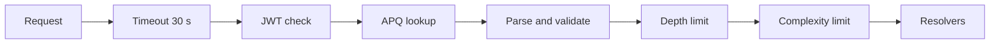
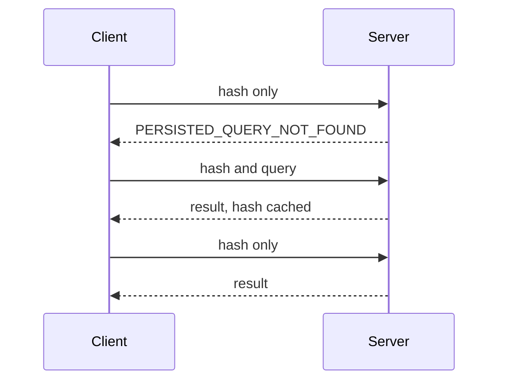

# GraphQL API guide

For wallet developers who call wallet-backend over HTTP. After reading it you can query accounts, balances, transactions, operations, and state changes, page through results, stay inside the server's limits, and handle its errors.

## Contents

- [Endpoint](#endpoint)
- [Root queries](#root-queries)
- [Pagination](#pagination)
  - [Example: page through an account's transactions](#example-page-through-an-accounts-transactions)
- [Time bounds](#time-bounds)
- [Balances](#balances)
  - [Example: all balance types](#example-all-balance-types)
- [State changes](#state-changes)
  - [Example: incoming payments to an account](#example-incoming-payments-to-an-account)
- [Transactions and operations](#transactions-and-operations)
  - [Example: a transaction with its operations and state changes](#example-a-transaction-with-its-operations-and-state-changes)
- [Limits](#limits)
- [Errors](#errors)
- [Persisted queries](#persisted-queries)
- [Where in the code](#where-in-the-code)

Every type and field is listed in the [schema reference](schema.md). For request signing, see [Request authentication](authentication.md).

## Endpoint

| Item | Value |
|---|---|
| URL | `http://<HOST>:<PORT>/graphql/query` |
| Port | `PORT`, default `8001` |
| Methods | `POST` with `Content-Type: application/json`. `GET` with `query`, `variables`, and `extensions` as URL parameters. |
| Operations | Queries only. The root queries are in [Root queries](#root-queries). |
| Auth | Only when the server sets `CLIENT_AUTH_PUBLIC_KEYS`. Send `Authorization: Bearer <TOKEN>`. See [Request authentication](authentication.md). |
| Introspection | Off unless the server sets `GRAPHQL_INTROSPECTION_ENABLED=true`. |

A `POST` with any other content type returns HTTP 400 with the message `transport not supported`.

The examples on this page save the query to `query.graphql` and the variables to `vars.json`, then send both with this command:

```bash
jq -n --rawfile query query.graphql --slurpfile vars vars.json '{query: $query, variables: $vars[0]}' \
  | curl -s http://localhost:8001/graphql/query -H 'Content-Type: application/json' --data @-
```

With auth on, add `-H 'Authorization: Bearer <TOKEN>'`. The token signs the exact body bytes, so sign the output of `jq` and send those same bytes.

Every request passes through the same steps before any resolver runs:



The server starts a 30 second deadline for the request. It checks the JWT only when auth is on. It swaps a persisted-query hash for its query text. It parses the query and validates it against the schema. It rejects queries nested deeper than 15 levels, then queries above the complexity limit. Only then do resolvers read the database.

## Root queries

| Query | Returns | When the result is null |
|---|---|---|
| `accountByAddress(address: String!)` | `Account` for a `G...` account or `C...` contract | Only for an invalid address, with `INVALID_ADDRESS`. A valid address with no indexed activity returns an `Account` whose connections are empty. |
| `transactionByHash(hash: String!)` | `Transaction` | A malformed hash returns `INVALID_TRANSACTION_HASH`. An unknown hash returns `INTERNAL_SERVER_ERROR`. |
| `operationById(id: Int64!)` | `Operation` | An unknown ID returns `INTERNAL_SERVER_ERROR`. |

A muxed address (`M...`) is not accepted. Pass the underlying `G...` address.

The server does not tell a missing transaction or operation apart from a database failure. Both return `null` with the message `internal server error` and code `INTERNAL_SERVER_ERROR`.

## Pagination

Lists of transactions, operations, state changes, balances, and allowances are Relay connections: `edges { cursor node }` plus `pageInfo`.

| Argument | Meaning |
|---|---|
| `first` | Up to N edges from the start of the list, or after `after`. |
| `after` | Cursor. Edges after it. Read only together with `first`. |
| `last` | Up to N edges from the end of the list, or before `before`. |
| `before` | Cursor. Edges before it. Read only together with `last`. |

Rules, enforced in `internal/serve/graphql/resolvers/utils.go`:

| Rule | Error |
|---|---|
| No `first` and no `last` | Page of 50 (`DefaultPageLimit` in `internal/serve/graphql/utils.go`). `after` and `before` are ignored. |
| `first` or `last` above 100 | `BAD_USER_INPUT`: `first must be less than or equal to 100` |
| `first` or `last` of 0 or less | `BAD_USER_INPUT`: `first must be greater than 0` |
| `first` with `last` | `BAD_USER_INPUT`: `first and last cannot be used together` |
| `after` with `before` | `BAD_USER_INPUT`: `after and before cannot be used together` |
| `first` with `before`, or `last` with `after` | `BAD_USER_INPUT` |
| A cursor the server did not issue | `BAD_USER_INPUT` |

The cap of 100 applies to every connection: account history, balances, SEP-41 allowances, and the connections nested under a transaction or operation.

Edges in a page are always oldest first, in both directions. History connections start at the oldest record, so `first: 10` returns the account's first ten transactions. For the most recent ten, use `last: 10`, then `before: <startCursor>` to step further back.

Treat cursors as opaque strings. Pass a cursor back only to the same field it came from.

`pageInfo` fields:

| Field | Forward paging (`first`) | Backward paging (`last`) |
|---|---|---|
| `hasNextPage` | More edges follow this page | `true` whenever `before` was given |
| `hasPreviousPage` | `true` whenever `after` was given | More edges precede this page |
| `startCursor`, `endCursor` | Cursors of the first and last edge; null on an empty page | Same |

Four lists are plain arrays with no pagination. `Transaction.accounts` and `Operation.accounts` return every participant. `AccountTransactionEdge.operations` and `AccountTransactionEdge.stateChanges` return everything the account did inside that one transaction.

### Example: page through an account's transactions

Query:

```graphql
query AccountTransactions($address: String!, $first: Int, $after: String) {
  accountByAddress(address: $address) {
    transactions(first: $first, after: $after) {
      edges {
        cursor
        node {
          hash
          ledgerNumber
          ledgerCreatedAt
        }
      }
      pageInfo {
        endCursor
        hasNextPage
      }
    }
  }
}
```

Variables for the first page:

```json
{"address": "<G_ADDRESS>", "first": 20}
```

Request:

```bash
jq -n --rawfile query query.graphql --slurpfile vars vars.json '{query: $query, variables: $vars[0]}' \
  | curl -s http://localhost:8001/graphql/query -H 'Content-Type: application/json' --data @-
```

Response:

```json
{
  "data": {
    "accountByAddress": {
      "transactions": {
        "edges": [
          {
            "cursor": "MTcwMDAwMDAwMDAwMDAwMDAwMDo0Mjk0OTY3MzAwMDk2",
            "node": {
              "hash": "<TX_HASH>",
              "ledgerNumber": 1000,
              "ledgerCreatedAt": "2023-11-14T22:13:20Z"
            }
          }
        ],
        "pageInfo": {
          "endCursor": "MTcwMDAwMDAwMDAwMDAwMDAwMDo0Mjk0OTY3MzAwMDk2",
          "hasNextPage": true
        }
      }
    }
  }
}
```

For the next page, send the same query with `"after"` set to `endCursor`. Stop when `hasNextPage` is `false`.

## Time bounds

`Account.transactions`, `Account.operations`, and `Account.stateChanges` take `since` and `until`. Both are RFC 3339 timestamps compared with the ledger close time.

| Argument | Meaning |
|---|---|
| `since` | Items whose ledger closed at or after this time |
| `until` | Items whose ledger closed at or before this time |

Either bound can be used alone. `until` earlier than `since` returns `BAD_USER_INPUT`: `until must not be before since`. Bounds combine with cursors and with the state-change filter. They do not change a query's complexity score.

Set a bound when you can. On a long history a bounded query runs faster.

Variables for one day of operations:

```json
{"address": "<G_ADDRESS>", "since": "2026-09-01T00:00:00Z", "until": "2026-09-01T23:59:59Z", "first": 50}
```

The query declares them as `$since: Time, $until: Time` and passes them to `operations(since: $since, until: $until, first: $first)`.

## Balances

`accountByAddress(...).balances` returns every token balance as one connection. What you get depends on the address:

| Address | Balance types, in this order |
|---|---|
| `G...` account | `NativeBalance`, `TrustlineBalance`, `SEP41Balance`, `LiquidityPoolBalance` |
| `C...` contract | `SACBalance`, `SEP41Balance` |
| `M...` muxed | Not accepted. `INVALID_ADDRESS`. |

The types always come in that order. Inside one type the order is stable across pages but is not alphabetical.

Each node implements `Balance` with `balance`, `tokenId`, and `tokenType`. Use `__typename` or `tokenType` to tell them apart and inline fragments for the rest.

| `__typename` | `tokenType` | `balance` format | Type-specific fields |
|---|---|---|---|
| `NativeBalance` | `NATIVE` | 7 decimal places, for example `"100.0000000"` | `minimumBalance`, `buyingLiabilities`, `sellingLiabilities`, `numSubentries`, `lastModifiedLedger` |
| `TrustlineBalance` | `CLASSIC` | 7 decimal places | `code`, `issuer`, `assetType`, `limit`, `buyingLiabilities`, `sellingLiabilities`, `lastModifiedLedger`, `isAuthorized`, `isAuthorizedToMaintainLiabilities` |
| `SACBalance` | `SAC` | Integer in the token's smallest unit | `code`, `issuer`, `decimals`, `isAuthorized`, `isClawbackEnabled` |
| `SEP41Balance` | `SEP41` | Integer in the token's smallest unit | `name`, `symbol`, `decimals`, `lastModifiedLedger` |
| `LiquidityPoolBalance` | `LIQUIDITY_POOL` | Pool shares, 7 decimal places | `reserves { asset amount }`, `lastModifiedLedger` |

All amounts are strings. For `SACBalance` and `SEP41Balance`, divide `balance` by 10^`decimals` to display it. `tokenId` is the token's contract ID (`C...`). For XLM and classic assets it is the Stellar Asset Contract ID. For pool shares it is the hex pool ID.

Spendable XLM is `balance - minimumBalance - sellingLiabilities`.

`Account.sep41Allowances` lists the active SEP-41 allowances the account granted, ordered by spender. Expired allowances are left out.

### Example: all balance types

Query:

```graphql
query AccountBalances($address: String!, $first: Int, $after: String) {
  accountByAddress(address: $address) {
    balances(first: $first, after: $after) {
      edges {
        node {
          __typename
          balance
          tokenId
          tokenType
          ... on NativeBalance {
            minimumBalance
            buyingLiabilities
            sellingLiabilities
          }
          ... on TrustlineBalance {
            code
            issuer
            limit
            isAuthorized
          }
          ... on SACBalance {
            code
            issuer
            decimals
          }
          ... on SEP41Balance {
            name
            symbol
            decimals
          }
          ... on LiquidityPoolBalance {
            reserves {
              asset
              amount
            }
          }
        }
      }
      pageInfo {
        endCursor
        hasNextPage
      }
    }
  }
}
```

Variables:

```json
{"address": "<G_ADDRESS>", "first": 100}
```

Request:

```bash
jq -n --rawfile query query.graphql --slurpfile vars vars.json '{query: $query, variables: $vars[0]}' \
  | curl -s http://localhost:8001/graphql/query -H 'Content-Type: application/json' --data @-
```

Response:

```json
{
  "data": {
    "accountByAddress": {
      "balances": {
        "edges": [
          {
            "node": {
              "__typename": "NativeBalance",
              "balance": "100.0000000",
              "tokenId": "<C_ADDRESS>",
              "tokenType": "NATIVE",
              "minimumBalance": "1.5000000",
              "buyingLiabilities": "0.0000000",
              "sellingLiabilities": "0.0000000"
            }
          },
          {
            "node": {
              "__typename": "TrustlineBalance",
              "balance": "25.0000000",
              "tokenId": "<C_ADDRESS>",
              "tokenType": "CLASSIC",
              "code": "USDC",
              "issuer": "<G_ADDRESS>",
              "limit": "922337203685.4775807",
              "isAuthorized": true
            }
          },
          ...
        ],
        "pageInfo": {"endCursor": "...", "hasNextPage": false}
      }
    }
  }
}
```

## State changes

A state change records one change to one account's ledger state: a balance movement, a signer edit, a trustline added, and so on. Each one points to the transaction that caused it and, except for fee charges, the operation.

Four fields return state changes:

| Field | Scope | Filters |
|---|---|---|
| `Account.stateChanges` | Changes to that account | `filter`, `since`, `until`, pagination |
| `Transaction.stateChanges` | Changes produced by that transaction, for all accounts | Pagination only |
| `Operation.stateChanges` | Changes produced by that operation, for all accounts | Pagination only |
| `AccountTransactionEdge.stateChanges` | Changes to the account inside one transaction | None, not paginated |

`filter` is an `AccountStateChangeFilterInput`. All set fields must match.

| Field | Type | Matches |
|---|---|---|
| `transactionHash` | `String` | Changes from this transaction. A malformed hash returns `INVALID_TRANSACTION_HASH`. |
| `operationId` | `Int64` | Changes from this operation |
| `category` | `StateChangeCategory` | For example `BALANCE`, `SIGNER`, `TRUSTLINE` |
| `reason` | `StateChangeReason` | For example `CREDIT`, `DEBIT`, `ADD` |

Each node is a concrete type such as `BalanceChange` or `SignerAddedChange`. `category` and `reason` identify the type too. The valid (category, reason) pairs are listed on each type in the [schema reference](schema.md).

A fee charge is a `BalanceChange` with reason `DEBIT` and a null `operation`.

Some field names have different types on different state-change types. `tokenId` is `String!` on `BalanceChange` and `AllowanceChange` but nullable on the trustline types. `flags` is `[AccountFlag!]!` on `AccountFlagsChange` and `[TrustlineFlag!]` on `BalanceAuthorizationChange`. GraphQL rejects a query that selects both under the same name. Give each one an alias, as below.

### Example: incoming payments to an account

Query:

```graphql
query Credits($address: String!, $filter: AccountStateChangeFilterInput, $first: Int) {
  accountByAddress(address: $address) {
    stateChanges(filter: $filter, first: $first) {
      edges {
        cursor
        node {
          __typename
          category
          reason
          ledgerCreatedAt
          transaction {
            hash
          }
          ... on BalanceChange {
            balanceTokenId: tokenId
            amount
            toMuxedId
          }
          ... on TrustlineAddedChange {
            trustlineTokenId: tokenId
            limit
          }
        }
      }
      pageInfo {
        endCursor
        hasNextPage
      }
    }
  }
}
```

Variables:

```json
{"address": "<G_ADDRESS>", "filter": {"category": "BALANCE", "reason": "CREDIT"}, "first": 50}
```

Request:

```bash
jq -n --rawfile query query.graphql --slurpfile vars vars.json '{query: $query, variables: $vars[0]}' \
  | curl -s http://localhost:8001/graphql/query -H 'Content-Type: application/json' --data @-
```

Response:

```json
{
  "data": {
    "accountByAddress": {
      "stateChanges": {
        "edges": [
          {
            "cursor": "...",
            "node": {
              "__typename": "BalanceChange",
              "category": "BALANCE",
              "reason": "CREDIT",
              "ledgerCreatedAt": "2026-09-01T10:15:02Z",
              "transaction": {"hash": "<TX_HASH>"},
              "balanceTokenId": "<C_ADDRESS>",
              "amount": "250000000",
              "toMuxedId": null
            }
          },
          ...
        ],
        "pageInfo": {"endCursor": "...", "hasNextPage": true}
      }
    }
  }
}
```

`BalanceChange.amount` is an integer string in the token's smallest unit. For XLM and classic assets that is stroops, so `"250000000"` is 25 units.

## Transactions and operations

Fields to know on `Transaction`:

| Field | Notes |
|---|---|
| `hash` | 64 hex characters. For a fee-bump transaction, the outer hash. |
| `feeCharged` | `Int64`, in stroops |
| `resultCode` | XDR result code name, for example `TransactionResultCodeTxSuccess` |
| `isFeeBump` | Whether the transaction is a fee bump |
| `ledgerNumber`, `ledgerCreatedAt` | Ledger sequence and close time |
| `ingestedAt` | When wallet-backend stored the row |
| `accounts` | Every account and contract that took part |

Fields to know on `Operation`:

| Field | Notes |
|---|---|
| `id` | TOID, an `Int64` that is unique and sorts by time |
| `type` | `OperationType` enum, for example `PAYMENT` or `INVOKE_HOST_FUNCTION` |
| `operationXdr` | The operation body as base64 XDR |
| `successful` | Whether the operation succeeded |
| `resultCode` | Snake case, for example `op_success` or `op_underfunded` |

`Int64` and `UInt32` are JSON numbers. A TOID can be larger than 2^53 - 1, so JavaScript clients should parse responses with a big-integer-safe JSON parser.

Timestamps are RFC 3339 strings.

### Example: a transaction with its operations and state changes

Query:

```graphql
query TransactionDetail($hash: String!) {
  transactionByHash(hash: $hash) {
    hash
    feeCharged
    resultCode
    isFeeBump
    ledgerNumber
    ledgerCreatedAt
    operations(first: 20) {
      edges {
        node {
          id
          type
          successful
          resultCode
          operationXdr
        }
      }
    }
    stateChanges(first: 50) {
      edges {
        node {
          __typename
          category
          reason
          account {
            address
          }
          ... on BalanceChange {
            tokenId
            amount
          }
        }
      }
    }
  }
}
```

Variables:

```json
{"hash": "<TX_HASH>"}
```

Request:

```bash
jq -n --rawfile query query.graphql --slurpfile vars vars.json '{query: $query, variables: $vars[0]}' \
  | curl -s http://localhost:8001/graphql/query -H 'Content-Type: application/json' --data @-
```

Response:

```json
{
  "data": {
    "transactionByHash": {
      "hash": "<TX_HASH>",
      "feeCharged": 100,
      "resultCode": "TransactionResultCodeTxSuccess",
      "isFeeBump": false,
      "ledgerNumber": 1000,
      "ledgerCreatedAt": "2023-11-14T22:13:20Z",
      "operations": {
        "edges": [
          {
            "node": {
              "id": 4294967300097,
              "type": "PAYMENT",
              "successful": true,
              "resultCode": "op_success",
              "operationXdr": "<BASE64_XDR>"
            }
          }
        ]
      },
      "stateChanges": {
        "edges": [
          {
            "node": {
              "__typename": "BalanceChange",
              "category": "BALANCE",
              "reason": "DEBIT",
              "account": {"address": "<G_ADDRESS>"},
              "tokenId": "<C_ADDRESS>",
              "amount": "100"
            }
          },
          ...
        ]
      }
    }
  }
}
```

For an account's full history in one call, select `operations` and `stateChanges` on each `Account.transactions` edge. Those two lists hold only what that account did in the transaction. `pkg/wbclient/queries.go` has a complete version of that query.

## Limits

| Limit | Value | Set by | When exceeded |
|---|---|---|---|
| Query complexity | 10000 | `GRAPHQL_COMPLEXITY_LIMIT` | HTTP 200, `COMPLEXITY_LIMIT_EXCEEDED`, `data: null` |
| Query depth | 15 | Fixed (`MaxQueryDepth`) | HTTP 200, `QUERY_TOO_DEEP`, `data: null` |
| Page size | 100 per connection | Fixed | HTTP 200, `BAD_USER_INPUT` |
| Request time | 30 s | Fixed (`requestContextTimeout`) | Fields still waiting on the database fail with `INTERNAL_SERVER_ERROR` |
| Body size, auth on | 102400 bytes | `CLIENT_AUTH_MAX_BODY_SIZE_BYTES` | HTTP 401: the server hashes only that many bytes, so the signature fails |

Complexity: each selected field costs 1. A connection multiplies the cost of what you select inside it by `first` or `last`, or by 50 when neither is set. `Transaction.accounts` and `Operation.accounts` multiply by 50. The unpaginated lists on `AccountTransactionEdge` are not multiplied.

| Query shape | Complexity |
|---|---|
| `transactions(first: 10)` > `operations(first: 2)` > `stateChanges(first: 5)`, a few fields each | 490 |
| The same shape with no `first` | 507,650 |

Always pass `first` or `last` on nested connections.

Inline fragments add up. The server counts every inline fragment you select, even though each node matches only one. A query that selects fields on every state-change type pays for all of them on every edge.

Depth: every field adds one level. Inline fragments and named fragments add none.

Responses for a limit:

```json
{"errors":[{"message":"operation has complexity 507651, which exceeds the limit of 10000","extensions":{"code":"COMPLEXITY_LIMIT_EXCEEDED"}}],"data":null}
```

```json
{"errors":[{"message":"operation has depth 22, which exceeds the limit of 15","extensions":{"code":"QUERY_TOO_DEEP"}}],"data":null}
```

## Errors

GraphQL errors come in the standard envelope. `extensions.code` is the field to branch on. `path` names the field that failed.

```json
{
  "errors": [
    {
      "message": "first and last cannot be used together",
      "path": ["accountByAddress", "transactions"],
      "extensions": {"code": "BAD_USER_INPUT"}
    }
  ],
  "data": {"accountByAddress": null}
}
```

A failed field becomes `null`. When the field is non-null in the schema, the null moves up to the closest nullable parent. A failure deep inside a transaction can therefore null the whole `transactionByHash` result.

Error codes:

| Code | Cause |
|---|---|
| `BAD_USER_INPUT` | Bad pagination arguments, a bad cursor, or `until` before `since` |
| `INVALID_ADDRESS` | `accountByAddress` got something other than a `G...` or `C...` address. `extensions.address` echoes it. |
| `INVALID_TRANSACTION_HASH` | Hash is not 64 hex characters. `extensions.hash` echoes it. |
| `GRAPHQL_PARSE_FAILED` | Query text does not parse |
| `GRAPHQL_VALIDATION_FAILED` | Query does not match the schema, for example an unknown field |
| `COMPLEXITY_LIMIT_EXCEEDED` | See [Limits](#limits) |
| `QUERY_TOO_DEEP` | See [Limits](#limits) |
| `PERSISTED_QUERY_NOT_FOUND` | See [Persisted queries](#persisted-queries) |
| `INTERNAL_ERROR` | Balances could not be read. Message: `failed to process account balances`. |
| `INTERNAL_SERVER_ERROR` | Anything else, including a missing transaction or operation, a disabled introspection query, and a timeout. The message is always `internal server error`; details stay in the server log. |

HTTP status codes:

| Status | When | Body |
|---|---|---|
| 200 | The query ran, with or without errors in the envelope. Also limit errors and `PERSISTED_QUERY_NOT_FOUND`. | GraphQL envelope |
| 422 | Parse or validation failure | GraphQL envelope, `data: null` |
| 400 | Body is not valid JSON, or the method or content type is unsupported | GraphQL envelope |
| 401 | Auth is on and the token is missing, malformed, expired, or does not match the request | `{"error": "Not authorized."}` |
| 404 | Unknown path | `{"error": "The resource at the url requested was not found."}` |
| 500 | Server panic, or auth verification failed for a reason other than a bad token | `{"error": "An error occurred while processing this request."}` |

With `Accept: application/graphql-response+json`, parse and validation failures return 400 instead of 422.

## Persisted queries

The server supports Automatic Persisted Queries (APQ). After the first request, a client sends a 64-character hash in place of the full query text.



The client first sends only the hash. On a miss the server answers `PERSISTED_QUERY_NOT_FOUND`. The client resends with the query text, and the server stores it. Later requests with that hash run without the text.

1. Compute the lowercase hex SHA-256 of the exact query string you send. When the query text comes from `query.graphql` as in the examples above, hash the file itself:

   ```bash
   shasum -a 256 query.graphql | cut -d' ' -f1
   ```

2. Send the hash with no `query`:

   ```json
   {
     "variables": {"hash": "<TX_HASH>"},
     "extensions": {"persistedQuery": {"version": 1, "sha256Hash": "<SHA256_OF_QUERY>"}}
   }
   ```

   ```bash
   curl -s http://localhost:8001/graphql/query -H 'Content-Type: application/json' --data @apq.json
   ```

3. On a miss the response is:

   ```json
   {"errors":[{"message":"PersistedQueryNotFound","extensions":{"code":"PERSISTED_QUERY_NOT_FOUND"}}],"data":null}
   ```

   Send the same body again with `"query"` set to the query text. The server checks the hash, stores the query, and runs it.

4. Later requests send the hash alone and get the normal result.

Details:

| Item | Value |
|---|---|
| `version` | Must be `1` |
| Cache | 100 queries per server process, least recently used evicted |
| Hash does not match the query | `INTERNAL_SERVER_ERROR` |
| `GET` | Supported. Pass `extensions` and `variables` as URL-encoded JSON parameters. |

Each server process has its own cache. Behind a load balancer, expect a miss the first time a query reaches each replica. With auth on, a `GET` token signs the full path and query string.

## Where in the code

| Path | Role |
|---|---|
| `internal/serve/graphql/schema/*.graphqls` | Schema source |
| `internal/serve/serve.go` | Route, transports, APQ cache, complexity rules, middleware order |
| `internal/serve/graphql/depth_limit.go` | Depth limit |
| `internal/serve/graphql/utils.go` | Default page size, error masking, client-visible error codes |
| `internal/serve/graphql/resolvers/utils.go` | Pagination validation, page caps, time bounds |
| `internal/serve/graphql/resolvers/account_balances.go` | Balance types per address, ordering, cursors |
| `internal/serve/graphql/resolvers/queries.resolvers.go` | Root queries and address and hash validation |
| `internal/serve/middleware/middleware.go` | Auth middleware and the 401 response |
| `internal/serve/httperror/errors.go` | Non-GraphQL error bodies |
| `cmd/serve.go` | `serve` flags and defaults |
| `pkg/wbclient/queries.go` | Working query strings used by the Go client |
