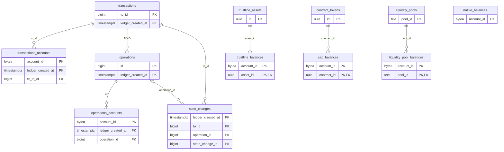

# Data model

For operators sizing storage and contributors writing queries. After reading, you can name every table, its keys, which process writes it, and which index serves which read.

## Contents

- [Hypertables](#hypertables)
- [Current-state tables](#current-state-tables)
- [Protocol tables](#protocol-tables)
- [Bookkeeping](#bookkeeping)
- [Indexes](#indexes)
- [Foreign keys and constraints](#foreign-keys-and-constraints)
- [Compression and retention](#compression-and-retention)
- [Where in the code](#where-in-the-code)

wallet-backend uses one PostgreSQL database with the TimescaleDB extension, and every table lives in the `public` schema. History tables are TimescaleDB hypertables partitioned by ledger close time. Current-state tables are plain PostgreSQL tables whose rows change in place as ledgers close. The SQL files in `internal/db/migrations/` define the schema. `wallet-backend migrate up` applies them; nothing applies them automatically.

Legend:

- The top five tables are hypertables. Their links are by ID only, with no foreign keys.
- `to_id` is a transaction's TOID. An operation's `id` encodes its parent transaction: `to_id = id & ~x'FFF'`.
- A state change with `operation_id` 0 is a fee change and has no operation.
- The bottom tables are current-state tables. Their links are real foreign keys, listed under [Foreign keys and constraints](#foreign-keys-and-constraints).
- Account addresses are stored as `BYTEA`.

## Hypertables

| Table | Partition column | Chunk interval (default) | segmentby | orderby | Sparse indexes | Purpose |
| --- | --- | --- | --- | --- | --- | --- |
| `transactions` | `ledger_created_at` | 1 day | Not set | `ledger_created_at DESC, to_id DESC` | `bloom(hash)` | One row per transaction: hash, fee charged, result code, ledger, fee-bump flag |
| `transactions_accounts` | `ledger_created_at` | 1 day | `account_id` | `ledger_created_at DESC, tx_to_id DESC` | None | Links each transaction to every account that took part in it |
| `operations` | `ledger_created_at` | 1 day | Not set | `ledger_created_at DESC, id DESC` | `bloom(operation_type)` | One row per operation: type, XDR, result code, success flag |
| `operations_accounts` | `ledger_created_at` | 1 day | `account_id` | `ledger_created_at DESC, operation_id DESC` | None | Links each operation to every account that took part in it |
| `state_changes` | `ledger_created_at` | 1 day | `account_id` | `ledger_created_at DESC, to_id DESC, operation_id DESC, state_change_id DESC` | `bloom(state_change_category)`, `bloom(state_change_reason)` | One row per change to an account: balances, signers, thresholds, flags, trustlines, data entries, allowances |

The chunk interval in the migrations is 1 day. On every start, the live ingester sets it again from `CHUNK_INTERVAL` (default `1 day`), which affects chunks created after that point.

Chunk skipping is on for these columns. It lets queries that filter on them skip whole chunks.

| Table | Chunk-skipping columns |
| --- | --- |
| `transactions` | `to_id`, `ledger_number` |
| `transactions_accounts` | `tx_to_id` |
| `operations` | `id` |
| `operations_accounts` | `operation_id` |
| `state_changes` | `to_id`, `operation_id` |

Each migration drops the single-column `ledger_created_at` index TimescaleDB creates by default. No query filters these tables by `ledger_created_at` alone.

## Current-state tables

| Table | Primary key | Purpose | Written by |
| --- | --- | --- | --- |
| `native_balances` | `account_id` | XLM balance, minimum balance, liabilities, subentry count per account | Both |
| `trustline_assets` | `id` (UUID v5 of `CODE:ISSUER`) | One row per classic asset. Unique on `(code, issuer)` | Both |
| `trustline_balances` | `(account_id, asset_id)` | Classic asset balance, limit, liabilities, flags per account | Both |
| `contract_tokens` | `id` (deterministic UUID) | Soroban token metadata: contract ID, type, code, issuer, name, symbol, decimals. Unique on `contract_id` | Both |
| `sac_balances` | `(account_id, contract_id)` | SAC balances held by contract addresses. Account holders keep these in `trustline_balances` | Both |
| `liquidity_pools` | `pool_id` | Constant-product pool reserves: two assets and their amounts | Both |
| `liquidity_pool_balances` | `(account_id, pool_id)` | Pool shares held per account | Both |

"Both" means the [checkpoint bootstrap](ingestion.md#checkpoint-bootstrap) fills the table on an empty database and the live ingester keeps it current every ledger. Backfill does not write these tables. Balance and pool rows carry `last_modified_ledger`.

The balance and pool tables take upserts and deletes on most ledgers, so their storage settings favor in-place updates:

| Setting | Value | Tables |
| --- | --- | --- |
| `fillfactor` | 90 | `native_balances`, `trustline_balances`, `sac_balances`, `liquidity_pool_balances` |
| `fillfactor` | 80 | `liquidity_pools` |
| `autovacuum_vacuum_scale_factor` | 0.02 | All five |
| `autovacuum_analyze_scale_factor` | 0.01 | All five |
| `autovacuum_vacuum_threshold`, `autovacuum_analyze_threshold` | 50 | All five |
| `autovacuum_vacuum_cost_delay` | 0 | All five |

`trustline_assets` and `contract_tokens` keep the PostgreSQL defaults.

## Protocol tables

| Table | Primary key | Purpose | Written by |
| --- | --- | --- | --- |
| `protocols` | `id` | One row per registered protocol, with `classification_status`, `history_migration_status`, `current_state_migration_status` | `migrate up` and `protocol-setup` insert the row. `protocol-setup` and `protocol-migrate` set the status columns. |
| `protocol_wasms` | `wasm_hash` | Every WASM hash seen, with the protocol it matched (`protocol_id`, NULL if none) | Checkpoint bootstrap, live ingester, `protocol-setup` |
| `protocol_contracts` | `contract_id` | Contract-to-WASM mapping, plus an optional contract `name` | Checkpoint bootstrap, live ingester |
| `sep41_balances` | `(account_id, contract_id)` | Balances of SEP-41 tokens that are not SACs | SEP-41 processor: `protocol-migrate current-state`, then the live ingester |
| `sep41_allowances` | `(owner_id, spender_id, contract_id)` | Current SEP-41 allowances with amount and `expiration_ledger`. Readers hide rows whose `expiration_ledger` is below `latest_ingest_ledger` | SEP-41 processor: `protocol-migrate current-state`, then the live ingester |

SEP-41 history goes into `state_changes`, written by `protocol-migrate history` and then the live ingester. The live ingester writes a protocol's rows only after the protocol's cursor exists; see [Cursors](ingestion.md#cursors). `internal/db/migrations/protocols/001_sep41.sql` registers SEP-41 in `protocols`.

`sep41_balances` and `sep41_allowances` use the same storage settings as the balance tables, with `fillfactor` 90.

## Bookkeeping

`ingest_store` holds the cursors as `key` and `value` text columns, keyed on `key`.

| Key | Meaning | Written by |
| --- | --- | --- |
| `latest_ingest_ledger` | Last ledger the live ingester committed | Checkpoint bootstrap, live ingester |
| `oldest_ingest_ledger` | Lowest ledger the history tables cover | Checkpoint bootstrap, backfill, `reconcile_oldest_cursor` job |
| `protocol_<ID>_history_cursor` | Last ledger with protocol history written | `protocol-migrate history`, live ingester |
| `protocol_<ID>_current_state_cursor` | Last ledger with protocol current state written | `protocol-migrate current-state`, live ingester |

Other bookkeeping objects:

| Object | Kind | Created by | Role |
| --- | --- | --- | --- |
| `gorp_migrations` | Table | `migrate up` (sql-migrate) | One row per applied migration file |
| `refresh_updated_at_column` | Function | Migration | Trigger function that sets `updated_at` |
| `contract_tokens_set_updated_at` | Trigger | Migration | Runs `refresh_updated_at_column` on every `contract_tokens` update |
| `reconcile_oldest_cursor` | Function and TimescaleDB job | Live ingester, only when `RETENTION_PERIOD` is set | Raises `oldest_ingest_ledger` after retention drops chunks |

Protocol registration files in `internal/db/migrations/protocols/` are not tracked in `gorp_migrations`. They are idempotent and run on every `migrate up` and `protocol-setup`.

## Indexes

| Name | Table | Columns | Used by |
| --- | --- | --- | --- |
| Primary key | `transactions_accounts` | `account_id, ledger_created_at, tx_to_id` | An account's transaction list (`TransactionModel.BatchGetByAccountAddress`) |
| Primary key | `operations_accounts` | `account_id, ledger_created_at, operation_id` | An account's operation list (`OperationModel.BatchGetByAccountAddress`, `BatchGetAccountOperationsByToIDs`) |
| Primary key | `state_changes` | `ledger_created_at, to_id, operation_id, state_change_id` | State changes of a transaction or operation (`BatchGetByToID`, `BatchGetByOperationID`, `BatchGetByOperationIDs`) |
| `idx_transactions_hash` | `transactions` | `hash` | `transactionByHash` (`TransactionModel.GetByHash`) and the transaction-hash filter on state changes |
| `idx_transactions_accounts_tx_to_id` | `transactions_accounts` | `tx_to_id` | Accounts of a transaction (`AccountModel.BatchGetByToIDs`) |
| `idx_operations_accounts_operation_id` | `operations_accounts` | `operation_id` | Accounts of an operation (`AccountModel.BatchGetByOperationIDs`) |
| `idx_state_changes_account_id` | `state_changes` | `account_id, ledger_created_at DESC, to_id DESC, operation_id DESC, state_change_id DESC` | An account's state changes (`StateChangeModel.BatchGetByAccountAddress`, `BatchGetAccountStateChangesByToIDs`) |
| `idx_protocol_wasms_protocol_id` | `protocol_wasms` | `protocol_id` | Contracts of a protocol (`ProtocolContractsModel.GetByProtocolID`) |
| `idx_protocol_contracts_wasm_hash` | `protocol_contracts` | `wasm_hash` | Contracts by WASM (`ProtocolContractsModel.GetByWasmHashes`) |
| `idx_sep41_allowances_expiration_ledger` | `sep41_allowances` | `expiration_ledger` | Expired-allowance sweep (`AllowanceModel.DeleteExpiredBefore`) |
| `contract_tokens_contract_id_key` | `contract_tokens` | `contract_id` (unique) | One row per contract ID |
| `trustline_assets_code_issuer_key` | `trustline_assets` | `code, issuer` (unique) | One row per classic asset |

Category and reason filters on an account's state changes use `idx_state_changes_account_id` and then filter. Compressed chunks prune on the bloom sparse indexes. Every other primary key serves lookups by that key.

## Foreign keys and constraints

| Constraint | From | To | Deferred |
| --- | --- | --- | --- |
| `fk_trustline_asset` | `trustline_balances.asset_id` | `trustline_assets.id` | Yes, `DEFERRABLE INITIALLY DEFERRED` |
| `fk_contract_token` | `sac_balances.contract_id` | `contract_tokens.id` | Yes |
| `fk_sep41_contract_token` | `sep41_balances.contract_id` | `contract_tokens.id` | Yes |
| `fk_sep41_allowance_contract_token` | `sep41_allowances.contract_id` | `contract_tokens.id` | Yes |
| `liquidity_pool_balances_pool_id_fkey` | `liquidity_pool_balances.pool_id` | `liquidity_pools.pool_id` | Yes |
| `protocol_wasms_protocol_id_fkey` | `protocol_wasms.protocol_id` | `protocols.id` | No |
| `protocol_contracts_wasm_hash_fkey` | `protocol_contracts.wasm_hash` | `protocol_wasms.wasm_hash` | No |

The deferred foreign keys are checked at commit. Ingestion writes a balance and its parent in the same transaction, in either order.

The five hypertables have no foreign keys, to each other or to any other table. `native_balances`, `liquidity_pools`, `trustline_assets`, `contract_tokens`, and `ingest_store` have no outgoing foreign keys.

Check constraints:

| Table | Constraint |
| --- | --- |
| `operations` | `operation_type` is one of the 27 Stellar operation types, from `CREATE_ACCOUNT` to `RESTORE_FOOTPRINT` |
| `state_changes` | `state_change_category` is one of `BALANCE`, `ACCOUNT`, `SIGNER`, `SIGNATURE_THRESHOLD`, `DATA_ENTRY`, `HOME_DOMAIN`, `ALLOWANCE`, `FLAGS`, `TRUSTLINE`, `BALANCE_AUTHORIZATION` |
| `state_changes` | `state_change_reason` is one of `CREATE`, `MERGE`, `DEBIT`, `CREDIT`, `MINT`, `BURN`, `ADD`, `REMOVE`, `UPDATE`, `SET`, `CLEAR` |
| `contract_tokens` | `contract_tokens_sac_has_asset`: a row with `type = 'SAC'` has `code` and `issuer` set |
| `protocols` | Each status column is one of `not_started`, `in_progress`, `success`, `failed` |

## Compression and retention

The five hypertables are created with the TimescaleDB columnstore on. TimescaleDB creates one compression policy per hypertable at that point. Compressed chunks are stored in columns, grouped by `segmentby` and sorted by `orderby` from the [Hypertables](#hypertables) table. TimescaleDB creates each policy with `compress_after` equal to the chunk interval, so a chunk becomes eligible one day after it closes unless `COMPRESSION_COMPRESS_AFTER` changes it (measured on TimescaleDB 2.28.2).

| Who | What it does |
| --- | --- |
| TimescaleDB compression job | Compresses closed chunks on its schedule. |
| Live ingester at startup | Changes the job's schedule, `compress_after`, and `maxchunks_to_compress` only when `COMPRESSION_SCHEDULE_INTERVAL`, `COMPRESSION_COMPRESS_AFTER`, or `COMPRESSION_MAX_CHUNKS` is set. |
| Backfill | Writes uncompressed rows, then runs `compress_chunk` on chunks its finished batches fully cover. |

Retention is off unless `RETENTION_PERIOD` is set on the live ingester. With a value, every hypertable gets a retention policy that drops chunks older than that interval, and the `reconcile_oldest_cursor` job keeps `oldest_ingest_ledger` in step. With it empty, the live ingester removes any retention policy on start. Current-state, protocol, and bookkeeping tables are never compressed or dropped.

See the [runbook](../operations/runbook.md) for changing these settings on a running deployment, and [Ingestion](ingestion.md#timescaledb-policies-the-live-ingester-applies) for how they are applied.

## Where in the code

| Path | Role |
| --- | --- |
| `internal/db/migrations/*.sql` | Schema: tables, hypertable options, indexes, constraints |
| `internal/db/migrations/protocols/` | Protocol registration SQL, run by `migrate up` and `protocol-setup` |
| `internal/db/migrate.go` | Runs migrations with sql-migrate |
| `internal/ingest/timescaledb.go` | Chunk interval, retention, compression settings, `reconcile_oldest_cursor` |
| `internal/data/transactions.go`, `operations.go`, `statechanges.go`, `accounts.go` | History table reads and `COPY` writes |
| `internal/data/*_balances.go`, `liquidity_pools.go`, `trustline_assets.go`, `contract_tokens.go` | Current-state table reads and writes |
| `internal/data/protocols.go`, `protocol_wasms.go`, `protocol_contracts.go` | Protocol table reads and writes |
| `internal/data/sep41/` | `sep41_balances` and `sep41_allowances` |
| `internal/data/ingest_store.go` | Cursor reads and writes |
