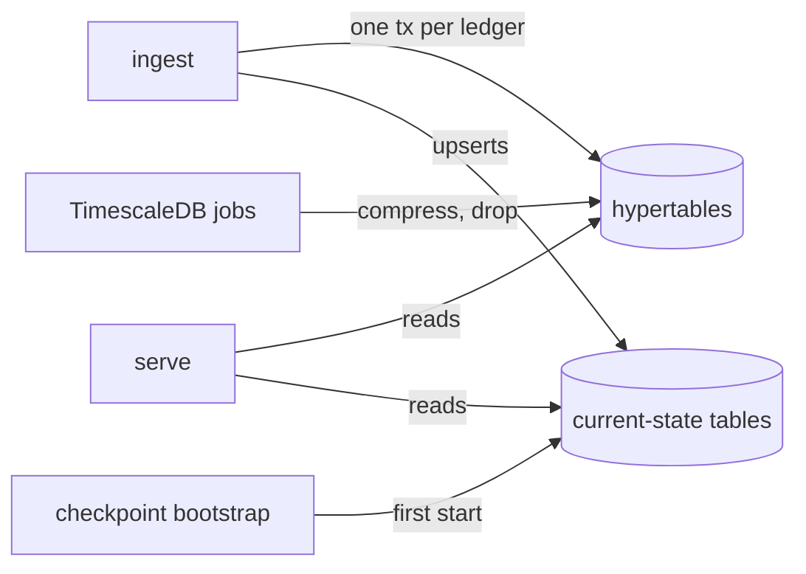

# Database

For operators tuning PostgreSQL and contributors writing queries or migrations. After reading it you know which tables are hypertables, why they are shaped the way they are, what the live ingester changes at runtime, and what the API needs from the connection.

## Contents

- [One database, two kinds of table](#one-database-two-kinds-of-table)
- [Hypertable layout](#hypertable-layout)
- [Indexes](#indexes)
- [Runtime policies](#runtime-policies)
- [Cursors](#cursors)
- [Writes](#writes)
- [Connections](#connections)
- [Requirements the migrations assume](#requirements-the-migrations-assume)
- [Where in the code](#where-in-the-code)

Table-by-table columns and keys are in the [data model](data-model.md).

## One database, two kinds of table



Ingest writes every ledger into the history hypertables and upserts balances into plain tables. The API only reads. TimescaleDB background jobs compress and, when retention is on, drop old chunks.

| Kind | Tables | Grows with | Written by |
|---|---|---|---|
| History hypertables | `transactions`, `transactions_accounts`, `operations`, `operations_accounts`, `state_changes` | ledgers retained | live ingest, backfill |
| Current state from ledger entries | `native_balances`, `trustline_balances`, `sac_balances`, `liquidity_pools`, `liquidity_pool_balances`, `trustline_assets`, `contract_tokens`, `protocol_wasms`, `protocol_contracts` | accounts and tokens on the network | checkpoint bootstrap once, then live ingest; `protocol-setup` also classifies `protocol_wasms` and writes `contract_tokens` metadata |
| Current state from protocol events | `sep41_balances`, `sep41_allowances` | SEP-41 holders | `protocol-migrate current-state` for ledgers already ingested, then live ingest once the protocol cursor exists |
| Bookkeeping | `ingest_store`, `protocols`, `gorp_migrations` | constant | ingest and `protocol-migrate` (cursors), `migrate up` and `protocol-setup` (`protocols`), sql-migrate (`gorp_migrations`) |

## Hypertable layout

Every hypertable is partitioned on `ledger_created_at` with 1-day chunks and uses the TimescaleDB columnstore. The settings are chosen so the API's queries touch one compressed segment and read it in the order it needs.

| Table | `orderby` | `segmentby` | Sparse index | Chunk skipping on |
|---|---|---|---|---|
| `transactions` | `ledger_created_at DESC, to_id DESC` | none | `bloom(hash)` | `to_id`, `ledger_number` |
| `transactions_accounts` | `ledger_created_at DESC, tx_to_id DESC` | `account_id` | none | `tx_to_id` |
| `operations` | `ledger_created_at DESC, id DESC` | none | `bloom(operation_type)` | `id` |
| `operations_accounts` | `ledger_created_at DESC, operation_id DESC` | `account_id` | none | `operation_id` |
| `state_changes` | `ledger_created_at DESC, to_id DESC, operation_id DESC, state_change_id DESC` | `account_id` | `bloom(state_change_category)`, `bloom(state_change_reason)` | `to_id`, `operation_id` |

What each setting buys:

| Setting | Effect |
|---|---|
| `segmentby = account_id` on the per-account tables | One account's rows sit in one compressed segment per chunk, so "latest N for account X" reads one segment in `orderby` order with no sort. |
| `orderby` matching the API's `ORDER BY` | Keyset pagination walks compressed data without decompressing whole chunks. |
| Bloom sparse indexes | Compressed chunks skip segments that cannot contain the hash, type, category, or reason being filtered. |
| Chunk skipping on the ID columns | IDs rise with time, so a query bounded by ID excludes whole chunks at plan time. |

`to_id`, `id` and `operation_id` are TOIDs (SEP-35): ledger, transaction and operation packed into one integer, so ID order is ledger order. `state_change_id` orders the changes within one operation.

## Indexes

Only the indexes a query uses exist. Hypertables do not get the default time index; chunk skipping and `orderby` cover time-bounded reads.

| Index | Serves |
|---|---|
| `idx_transactions_hash` | `transactionByHash` |
| `idx_transactions_accounts_tx_to_id`, `idx_operations_accounts_operation_id`, `idx_state_changes_operation_id` | joins from a transaction or operation to its rows |
| `idx_state_changes_account_id` | an account's state changes, newest first |
| `idx_state_changes_account_category` | an account's state changes filtered by category and reason |

Current-state tables use ordinary B-tree primary keys on the account or contract address plus the asset or contract identifier.

## Runtime policies

The live ingester converges these on every start from its environment. Backfill processes do not touch them.

| Variable | What changes |
|---|---|
| `CHUNK_INTERVAL` | `set_chunk_time_interval` on each hypertable; future chunks only |
| `RETENTION_PERIOD` | A `policy_retention` job per hypertable, added, altered, or removed to match. Empty means no retention. |
| `COMPRESSION_SCHEDULE_INTERVAL`, `COMPRESSION_COMPRESS_AFTER`, `COMPRESSION_MAX_CHUNKS` | `alter_job` on each hypertable's `policy_compression` job. Empty or zero leaves the job as it is. |

TimescaleDB creates the compression policy when a table is created with columnstore settings; the ingester only tunes it. If a job is missing, the ingester logs a warning and continues. Check the active values with:

```sql
SELECT hypertable_name, proc_name, schedule_interval, config
FROM timescaledb_information.jobs
WHERE proc_name IN ('policy_compression', 'policy_retention', 'reconcile_oldest_cursor');
```

When retention is on, a `reconcile_oldest_cursor` job runs every hour and moves `ingest_store.oldest_ingest_ledger` up to the real minimum ledger left after chunk drops. With retention off the job is removed.

## Cursors

`ingest_store` is a key-value table.

| Key | Meaning |
|---|---|
| `latest_ingest_ledger` | Last ledger live ingest committed |
| `oldest_ingest_ledger` | Oldest ledger present; backfill lowers it, retention raises it |
| `protocol_<ID>_history_cursor` | Progress of a protocol history migration |
| `protocol_<ID>_current_state_cursor` | Progress of a protocol current-state migration |

## Writes

Live ingest writes each batch of ledgers (one ledger by default, up to `LIVE_PERSIST_MAX_BATCH_SIZE`) through eight transactions on separate connections: five stream the bulk tables by `COPY`, two upsert the balance tables, and a coordinating transaction stages contracts, protocol state and the cursor. The seven siblings commit first without waiting on the WAL flush; the coordinator commits last, synchronously, and its flush covers them. A crash before the first commit loses nothing. A crash between the commits can leave bulk rows above the cursor; startup reconciliation deletes them, and every read query is bounded by the cursor so they are never served. Details in [ingestion](ingestion.md#live-mode).

Live ingest holds a session-level advisory lock keyed on the network passphrase for its whole life. The lock is what stops two live ingesters from writing the same network. Protocol migrations hold their own lock per protocol and strategy.

## Connections

| Process | Pool | Needs |
|---|---|---|
| `serve` | pgx pool, `QueryExecModeExec` (no server-side prepared statements) | Works behind PgBouncer in transaction pooling. Can target a read replica. |
| `ingest` | pgx pool, at least 9 connections (default 12) | A direct connection or session pooling, because of the advisory lock. Must target the primary. Live persist holds eight connections at its commit barrier plus the lock session, and refuses to start with fewer. |

Pool size and lifetimes come from `DB_MAX_CONNS`, `DB_MIN_CONNS`, `DB_MAX_CONN_LIFETIME`, `DB_MAX_CONN_IDLE_TIME`.

## Requirements the migrations assume

| Requirement | Why |
|---|---|
| PostgreSQL 17 | Tested version; CI and the published database image use it |
| TimescaleDB 2.28 or newer, extension already created | Migrations use `CREATE TABLE ... WITH (tsdb.hypertable, ...)` and `enable_chunk_skipping`, and never run `CREATE EXTENSION` |
| `timescaledb.enable_chunk_skipping = on` | `enable_chunk_skipping()` calls fail without it |
| `timescaledb.enable_sparse_index_bloom = on` | `tsdb.sparse_index = 'bloom(...)'` fails without it |

Migrations are forward-only in production. `migrate down` exists for development; see [upgrading](../operations/upgrading.md).

## Where in the code

| Path | Role |
|---|---|
| `internal/db/migrations/*.sql` | Schema; the hypertable options are in `2025-06-10.2`, `.3`, `.4` |
| `internal/db/migrations/2026-08-21.0-statechanges-account-id-index.sql` | Per-account state-change indexes and the reasoning for them |
| `internal/ingest/timescaledb.go` | Chunk interval, retention, compression tuning, reconcile job |
| `internal/db/migrate.go` | `migrate up` / `down` via sql-migrate |
| `internal/db/utils.go` | Advisory lock helpers |
| `internal/serve/serve.go` (`BuildPoolConfig`) | Exec query mode for PgBouncer |
| `internal/data/ingest_store.go` | Cursor keys |
