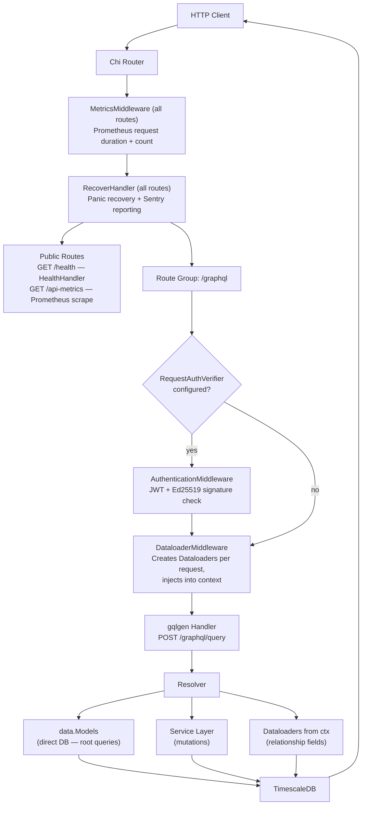
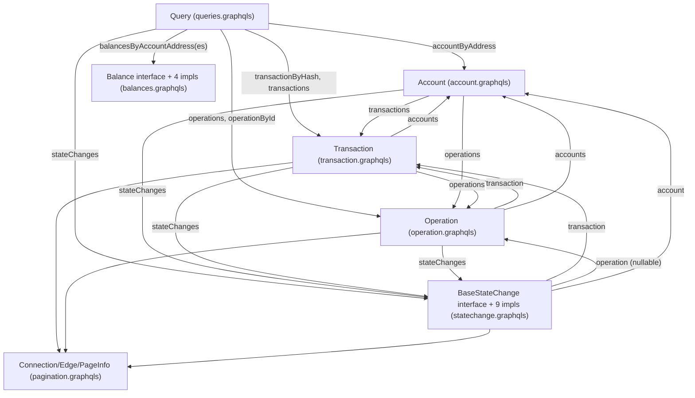
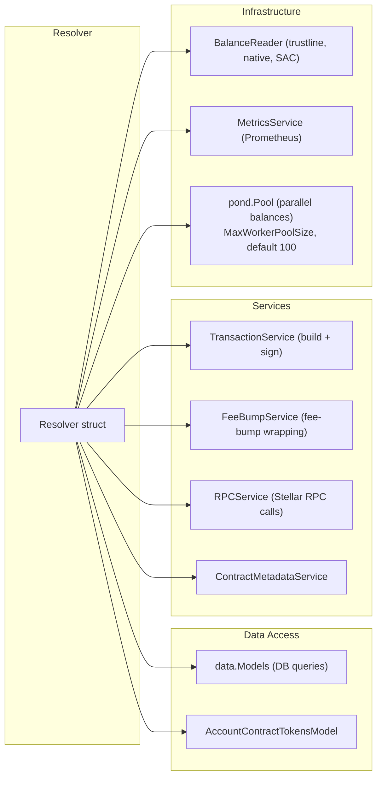
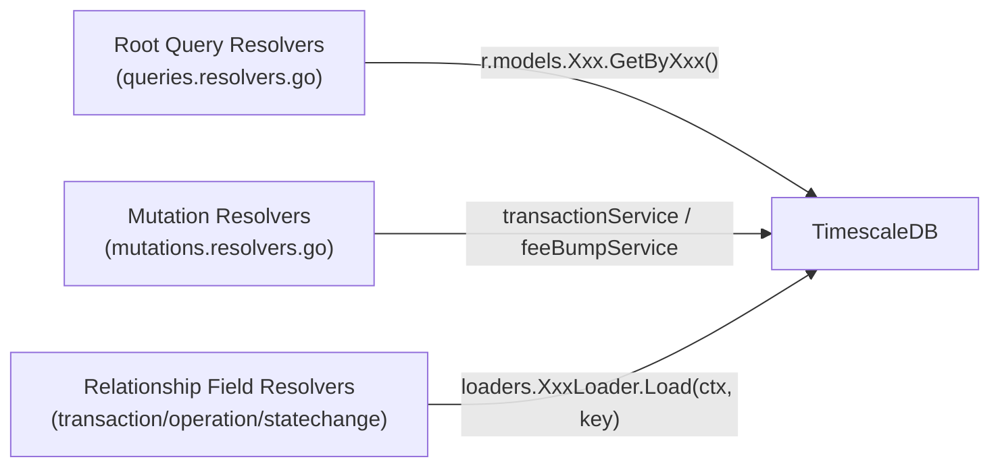
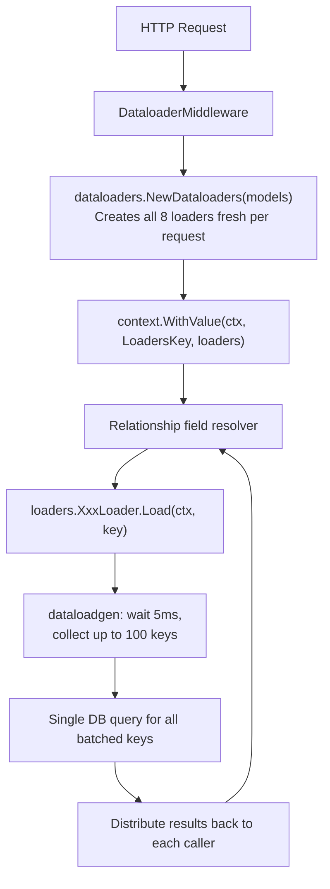
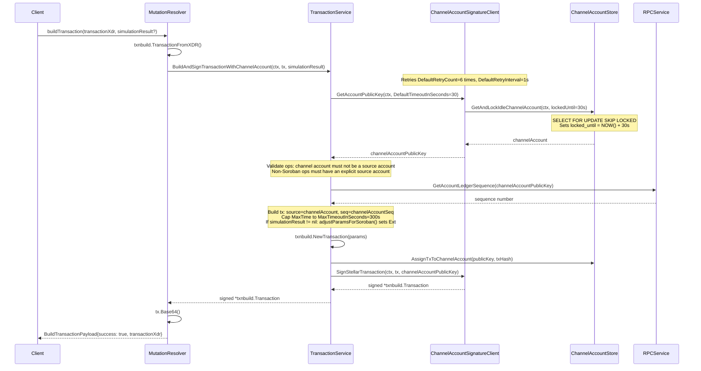
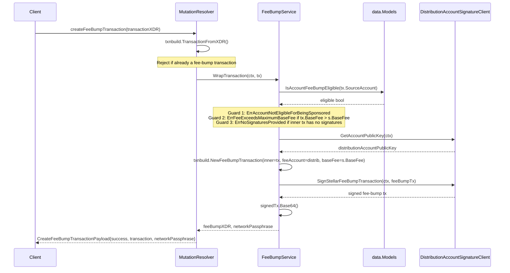
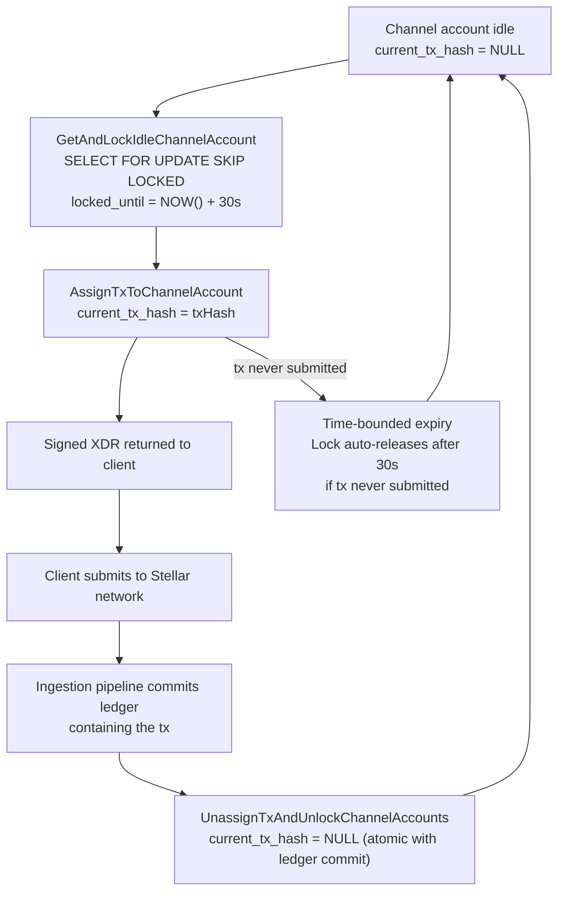

# GraphQL API Architecture

## Request Flow

The server (`internal/serve/serve.go`) builds a Chi router with a layered middleware stack. Two global middlewares wrap all routes; the `/graphql/query` path adds conditional authentication, per-request dataloaders, and the gqlgen handler with several extensions.



**gqlgen extensions** applied in `serve.go:handler()`:

| Extension | Configuration | Purpose |
|-----------|--------------|---------|
| LRU Query Cache | 1000 entries | Parse-once cache for compiled query documents |
| AutomaticPersistedQuery | LRU 100 entries | APQ protocol — send hash first, full query on cache miss |
| Introspection | always on | `__schema` / `__type` queries |
| FixedComplexityLimit | `GraphQLComplexityLimit` config | Reject queries whose computed cost exceeds the threshold |
| ComplexityLogger | via `complexityreporter` | Records per-query complexity to Prometheus |
| GraphQLFieldMetrics | `AroundFields` hook | Per-field resolver timing in Prometheus |
| CustomErrorPresenter | — | Normalises error shape for all GraphQL error responses |

**Complexity scoring** (`addComplexityCalculation` in `serve.go`): Paginated connection fields (`transactions`, `operations`, `stateChanges`) multiply child complexity by the `first` or `last` parameter (defaulting to 10 when neither is provided). Non-paginated scalar fields cost 1 each. Applied to: `Query.transactions`, `Query.operations`, `Query.stateChanges`, `Transaction.operations`, `Transaction.stateChanges`, `Operation.stateChanges`.

**Key source files:** `internal/serve/serve.go`, `internal/serve/middleware/middleware.go`, `internal/serve/middleware/metrics_middleware.go`, `internal/serve/middleware/dataloader_middleware.go`, `internal/serve/middleware/complexity_logger.go`, `internal/serve/middleware/graphql_field_metrics.go`

---

## Schema Organization

All schema source-of-truth files live in `internal/serve/graphql/schema/`. gqlgen reads every `.graphqls` file; any change requires `make gql-generate` to regenerate `internal/serve/graphql/generated/`.

### Schema Files

| File | Contents | Key Types |
|------|----------|-----------|
| `queries.graphqls` | Root Query type — 8 fields | `Query` |
| `mutations.graphqls` | Root Mutation type — 2 mutations + I/O types | `Mutation`, `BuildTransactionInput`, `BuildTransactionPayload`, `CreateFeeBumpTransactionInput`, `CreateFeeBumpTransactionPayload`, `SimulationResultInput` |
| `transaction.graphqls` | Transaction entity | `Transaction` |
| `operation.graphqls` | Operation entity | `Operation` |
| `statechange.graphqls` | BaseStateChange interface + 9 concrete implementations | `BaseStateChange`, `StandardBalanceChange`, `AccountChange`, `SignerChange`, `SignerThresholdsChange`, `MetadataChange`, `FlagsChange`, `TrustlineChange`, `ReservesChange`, `BalanceAuthorizationChange` |
| `balances.graphqls` | Balance interface + 4 concrete types + multi-account wrapper | `Balance`, `NativeBalance`, `TrustlineBalance`, `SACBalance`, `SEP41Balance`, `AccountBalances` |
| `account.graphqls` | Account entity | `Account` |
| `pagination.graphqls` | Relay-style pagination wrappers for 3 entity types | `TransactionConnection/Edge`, `OperationConnection/Edge`, `StateChangeConnection/Edge`, `PageInfo` |
| `scalars.graphqls` | Custom scalar declarations | `Time`, `UInt32`, `Int64` |
| `enums.graphqls` | All domain enumerations | `OperationType` (27 values), `StateChangeCategory` (9), `StateChangeReason` (18), `TokenType` (4) |
| `filters.graphqls` | Filter input types | `AccountStateChangeFilterInput` |
| `directives.graphqls` | gqlgen code-generation directive | `@goField` |

### Type Relationships



**Key design decisions:**

- **Relay-style pagination**: All list fields use the `Connection/Edge/PageInfo` pattern, enabling bidirectional cursor pagination (`first`/`after` for forward, `last`/`before` for backward).
- **`@goField(forceResolver: true)`**: Applied to relationship fields and enum fields (e.g., `type`, `reason` on `BaseStateChange`). Forces gqlgen to always call the resolver function instead of reading a Go struct field directly — necessary for lazy dataloader loading and type conversion.
- **`since`/`until` params on `Account`**: Optional time-range filters that enable TimescaleDB chunk exclusion on `ledger_created_at`, dramatically reducing scan cost for time-bounded account history.
- **`operation` nullable on `BaseStateChange`**: Fee-related state changes have no associated operation (they arise from the ledger fee processing, not a specific operation). All other state changes link to an operation.
- **`Balance` as an interface**: The four balance types (native XLM, trustlines, SAC, SEP41) share `balance`/`tokenId`/`tokenType` but have different additional fields. The interface lets `balancesByAccountAddress` return a heterogeneous list in a single query.

---

## Resolver Architecture

### Resolver Struct and Dependencies

`resolvers.Resolver` is the root struct that gqlgen embeds in every generated resolver interface. It is constructed once at startup and shared across all requests.



### Resolver File Layout (Follow-Schema Pattern)

gqlgen auto-generates one resolver file per schema file. Hand-written files provide the `Resolver` struct, utilities, and the `BalanceReader` abstraction.

| Resolver File | Schema File | Resolution Pattern |
|--------------|-------------|-------------------|
| `queries.resolvers.go` | `queries.graphqls` | Direct `r.models.Xxx.GetByXxx()` |
| `mutations.resolvers.go` | `mutations.graphqls` | Delegates to `transactionService` / `feeBumpService` |
| `transaction.resolvers.go` | `transaction.graphqls` | Dataloader calls for all relationship fields |
| `operation.resolvers.go` | `operation.graphqls` | Dataloader calls for all relationship fields |
| `statechange.resolvers.go` | `statechange.graphqls` | Shared helpers + type-category dispatch |
| `account.resolvers.go` | `account.graphqls` + `balances.graphqls` | Direct model + `BalanceReader` via `pond.Pool` |
| `resolver.go` | — (not generated) | Resolver struct, `NewResolver`, shared field helpers |
| `utils.go` | — (not generated) | Pagination, cursor encoding/decoding, DB column selection |
| `errors.go` | — (not generated) | GraphQL error message constants |
| `balance_reader.go` | — (not generated) | `BalanceReader` interface implementation |

### Three Resolution Patterns



### Column Selection Optimization

`GetDBColumnsForFields(ctx, model)` in `utils.go` introspects the live GraphQL request's field selection set via `graphql.CollectFieldsCtx`. For paginated fields it traverses `edges → node` to find the requested leaf fields, then maps each GraphQL field name to a DB column name using `json`/`db` struct tags. Only the requested columns are included in the SQL query (`SELECT col1, col2, ...` instead of `SELECT *`).

Some GraphQL fields map to multiple DB columns — e.g. `limit` → `trustline_limit_old, trustline_limit_new`; `thresholds` → `threshold_old, threshold_new` — handled by explicit switch cases in `getDBColumns`.

### Cursor Pagination System

Three cursor types serve different query contexts (`utils.go`):

| Cursor Type | Used By | Decoded Format | Example |
|-------------|---------|----------------|---------|
| `CursorTypeInt64` | Nested operation resolvers (within-transaction) | `int64` string | `"42"` |
| `CursorTypeComposite` | Root-level and account-level tx/op queries | `ledger_created_at_nano:id` | `"1700000000000000000:1234"` |
| `CursorTypeStateChange` | All state change queries | `ledger_created_at_nano:to_id:op_id:sc_order` | `"1700000000000000000:512:513:0"` |

All cursors are base64-encoded before being returned to clients, making them opaque. Default page size: `DefaultLimit = 50`.

### Error Handling Pattern

All resolver errors are wrapped in `*gqlerror.Error` with a machine-readable `code` extension field:

```go
return nil, &gqlerror.Error{
    Message: err.Error(),
    Extensions: map[string]any{
        "code": "CHANNEL_ACCOUNT_UNAVAILABLE",
    },
}
```

Error codes: `INVALID_TRANSACTION_XDR`, `INVALID_OPERATION_STRUCTURE`, `INVALID_SOROBAN_TRANSACTION`, `CHANNEL_ACCOUNT_UNAVAILABLE`, `FORBIDDEN_SIGNER`, `TRANSACTION_BUILD_FAILED`, `FEE_EXCEEDS_MAXIMUM`, `NO_SIGNATURES_PROVIDED`, `ACCOUNT_NOT_ELIGIBLE_FOR_BEING_SPONSORED`, `FEE_BUMP_TX_NOT_ALLOWED`, `FEE_BUMP_CREATION_FAILED`.

---

## DataLoader Pattern

### Per-Request Lifecycle



**Key design decisions:**

- **Per-request creation**: A fresh `Dataloaders` instance per HTTP request prevents cross-request data leakage and stale reads in horizontally-scaled deployments. (See [dataloader issue #62](https://github.com/graphql/dataloader/issues/62) for the canonical rationale.)
- **Library**: `github.com/vikstrous/dataloadgen` — generic, type-safe dataloader.
- **Batching config**: `BatchCapacity(100)` (max keys per batch flush), `Wait(5ms)` (time window to collect keys before firing the batch query).
- **Context retrieval**: Resolvers access loaders via `ctx.Value(middleware.LoadersKey).(*dataloaders.Dataloaders)`.

### Loader Inventory

| Loader | Key Field | Value | Cardinality | DB Method |
|--------|-----------|-------|-------------|-----------|
| `OperationsByToIDLoader` | `ToID` (tx TOID) | `[]*OperationWithCursor` | 1→N | `BatchGetByToIDs` |
| `AccountsByToIDLoader` | `ToID` (tx TOID) | `[]*Account` | 1→N | `BatchGetByToIDs` |
| `StateChangesByToIDLoader` | `ToID` (tx TOID) | `[]*StateChangeWithCursor` | 1→N | `BatchGetByToIDs` |
| `TransactionsByOperationIDLoader` | `OperationID` | `*Transaction` | 1→1 | `BatchGetByOperationIDs` |
| `AccountsByOperationIDLoader` | `OperationID` | `[]*Account` | 1→N | `BatchGetByOperationIDs` |
| `StateChangesByOperationIDLoader` | `OperationID` | `[]*StateChangeWithCursor` | 1→N | `BatchGetByOperationIDs` |
| `OperationByStateChangeIDLoader` | `StateChangeID` | `*Operation` | 1→1 | `BatchGetByStateChangeIDs` |
| `TransactionByStateChangeIDLoader` | `StateChangeID` | `*Transaction` | 1→1 | `BatchGetByStateChangeIDs` |

All keys also carry a `Columns` field (the output of `GetDBColumnsForFields`) so each loader fires a column-projected query.

### Generic Loader Helpers

Two generic factory functions in `loaders.go` eliminate boilerplate:

- **`newOneToManyLoader[K, PK, V, T]`**: Calls `fetcher(ctx, keys)`, groups results by primary key, returns `[]*V` slices in input-key order.
- **`newOneToOneLoader[K, PK, V, T]`**: Same but returns a single `*V` per key (nil if not found).

Both are generic over the key type `K`, primary-key type `PK`, value type `V`, and raw DB result type `T`.

### TOID Bit Masking

Stellar operation IDs encode `(ledger, tx_order, op_index)` — the lower 12 bits hold `op_index`. Masking them with `&^ 0xFFF` recovers the parent transaction's TOID (`to_id`), enabling grouping without a join:

```go
// operationsByToIDLoader: derive tx_to_id from operation ID
tx_to_id = item.ID &^ 0xFFF
```

### State Change ID Format

Loaders 7 and 8 use a composite string ID to uniquely identify a state change across the three-dimensional key `(to_id, op_id, sc_order)`:

```go
stateChangeID = fmt.Sprintf("%d-%d-%d", toID, operationID, stateChangeOrder)
```

`parseStateChangeIDs` in `dataloaders/utils.go` splits this back into the three components for the batch DB query.

---

## Mutation Flow

Two mutations are exposed: `buildTransaction` (assigns a channel account, builds, and signs) and `createFeeBumpTransaction` (wraps an existing signed transaction with the distribution account as fee payer). Neither mutation submits the transaction — clients receive the signed XDR and submit it directly to the Stellar network.

### BuildTransaction



### CreateFeeBumpTransaction



### Channel Account Lock Lifecycle



**Key design decisions:**

- **No submission in mutations**: `buildTransaction` returns the signed XDR to the caller. Clients submit to Stellar RPC directly. The wallet-backend never holds user private keys; it only manages its own channel account pool.
- **Time-bounded locks**: The `lockedUntil` timestamp (default 30s) ensures a channel account is never indefinitely blocked if the client crashes after receiving the XDR.
- **Ingestion-based release**: `UnassignTxAndUnlockChannelAccounts` is called inside `PersistLedgerData` within the same DB transaction that commits the ledger. This ties channel account release to confirmed on-chain inclusion.
- **Soroban support**: `adjustParamsForSoroban` validates the simulation result (must be non-empty, must not have failed), checks that the channel account is not misused as a Soroban auth signer, then sets the `Ext` field in the `InvokeHostFunction`/`ExtendFootprintTtl`/`RestoreFootprint` operation to encode resource limits and fees.
- **Fee-bump eligibility check**: `IsAccountFeeBumpEligible` queries the `accounts` table to confirm the source account is tracked and eligible. This prevents the distribution account from sponsoring arbitrary strangers.

### Key Constants Reference

| Constant | Value | Location | Role |
|----------|-------|----------|------|
| `MaxTimeoutInSeconds` | 300 | `services/transaction_service.go` | Hard cap on tx max-time; limits how long a channel account can be locked |
| `DefaultTimeoutInSeconds` | 30 | `services/transaction_service.go` | Default lock duration used by `GetAccountPublicKey` |
| `DefaultRetryCount` | 6 | `signing/channel_account_db_signature_client.go` | Retries when no idle channel account is available |
| `DefaultRetryInterval` | 1s | `signing/channel_account_db_signature_client.go` | Delay between channel account acquisition retries |
| `DefaultLimit` | 50 | `resolvers/utils.go` | Default page size for paginated connection queries |
