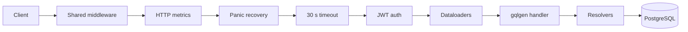
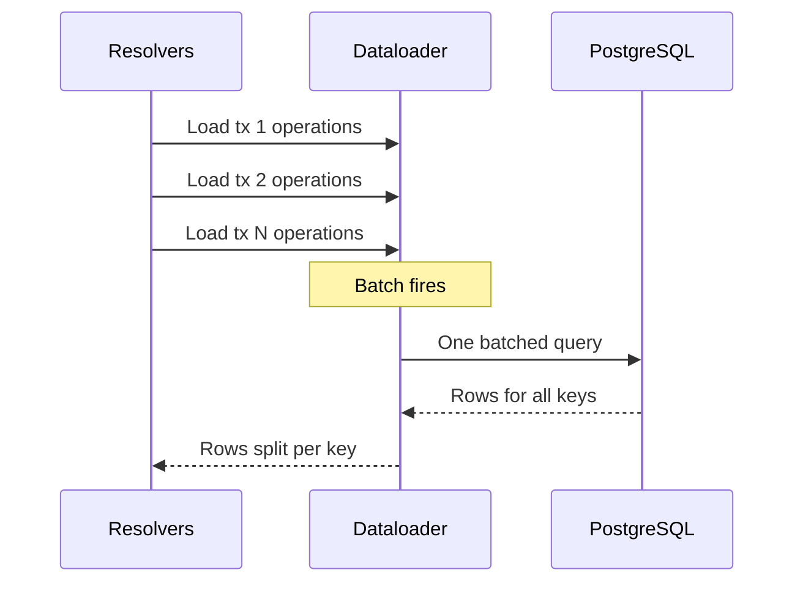

# GraphQL serving

For contributors changing the API and operators tuning it. After reading it you can trace a request from the socket to the database, find the code that answers each query, and tell which limit rejected a request.

## Contents

- [Request path](#request-path)
- [Schema and codegen](#schema-and-codegen)
- [Root queries](#root-queries)
- [Dataloaders](#dataloaders)
- [Limits](#limits)
- [Persisted queries](#persisted-queries)
- [Health](#health)
- [Database access](#database-access)
- [Metrics](#metrics)
- [Where in the code](#where-in-the-code)

## Request path

`wallet-backend serve` runs one HTTP server on `--port` (default `8001`). GraphQL lives at `POST /graphql/query`. The server only reads; ingestion writes everything it returns.



Legend, in request order:

| Step | What it does |
| --- | --- |
| Shared middleware | The standard Stellar Go mux: request ID, a panic recoverer, request logging, and CORS that allows any origin, header and common method. |
| HTTP metrics | Counts requests and times them by route pattern and method. Unmatched routes get the label `unmatched`, so client paths never become labels. |
| Panic recovery | Logs a panic with its stack and returns 500. |
| 30 s timeout | Cancels the request context after 30 s, so resolvers and database calls stop instead of holding a pooled connection. |
| JWT auth | Present only when `--client-auth-public-keys` is set. A bad token gets 401. See [Authentication](../api/authentication.md). |
| Dataloaders | Builds a fresh set of dataloaders for this request and puts it on the context. |
| gqlgen handler | Parses, validates, applies the limits below, and runs the operation. |

`/health` and `/api-metrics` sit before the timeout and auth steps, so they never need a token. `/api-metrics` serves the Prometheus registry with at most 5 scrapes in flight and a 10 s scrape timeout.

Server timeouts:

| Timeout | Value | Bounds |
| --- | --- | --- |
| Read | 5 s | Reading the request. Default of the Stellar Go HTTP server. |
| Write | 35 s | Writing the response. Set above the request timeout so normal queries never hit it. |
| Idle | 2 min | A keep-alive connection waiting for its next request. |
| Shutdown grace | 10 s | In-flight requests on SIGINT or SIGTERM. Default of the Stellar Go HTTP server. |

When `--admin-port` is above 0, a second listener serves pprof at `/debug/pprof/`. A bind failure there is logged and the API keeps running.

Errors are filtered before they reach the client. An error whose `code` extension is on the client-safe list passes through. Any other error is logged with the operation name and field path, then replaced with `internal server error` and code `INTERNAL_SERVER_ERROR`. SQL text and table names never leak.

## Schema and codegen

The API is schema-first. The schema is the set of `.graphqls` files in `internal/serve/graphql/schema/`. gqlgen generates Go from it, configured by `gqlgen.yml`.

| Path | Contents | Edit by hand |
| --- | --- | --- |
| `internal/serve/graphql/schema/*.graphqls` | The schema | Yes |
| `internal/serve/graphql/generated/` | Executable schema and generated models | No |
| `internal/serve/graphql/resolvers/*.resolvers.go` | One resolver file per schema file | Yes, inside the generated function stubs |
| `internal/serve/graphql/resolvers/*.go` | Helpers: pagination, balances, errors | Yes |

After editing a schema file, regenerate:

```bash
make gql-generate
```

`gqlgen.yml` binds most GraphQL types to existing Go structs in `internal/indexer/types` instead of generated models. A field with a matching struct field resolves without code.

The schema uses `@goField` in two ways:

- `@goField(forceResolver: true)` makes gqlgen call a resolver method for a field the struct already has. Examples: `Transaction.hash`, `Transaction.accounts`, `Operation.transaction`, and the operations and state changes on an account transaction edge.
- `@goField(name: "...")` maps a GraphQL field to a differently named Go field, as with `Operation.type`.

Resolvers project columns. They read the fields the client selected and pass only the matching database columns to the query.

## Root queries

The API is read-only. It has three root queries.

| Query | Resolver file | Model call | Pagination |
| --- | --- | --- | --- |
| `transactionByHash(hash)` | `queries.resolvers.go` | `Transactions.GetByHash` | None, one row |
| `accountByAddress(address)` | `queries.resolvers.go` | None. It validates the address and returns an account object. Each child field runs its own query. | On the child connections |
| `operationById(id)` | `queries.resolvers.go` | `Operations.GetByID` | None, one row |

An invalid hash returns code `INVALID_TRANSACTION_HASH`. An invalid address returns `INVALID_ADDRESS`.

The account's connections:

| Field | Model call | Cursor |
| --- | --- | --- |
| `transactions` | `Transactions.BatchGetByAccountAddress` | `ledger_created_at:id` keyset |
| `operations` | `Operations.BatchGetByAccountAddress` | `ledger_created_at:id` keyset |
| `stateChanges` | `StateChanges.BatchGetByAccountAddress` | State change keyset, with optional filters on transaction hash, operation ID, category and reason |
| `balances` | Balance reader, one call per source | Opaque `v1:<source>:<id>` |
| `sep41Allowances` | Balance reader, `GetSEP41Allowances` | Opaque `v1` keyset |

All connections follow the Relay shape: `first`/`after` or `last`/`before`, then `edges` and `pageInfo`. Resolvers fetch one extra row to learn whether another page exists. The account history fields also take `since` and `until`.

`balances` merges several sources into one ordered list. The sources depend on the address type:

| Address | Sources, in order |
| --- | --- |
| `G...` account | native, classic trustlines, SEP-41, liquidity pool shares |
| `C...` contract | SAC, SEP-41 |

The cursor names the source of the last edge and that source's own keyset ID. The next page skips earlier sources and resumes inside that one.

## Dataloaders

Nested fields go through dataloaders. Without them, a page of 100 transactions that each select `operations` would run 100 queries. The loader collects those keys and runs one.



Legend:

- **Load** is each sibling resolver asking for its own key. gqlgen runs siblings concurrently, so the keys arrive together.
- **Batch fires** ends the collection window. It fires at 100 keys, the maximum page size, or after 1 ms. Each nested level adds at most one window of latency.
- **One batched query** covers every key. Keys are first grouped by query shape: selected columns, limit, cursor and sort order. Two aliases of the same field with different selections never share a query. A batch with a single key uses a simpler query.
- **Rows split per key** maps results back to their parent. Operations map to their transaction by clearing the low 12 bits of the operation ID.

Loaders are built per request, so no data is shared between requests.

| Loader | Used by | Prevents one query per |
| --- | --- | --- |
| `OperationsByToIDLoader` | `Transaction.operations` | transaction |
| `StateChangesByToIDLoader` | `Transaction.stateChanges` | transaction |
| `AccountsByToIDLoader` | `Transaction.accounts` | transaction |
| `TransactionsByOperationIDLoader` | `Operation.transaction` | operation |
| `StateChangesByOperationIDLoader` | `Operation.stateChanges` | operation |
| `AccountsByOperationIDLoader` | `Operation.accounts` | operation |
| `OperationByStateChangeIDLoader` | `StateChange.operation` | state change |
| `TransactionByStateChangeIDLoader` | `StateChange.transaction` | state change |
| `AccountOperationsByToIDLoader` | `AccountTransactionEdge.operations` | account transaction edge |
| `AccountStateChangesByToIDLoader` | `AccountTransactionEdge.stateChanges` | account transaction edge |

The two account-scoped loaders also group by account, so a request for several accounts never mixes their edges.

## Limits

| Limit | Default | Flag | Why |
| --- | --- | --- | --- |
| Query complexity | 10,000 | `--graphql-complexity-limit` | Rejects queries too costly to run. Each field costs 1. A paginated connection multiplies its children by `first` or `last`, or by 50 when both are omitted. `Transaction.accounts` and `Operation.accounts` multiply by 50. gqlgen adds up all inline fragments, even mutually exclusive ones. A full-detail query that selects every state change type costs about 7,600 at `first: 100`. |
| Query depth | 15 | none | The complexity limit cannot catch a deep chain of `first: 1` connections. Each field adds a level. Inline fragments add none. Fragment spreads are followed. Error code `QUERY_TOO_DEEP`. |
| Default page size | 50 | none | Used when `first` and `last` are both omitted. The complexity calculation uses the same value. |
| Maximum page size | 100 | none | Account history, nested connections, `balances` and `sep41Allowances`. A larger value is rejected with `BAD_USER_INPUT`, not clamped. |
| Request context | 30 s | none | See [Request path](#request-path). |
| JWT lifetime | 15 s | `--client-auth-max-timeout-seconds` | A token may not expire more than this far after it was issued, or past the current time. |
| Authenticated body size | 102,400 bytes | `--client-auth-max-body-size-bytes` | Caps the body read for JWT verification. |
| Introspection | off | `--graphql-introspection-enabled` | `__schema` and `__type` are served only when this is `true`. |
| Parsed query cache | 1,000 documents | none | LRU of parsed query documents, so repeated queries skip parsing. |

Add `first` or `last` to every connection to keep complexity low. The comment above `addComplexityCalculation` in `internal/serve/serve.go` works through an example.

## Persisted queries

Automatic persisted queries (APQ) are on. A client sends only the SHA-256 hash of a query; on a miss the server answers `PersistedQueryNotFound` and the client resends the hash with the full query, which the server caches. The cache is an in-process LRU of 100 queries. Each `serve` replica has its own cache, and it empties on restart.

The GET transport is registered too, so a hash-only request can be a GET.

## Health

`GET /health` checks two things on every call.

1. It calls RPC `getHealth` on `--rpc-url`. A failed call returns 500. A status other than `healthy` returns 503.
2. It reads `latest_ingest_ledger` from `ingest_store` and subtracts it from RPC's latest ledger. A gap above 50 ledgers returns 503 with both values.

Otherwise it returns 200:

```json
{
  "status": "ok",
  "backend_latest_ledger": 123456
}
```

`serve` has no data of its own. It answers from rows that ingestion writes. When ingestion falls behind, every answer is stale, so `serve` reports itself unhealthy and a load balancer stops sending it traffic. Restarting `serve` does not fix this; look at ingestion.

The subtraction is unsigned. If the RPC that `serve` talks to is behind ingestion, the result wraps to a large number and `/health` returns 503. Point `serve` at an RPC that is at or ahead of the one ingestion uses.

## Database access

`serve` opens one pgx connection pool. All reads go through it.

| Setting | Default | Flag |
| --- | --- | --- |
| Max connections | 10 | `--db-max-conns` |
| Min connections | 5 | `--db-min-conns` |
| Max connection lifetime | 5m | `--db-max-conn-lifetime` |
| Max connection idle time | 10s | `--db-max-conn-idle-time` |

The pool uses `QueryExecModeExec`. pgx then sends each query without creating a server-side prepared statement. That keeps `serve` compatible with PgBouncer in transaction pooling mode, where a prepared statement can land on a different backend and fail with SQLSTATE 42P05.

Every history read is bounded by `latest_ingest_ledger`: the query compares the row's TOID against the cursor in the same snapshot, so rows the ingester has written but not yet acknowledged with a cursor commit are never served, and a transaction never appears without its operations and state changes.

Read replicas are a deployment choice. `serve` uses whatever `DATABASE_URL` points at, and nothing in the code routes reads elsewhere. `serve` only reads, so it can point at a replica. `/health` then reads `latest_ingest_ledger` from that replica, so replication lag counts toward the 50-ledger rule.

## Metrics

`serve` exposes these on `/api-metrics`. See [Observability](../operations/observability.md) for what to alert on.

| Area | Metrics |
| --- | --- |
| HTTP | `wallet_http_requests_total`, `wallet_http_request_duration_seconds` |
| GraphQL | `wallet_graphql_operation_duration_seconds`, `wallet_graphql_operations_total`, `wallet_graphql_in_flight_operations`, `wallet_graphql_response_size_bytes`, `wallet_graphql_complexity`, `wallet_graphql_errors_total`, `wallet_graphql_deprecated_fields_total` |
| Dataloaders | `wallet_graphql_dataloader_batch_size`, `wallet_graphql_dataloader_fetch_duration_seconds` |
| Auth | `wallet_auth_expired_signatures_total` |
| Database | `wallet_db_query_duration_seconds`, `wallet_db_queries_total`, `wallet_db_query_errors_total`, `wallet_db_pool_*` |
| RPC | `wallet_rpc_*` |

## Where in the code

| Path | Role |
| --- | --- |
| `internal/serve/serve.go` | Router, middleware order, timeouts, gqlgen setup, complexity functions, pool config. |
| `internal/serve/middleware/` | HTTP metrics, panic recovery, request timeout, auth, dataloader injection, GraphQL metrics. |
| `internal/serve/graphql/depth_limit.go` | Depth limit extension. |
| `internal/serve/graphql/utils.go` | Default page size and the error presenter. |
| `internal/serve/graphql/schema/` | GraphQL schema. |
| `internal/serve/graphql/resolvers/` | Resolvers, pagination helpers, balance reader. |
| `internal/serve/graphql/dataloaders/` | Dataloaders and batch settings. |
| `internal/serve/httphandler/health.go` | `/health`. |
| `gqlgen.yml` | gqlgen configuration and type bindings. |
| `cmd/serve.go`, `cmd/utils/global_options.go` | `serve` flags and defaults. |
| `internal/db/db.go` | Pool defaults. |
| `internal/metrics/` | Metric definitions. |
