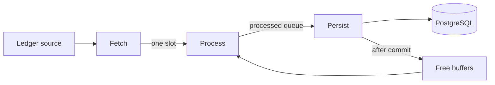
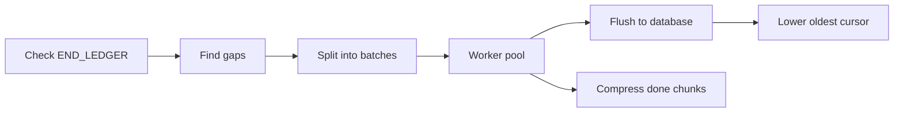
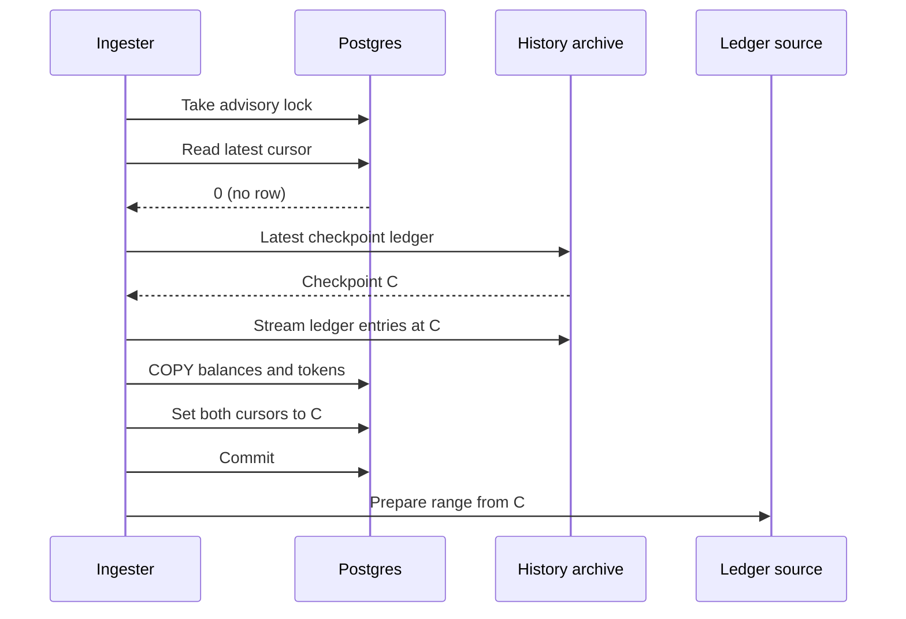

# Ingestion

For operators and contributors who need to know how a Stellar ledger becomes rows in the database. After reading, you can tell what the `ingest` process does at startup, how a ledger moves through the live pipeline, what each cursor means, and why a process exited.

## Contents

- [Processes](#processes)
- [Live mode](#live-mode)
  - [Startup](#startup)
  - [Pipeline](#pipeline)
  - [Persisting a batch](#persisting-a-batch)
  - [Errors and retries](#errors-and-retries)
  - [Shutdown](#shutdown)
- [Backfill mode](#backfill-mode)
- [Ledger sources](#ledger-sources)
- [Cursors](#cursors)
- [Checkpoint bootstrap](#checkpoint-bootstrap)
- [Indexer](#indexer)
- [TimescaleDB policies the live ingester applies](#timescaledb-policies-the-live-ingester-applies)
- [Failure modes](#failure-modes)
- [Where in the code](#where-in-the-code)

## Processes

| Process | Command | Writes to the database | Instances |
| --- | --- | --- | --- |
| API server | `wallet-backend serve` | No. Reads only. | Any number |
| Live ingester | `wallet-backend ingest` with `INGESTION_MODE=live` (default) | Yes | One per network |
| Backfill | `wallet-backend ingest` with `INGESTION_MODE=backfill` | The five history tables and `oldest_ingest_ledger` only | Takes no lock. Runs next to the live ingester. |

The live ingester holds a PostgreSQL session-level advisory lock (`pg_try_advisory_lock`). The lock key is a hash of the string `wallet-backend-ingest-` plus `NETWORK_PASSPHRASE`, so each network gets its own lock. A second live ingester for the same network fails to get the lock and exits with `advisory lock not acquired`.

Both modes serve `/health` and `/ingest-metrics` on `INGEST_SERVER_PORT` (default 8002). Profiling endpoints under `/debug/pprof/` run on `ADMIN_PORT` when it is greater than 0.

## Live mode

Live mode follows the network tip, one ledger after another, and is the only writer of balances, protocol state, and `latest_ingest_ledger`.

### Startup

1. The command rejects `START_LEDGER` and `END_LEDGER` in live mode. Live mode resumes from the stored cursor.
2. The process checks the pool size before it opens the pool. Live persist holds 8 connections at its commit barrier (seven siblings and the coordinator) and the advisory-lock session holds a ninth, so a `DB_MAX_CONNS` below 9 stops the process with `db-max-conns is <n>, below the 9 connections live persist requires`. The default `DB_MAX_CONNS` is 12, which leaves room for the classification reads. Backfill skips this check.
3. The process opens the database pool and applies the settings listed under [TimescaleDB policies the live ingester applies](#timescaledb-policies-the-live-ingester-applies).
4. It builds the ledger source, the RPC client, the history archive client, the protocol validators and processors, and starts the HTTP servers.
5. It takes the advisory lock on a dedicated connection. That connection stays checked out for the life of the process.
6. It records which protocol cursors exist, so it knows which protocols to ingest. See [Cursors](#cursors).
7. It reads `latest_ingest_ledger`.
8. If the value is 0, it runs the [checkpoint bootstrap](#checkpoint-bootstrap). The first ledger to ingest is the checkpoint ledger.
9. Otherwise it runs startup reconciliation, then starts at `latest_ingest_ledger + 1`. Reconciliation deletes every row above the cursor ledger from the five bulk tables, in one transaction. These rows exist only when an earlier run crashed during a commit, as described under [Persisting a batch](#persisting-a-batch). Each delete matches rows whose TOID is at or past the first TOID of the next ledger. When the cursor ledger has a `transactions` row, the deletes also filter on `ledger_created_at` at or after that ledger's close time, so TimescaleDB skips every older chunk. A failure here stops the process, because ingesting over the leftover rows would collide on primary keys. Each deleted batch logs `startup reconciliation: deleted`.
10. It prepares the ledger source for an unbounded range from the first ledger, then starts the pipeline.

### Pipeline

Fetch reads ledgers from the ledger source and hands each one to process through a one-slot channel. Process takes a free buffer, runs the [indexer](#indexer) on the ledger, and puts the filled buffer on the processed queue. Persist takes ledgers off the queue, writes them in batches, and returns each buffer to the free pool only after its batch commits.

The three stages run at the same time. While ledger N persists, N+1 is processed and N+2 is fetched, so the time per ledger is the slowest stage, not the sum of stages. Persist runs strictly in ledger order.

| Part | Size | Why |
| --- | --- | --- |
| Fetch to process channel | 1 ledger | Fetch already works ahead without it. The slot absorbs the bursts in which a source refills its own prefetch. |
| Processed queue | `LIVE_PERSIST_MAX_BATCH_SIZE - 1` ledgers, at least 1 | The queue is where a persist backlog waits, so its depth caps the batch size. The floor of 1 lets process start the next ledger while persist commits. |
| Buffers | `2 × LIVE_PERSIST_MAX_BATCH_SIZE + 1` | One batch in flight, a full queue, and one buffer being filled. Fewer buffers would cap the batch below `LIVE_PERSIST_MAX_BATCH_SIZE`. |

`LIVE_PERSIST_MAX_BATCH_SIZE` (default 1) caps how many consecutive ledgers one persist commit holds. Persist waits for one ledger, then takes whatever process has already finished, up to the cap, and never waits for more. With the default, every ledger gets its own commit. With a higher value, a backlog coalesces into fewer, larger commits, at the cost of coarser crash recovery and later visibility under load. `wallet_ingestion_persist_batch_size` shows the batch sizes persist forms.

The memory cost scales with ledger count, not bytes. At peak the pipeline holds `2 × LIVE_PERSIST_MAX_BATCH_SIZE + 1` indexer buffers, and each queued ledger also keeps its ledger close meta and decoded transactions until its batch commits. Large ledgers are the thing to watch under a memory limit.

A separate goroutine updates `wallet_ingestion_lag_ledgers` once per second from the ledger source's tip. It runs off the pipeline so a slow tip query never stalls the stages.

### Persisting a batch

Persist does these steps for each batch:

1. **Lock-session check.** It runs `SELECT 1` on the connection that holds the advisory lock. The process never unlocks mid-run, so a live session means a held lock. A database failover can end that session on the server without this process seeing a disconnect, and this check is what catches it.
2. **Classification plan.** It builds one plan for the whole batch from the union of the batch's uploaded WASMs, their bytecode, and deployed contracts. Each WASM is matched against the registered protocol validators, and the validators make any RPC calls they need here, for example to fetch SEP-41 token metadata. Hashes uploaded in an earlier ledger come from a read of `protocol_wasms` on the pool, which sees exactly what the previous batch committed. That read has its own retry, described under [Errors and retries](#errors-and-retries). When a later ledger of the batch rebinds a contract to a different WASM, the plan keeps the earlier binding as a candidate too, so the earlier ledger still claims the contract under the binding it saw. No database transaction is open during this step, and every retry of the batch reuses the same plan.
3. **Open the transactions.** It opens the coordinating transaction and seven sibling transactions, each sibling on its own connection. Each sibling runs `SET LOCAL synchronous_commit = off`.
4. **Write.** The siblings and the coordinating transaction write at the same time. Each one writes every ledger of the batch, in ledger order.
5. **Commit barrier.** If every writer succeeded, the siblings commit in the order below, then the coordinating transaction commits last.
6. **Hand back.** It records the per-ledger metrics and returns the batch's buffers to the free pool.

The commit set, in commit order:

| Order | Transaction | Writes |
| --- | --- | --- |
| 1 | `transactions` sibling | `transactions` by `COPY` |
| 2 | `transactions_accounts` sibling | `transactions_accounts` by `COPY` |
| 3 | `operations` sibling | `operations` by `COPY` |
| 4 | `operations_accounts` sibling | `operations_accounts` by `COPY` |
| 5 | `state_changes` sibling | `state_changes` by `COPY`, plus the protocol history rows the coordinating transaction sends it |
| 6 | `balances` sibling | `native_balances`, then `liquidity_pools`, then `liquidity_pool_balances`, as upserts and deletes |
| 7 | `trustlines` sibling | `trustline_assets` inserts, then `trustline_balances` upserts and deletes |
| 8 | Coordinating transaction | The plan's validator writes once per batch, such as `contract_tokens`. Then per ledger: `contract_tokens` rows for SACs not yet stored, `protocol_wasms` stamped with their protocol, each protocol's cursor swap and current-state rows, `protocol_contracts`, `sac_balances`, and `latest_ingest_ledger`. |

Each writer owns its own tables, and no table has a foreign key into another transaction's tables, so the eight transactions never contend. Each balance family rides the transaction that writes its foreign-key parents. Two placements follow from that rule:

- **SAC balances** stay on the coordinating transaction. Their parent is `contract_tokens`, which the classification path also writes there. A same-key insert from two concurrent transactions could deadlock at the commit barrier.
- **Protocol history rows** are `state_changes` rows, so they go through the `state_changes` sibling under a mutex. Two transactions inserting into the same hypertable can deadlock at a chunk boundary in a way PostgreSQL's deadlock detector cannot see. The protocol cursor swap for those rows stays on the coordinating transaction, so a committed cursor still implies committed history rows.

Contract-event membership for protocols is looked up on the coordinating transaction, not the pool. A contract classified at the head of a batch is uncommitted until the barrier, and a later ledger of the same batch must still see it.

**Durability.** Sibling commits skip the WAL-flush wait. The coordinating transaction commits synchronously and strictly last, and its WAL flush covers all earlier WAL, including the sibling commit records. So a durable cursor implies durable siblings.

**The barrier runs detached from the pipeline context.** A cancellation that lands mid-barrier, from a shutdown signal or another stage's failure, does not stop it between commits. A shutdown never leaves a batch half committed. A cancellation before the barrier still rolls everything back.

**The crash window.** Nothing is visible until the barrier starts. A crash between the first sibling commit and the coordinating commit can leave rows from ledgers above the committed cursor:

| Rows above the cursor | What covers them |
| --- | --- |
| The five bulk tables | API reads hide them, because each root history read carries a bound on the committed cursor in the same snapshot. Startup reconciliation deletes them. |
| Balance tables | They stay visible until those ledgers re-ingest and the upserts reapply. The balance siblings commit last among the siblings to keep this window short. |

The cursor bound applies to the transaction-by-hash and operation-by-ID lookups and to the per-account lists of transactions, operations, and state changes. A database with no cursor row reads unbounded.

**Per-ledger order inside the coordinating transaction.** For each protocol whose cursor exists, the transaction swaps the cursor from `N-1` to `N`. Only a won swap lets that protocol write its rows for the ledger. Last, it advances `latest_ingest_ledger` with a guarded update that succeeds only when the stored value is `N-1`, or `N` for the first ledger after a checkpoint bootstrap. A refused update means another writer moved the cursor, which is the backstop for a lost lock the session check has not caught yet. In a batch, the cursor ends at the batch's last ledger.

### Errors and retries

The persist stage classifies each failure of a batch.

| Error | Handling |
| --- | --- |
| SQLSTATE class 22 (data exception), 23 (constraint violation), 42 (syntax or access rule) | Permanent. The process exits at once. |
| Guarded cursor update refused (`ingest_store guarded cursor update refused: cursor value not owned by this writer`) | Permanent. Another writer advanced the cursor. |
| Protocol cursor row missing after it existed (`ingest_store cursor row missing`) | Permanent. |
| Row encoding failure during `COPY` (`encoding row for COPY`) | Permanent. The same rows always fail. |
| A commit failure after the first commit succeeded (`ledger persist partially committed`) | Permanent. Part of the batch is durable, and a retry would collide on primary keys. The next start's reconciliation repairs it. |
| Anything else, including SQLSTATE 08, 40, 57P01, 57P02, 57P03, and a failed first commit | Retried. The failed attempt rolled everything back, so the retry replays the whole batch. |

A first commit whose error hides a commit that reached the server is retried too. The retry then collides on a primary key, which is permanent, and reconciliation repairs it after restart.

Retry ladders:

| Operation | Attempts | Waits between attempts | Fails at once on |
| --- | --- | --- | --- |
| Live ledger fetch | 10 | 1, 2, 4, 8, 16 s, then 30 s | Datastore buffer death |
| Classification read of `protocol_wasms` | 5 | 1, 2, 4, 8 s | The permanent persist errors above |
| Persist batch | 5 | 1, 2, 4, 8 s | The permanent persist errors above |

If the context ends during an attempt or a wait, the ladder returns the cancellation, not an exhaustion, and logs no retry. Every retry adds to `wallet_ingestion_retries_total`, with the operation label `ledger_fetch`, `classification_read`, or `db_persist`. An exhausted persist ladder also adds to `wallet_ingestion_retry_exhaustions_total`.

**One error, counted once.** A stage failure cancels the whole pipeline. The other stages then return their own cancellation errors, and the pipeline reports only the first error, prefixed `live ingestion pipeline:`. Each stage adds to `wallet_ingestion_errors_total{operation="ingest_live"}` only when it is the stage that failed, not when it saw the pipeline's cancellation. The persist ladder also counts `operation="db_persist"` for a permanent error or an exhaustion, and counts nothing for a cancellation.

**Lock loss versus shutdown.** A cancelled pipeline also fails the lock-session check. Persist looks at the pipeline context after a failed check. If the context is cancelled, it reports a cancellation. Otherwise it reports `advisory lock session is no longer alive, the lock may have been lost` and the process exits.

Ledgers already handed to process or persist when the pipeline stops are dropped. The cursor rests on the last batch that fully committed, and a restart resumes from `latest_ingest_ledger + 1`.

Every 100 ledgers, persist rereads `oldest_ingest_ledger` for the metric and checks for protocol cursors that a `protocol-setup` or `protocol-migrate` run created since startup. A failed read there is logged and retried at the next interval.

### Shutdown

SIGINT or SIGTERM cancels the root context. A batch that has not reached its commit barrier rolls back entirely, and its ledgers are fetched again on the next start. A barrier already in progress runs to completion. In live mode a run that ends because of the signal logs `shutdown requested; exiting cleanly` and exits with status 0.

The live loop releases the advisory lock as it returns, on a context detached from the cancelled one with a 10 s timeout. If the unlock fails, the process logs `releasing advisory lock, destroying connection to end its session` and closes that connection, so PostgreSQL ends the session and drops the lock. Cleanup then runs in this order:

1. Stop the HTTP servers, with a 10 s timeout.
2. Stop the indexer and backfill worker pools and any validator that owns resources.
3. Close the ledger source.
4. Close the WASM spec extractor, with a 5 s timeout.
5. Close the database pool.

## Backfill mode

Backfill fills holes in history that live ingestion did not write. Run it with `INGESTION_MODE=backfill`, `START_LEDGER` greater than 0, and `END_LEDGER` at least `START_LEDGER`.

- **Check END_LEDGER.** `END_LEDGER` must be at most `latest_ingest_ledger`. Otherwise backfill exits with `end ledger <end> cannot be greater than latest ingested ledger <latest> for backfilling`.
- **Find gaps.** Backfill reads the ledger of the oldest row in `transactions` and lists missing ledger numbers between it and `END_LEDGER`. It adds the range from `START_LEDGER` up to the oldest ledger when the request starts earlier. Gaps are clipped to `[START_LEDGER, END_LEDGER]`.
- **Split into batches.** Each gap is cut into batches of `BACKFILL_BATCH_SIZE` ledgers (default 250).
- **Worker pool.** `BACKFILL_WORKERS` batches run at once. The default 0 means one per CPU the Go runtime may use (`GOMAXPROCS`). Each batch opens its own ledger source for a bounded range and reuses one indexer buffer.
- **Flush to database.** Each batch writes every `BACKFILL_DB_INSERT_BATCH_SIZE` ledgers (default 100). A flush is one transaction with `synchronous_commit = off` that writes the five bulk tables in turn. Backfill does not use the live commit set or its sibling transactions. A failed flush is retried up to 5 times, waiting 1, 2, 4, 8 s, and stops at once on the permanent persist errors.
- **Lower oldest cursor.** The last flush of a batch sets `oldest_ingest_ledger` to the lower of its current value and the batch's first ledger, in the same transaction. When the last flush had no ledgers left, a separate transaction does it.
- **Compress done chunks.** When a contiguous run of batches from the start has finished, backfill runs `compress_chunk` on the uncompressed chunks that end inside that run, for each table in the bulk-table list. Backfill waits for compression to finish before it exits.

A ledger fetch in backfill retries up to 10 times with the same waits as live fetch, and retries every error, including datastore buffer death.

A ledger with no transactions has no row in `transactions`. Gap detection lists it as a gap, so backfill fetches it again and writes nothing.

Backfill writes only `transactions`, `transactions_accounts`, `operations`, `operations_accounts`, and `state_changes`, plus `oldest_ingest_ledger`. It does not write balance tables, protocol tables, or `latest_ingest_ledger`, and it does not change TimescaleDB policies or run the pool-size check. That is why it takes no advisory lock and can run while the live ingester runs.

A cancelled backfill exits with an error, not status 0. Batches that never started are logged as `Backfill batches cancelled before starting`. Rerun it with the same range. Gap detection skips what was written.

## Ledger sources

Set the source with `LEDGER_BACKEND_TYPE`.

| | `rpc` (default) | `datastore` |
| --- | --- | --- |
| Reads from | Stellar RPC `getLedgers` at `RPC_URL` | Ledger files in an S3-compatible bucket, as exported by Galexie |
| Required settings | `RPC_URL` | `DATASTORE_BUCKET_PATH`. Optional: `DATASTORE_REGION` (default `us-east-2`), `DATASTORE_ENDPOINT_URL` |
| Prefetch | `GET_LEDGERS_LIMIT` ledgers per call (default 10) | `DATASTORE_BUFFER_SIZE` files (default 100), downloaded by `DATASTORE_NUM_WORKERS` workers (default 10) |
| Retries inside the source | Waits while the requested ledger is past the RPC tip | Transient download errors: `DATASTORE_RETRY_LIMIT` (default 3), with `DATASTORE_RETRY_WAIT` (default `5s`) between tries |
| History reach | The RPC's retention window | Whatever the bucket holds |

The `rpc` source checks the RPC's `getHealth` before each `getLedgers` call. When the process prepares the range, it fetches the first ledger, so a start ledger outside the RPC's retention window fails at startup.

The datastore source reads the file layout from the bucket's `.config.json` manifest. `DATASTORE_LEDGERS_PER_FILE` and `DATASTORE_FILES_PER_PARTITION` override it for a bucket without a manifest. `DATASTORE_NUM_WORKERS` must not exceed `DATASTORE_BUFFER_SIZE`. Workers download and decode files in parallel, and a single goroutine hands them on in ledger order. On an unbounded range (live mode), a file that does not exist yet is awaited without limit, checking every `DATASTORE_RETRY_WAIT`. On a bounded range (backfill), a missing file is an error. A missing file on a bounded range, or a download that runs out of retries, kills the buffer. Every later read on that source then fails with `ledger buffer permanently cancelled`.

`RPC_URL` is required with either source. The ingester calls RPC for `/health` (`getHealth`) and for the validators' metadata fetches during protocol classification. The process connects to the history archive at `ARCHIVE_URL` at startup with either source, and live mode reads it for the checkpoint bootstrap. See [Configuration](../configuration.md) for every setting.

## Cursors

Cursors live in the `ingest_store` table as key and text value pairs.

| Key | Meaning | Written by |
| --- | --- | --- |
| `latest_ingest_ledger` | Last ledger the live ingester committed. API history reads hide rows above it. | Checkpoint bootstrap (set to the checkpoint ledger), then the live ingester's coordinating transaction on every batch. |
| `oldest_ingest_ledger` | Lowest ledger the history tables cover. | Checkpoint bootstrap (set to the checkpoint ledger), backfill (moves it down only), and the `reconcile_oldest_cursor` job when retention is on (moves it up only). |
| `protocol_<ID>_history_cursor` | Last ledger whose protocol history rows are written for protocol `<ID>`. | `protocol-migrate history`, then the live ingester through compare-and-swap. |
| `protocol_<ID>_current_state_cursor` | Last ledger whose protocol current-state rows are written for protocol `<ID>`. | `protocol-migrate current-state`, then the live ingester through compare-and-swap. |

A missing key reads as 0.

For each protocol cursor, the live ingester swaps the value from ledger `N-1` to `N` inside the coordinating transaction, and writes that protocol's rows only when the swap succeeds. A cursor that holds another value is behind the tip or owned by a `protocol-migrate` run, and the ledger is skipped for that protocol. The migration folds that ledger later. A cursor that did not exist at startup is skipped with no database call, and the ingester checks again every 100 ledgers, so a protocol starts without a restart once its cursor row appears. A cursor row that existed and then vanished is a permanent error. See [Protocol data migrations](../operations/data-migrations.md) and [Protocols](protocols.md).

## Checkpoint bootstrap

On an empty database the live ingester has no history, but it still needs every account's current balances. It reads them from the Stellar history archive at `ARCHIVE_URL`.

The ingester asks the archive for its latest checkpoint ledger C and streams every live ledger entry at C. It then reads the archived (evicted) Soroban entries from the hot archive, when the checkpoint has one. Rows are written with `COPY` in batches of 250,000 entries. Everything, including setting `latest_ingest_ledger` and `oldest_ingest_ledger` to C, happens in one transaction. That transaction runs with `synchronous_commit = off` and `idle_in_transaction_session_timeout = 0`, so a server-wide idle timeout does not kill it.

| Table | Filled from |
| --- | --- |
| `native_balances` | Account entries |
| `trustline_balances`, `trustline_assets` | Trustline entries for classic assets |
| `liquidity_pool_balances` | Pool-share trustline entries |
| `liquidity_pools` | Liquidity pool entries |
| `contract_tokens` | Contract instances, live and archived. SACs carry their asset metadata. WASM contracts start with an unknown type. |
| `sac_balances` | SAC balance entries held by contract addresses, kept only when the contract is a confirmed SAC |
| `protocol_wasms` | Contract code entries, live and archived |
| `protocol_contracts` | Contract instances whose WASM is in `protocol_wasms` |

Archived balance entries are skipped. Live ingestion writes their rows again when the entries are restored. The history tables start empty and fill from ledger C onward.

`CHECKPOINT_FREQUENCY` is the number of ledgers between archive checkpoints (default 64). Use 8 only for a test network that runs with accelerated time.

If the bootstrap fails, the transaction rolls back and the cursors stay unset. The next start runs the bootstrap again.

## Indexer

The indexer turns one ledger into rows held in an in-memory buffer. It reads the ledger's transactions, then processes them in parallel on a pool of twice `GOMAXPROCS` workers. Each worker builds a result for one transaction with no shared state. The results are then merged into the ledger's buffer one at a time, in transaction order.

For each transaction, the indexer produces:

| Output | Processor | Source |
| --- | --- | --- |
| Transaction row and its participants | `ParticipantsProcessor` | Transaction envelope and meta |
| Operation rows and their participants | `ParticipantsProcessor` | Operations in the envelope |
| State changes for account properties | `EffectsProcessor` | Operation effects |
| State changes for contract deployments | `ContractDeployProcessor` | Deploy operations |
| State changes for SAC events | `SACEventsProcessor` | Contract events |
| State changes for token transfers | `TokenTransferProcessor` | Token transfer events |
| Native balance changes | `AccountsProcessor` | Account entry changes, plus fee charges and refunds |
| Trustline balance changes | `TrustlinesProcessor` | Trustline entry changes |
| SAC balance changes | `SACBalancesProcessor` | Contract data entry changes |
| SAC contract metadata | `SACInstanceProcessor` | Contract instance entries |
| Pool-share balance changes | `LiquidityPoolSharesProcessor` | Pool-share trustline changes |
| Pool reserve changes | `LiquidityPoolsProcessor` | Liquidity pool entry changes |
| WASM hashes and bytecode | `ProtocolWasmProcessor` | Contract code entries |
| Contract-to-WASM mappings | `ProtocolContractsProcessor` | Contract instance entries |

The buffer stores data this way:

- **Canonical rows.** Each transaction is stored once, keyed by its TOID, and each operation once, keyed by its operation ID. Participant sets use the same keys. A participant is an account linked to a transaction or operation, and becomes a row in `transactions_accounts` or `operations_accounts`. The key is the TOID, not the hash, because a hash names an envelope, not a position. Two tx-set positions that carry the same envelope stay two rows.
- **Balance changes.** For each key, such as an account or an account and asset pair, the buffer keeps only the change with the highest order, by operation ID or the account change's sort key. That change is the key's final state in the ledger. A trailing remove is kept as a delete, never netted against an earlier add in the same ledger.
- **Contract events.** Events from successful `InvokeHostFunction` operations are kept per transaction and operation index, for protocol processors such as SEP-41.

**State change IDs.** Each state-change processor numbers its own changes 1 to N within each `(to_id, operation_id)` group and adds its own fixed base, so IDs do not depend on processor order. Re-processing a ledger yields the same IDs, so a duplicate insert fails on the primary key. The indexer checks the bases at startup and refuses to start if one is invalid or two overlap.

**Buffer reuse.** Both modes reuse buffers instead of allocating one per ledger. Live mode rotates its `2 × LIVE_PERSIST_MAX_BATCH_SIZE + 1` buffers and clears each one when process takes it, never while persist still reads it. Backfill clears its one buffer after every flush. A clear keeps the maps' allocated space, and the parsed-asset cache is never cleared because a given asset string always parses the same way.

## TimescaleDB policies the live ingester applies

The live ingester applies these settings on every start. Backfill does not. All of them apply to the five bulk tables that ingestion loads with `COPY`: `transactions`, `transactions_accounts`, `operations`, `operations_accounts`, `state_changes`. One list in the code drives these settings, startup reconciliation, and backfill compression.

| Setting | Default | Effect |
| --- | --- | --- |
| `CHUNK_INTERVAL` | `1 day` | `set_chunk_time_interval`. Affects chunks created after the change. |
| `RETENTION_PERIOD` | empty | Empty removes any retention policy. A value adds or updates a `drop_after` retention policy. |
| `COMPRESSION_SCHEDULE_INTERVAL` | empty | How often the compression job runs. Empty leaves it unchanged. |
| `COMPRESSION_COMPRESS_AFTER` | empty | How long after a chunk closes before it can be compressed. Empty leaves it unchanged. |
| `COMPRESSION_MAX_CHUNKS` | 0 | `maxchunks_to_compress` per job run. 0 leaves it unchanged (TimescaleDB default: no limit). |

The compression jobs come from the hypertable definitions in the migrations. The ingester only changes their schedule and config, and skips a table with a warning when it has no compression job. Policies are updated in place when they differ, so job IDs and run history survive restarts.

When `RETENTION_PERIOD` is set, the ingester also creates the `reconcile_oldest_cursor` function and a job that runs it every hour on a fixed schedule. The job reads the ledger of the oldest remaining row in `transactions` and raises `oldest_ingest_ledger` to it after retention drops chunks. It never lowers the cursor. When `RETENTION_PERIOD` is empty, the job is deleted. See [Data model](data-model.md) for the tables.

## Failure modes

| Event | What the process does | What to do |
| --- | --- | --- |
| A second live ingester starts for the same network | The second one exits with `advisory lock not acquired`. The first keeps running. | Run one live ingester per network. |
| `DB_MAX_CONNS` below 9 in live mode | The process refuses to start with `db-max-conns is <n>, below the 9 connections live persist requires`. | Raise `DB_MAX_CONNS`. The default is 12. |
| Database failover ends the lock session | The next lock-session check fails and the process exits with `advisory lock session is no longer alive, the lock may have been lost`. If a second ingester advanced the cursor first, the guarded cursor update refuses the write. | Restart. Transient connection errors during persist are retried before that. |
| SIGINT or SIGTERM | A batch before its barrier rolls back. A barrier in progress completes. Live mode exits with status 0. A failed lock-session check during shutdown counts as shutdown, not lock loss. | None. The next start refetches the rolled-back ledgers. |
| Commit fails after the first sibling committed | The process exits with `ledger persist partially committed`. | Restart. Startup reconciliation deletes the orphaned bulk rows, and the batch re-ingests. |
| Permanent persist error | The process exits with `failed with a permanent error`. | Read the wrapped error. A SQLSTATE class 22, 23, or 42 points to bad data or schema drift, and a restart alone does not fix it. |
| Transient persist errors on all 5 attempts | The process exits with `retries exhausted`. | Check database health, then restart. |
| Datastore buffer dead | A download worker ran out of retries, or a bounded range hit a missing file. Live mode exits at once with `ledger buffer permanently cancelled`, without retrying. A backfill batch fails after its 10 fetch attempts. | Check bucket access, then restart. A restart builds a fresh buffer. |
| Start ledger older than the RPC's retention window | Preparing the `rpc` source fails and the process exits at startup with `preparing unbounded ledger backend range from`. | Restart with `LEDGER_BACKEND_TYPE=datastore` until caught up, or use an RPC with longer retention. |
| RPC tip is behind the network | The `rpc` source waits at the RPC tip. Ingestion runs only as fresh as the RPC. `/health` returns 503 when RPC `getHealth` reports unhealthy, and 500 when the RPC cannot be reached. | Fix the RPC node. |
| Ingester falls behind the RPC | `/health` returns 503 with `wallet backend is not in sync with the RPC` when the RPC's latest ledger minus `latest_ingest_ledger` is more than 50. | Check `wallet_ingestion_phase_duration_seconds` for the slow phase: `process_ledger`, `prepare_classification`, or `insert_into_db`. Check `wallet_ingestion_persist_batch_size` for a backlog. |

See the [Runbook](../operations/runbook.md) for recovery procedures.

## Where in the code

| Path | Role |
| --- | --- |
| `cmd/ingest.go` | `ingest` flags, their defaults, and the per-mode validation |
| `cmd/utils/global_options.go` | Shared flags: ports, `DB_*` pool settings, `DATASTORE_*` settings |
| `internal/ingest/ingest.go` | Pool-size check, dependency setup, signal handling, cleanup order, HTTP servers |
| `internal/ingest/ledger_backend.go` | Picks the `rpc` or `datastore` ledger source |
| `internal/ingest/datastore_backend.go` | Parallel bucket download and decode, ordered hand-off, `ErrBufferDead` |
| `internal/ingest/timescaledb.go` | Chunk interval, retention, compression, and `reconcile_oldest_cursor` setup |
| `internal/services/ingest.go` | Ingest service, advisory lock key, retry constants, bulk-table inserts |
| `internal/services/ingest_live.go` | Live startup, the three-stage pipeline, batch classification, the commit set and barrier, error classification, lock-session check, lock release |
| `internal/services/ingest_backfill.go` | Gap calculation, batches, flushes, progressive compression |
| `internal/services/protocol_validation_dispatch.go` | Classification plan: matching and RPC prefetch outside the transaction, validator writes inside it |
| `internal/services/token_ingestion.go` | Balance upserts and deletes, split by foreign-key parent |
| `internal/services/checkpoint.go` | Checkpoint bootstrap from the history archive |
| `internal/indexer/indexer.go` | Per-ledger, per-transaction processing and state change ID assignment |
| `internal/indexer/indexer_buffer.go` | The ledger buffer: canonical rows, change folding, reuse |
| `internal/indexer/processors/` | One processor per output kind |
| `internal/data/ingest_store.go` | Cursor reads and writes, compare-and-swap, guarded update, bulk-table list, startup reconciliation, gap query |
| `internal/data/query_utils.go` | The cursor bound appended to API history reads |
| `internal/data/transactions.go` | Transaction reads that carry the cursor bound |
| `internal/db/db.go` | Pool defaults and the live persist connection floor |
| `internal/db/utils.go` | Advisory lock acquire and release |
| `internal/utils/retry.go` | Retry with backoff, permanent-error and cancellation exits |
| `internal/metrics/ingestion.go` | Ingestion metrics, phase names, persist batch size |
| `internal/serve/httphandler/health.go` | `/health` checks against RPC |
