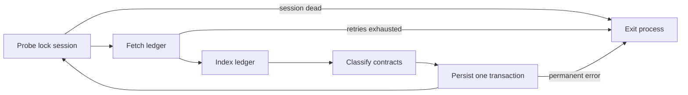
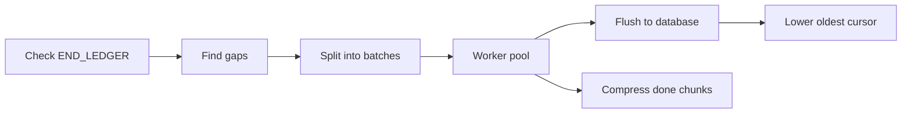
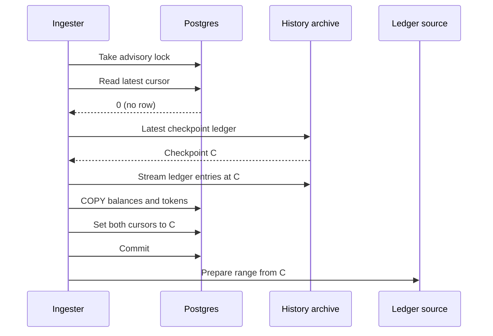

# Ingestion

For operators and contributors who need to know how a Stellar ledger becomes rows in the database. After reading, you can tell what the `ingest` process does at startup, what each cursor means, and why a process exited.

## Contents

- [Processes](#processes)
- [Live mode](#live-mode)
  - [Shutdown](#shutdown)
- [Backfill mode](#backfill-mode)
- [Ledger sources](#ledger-sources)
- [Cursors](#cursors)
- [Checkpoint bootstrap](#checkpoint-bootstrap)
- [Indexer](#indexer)
- [TimescaleDB policies the live ingester applies](#timescaledb-policies-the-live-ingester-applies)
- [Failure modes](#failure-modes)
- [Where in the code](#where-in-the-code)

## Processes

| Process | Command | Writes to the database | Instances |
| --- | --- | --- | --- |
| API server | `wallet-backend serve` | No. Reads only. | Any number |
| Live ingester | `wallet-backend ingest` with `INGESTION_MODE=live` (default) | Yes | One per network |
| Backfill | `wallet-backend ingest` with `INGESTION_MODE=backfill` | History tables and `oldest_ingest_ledger` only | Takes no lock. Runs next to the live ingester. |

The live ingester holds a PostgreSQL session-level advisory lock (`pg_try_advisory_lock`). The lock key is derived from the string `wallet-backend-ingest-` plus `NETWORK_PASSPHRASE`, so each network gets its own lock. A second live ingester for the same network fails to get the lock and exits with `advisory lock not acquired`.

Both modes serve `/health` and `/ingest-metrics` on `INGEST_SERVER_PORT`. Profiling endpoints under `/debug/pprof/` run on `ADMIN_PORT` when it is greater than 0.

## Live mode

Startup:

1. Open the database pool and apply the TimescaleDB settings listed under [TimescaleDB policies the live ingester applies](#timescaledb-policies-the-live-ingester-applies).
2. Take the advisory lock on a dedicated connection. That connection stays checked out for the life of the process.
3. Read `latest_ingest_ledger` from `ingest_store`.
4. If the value is 0 (no row), run the [checkpoint bootstrap](#checkpoint-bootstrap). The first ledger to ingest is the checkpoint ledger.
5. Otherwise, the first ledger to ingest is `latest_ingest_ledger + 1`.
6. Prepare the ledger source for an unbounded range starting at that ledger.

Each loop iteration handles one ledger:

- **Probe lock session.** Runs `SELECT 1` on the connection that holds the advisory lock. If that session is gone, the lock is gone too, and the process exits.
- **Fetch ledger.** Reads the ledger from the ledger source. Up to 10 attempts, with backoff doubling from 1 s to a 30 s cap.
- **Index ledger.** Runs the [indexer](#indexer) and fills an in-memory buffer.
- **Classify contracts.** Matches WASM uploads and contract deployments in the ledger against registered protocol validators. Any RPC calls (for example SEP-41 token metadata) happen here, before a database transaction opens. The database read in this step has its own 5-attempt retry.
- **Persist one transaction.** Writes everything for the ledger and advances `latest_ingest_ledger` in a single database transaction. If the transaction fails, nothing from the ledger is kept.

Write order inside the persist transaction:

1. `trustline_assets` rows referenced by this ledger.
2. `contract_tokens` rows for Stellar Asset Contracts (SAC) seen for the first time.
3. Protocol classification results, then `protocol_wasms`.
4. Protocol state, for each protocol whose cursor wins its compare-and-swap for this ledger.
5. `protocol_contracts`.
6. `transactions`, `transactions_accounts`, `operations`, `operations_accounts`, `state_changes` (PostgreSQL `COPY`).
7. Balance tables: `trustline_balances`, `native_balances`, `sac_balances`, `liquidity_pools`, `liquidity_pool_balances`.
8. `latest_ingest_ledger`, with a guarded update. It succeeds only if the stored value is this ledger or the one before it.

Persist retries and errors:

| Error | Handling |
| --- | --- |
| SQLSTATE class 22 (data exception), 23 (constraint violation), 42 (syntax or access rule) | Permanent. The process exits at once. |
| Guarded cursor update refused | Permanent. Another writer advanced the cursor. |
| Protocol cursor row missing after it existed | Permanent. |
| Row encoding failure during `COPY` | Permanent. |
| Anything else, including SQLSTATE 08, 40, 57P01, 57P02, 57P03 | Retried. Up to 5 attempts, backoff doubling from 1 s to a 10 s cap. |

When the live ingester exits with an error, restart it. It resumes from `latest_ingest_ledger + 1`.

Every 100 ledgers the loop rereads `oldest_ingest_ledger` for the metric and checks for protocol cursors that a `protocol-migrate` run created since startup.

### Shutdown

SIGINT or SIGTERM cancels the root context. The in-flight ledger's transaction rolls back, so that ledger is fetched again on the next start. In live mode this counts as a clean exit with status 0.

The live loop releases the advisory lock as it returns. If the unlock fails, the process destroys that connection so PostgreSQL ends the session and drops the lock. The process then stops its HTTP servers (10 s timeout), stops worker pools, closes the ledger source, and closes the database pool.

## Backfill mode

Backfill fills holes in history that live ingestion did not write. Run it with `INGESTION_MODE=backfill`, `START_LEDGER` greater than 0, and `END_LEDGER` at least `START_LEDGER`. Live mode rejects `START_LEDGER` and `END_LEDGER`.

- **Check END_LEDGER.** `END_LEDGER` must be at most `latest_ingest_ledger`. Otherwise backfill exits with an error.
- **Find gaps.** Backfill reads the oldest `ledger_number` in `transactions` and lists missing ledger numbers between it and `END_LEDGER`. It adds the range from `START_LEDGER` up to the oldest ledger when the request starts earlier. Gaps are clipped to `[START_LEDGER, END_LEDGER]`.
- **Split into batches.** Each gap is cut into batches of `BACKFILL_BATCH_SIZE` ledgers (default 250).
- **Worker pool.** `BACKFILL_WORKERS` batches run at once (default: number of CPUs). Each batch opens its own ledger source for a bounded range.
- **Flush to database.** Each batch writes to the database every `BACKFILL_DB_INSERT_BATCH_SIZE` ledgers (default 100). Each flush is one transaction with `synchronous_commit = off`.
- **Lower oldest cursor.** The last flush of a batch sets `oldest_ingest_ledger` to the lower of its current value and the batch's first ledger, in the same transaction.
- **Compress done chunks.** When a contiguous run of batches from the start has finished, backfill runs `compress_chunk` on uncompressed chunks that end inside that run. Backfill waits for compression to finish before it exits.

A ledger with no transactions has no row in `transactions`. Gap detection lists it as a gap, so backfill fetches it again and writes nothing.

Backfill writes only `transactions`, `transactions_accounts`, `operations`, `operations_accounts`, and `state_changes`, plus `oldest_ingest_ledger`. It does not write balance tables, protocol tables, or `latest_ingest_ledger`, and it does not change TimescaleDB policies. That is why it takes no advisory lock and can run while the live ingester runs.

A cancelled backfill exits with an error, not status 0. Rerun it with the same range; gap detection skips what was written.

## Ledger sources

Set the source with `LEDGER_BACKEND_TYPE`.

| | `rpc` (default) | `datastore` |
| --- | --- | --- |
| Reads from | Stellar RPC `getLedgers` at `RPC_URL` | Ledger files in an S3 bucket, as exported by Galexie |
| Required settings | `RPC_URL` | `DATASTORE_BUCKET_PATH`. Optional: `DATASTORE_REGION` (default `us-east-2`), `DATASTORE_ENDPOINT_URL` |
| Prefetch | `GET_LEDGERS_LIMIT` ledgers per call (default 10) | `DATASTORE_BUFFER_SIZE` files (default 100), downloaded by `DATASTORE_NUM_WORKERS` workers (default 10) |
| Retries inside the source | Waits when the requested ledger is past the RPC tip | Transient download errors: `DATASTORE_RETRY_LIMIT` (default 3), `DATASTORE_RETRY_WAIT` (default `5s`) |
| History reach | The RPC's retention window | Whatever the bucket holds |

The datastore source reads the file layout from the bucket's `.config.json` manifest. `DATASTORE_LEDGERS_PER_FILE` and `DATASTORE_FILES_PER_PARTITION` override it for a bucket without a manifest. Workers download and decode files in parallel, and a single goroutine hands them to the ingester in ledger order. On an unbounded range (live mode), a file that does not exist yet is awaited without limit. On a bounded range (backfill), a missing file is an error.

`RPC_URL` is required with either source. The ingester calls RPC for `/health` (`getHealth`) and to fetch contract metadata during protocol classification. `ARCHIVE_URL` is also required with either source, for the checkpoint bootstrap. See [Configuration](../configuration.md) for every setting.

## Cursors

Cursors live in the `ingest_store` table as key and text value pairs.

| Key | Meaning | Written by |
| --- | --- | --- |
| `latest_ingest_ledger` | Last ledger the live ingester committed. | Checkpoint bootstrap (set to the checkpoint ledger), then the live ingester on every ledger. |
| `oldest_ingest_ledger` | Lowest ledger the history tables cover. | Checkpoint bootstrap (set to the checkpoint ledger), backfill (moves it down only), and the `reconcile_oldest_cursor` job when retention is on (moves it up only). |
| `protocol_<ID>_history_cursor` | Last ledger whose protocol history rows are written for protocol `<ID>`. | `protocol-migrate history`, then the live ingester through compare-and-swap. |
| `protocol_<ID>_current_state_cursor` | Last ledger whose protocol current-state rows are written for protocol `<ID>`. | `protocol-migrate current-state`, then the live ingester through compare-and-swap. |

A missing key reads as 0. For each protocol cursor, the live ingester swaps the value from ledger `N-1` to `N` inside the ledger's transaction. Only when the swap succeeds does it write that protocol's rows. A protocol cursor that is behind the tip or missing is skipped. See [Protocol data migrations](../operations/data-migrations.md).

## Checkpoint bootstrap

On an empty database the live ingester has no history, but it still needs every account's current balances. It reads them from the Stellar history archive at `ARCHIVE_URL`.

The ingester asks the archive for its latest checkpoint ledger C and streams every live ledger entry at C. It then reads the archived (evicted) Soroban entries from the hot archive, when the checkpoint has one. Rows are written with `COPY` in batches of 250,000 entries. Everything, including setting `latest_ingest_ledger` and `oldest_ingest_ledger` to C, happens in one transaction. That transaction runs with `synchronous_commit = off` and `idle_in_transaction_session_timeout = 0`, so a server-wide idle timeout does not kill it.

| Table | Filled from |
| --- | --- |
| `native_balances` | Account entries |
| `trustline_balances`, `trustline_assets` | Trustline entries for classic assets |
| `liquidity_pool_balances` | Pool-share trustline entries |
| `liquidity_pools` | Liquidity pool entries |
| `contract_tokens` | SAC contract instances, live and archived |
| `sac_balances` | SAC balance entries held by contract addresses, kept only when the contract is a confirmed SAC |
| `protocol_wasms` | Contract code entries, live and archived |
| `protocol_contracts` | Contract instances whose WASM is in `protocol_wasms` |

Archived balance entries are skipped. Live ingestion writes their rows again when the entries are restored. The history tables start empty and fill from ledger C onward.

`CHECKPOINT_FREQUENCY` is the number of ledgers between archive checkpoints (default 64). Use 8 only for a test network that runs with accelerated time.

If the bootstrap fails, the transaction rolls back and the cursors stay unset. The next start runs the bootstrap again.

## Indexer

The indexer turns one ledger into rows held in memory. It processes the ledger's transactions in parallel on a pool of twice the number of CPUs. Each worker builds a result for one transaction with no shared state. The results are then merged into the ledger buffer one at a time, in transaction order.

For each transaction, the indexer produces:

| Output | Processor | Source |
| --- | --- | --- |
| Transaction row and its participants | `ParticipantsProcessor` | Transaction envelope and meta |
| Operation rows and their participants | `ParticipantsProcessor` | Operations in the envelope |
| State changes for account properties | `EffectsProcessor` | Operation effects |
| State changes for contract deployments | `ContractDeployProcessor` | Deploy operations |
| State changes for SAC events | `SACEventsProcessor` | Contract events |
| State changes for token transfers | `TokenTransferProcessor` | Token transfer events |
| Native balance changes | `AccountsProcessor` | Account entry changes and fee changes |
| Trustline balance changes | `TrustlinesProcessor` | Trustline entry changes |
| SAC balance changes | `SACBalancesProcessor` | Contract data entry changes |
| SAC contract metadata | `SACInstanceProcessor` | Contract instance entries |
| Pool-share balance changes | `LiquidityPoolSharesProcessor` | Pool-share trustline changes |
| Pool reserve changes | `LiquidityPoolsProcessor` | Liquidity pool entry changes |
| WASM hashes and bytecode | `ProtocolWasmProcessor` | Contract code entries |
| Contract-to-WASM mappings | `ProtocolContractsProcessor` | Contract instance entries |

A participant is an account linked to a transaction or operation. Participants become rows in `transactions_accounts` and `operations_accounts`. Contract events from successful `InvokeHostFunction` operations are kept in the buffer for protocol processors such as SEP-41.

Each state-change processor assigns IDs in its own numeric range, so IDs do not depend on processor order. The indexer checks those ranges at startup and refuses to start if two overlap.

## TimescaleDB policies the live ingester applies

The live ingester applies these settings on every start. Backfill does not. All of them apply to the five hypertables: `transactions`, `transactions_accounts`, `operations`, `operations_accounts`, `state_changes`.

| Setting | Default | Effect |
| --- | --- | --- |
| `CHUNK_INTERVAL` | `1 day` | `set_chunk_time_interval`. Affects chunks created after the change. |
| `RETENTION_PERIOD` | empty | Empty removes any retention policy. A value adds or updates a `drop_after` retention policy. |
| `COMPRESSION_SCHEDULE_INTERVAL` | empty | How often the compression job runs. Empty leaves it unchanged. |
| `COMPRESSION_COMPRESS_AFTER` | empty | How long after a chunk closes before it can be compressed. Empty leaves it unchanged. |
| `COMPRESSION_MAX_CHUNKS` | 0 | `maxchunks_to_compress` per job run. 0 leaves it unchanged (TimescaleDB default: no limit). |

The compression jobs come from the hypertable definitions in the migrations. The ingester only changes their schedule and config. Policies are updated in place when they differ, so job IDs and run history survive restarts.

When `RETENTION_PERIOD` is set, the ingester also creates the `reconcile_oldest_cursor` function and a job that runs it every hour on a fixed schedule. The job reads the oldest remaining ledger in `transactions` and raises `oldest_ingest_ledger` to it after retention drops chunks. It never lowers the cursor. When `RETENTION_PERIOD` is empty, the job is deleted.

## Failure modes

| Event | What the process does | What to do |
| --- | --- | --- |
| A second live ingester starts for the same network | The second one exits with `advisory lock not acquired`. The first keeps running. | Run one live ingester per network. |
| RPC tip is behind the network | The `rpc` source waits at the RPC tip. Ingestion runs only as fresh as the RPC. `/health` returns 503 when RPC `getHealth` reports unhealthy, and 500 when the RPC cannot be reached. | Fix the RPC node. |
| Ingester falls behind the RPC | `/health` returns 503 when the RPC's latest ledger minus `latest_ingest_ledger` is more than 50. | Check `wallet_ingestion_phase_duration_seconds` for the slow phase. |
| Next ledger is older than the RPC's retention window | The RPC rejects the request, the 10 fetch attempts fail, and the process exits. | Restart with `LEDGER_BACKEND_TYPE=datastore` until caught up, or use an RPC with longer retention. |
| Datastore buffer dead | A download worker ran out of retries. Every later read on that source fails, so the ingester exits at once without retrying. | Check bucket access, then restart. A restart builds a fresh buffer. |
| Database failover | The lock session dies on the server. The next lock probe fails and the process exits. If a second ingester advanced the cursor first, the guarded cursor update refuses the write. | Restart. Transient connection errors during persist are retried before that. |
| SIGINT or SIGTERM | The in-flight ledger rolls back. Live mode exits with status 0. | None. The next start refetches that ledger. |

## Where in the code

| Path | Role |
| --- | --- |
| `internal/ingest/ingest.go` | Builds dependencies, signal handling, shutdown order, HTTP servers |
| `internal/ingest/ledger_backend.go` | Picks the `rpc` or `datastore` ledger source |
| `internal/ingest/datastore_backend.go` | Parallel S3 download and decode, `ErrBufferDead` |
| `internal/ingest/timescaledb.go` | Chunk interval, retention, compression, and `reconcile_oldest_cursor` setup |
| `internal/services/ingest.go` | Ingest service, advisory lock key, history-table inserts |
| `internal/services/ingest_live.go` | Live startup, per-ledger loop, persist transaction, error classification |
| `internal/services/ingest_backfill.go` | Gap calculation, batches, progressive compression |
| `internal/services/checkpoint.go` | Checkpoint bootstrap from the history archive |
| `internal/services/token_ingestion.go` | Balance table upserts and deletes per ledger |
| `internal/indexer/indexer.go` | Per-ledger, per-transaction processing |
| `internal/indexer/processors/` | One processor per output kind |
| `internal/data/ingest_store.go` | Cursor reads and writes, gap query |
| `internal/db/utils.go` | Advisory lock acquire and release |
| `cmd/ingest.go` | `ingest` flags and their defaults |
