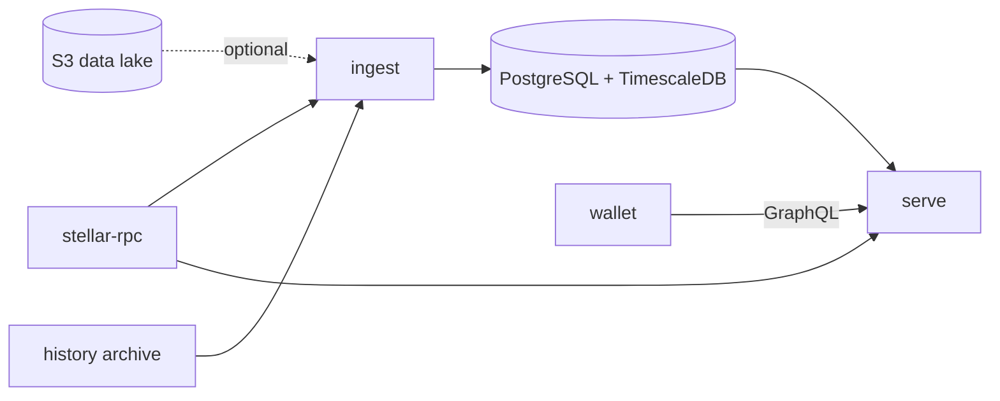
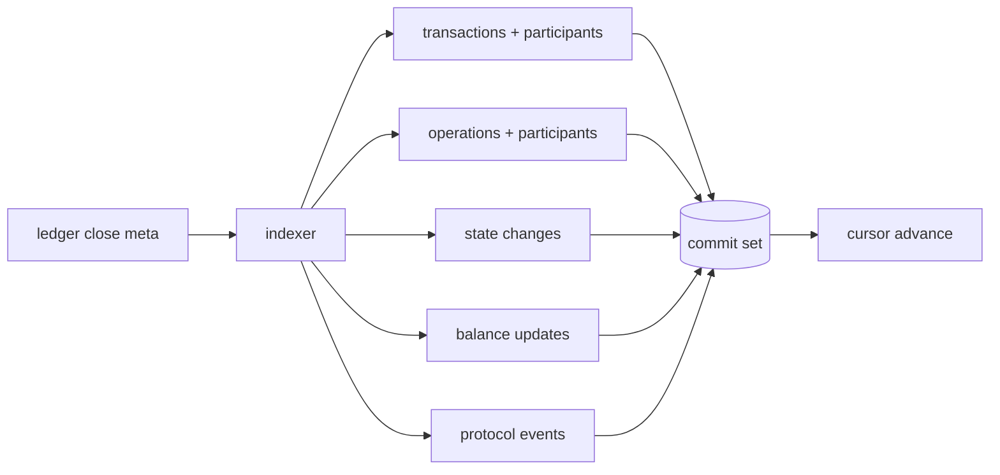

# Architecture overview

For anyone deciding whether to run wallet-backend or about to read the code. After reading it you know what the processes are, what they talk to, and where data flows.

## Contents

- [Processes](#processes)
- [Data flow for one ledger](#data-flow-for-one-ledger)
- [What is stored](#what-is-stored)
- [Serving](#serving)
- [Boundaries](#boundaries)
- [Repository map](#repository-map)

wallet-backend indexes the Stellar ledger for wallets. It keeps every transaction, operation and balance-affecting state change for every account, keeps current balances for every account and token it has seen, and serves them over GraphQL.

## Processes

One binary, several commands. `ingest` and `serve` run for as long as the deployment does; the others are one-shot.

| Command | Runs | Talks to | Exposes |
|---|---|---|---|
| `ingest` | one per network | RPC, history archive, optional data lake, database | `/health`, `/ingest-metrics` |
| `serve` | as many replicas as you need | database, RPC (`getHealth` only) | `/graphql/query`, `/health`, `/api-metrics` |
| `migrate up` | before the first start and after each upgrade | database | |
| `protocol-setup` | when a protocol is added after history was ingested | database, RPC | |
| `protocol-migrate` | after `protocol-setup`, to fill the protocol's history and current state | database, RPC or data lake | `/metrics` on `--metrics-port` |
| `version` | | | |

The history archive is read once, on first start, to load current balances at a checkpoint. From then on ledgers come from RPC (`getLedgers`) or from a Galexie-format data lake on S3. RPC is needed in both cases for health checks and for `simulateTransaction` calls that fetch token metadata.

## Data flow for one ledger

The indexer runs the transactions of a ledger in parallel, each producing rows for every table. The rows are written by a set of transactions that commit together, with the cursor advance strictly last, so a crash never serves a half-ingested ledger. Details in [ingestion](ingestion.md).

## What is stored

| Data | Shape | Page |
|---|---|---|
| Transactions, operations, and which accounts took part | TimescaleDB hypertables, 1-day chunks, columnstore | [database](database.md), [data model](data-model.md) |
| State changes: every effect of an operation on an account or contract, with a category and reason | hypertable | [state changes](state-changes.md) |
| Balances: native, classic assets, SAC, SEP-41, liquidity pool shares | plain tables keyed by holder and asset | [token tracking](token-tracking.md) |
| Protocol data (SEP-41 today) | per-protocol tables | [protocols](protocols.md) |

History can be bounded with `RETENTION_PERIOD`. Current state is complete for ledger-entry balances from the first start on; a protocol's tables (SEP-41) are complete only after its data migration has run, see [protocols](protocols.md).

## Serving

`serve` is stateless. It exposes three GraphQL root queries: `accountByAddress`, `transactionByHash`, `operationById`, each with connections for the related rows. Requests can be required to carry a JWT signed with a Stellar key. Details in [GraphQL serving](graphql-serving.md) and the [API guide](../api/graphql.md).

## Boundaries

| Concern | Where it lives |
|---|---|
| Building and submitting transactions | not here; use an SDK and RPC |
| Historical data older than what you ingested | backfill from a data lake, see [running](../operations/running.md) |
| Leader election for ingest | a database advisory lock; a second live ingester exits |
| Rate limiting, TLS, caching | your ingress or gateway |

## Repository map

| Path | Contents |
|---|---|
| `cmd/` | CLI commands and flag definitions |
| `internal/ingest/` | Ingest process wiring, ledger sources, TimescaleDB policies |
| `internal/services/` | Ingest loop, backfill, checkpoint bootstrap, token tracking, protocols, RPC client |
| `internal/indexer/` | Per-ledger processing and the processors that emit rows |
| `internal/data/` | Table models and queries |
| `internal/db/` | Connection pool, migrations |
| `internal/serve/` | HTTP server, GraphQL schema, resolvers, dataloaders, middleware |
| `internal/metrics/` | Prometheus metrics |
| `pkg/wbclient/` | Go client and request signer |
| `docs/` | This documentation |
