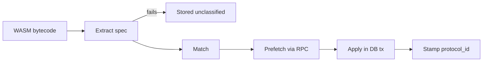
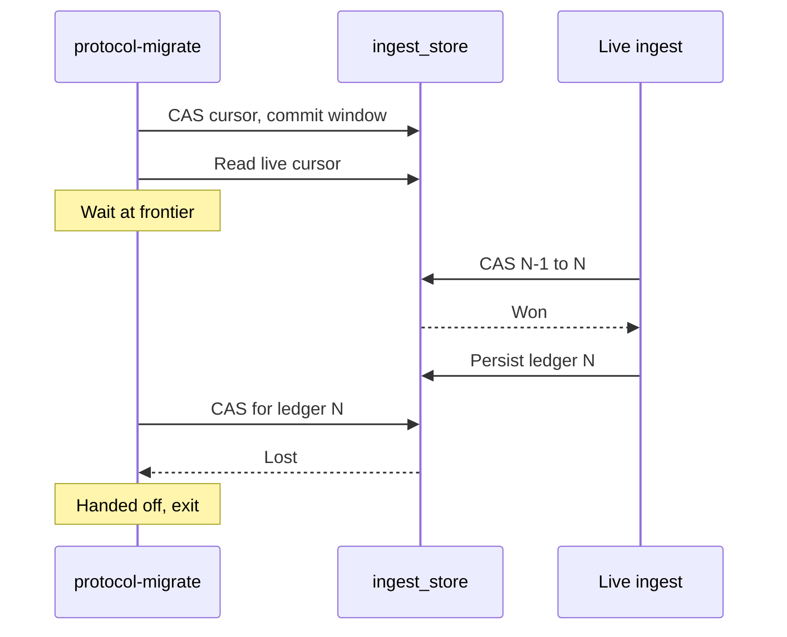

# Protocols and data migrations

For contributors adding a protocol and operators running a protocol migration. After reading it you can tell how wallet-backend recognizes a protocol's contracts, how it turns their activity into rows, and how a migration fills in history for a protocol added after ingestion started.

## What a protocol is here

A protocol is a family of Soroban contracts that share an interface. wallet-backend identifies the family by the WASM each contract runs, not by a list of addresses. Once a WASM hash belongs to a protocol, every contract deployed with that WASM belongs to it too, and the protocol's code decodes those contracts' events into rows.

Each protocol has two parts:

| Part | Interface | Job |
| --- | --- | --- |
| Validator | `ProtocolValidator` | Decides which WASMs belong to the protocol and writes per-contract metadata. |
| Processor | `ProtocolProcessor` | Turns ledger data for the protocol's contracts into history rows and current-state rows. |

SEP-41, the Soroban token interface, is the one protocol shipped. Its protocol ID is `SEP41`.

Four tables hold the shared protocol state:

| Table | Holds |
| --- | --- |
| `protocols` | One row per protocol, with `classification_status`, `history_migration_status` and `current_state_migration_status`. Each is `not_started`, `in_progress`, `success` or `failed`. |
| `protocol_wasms` | Every WASM hash seen, with `protocol_id` set once classified and NULL otherwise. |
| `protocol_contracts` | Every contract instance seen, with the WASM hash it runs. |
| `ingest_store` | The protocol cursors, next to live ingestion's own cursors. |

## Registration

A protocol is registered in two places: the database and the binary.

**Database.** Each protocol has an SQL file in `internal/db/migrations/protocols/`. The file inserts the protocol's row and must be idempotent:

```sql
INSERT INTO protocols (id) VALUES ('SEP41') ON CONFLICT (id) DO NOTHING;
```

The files are embedded in the binary. `migrate up` applies the schema migrations first, then runs every protocol file in alphabetical order inside one transaction. `protocol-setup` runs the same files again before it classifies. There is no tracking table for these files; idempotency is what makes rerunning them safe.

**Binary.** Each protocol lives in its own package. The package's `init()` calls `services.RegisterValidator` and `services.RegisterProcessor` with a factory for each. A blank import of the package runs `init()`. The SEP-41 package is blank-imported in three places: the ingest service, `protocol-setup` and `protocol-migrate`.

The registry is a plain map filled during `init()`. Adding a protocol needs a rebuild and a restart. Live ingestion builds a validator and a processor for every registered protocol at startup, sorted by protocol ID.

## Classification

Classification decides which WASMs belong to which protocol. It runs in two places:

- **Live ingestion**, for every ledger that uploads WASM code or deploys or upgrades a contract.
- **`protocol-setup`**, for WASMs already stored with a NULL `protocol_id`. It fetches their bytecode from RPC with `getLedgerEntries` in batches of 200. A WASM that RPC cannot return, because it expired or was evicted, is logged and skipped.



Legend:

- **Extract spec** compiles the WASM with wazero and decodes its `contractspecv0` custom section. Limits: 2 MiB of bytecode, 10 s to compile, 10,000 spec entries. Spec extraction runs once per WASM, shared by every validator.
- **Stored unclassified** covers a WASM whose spec cannot be read. Its `protocol_wasms` row keeps a NULL `protocol_id`.
- **Match** is a pure signature check against the spec entries. It makes no RPC or database calls.
- **Prefetch** makes the RPC calls the validator needs, such as token metadata. It runs before any database transaction opens. A failed fetch for one contract is logged and left out of the result.
- **Apply** writes the validator's rows inside the ledger's database transaction. It gets no RPC handle, so no network call happens while row locks are held.
- **Stamp protocol_id** writes the verdict to `protocol_wasms` in the same transaction.

Validators run in protocol ID order, and the first match wins. A WASM claimed by one protocol is removed from the candidates passed to the next. When two protocols' signatures overlap, the alphabetically earlier ID claims the WASM. Pick an added protocol's ID with that in mind.

Live ingestion builds the plan once per ledger, before the persist transaction opens, and reuses it across retries. A retry never repeats RPC calls.

Failures increment `wallet_ingestion_wasm_classification_failures_total`. Its `reason` label is `spec_extraction_error` or `validate_error`. Its `protocol_id` label is the validator that was running, or `unknown` when spec extraction failed first. The fix for an unclassified WASM is to rerun `protocol-setup`.

`protocol-setup` sets `classification_status` to `in_progress` at the start and to `success` or `failed` at the end. A protocol migration refuses to start until classification is `success`.

```bash
wallet-backend protocol-setup \
  --database-url <DATABASE_URL> \
  --rpc-url <RPC_URL> \
  --network-passphrase "<NETWORK_PASSPHRASE>" \
  --protocol-id SEP41
```

## Processing

During live ingestion each processor runs inside the same database transaction as the rest of the ledger.

For each protocol and each ledger `N`, live ingestion:

1. Tries a compare-and-swap (CAS) on the protocol's history cursor, from `N-1` to `N`.
2. Tries the same CAS on the protocol's current-state cursor.
3. Skips the protocol when neither CAS wins. That happens while a migration still owns the cursor.
4. Otherwise resets the processor, calls `ProcessLedger`, then calls `PersistHistory` if the history CAS won and `PersistCurrentState` if the current-state CAS won.

Live ingestion only tries a CAS on a cursor row that exists. It reads which rows exist at startup and checks the missing ones again every 100 ledgers. A protocol whose cursors were never created costs nothing per ledger. A cursor row that disappears after it existed is treated as an incident. The ledger's transaction fails with a permanent error rather than skipping the protocol.

The processor sees the protocol's contracts that emitted events in the ledger, plus contracts classified in the same ledger. A processor that returns true from `RequiresContractData` also gets the ledger's ContractData changes and the protocol's full contract list.

### Processor contract

| Rule | Why |
| --- | --- |
| `StateChangeOrdinalBase` returns a positive multiple of 2^40, unique per processor, never changed. | `state_changes` rows from different writers share an operation. Each writer numbers its rows inside its own range, so IDs never collide. The indexer uses base 0. SEP-41 uses 1 × 2^40. Startup fails on a zero, misaligned or duplicate base. |
| State changes within one transaction-and-operation group come out in the same order on every run. | `state_change_id` must be identical when a ledger is processed again. Sort a group by a deterministic key before assigning IDs if needed. |
| Folding many ledgers then persisting once gives the same rows as persisting each ledger. | A migration commits a window of ledgers at a time. A protocol that cannot meet this must be migrated with `--window-size=1`. |
| `WipeCurrentState` deletes only the protocol's current-state tables. | `contract_tokens`, `protocol_wasms` and `protocol_contracts` belong to classification, and nothing rebuilds them. |

### ProtocolDeps

Factories receive one `ProtocolDeps` value. Adding a protocol needs no extra wiring in `cmd/` or `internal/ingest/`.

| Field | Contents |
| --- | --- |
| `NetworkPassphrase` | The network passphrase. |
| `Models` | All data models. |
| `RPCService` | The RPC client. Nil in `protocol-migrate`, so factories must handle nil. |
| `ContractMetadataService` | Runs read-only contract calls through RPC simulation. Nil in `protocol-migrate` when no `--rpc-url` is set. |
| `MetricsService` | The Prometheus metrics. |

## Data migrations

A protocol added after ingestion started has no rows for the ledgers already ingested. A data migration replays those ledgers through the protocol's processor. Two migrations exist, one per cursor:

| Command | Builds | Starts at | Cursor |
| --- | --- | --- | --- |
| `protocol-migrate history` | `state_changes` rows for the protocol | `oldest_ingest_ledger` from `ingest_store` | `protocol_<id>_history_cursor` |
| `protocol-migrate current-state` | The protocol's current-state tables, such as balances | `--start-ledger`, required | `protocol_<id>_current_state_cursor` |

Current state is a running total of deltas. A current-state migration must start at or before the first ledger that touched any of the protocol's contracts, or the totals are wrong.

Order of operations:

1. Run `migrate up` with a binary that contains the protocol. This registers the protocol row.
2. Run live ingestion with that binary. Migrations depend on it to finish, as explained below.
3. Run `protocol-setup --protocol-id <ID>`.
4. Run `protocol-migrate history --protocol-id <ID>` and `protocol-migrate current-state --protocol-id <ID> --start-ledger <LEDGER>`.

```bash
wallet-backend protocol-migrate current-state \
  --database-url <DATABASE_URL> \
  --network-passphrase "<NETWORK_PASSPHRASE>" \
  --ledger-backend-type datastore \
  --datastore-bucket-path <BUCKET_PATH> \
  --protocol-id SEP41 \
  --start-ledger <LEDGER>
```

Shared flags for both subcommands:

| Flag | Default | Effect |
| --- | --- | --- |
| `--protocol-id` | none, required | Protocol to migrate. Repeatable. |
| `--window-size` | `100` | Ledgers folded into one commit. `0` or `1` commits every ledger. |
| `--ledger-backend-type` | `rpc` | `rpc` needs `--rpc-url`. `datastore` needs `--datastore-bucket-path` and reaches ledgers older than RPC retention. |
| `--get-ledgers-limit` | `10` | Ledgers per RPC request. Ignored for datastore. |
| `--metrics-port` | `0` | Serves Prometheus `/metrics` on this port. `0` disables it. |
| `--rebuild` | `false` | Wipes and rebuilds an already migrated protocol. See below. |

### How a run proceeds

1. **Validate.** Every protocol must have a registered processor, exist in `protocols` and have `classification_status = success`. A protocol whose status for this strategy is already `success` is skipped.
2. **Lock.** The run takes a PostgreSQL advisory lock per protocol and strategy, with `pg_try_advisory_lock` on one dedicated connection. If the lock is held, the run exits with an error. History and current-state use separate locks.
3. **Mark.** The strategy's status becomes `in_progress`.
4. **Initialize the cursor.** A missing cursor row is created at the start ledger minus one. Live ingestion sees the row within 100 ledgers.
5. **Fold.** Each ledger is fetched once and handed to every protocol in the run. Contract membership is reread at the start of every window, so contracts that live ingestion classifies during the run are included.
6. **Commit a window.** One transaction does a CAS on the cursor, from the window's start minus one to its end, and persists the folded rows. The transaction uses `synchronous_commit = off`, since a lost commit is replayed from the cursor.
7. **Hand off.** A failed CAS means live ingestion has taken the cursor. The window is discarded and that protocol is done.
8. **Mark.** Status becomes `success`. On error, protocols that already handed off are marked `success` and the rest `failed`.

A run that stops partway resumes from its cursor on the next run.

### Handoff with live ingestion

The two writers never coordinate directly. The cursor CAS decides which writer lands each ledger. A gate makes the migration wait for live ingestion at the tip.



Legend:

- **CAS cursor, commit window.** The migration commits its open window before it reads live ingestion's position. The protocol cursor then sits exactly at the last ledger the migration folded.
- **Read live cursor.** The migration folds ledger `N` only after live ingestion's `latest_ingest_ledger` reaches `N`. Live ingestion commits each ledger's contract classifications in the same transaction as that cursor. So the migration never folds a ledger whose classifications are not yet visible.
- **Wait at frontier.** At the tip the migration polls live ingestion's cursor every second. With live ingestion stopped, the migration waits here and does not finish.
- **CAS N-1 to N.** Live ingestion reaches `N`, finds the protocol cursor at `N-1`, and wins. From here on it writes the protocol's rows itself.
- **CAS for ledger N, Lost.** The migration's next commit expects `N-1` and finds `N`. It discards its window and marks the protocol handed off.

While the migration is behind, live ingestion's CAS fails on every ledger and it skips the protocol. Nothing is lost: the migration folds those ledgers later.

### Rebuild

`--rebuild` re-derives a protocol that has already been migrated. It is destructive: the protocol's data is empty or partial until the rebuild reaches the tip. It refuses to run while the strategy's status is `in_progress`, since that points to a dead run that needs a look first.

| Strategy | Wipe | Then |
| --- | --- | --- |
| `history --rebuild` | Resets the cursor to `oldest_ingest_ledger - 1` and the status to `not_started`. Then deletes the protocol's `state_changes` rows in its ID range, 10,000 ledgers per transaction. | A normal history run from the oldest ledger. |
| `current-state --rebuild` | One transaction resets the cursor to `--start-ledger - 1`, resets the status, and truncates the protocol's current-state tables. | A normal current-state run from `--start-ledger`. |

Both wipes run on the connection that holds the advisory lock. If that session dies, the wipe cannot commit under a lock another run has since taken.

The current-state wipe holds the cursor row lock that every live ledger transaction needs. Live ingestion stalls for all protocols until it commits. The transaction sets `lock_timeout = 5s`, so a long API read on the tables makes it fail fast. Rerun the rebuild when that happens. Both rebuilds are safe to rerun after a failure.

## SEP-41

**Match.** A WASM is SEP-41 when its spec has every function below with the exact argument names and types.

| Function | Inputs |
| --- | --- |
| `balance` | `id: Address` |
| `allowance` | `from: Address, spender: Address` |
| `decimals`, `name`, `symbol` | none |
| `approve` | `from: Address, spender: Address, amount: i128, expiration_ledger: u32` |
| `transfer` | `from: Address, to: Address, amount: i128`, or `to_muxed: MuxedAddress` in place of `to` |
| `transfer_from` | `spender: Address, from: Address, to: Address, amount: i128` |
| `burn` | `from: Address, amount: i128` |
| `burn_from` | `spender: Address, from: Address, amount: i128` |

Stellar Asset Contracts run no WASM, so they never classify as SEP-41. Their balances live in separate tables.

**Metadata.** Prefetch calls `name()`, `symbol()` and `decimals()` through RPC simulation, 20 contracts per batch with a 2 s pause between batches. Apply writes them to `contract_tokens` with `type = 'sep41'`. A contract whose metadata is already stored is never fetched again. A failed fetch is skipped for 5 minutes. Values are rejected when `decimals` is above 70, `name` is longer than 128 bytes, `symbol` is longer than 32 bytes, or a string is not valid UTF-8 or contains a NUL byte. A rejected or failed fetch still writes a default row, filled on a later classification pass.

**Events.** The processor reads events from contracts classified as SEP-41 and ignores the rest. Events from failed transactions never reach it.

| Event | Topics | Data | State change | Balance effect |
| --- | --- | --- | --- | --- |
| `transfer` | `from, to` | `i128`, or map with `amount` and `to_muxed_id` | `BALANCE` `DEBIT` for `from`, `BALANCE` `CREDIT` for `to` | `from` down, `to` up |
| `mint` | `to`, or `admin, to` | `i128`, or map with `amount` and `to_muxed_id` | `BALANCE` `MINT` | `to` up |
| `burn` | `from` | `i128`, or map with `amount` | `BALANCE` `BURN` | `from` down |
| `clawback` | `from`, or `admin, from` | `i128`, or map with `amount` | `BALANCE` `BURN` | `from` down |
| `approve` | `from, spender` | `[amount, live_until_ledger]`, or map with both | `ALLOWANCE` `UPDATE` | sets the allowance |

Map-form data must use Symbol keys, with no duplicates. Extra keys are allowed. A malformed event is logged and skipped, and the rest of the ledger still processes. Other events from a SEP-41 contract are ignored.

Events are folded in transaction order. That matters for `approve`, where the last write wins.

**Current-state tables.**

| Table | Key | Written as |
| --- | --- | --- |
| `sep41_balances` | `account_id, contract_id` | Deltas added to the stored balance on the server side. |
| `sep41_allowances` | `owner_id, spender_id, contract_id` | The latest `approve` replaces the row. An amount of 0 deletes it. Expired rows are deleted on each persist, and readers hide grants whose `expiration_ledger` has passed. |

Both tables reference `contract_tokens.id`. A current-state rebuild truncates both and leaves `contract_tokens` alone.

## Where in the code

| Path | Role |
| --- | --- |
| `internal/services/protocol_validator.go` | `ProtocolValidator` interface and `WasmSpecExtractor`. |
| `internal/services/protocol_validation_dispatch.go` | `PrepareClassification` and `ApplyClassificationPlan`: first-match-wins and the RPC/DB split. |
| `internal/services/protocol_processor.go` | `ProtocolProcessor` interface, staging modes, determinism rules. |
| `internal/services/protocol_deps.go` | `ProtocolDeps`. |
| `internal/services/validator_registry.go`, `processor_registry.go` | Registries and the ordinal base check. |
| `internal/db/migrations/protocols/` | Protocol registration SQL and its runner. |
| `internal/db/migrations/2026-03-09.0-protocols.sql`, `2026-03-09.1-protocol_wasms_and_contracts.sql` | Protocol tables. |
| `internal/services/protocol_setup.go` | `protocol-setup` classification. |
| `internal/services/ingest_live.go` | Live classification and the per-ledger protocol cursor CAS. |
| `internal/services/protocol_migrate.go` | Migration engine: fold loop, frontier gate, window commit, handoff. |
| `internal/services/protocol_migrate_history.go`, `protocol_migrate_current_state.go` | The two strategies. |
| `internal/services/protocol_migrate_lock.go` | Per-protocol, per-strategy advisory locks. |
| `internal/services/protocol_migrate_history_rebuild.go`, `protocol_migrate_current_state_rebuild.go` | `--rebuild`. |
| `internal/indexer/types/types.go` | `state_change_id` namespace bases. |
| `internal/services/sep41/` | SEP-41 validator, processor, event parsing, metadata fetch. |
| `internal/data/sep41/` | SEP-41 balance and allowance models, current-state wipe. |
| `cmd/protocol_setup.go`, `cmd/protocol_migrate.go` | CLI commands and flags. |
| `internal/metrics/migration.go` | `wallet_migration_*` metrics. |
