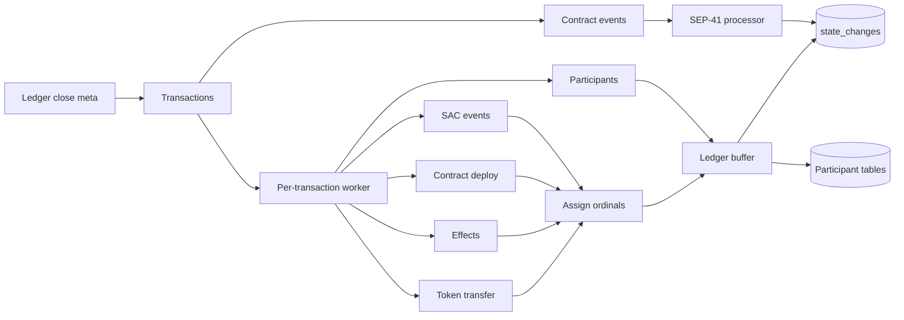

# State changes

For API consumers who read `stateChanges` fields, and for contributors who add or change a processor. After reading it you can tell which state change a ledger event produces, how rows are ordered, and who counts as a participant.

## Contents

- [What a state change is](#what-a-state-change-is)
- [Categories and reasons](#categories-and-reasons)
- [Processors](#processors)
- [Participants](#participants)
- [Fee and refund changes](#fee-and-refund-changes)
- [Querying](#querying)
- [Where in the code](#where-in-the-code)

## What a state change is

A state change is one row per effect on one account or contract. A payment produces two rows: a debit on the sender and a credit on the receiver. Every row lives in the `state_changes` hypertable. One wide row shape covers all categories, and each category fills only its own columns.

Rows are ordered by this key:

| Column | Meaning |
| --- | --- |
| `ledger_created_at` | Close time of the ledger |
| `to_id` | Transaction ID, built from ledger sequence and transaction index |
| `operation_id` | Operation ID, built from ledger, transaction, and operation index. 0 on transaction-fee rows. |
| `state_change_id` | Ordinal within one (`to_id`, `operation_id`) group |

One operation often yields several rows. The ordinal numbers them 1 to N in emission order, and emission order comes from the transaction meta. Re-ingesting the same ledger therefore yields the same IDs, and a duplicate insert fails on the primary key instead of writing duplicate rows.

Several emitters can write rows for the same operation. Each emitter adds its own base to the ordinal, so their IDs never collide.

| Emitter | Interface | `state_change_id` base |
| --- | --- | --- |
| Token transfer processor | `TokenTransferProcessorInterface` | `0` |
| Effects processor | `OperationProcessorInterface` | `1 << 28` |
| Contract deploy processor | `OperationProcessorInterface` | `2 << 28` |
| SAC events processor | `OperationProcessorInterface` | `3 << 28` |
| SEP-41 protocol processor | `ProtocolProcessor` | `1 << 40` |

The indexer owns the space below `1 << 40` and splits it per processor. Each protocol processor gets its own `1 << 40` block through `StateChangeOrdinalBase()`. Bases never change once rows exist. The indexer rejects a duplicate or malformed sub-base at startup.



Each transaction in a ledger runs on its own worker. The worker collects participants and runs the four indexer streams, and each stream gets its ordinals separately. Results fold into one ledger buffer, which writes `state_changes`, `transactions_accounts`, and `operations_accounts`. Contract events from successful transactions also go to the SEP-41 processor. That processor writes `state_changes` rows in the same database transaction, under its own base.

## Categories and reasons

| Category | Reason | Emitted when | GraphQL type |
| --- | --- | --- | --- |
| `BALANCE` | `DEBIT` | An account sends tokens. A transaction's net fee is charged (operation null). A holder loses tokens to a burn or clawback. An account deposits into a pool or creates a claimable balance. | `BalanceChange` |
| `BALANCE` | `CREDIT` | An account receives tokens, claims a claimable balance, or withdraws from a pool. | `BalanceChange` |
| `BALANCE` | `MINT` | An issuer sends its own classic asset (row on the issuer). A SEP-41 `mint` event (row on the receiver). | `BalanceChange` |
| `BALANCE` | `BURN` | A classic asset reaches its issuer, or the issuer claws it back (row on the issuer). A SEP-41 `burn` or `clawback` event (row on the holder). | `BalanceChange` |
| `ACCOUNT` | `CREATE` | `create_account` (row on the funded account). A contract deployment (row on the contract, creator is the deployer). | `AccountCreatedChange` |
| `ACCOUNT` | `MERGE` | `account_merge` (row on the merged account) | `AccountMergedChange` |
| `SIGNER` | `ADD` | A signer is added | `SignerAddedChange` |
| `SIGNER` | `UPDATE` | A signer's weight changes | `SignerUpdatedChange` |
| `SIGNER` | `REMOVE` | A signer is removed | `SignerRemovedChange` |
| `SIGNATURE_THRESHOLD` | `UPDATE` | A low, medium, or high threshold changes. One row per changed threshold. | `ThresholdChange` |
| `FLAGS` | `SET` | Account authorization flags are turned on | `AccountFlagsChange` |
| `FLAGS` | `CLEAR` | Account authorization flags are turned off | `AccountFlagsChange` |
| `HOME_DOMAIN` | `SET` | A home domain is set on an account that had none | `HomeDomainSetChange` |
| `HOME_DOMAIN` | `UPDATE` | A home domain is replaced by a different one | `HomeDomainUpdatedChange` |
| `HOME_DOMAIN` | `CLEAR` | A home domain is removed | `HomeDomainClearedChange` |
| `DATA_ENTRY` | `ADD` | `manage_data` creates an entry | `DataEntryAddedChange` |
| `DATA_ENTRY` | `UPDATE` | `manage_data` changes an entry's value | `DataEntryUpdatedChange` |
| `DATA_ENTRY` | `REMOVE` | `manage_data` deletes an entry | `DataEntryRemovedChange` |
| `ALLOWANCE` | `UPDATE` | A SEP-41 `approve` event | `AllowanceChange` |
| `TRUSTLINE` | `ADD` | A trustline is created, by `change_trust` or inside a contract call | `TrustlineAddedChange` |
| `TRUSTLINE` | `UPDATE` | A trustline's limit changes | `TrustlineUpdatedChange` |
| `TRUSTLINE` | `REMOVE` | A trustline is removed | `TrustlineRemovedChange` |
| `BALANCE_AUTHORIZATION` | `SET` | Trustline flags are turned on, a trustline is created with its initial flags, or a SAC `set_authorized` event authorizes a holder | `BalanceAuthorizationChange` |
| `BALANCE_AUTHORIZATION` | `CLEAR` | Trustline flags are turned off, or a SAC `set_authorized` event deauthorizes a holder | `BalanceAuthorizationChange` |

Any other (category, reason) pair has no GraphQL type, and the resolver returns an error for it. A home-domain write that keeps the same value emits nothing. Clawbacks have no reason of their own and appear as `BURN`. `BalanceAuthorizationChange.flags` is null for SAC contract holders, whose authorization is a single boolean.

A failed transaction emits only its fee row. The Stellar SDK returns only fee events for it, effects are empty, and the contract deploy processor skips it.

## Processors

| Processor | Input | Emits |
| --- | --- | --- |
| Token transfer (`TokenTransferProcessor`) | Token transfer events from the Stellar SDK for the whole transaction: fee, transfer, mint, burn, clawback. Events from a contract call count only for the native asset or when the contract is the asset's SAC. | `BALANCE` rows; `ACCOUNT` `CREATE` and `MERGE` for `create_account` and `account_merge` |
| Effects (`EffectsProcessor`) | Stellar effects derived from each successful operation's meta, plus the operation's ledger entry changes for old values | `SIGNER`, `SIGNATURE_THRESHOLD`, `FLAGS`, `HOME_DOMAIN`, `DATA_ENTRY`, `TRUSTLINE`, `BALANCE_AUTHORIZATION` |
| Contract deploy (`ContractDeployProcessor`) | Successful `invoke_host_function` operations that create contracts, at the top level or inside authorized sub-invocations | `ACCOUNT` `CREATE` on the contract address |
| SAC events (`SACEventsProcessor`) | `set_authorized` events from SAC contracts, and trustlines created by a contract call | `BALANCE_AUTHORIZATION`; `TRUSTLINE` `ADD` |
| SEP-41 (`ProtocolProcessor` for `SEP41`) | `transfer`, `mint`, `burn`, `clawback`, `approve` events from contracts classified as SEP-41 | `BALANCE`; `ALLOWANCE` `UPDATE` |

Other indexer processors read the same ledger changes but emit balances and contract records, not state changes. Those are the accounts, trustlines, SAC balances, SAC instances, liquidity pool, protocol WASM, and protocol contract processors. See [Token and balance tracking](token-tracking.md).

A processor that implements `OperationProcessorInterface` must return its rows in a fixed order derived from transaction meta, never from map iteration or goroutine timing. Ordinals are assigned from that order. It also returns its slot through `StateChangeSubBase()`. A row with an empty account is dropped before ordinals are assigned.

SEP-41 rows exist only after an operator runs `protocol-setup` and `protocol-migrate history`. Live ingestion writes SEP-41 rows for a ledger only once the protocol's history cursor exists. See [Protocol data migrations](../operations/data-migrations.md).

## Participants

A participant is an address that a transaction or operation is listed under. The ingest buffer writes participants to `transactions_accounts` and `operations_accounts`. `Account.transactions` and `Account.operations` read those tables.

| Who | `transactions_accounts` | `operations_accounts` |
| --- | --- | --- |
| Transaction source account | always | every operation of a failed transaction |
| Fee-bump fee account | always | every operation of a failed transaction |
| Accounts whose entry changes in the fee phase | always | no |
| Accounts whose entry changes in a successful operation's meta | yes | no |
| Operation source account | yes | successful transactions |
| Accounts named in the operation body, for example payment destinations, claimants, trustors, and clawback holders | yes | successful transactions |
| Sponsor of an entry or signer the operation creates | yes | successful transactions |
| Owner of each nonce entry a Soroban operation creates | yes | successful transactions |
| Account of an indexer state change | yes | yes, except on fee rows |

Every operation participant is also recorded as a participant of its transaction.

A Soroban operation's participants are its source account and the addresses that authorised it. The host writes a nonce entry only after a signature or a custom account's `__check_auth` passes, so each nonce owner is a verified authoriser. The declared authorization tree is not read. Its addresses are submitter input and can be forged.

For a failed transaction, operations list only the source account and the fee-bump account. Destinations, signer keys, and auth entries of a failed transaction are unverified input.

SEP-41 rows add no participants. The SEP-41 processor writes `state_changes` only. An address that only receives a SEP-41 transfer has the `BALANCE` `CREDIT` row in `Account.stateChanges`, but the transaction does not appear in its `Account.transactions`.

## Fee and refund changes

| Path | Rows written |
| --- | --- |
| State change | One `BALANCE` row per transaction, on the fee payer, for the native token. The amount is the net of every fee event, so Soroban refunds are subtracted from the charge. A net of zero writes no row. The row has `operation_id` 0 and a null `operation`. |
| Native balance | The fee charge and the post-apply refund both update `native_balances`. The refund comes from the post-apply fee changes that protocol 23 and later report after the whole transaction set applies. |

The fee row is a `BALANCE` `DEBIT` whenever the net is positive. Refunds never produce a separate row.

## Querying

| Field | Scope | Filters | Page size |
| --- | --- | --- | --- |
| `Account.stateChanges` | Rows whose account is this address | `filter` (`transactionHash`, `operationId`, `category`, `reason`, all ANDed), `since`, `until` | default 50, max 100 |
| `Transaction.stateChanges` | Every row from this transaction | none | default 50, max 100 |
| `Operation.stateChanges` | Every row from this operation | none | default 50, max 100 |
| `AccountTransactionEdge.stateChanges` | This account's rows in this transaction | none | unpaginated list |

Connections sort by `ledgerCreatedAt`, then transaction, operation, and ordinal, in ascending order. `first` pages forward from the oldest row. `last` pages back from the newest row, and the page still returns in ascending order. `AccountTransactionEdge.stateChanges` returns newest first. `since` and `until` bound ledger close time and let TimescaleDB skip chunks outside the range. A `first` or `last` above 100 returns a `BAD_USER_INPUT` error.

Query complexity is capped at 10000. A connection costs its page size times the cost of its selected fields, and an omitted `first` or `last` counts as 50. `AccountTransactionEdge.stateChanges` carries no page-size multiplier. A full-detail account-history page selects every state-change fragment, and a multiplier there would push it past the cap.

Select type-specific fields with inline fragments. `category` and `reason` are on every type.

```graphql
query AccountStateChanges($address: String!, $last: Int, $filter: AccountStateChangeFilterInput) {
  accountByAddress(address: $address) {
    stateChanges(last: $last, filter: $filter) {
      edges {
        cursor
        node {
          category
          reason
          ledgerNumber
          ledgerCreatedAt
          transaction { hash }
          operation { id }
          ... on BalanceChange { tokenId amount toMuxedId }
          ... on AllowanceChange { tokenId spender amount expirationLedger }
        }
      }
      pageInfo { hasPreviousPage startCursor }
    }
  }
}
```

```json
{ "address": "<G_OR_C_ADDRESS>", "last": 20, "filter": { "category": "BALANCE" } }
```

```bash
curl -s -X POST http://localhost:8001/graphql/query \
  -H 'Content-Type: application/json' \
  -H "Authorization: Bearer <TOKEN>" \
  -d '{"query":"query AccountStateChanges($address: String!, $last: Int, $filter: AccountStateChangeFilterInput) { accountByAddress(address: $address) { stateChanges(last: $last, filter: $filter) { edges { cursor node { category reason ledgerNumber ... on BalanceChange { tokenId amount } } } pageInfo { hasPreviousPage startCursor } } } }","variables":{"address":"<G_OR_C_ADDRESS>","last":20,"filter":{"category":"BALANCE"}}}'
```

Send the `Authorization` header only when the server sets `CLIENT_AUTH_PUBLIC_KEYS`. See [Authentication](../api/authentication.md).

```json
{
  "data": {
    "accountByAddress": {
      "stateChanges": {
        "edges": [
          {
            "cursor": "<CURSOR>",
            "node": {
              "category": "BALANCE",
              "reason": "DEBIT",
              "ledgerNumber": 123456,
              "tokenId": "<C_ADDRESS>",
              "amount": "<AMOUNT>"
            }
          }
        ],
        "pageInfo": { "hasPreviousPage": true, "startCursor": "<CURSOR>" }
      }
    }
  }
}
```

The full field list for every state-change type is in the [GraphQL schema reference](../api/schema.md).

## Where in the code

| Path | Role |
| --- | --- |
| `internal/indexer/types/types.go` | `StateChange` struct, category and reason enums, ID bases, `AssignStateChangeOrdinals` |
| `internal/indexer/indexer.go` | Per-transaction workers, processor registry, per-stream ordinal assignment |
| `internal/indexer/indexer_buffer.go` | Ledger buffer and participant recording |
| `internal/indexer/processors/token_transfer.go` | `BALANCE` rows, net fee row, account create and merge |
| `internal/indexer/processors/effects.go` | Signer, threshold, flag, home domain, data entry, and trustline rows |
| `internal/indexer/processors/contract_deploy.go` | Contract `ACCOUNT` `CREATE` rows |
| `internal/indexer/processors/contracts/sac.go` | SAC `set_authorized` and contract-created trustline rows |
| `internal/indexer/processors/participants.go` | Transaction and operation participants, Soroban authorisers |
| `internal/indexer/processors/transaction_operation_wrapper.go` | Participants named in each operation body |
| `internal/indexer/processors/accounts.go` | Fee charge and post-apply refund for native balances |
| `internal/services/protocol_processor.go` | `ProtocolProcessor` interface and ordering contract |
| `internal/services/sep41/processor.go` | SEP-41 `BALANCE` and `ALLOWANCE` rows |
| `internal/data/statechanges.go` | Inserts and paginated reads on `state_changes` |
| `internal/serve/graphql/resolvers/utils.go` | (category, reason) to GraphQL type mapping, page-size caps |
| `internal/serve/serve.go` | Complexity accounting |
| `internal/serve/graphql/schema/statechange.graphqls` | State-change types |
