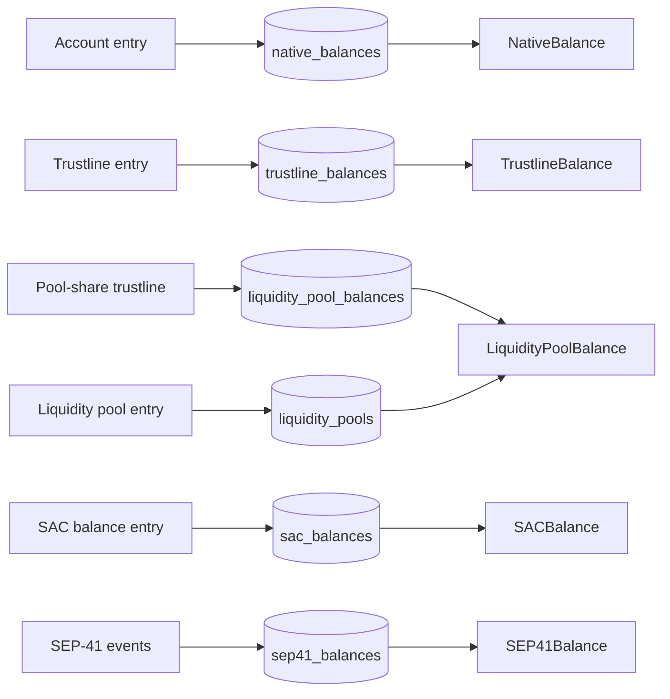
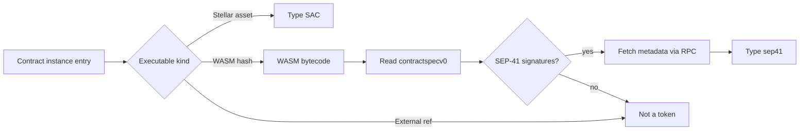

# Token and balance tracking

For API consumers who read `accountByAddress.balances`, and for contributors who change how balances are ingested. After reading it you can tell which balance kinds an address can return, where each value comes from, and when a field can be empty or missing.

## Contents

- [Balance kinds](#balance-kinds)
- [How each kind stays current](#how-each-kind-stays-current)
- [SAC vs SEP-41 classification](#sac-vs-sep-41-classification)
  - [SAC detection](#sac-detection)
  - [SEP-41 detection](#sep-41-detection)
  - [Metadata fetch](#metadata-fetch)
  - [`contract_tokens.type` values](#contract_tokenstype-values)
- [Decimals, symbols, and metadata](#decimals-symbols-and-metadata)
- [What is not tracked](#what-is-not-tracked)
- [Reading balances](#reading-balances)
- [Where in the code](#where-in-the-code)

## Balance kinds

`accountByAddress` accepts a G-address (account) or a C-address (contract). Muxed M-addresses fail address validation and return an `INVALID_ADDRESS` error.

| Kind | Holder address kinds | Source of truth | Table | GraphQL type |
| --- | --- | --- | --- | --- |
| Native XLM | G | Account ledger entry | `native_balances` | `NativeBalance` (`NATIVE`) |
| Classic asset | G | Trustline ledger entry, excluding pool-share trustlines | `trustline_balances`, `trustline_assets` | `TrustlineBalance` (`CLASSIC`) |
| Stellar Asset Contract (SAC) | C | Contract data entry keyed `["Balance", holder]` on a contract whose instance entry is a Stellar asset | `sac_balances`, `contract_tokens` | `SACBalance` (`SAC`) |
| SEP-41 token | G or C | `transfer`, `mint`, `burn`, `clawback` contract events from a contract classified as SEP-41 | `sep41_balances`, `contract_tokens` | `SEP41Balance` (`SEP41`) |
| Liquidity pool share | G | Pool-share trustline for shares, liquidity pool entry for reserves | `liquidity_pool_balances`, `liquidity_pools` | `LiquidityPoolBalance` (`LIQUIDITY_POOL`) |

A G-address holds a classic asset on its trustline, so its SAC holdings appear as `TrustlineBalance`. `SACBalance` rows exist only for contract holders.



Each row reads left to right: the ledger input, the table that holds the current value, and the GraphQL type that exposes it. Liquidity pool balances join two tables at query time: the account's shares and the pool's reserves. Every ledger-entry kind stores the absolute value from the entry. SEP-41 is the only kind built from events, by summing signed amounts.

## How each kind stays current

Live ingestion writes the ledger-entry balance tables (native, classic, SAC, liquidity pool) and, once the protocol's cursor exists, the SEP-41 tables. `protocol-migrate current-state` fills the SEP-41 tables for ledgers ingested before that. Backfill writes transactions, operations, and state changes, and never touches balances. On an empty database, live ingestion first loads the ledger-entry balances from the history archive's latest checkpoint (SEP-41 balances are not in the archive), then applies each ledger's changes in the same persist commit set as that ledger's history rows.

| Kind | Live update | Checkpoint bootstrap |
| --- | --- | --- |
| Native XLM | Account entry changes from each operation, the fee charge, and the post-apply Soroban fee refund. A change that touches only signers is skipped. A removed entry (account merge) deletes the row. | Every account entry. |
| Classic asset | Trustline entry changes. A removed trustline deletes the row. Each asset seen gets a `trustline_assets` row. | Every non-pool-share trustline, plus one `trustline_assets` row per asset. |
| SAC | Contract data balance entries with a C-address holder. The upsert keeps a row only when `contract_tokens` already has the contract with type `SAC`. | Balance-shaped entries, kept only for contracts whose instance entry confirms a SAC. |
| SEP-41 | Signed deltas from `transfer`, `mint`, `burn`, and `clawback` events, added to the stored balance in SQL. Rows that reach zero are deleted. | Not loaded. See below. |
| Liquidity pool share | Pool-share trustline changes for shares. Constant-product pool entry changes for reserves. | Every pool-share trustline and every constant-product pool entry. |

Within one ledger, several operations can touch the same balance. The ingest buffer keeps the last change per key. For native XLM the order is fee charge, then operations, then the post-apply refund, which matches the order stellar-core applies them.

`NativeBalance.minimumBalance` is computed, not read. The formula is `(2 + numSubentries + numSponsoring - numSponsored) * baseReserve`, with the base reserve fixed at 0.5 XLM in code. Every other numeric field is read from the ledger entry or the event.

SEP-41 balances and SEP-41 history fill only after an operator runs `protocol-setup` and `protocol-migrate current-state` (and `protocol-migrate history` for state changes). Live ingestion writes SEP-41 rows for a ledger only once the protocol's cursors exist. Until then `SEP41Balance` never appears. See [Protocol data migrations](../operations/data-migrations.md).

## SAC vs SEP-41 classification

A contract becomes a token in one of two ways: its instance entry says it is a SAC, or its WASM passes the SEP-41 signature check.



The instance entry's executable decides the first branch. A SAC gets its metadata from the instance entry itself. A WASM contract is matched by its interface spec, then enriched over RPC. A CAP-85 external-ref executable has no WASM hash and stays unclassified.

### SAC detection

The SAC instance processor reads contract instance entries and decodes the wrapped asset. It writes a `contract_tokens` row with code, issuer, name `CODE:ISSUER`, symbol equal to the code, and decimals 7. No RPC call is involved. The checkpoint bootstrap does the same for every SAC instance in the archive.

### SEP-41 detection

1. The protocol WASM processor records the bytecode of every uploaded contract code entry. The protocol contracts processor maps each WASM contract instance to its WASM hash.
2. Classification runs once per ledger during live ingestion, and once over existing contracts when an operator runs `protocol-setup`.
3. The spec extractor compiles the WASM with wazero and reads its `contractspecv0` custom section. A WASM whose spec cannot be read is dropped from matching and stays unclassified.
4. Validators run in lexicographic protocol-ID order. The first validator to match a WASM claims it. SEP-41 is the only registered validator.
5. The SEP-41 match requires every function below, with exact parameter names, types, and order.

| Function | Inputs | Output |
| --- | --- | --- |
| `balance` | `id: Address` | `i128` |
| `allowance` | `from: Address`, `spender: Address` | `i128` |
| `decimals` | none | `u32` |
| `name` | none | `String` |
| `symbol` | none | `String` |
| `approve` | `from: Address`, `spender: Address`, `amount: i128`, `expiration_ledger: u32` | none |
| `transfer` | `from: Address`, `to: Address`, `amount: i128`, or `from: Address`, `to_muxed: MuxedAddress`, `amount: i128` | none |
| `transfer_from` | `spender: Address`, `from: Address`, `to: Address`, `amount: i128` | none |
| `burn` | `from: Address`, `amount: i128` | none |
| `burn_from` | `spender: Address`, `from: Address`, `amount: i128` | none |

### Metadata fetch

For each claimed contract, the validator calls `name()`, `symbol()`, and `decimals()` through RPC `simulateTransaction`. The fetch runs before the ledger's database transaction opens, so no RPC call holds row locks.

| Setting | Value |
| --- | --- |
| Parallel fetches per batch | 20 contracts |
| Pause between batches | 2 s |
| Attempts per call on a transient RPC error | 3, with 200 ms then 400 ms backoff |
| Skip after a failed fetch | 5 min |

Transient errors are matched by message: latency, timeout, connection refused or reset, temporarily unavailable, too many requests. Any other error fails the contract on the first attempt. A contract whose `contract_tokens` row already has a name is not fetched again.

### `contract_tokens.type` values

| Value | Written by |
| --- | --- |
| `SAC` | SAC instance processor and checkpoint bootstrap |
| `sep41` | SEP-41 validator |
| `UNKNOWN` | Checkpoint bootstrap, for every WASM contract instance it finds |

A contract stored as `UNKNOWN` at bootstrap keeps that type until a SEP-41 metadata fetch succeeds for it.

Token transfer events from a contract call are recorded only for the native asset or when the contract is the SAC of the event's asset. Events from SEP-41 contracts go through the SEP-41 processor. Events from any other contract produce no balance and no state change.

## Decimals, symbols, and metadata

| Kind | Amount format | `decimals` | Code, issuer, name, symbol |
| --- | --- | --- | --- |
| Native XLM | Decimal string with 7 places | not exposed | not exposed |
| Classic asset | Decimal string with 7 places | not exposed | `code`, `issuer` from the trustline asset. `assetType` is `CREDIT_ALPHANUM4` for codes up to 4 characters, else `CREDIT_ALPHANUM12`. |
| SAC | Decimal string with 7 places | always 7 | `code`, `issuer` from the instance entry |
| SEP-41 | Integer string in the token's smallest unit | from `decimals()` | `name`, `symbol` from the contract |
| Liquidity pool share | Decimal string with 7 places | not exposed | `reserves[].asset` is `native` or `CODE:ISSUER` |

Divide a SEP-41 `balance` by `10^decimals` to get display units.

SEP-41 metadata is missing in these cases:

- **The fetch has not succeeded yet.** `name` and `symbol` are null and `decimals` is 0.
- **The contract returned a value out of bounds.** `decimals` above 70, `name` over 128 bytes, or `symbol` over 32 bytes is rejected. So is a string with invalid UTF-8 or a NUL byte. The null defaults stay.
- **RPC was unreachable.** The classification still commits with defaults, and a later ledger that touches the contract retries the fetch.

`tokenId` is always a C-address, except for liquidity pool shares, where it is the hex pool ID. For native XLM and classic assets it is the asset's SAC contract ID, derived from the asset and the network passphrase.

## What is not tracked

| Item | Detail |
| --- | --- |
| Native XLM held by a contract | The SAC extractor skips the native asset contract, and `native_balances` covers G-addresses only. A C-address never returns a `NativeBalance`. |
| Claimable balances | No table and no balance type. Creating or claiming one produces only the creator's debit or the claimer's credit as a state change. |
| Offers | No table. Amounts locked in offers appear only as `buyingLiabilities` and `sellingLiabilities`. |
| Non-SEP-41 contract tokens | A WASM contract that fails the signature check has no balance rows, even when it emits transfer-shaped events. |
| Muxed M-addresses as holders | Balances are stored per G- or C-address. SEP-41 transfer and mint events carry a CAP-67 destination memo as `toMuxedId` on the state change only. |
| Balances during backfill | Backfill never writes balance tables. |

## Reading balances

`Account.balances` is one Relay connection over all sources. Sources come in a fixed order, and each source pages by its own key.

| Address | Source order | Key within a source |
| --- | --- | --- |
| G | native, classic, SEP-41, liquidity pool | Asset UUID, contract UUID, or pool ID |
| C | SAC, SEP-41 | Contract UUID |

The UUIDs are deterministic hashes of the asset or contract, so the order inside a source is stable but not alphabetical. Pages default to 50 items, and `first` or `last` above 100 returns a `BAD_USER_INPUT` error. Cursors are opaque, versioned strings that name their source. A cursor from a G-address page fails on a C-address.

An address with no ledger state returns an empty connection, not an error. Query complexity for `balances` is the page size times the cost of the selected fields.

`Account.sep41Allowances` lists active SEP-41 `approve()` grants made by the address. Grants whose expiration ledger is below the latest ingested ledger are hidden.

```graphql
query Balances($address: String!, $first: Int, $after: String) {
  accountByAddress(address: $address) {
    balances(first: $first, after: $after) {
      edges {
        cursor
        node {
          balance
          tokenId
          tokenType
          ... on NativeBalance { minimumBalance sellingLiabilities }
          ... on TrustlineBalance { code issuer isAuthorized }
          ... on SACBalance { code issuer decimals }
          ... on SEP41Balance { name symbol decimals }
          ... on LiquidityPoolBalance { reserves { asset amount } }
        }
      }
      pageInfo { hasNextPage endCursor }
    }
  }
}
```

```json
{ "address": "<G_OR_C_ADDRESS>", "first": 20 }
```

```bash
curl -s -X POST http://localhost:8001/graphql/query \
  -H 'Content-Type: application/json' \
  -H "Authorization: Bearer <TOKEN>" \
  -d '{"query":"query Balances($address: String!, $first: Int, $after: String) { accountByAddress(address: $address) { balances(first: $first, after: $after) { edges { cursor node { balance tokenId tokenType ... on SEP41Balance { name symbol decimals } } } pageInfo { hasNextPage endCursor } } } }","variables":{"address":"<G_OR_C_ADDRESS>","first":20}}'
```

Send the `Authorization` header only when the server sets `CLIENT_AUTH_PUBLIC_KEYS`. See [Authentication](../api/authentication.md).

```json
{
  "data": {
    "accountByAddress": {
      "balances": {
        "edges": [
          {
            "cursor": "<CURSOR>",
            "node": {
              "balance": "<DECIMAL_STRING>",
              "tokenId": "<C_ADDRESS>",
              "tokenType": "NATIVE"
            }
          }
        ],
        "pageInfo": { "hasNextPage": false, "endCursor": "<CURSOR>" }
      }
    }
  }
}
```

## Where in the code

| Path | Role |
| --- | --- |
| `internal/indexer/processors/accounts.go` | Native balance changes, fee and refund phases, minimum balance formula |
| `internal/indexer/processors/trustlines.go` | Classic trustline changes, skips pool-share trustlines |
| `internal/indexer/processors/sac_balances.go` | SAC balance entries for contract holders |
| `internal/indexer/processors/sac_instances.go` | SAC detection and metadata from instance entries |
| `internal/indexer/processors/liquidity_pools.go` | Pool shares and pool reserves |
| `internal/indexer/processors/protocol_wasms.go` | Captures WASM bytecode for classification |
| `internal/indexer/processors/protocol_contracts.go` | Maps contract instances to WASM hashes |
| `internal/indexer/processors/token_transfer.go` | Drops token events from non-SAC contracts |
| `internal/services/checkpoint.go` | Checkpoint bootstrap of the ledger-entry balance tables (archived entries skipped, no SEP-41) and `contract_tokens` |
| `internal/services/token_ingestion.go` | Live upserts and deletes for ledger-entry balances |
| `internal/services/protocol_validator.go` | WASM spec extraction with wazero |
| `internal/services/protocol_validation_dispatch.go` | First-match-wins classification across validators |
| `internal/services/contract_metadata.go` | RPC simulation with retries |
| `internal/services/sep41/validator.go` | SEP-41 signature check and `contract_tokens` writes |
| `internal/services/sep41/metadata.go` | Metadata batches, bounds, and failure skip |
| `internal/services/sep41/processor.go` | SEP-41 balance deltas from events |
| `internal/data/sep41/balances.go` | Delta apply and zero-row cleanup |
| `internal/data/sac_balances.go` | SAC upsert gated on `contract_tokens.type = 'SAC'` |
| `internal/serve/graphql/resolvers/account_balances.go` | Multi-source balance connection and cursors |
| `internal/serve/graphql/resolvers/account_balances_utils.go` | Amount formatting and `tokenId` derivation |
| `internal/serve/graphql/schema/balances.graphqls` | Balance types |
