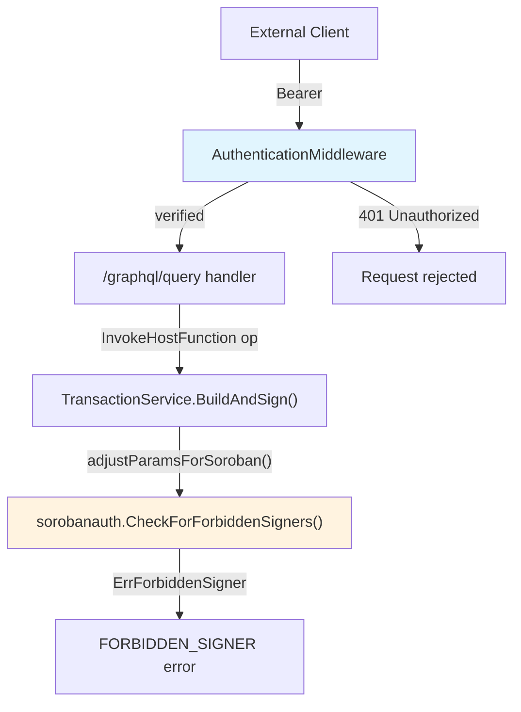
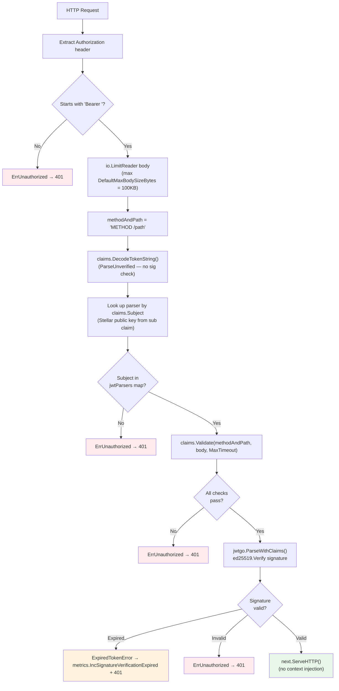
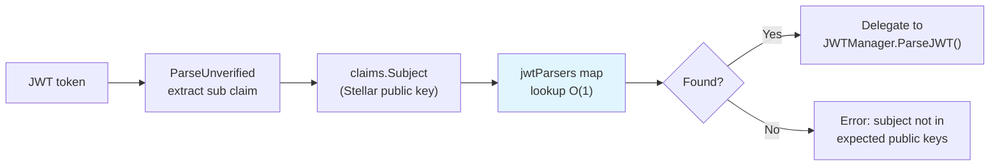
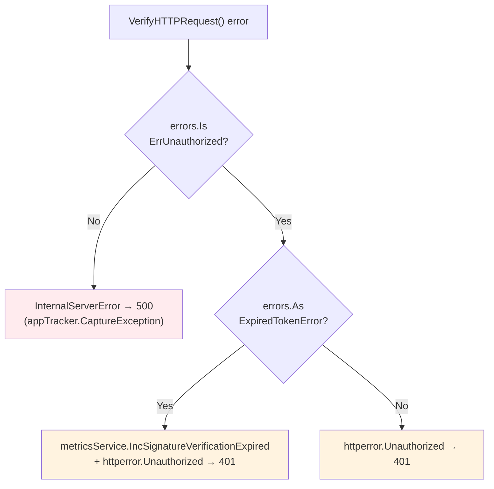
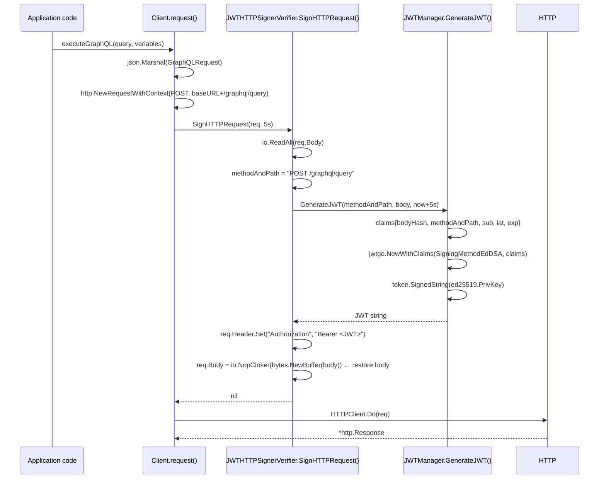
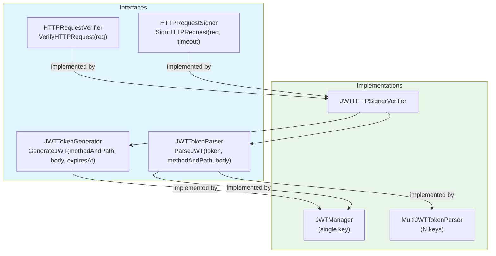
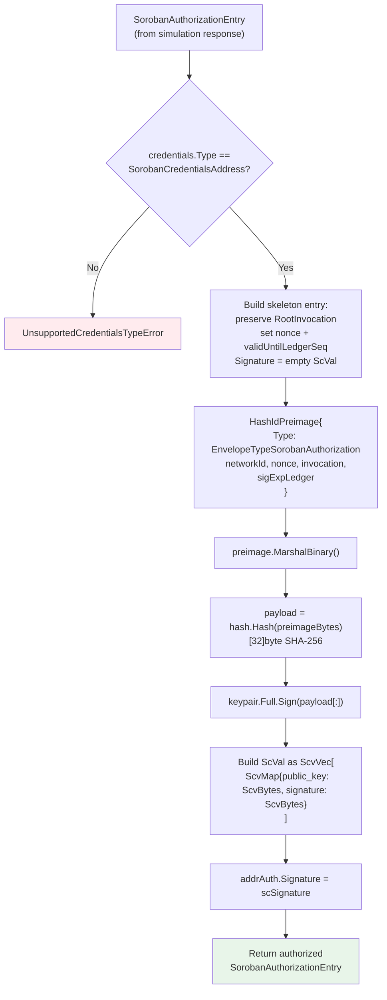
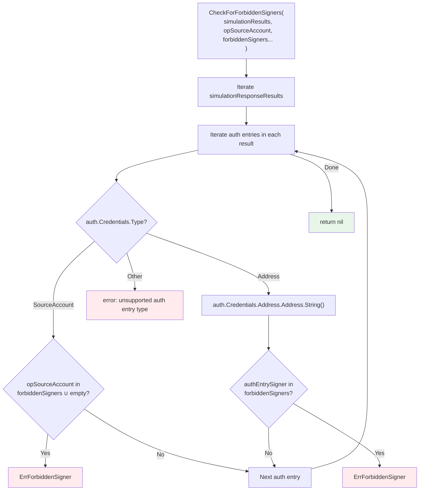

# Authentication Architecture

The wallet-backend uses two independent authentication systems:

1. **HTTP request authentication** — JWT/Ed25519-based middleware that gates the GraphQL API. Clients sign every HTTP request with a per-request JWT; the server verifies the Ed25519 signature against a configured set of public keys.
2. **Soroban contract invocation auth** — XDR-level authorization entries required when invoking smart contracts. Distinct from HTTP auth; operates on transaction envelopes.

## High-Level Overview

**Key source files:**
- `internal/serve/middleware/middleware.go` — `AuthenticationMiddleware`
- `internal/serve/serve.go` — wiring, conditional auth enable/disable
- `pkg/wbclient/auth/` — JWT generation, parsing, HTTP signing/verifying
- `pkg/sorobanauth/sorobanauth.go` — `AuthSigner`, `CheckForForbiddenSigners`

---

## Auth Flow (Server-Side Middleware)

### Request Verification Pipeline

Every authenticated request passes through `AuthenticationMiddleware` → `JWTHTTPSignerVerifier.VerifyHTTPRequest()` → `MultiJWTTokenParser.ParseJWT()`.

### Multi-Key O(1) Routing

`MultiJWTTokenParser` supports multiple authorized clients without scanning every key:

The Subject-as-key pattern lets the server verify the token with the exact right key without trying all registered keys. The public key itself acts as the lookup index.

### Error Classification

### Claims Validation Rules

`customClaims.Validate()` enforces all of these before the signature is checked:

| Check | Rule | Error |
|-------|------|-------|
| `exp` present | `ExpiresAt != nil` | "JWT expiration is not set" |
| `iat` present | `IssuedAt != nil` | "JWT issuance time is not set" |
| Expiry window (absolute) | `exp <= now + MaxTimeout` | "JWT expiration is too long" |
| Expiry window (relative) | `exp - iat <= MaxTimeout` | "difference between exp and iat is too long" |
| Subject format | `IsValidEd25519PublicKey(sub)` | "JWT subject is not a valid Stellar public key" |
| Method+path binding | `claims.MethodAndPath == "METHOD /path"` | "JWT method-and-path does not match" |
| Body hash | `SHA-256(body) == claims.bodyHash` | "JWT hashed body does not match" |

The body hash prevents replay attacks: a token signed for `POST /graphql/query` with body `X` cannot be reused for the same endpoint with body `Y`.

### JWT Claims Schema

| Field | JSON key | Type | Description |
|-------|----------|------|-------------|
| `BodyHash` | `bodyHash` | `string` | `hex(SHA-256(request body))` |
| `MethodAndPath` | `methodAndPath` | `string` | e.g. `"POST /graphql/query"` |
| `Subject` | `sub` | `string` | Stellar Ed25519 public key (G...) |
| `IssuedAt` | `iat` | `NumericDate` | Token creation time |
| `ExpiresAt` | `exp` | `NumericDate` | Token expiry time |

### Server Configuration

| Config field | CLI flag | Default | Description |
|---|---|---|---|
| `ClientAuthPublicKeys` | `--client-auth-public-keys` | (empty = disabled) | Comma-separated Stellar public keys |
| `ClientAuthMaxTimeoutSeconds` | `--client-auth-max-timeout-seconds` | `15` | Maximum `exp - iat` window |
| `ClientAuthMaxBodySizeBytes` | `--client-auth-max-body-size-bytes` | `102400` (100KB) | Body size cap for verification |

**Auth is optional:** if `ClientAuthPublicKeys` is empty, `RequestAuthVerifier` is `nil` and the middleware is not mounted. The `/health` and `/api-metrics` routes are always unauthenticated.

### Constants

| Constant | Value | Location |
|----------|-------|----------|
| `DefaultMaxTimeout` | `15s` | `pkg/wbclient/auth/jwt_manager.go` |
| `DefaultMaxBodySizeBytes` | `102400` (100KB) | `pkg/wbclient/auth/jwt_http_signer_verifier.go` |
| `ErrUnauthorized` | `errors.New("not authorized")` | `pkg/wbclient/auth/jwt_http_signer_verifier.go` |

---

## Client Library

The `pkg/wbclient` package provides a typed Go client that handles JWT signing transparently. `Client.request()` calls `SignHTTPRequest()` before every HTTP send.

### Request Signing Flow

The body is read and then restored (`req.Body = io.NopCloser(...)`) so the HTTP transport can read it again. The JWT expiry is hardcoded to `now + 5s` in `Client.request()`.

### Type Architecture

### Constructors

| Constructor | Returns | Use case |
|---|---|---|
| `NewJWTManager(privKey, pubKey, timeout)` | `*JWTManager` | Both sign and verify with a single key |
| `NewJWTTokenParser(timeout, pubKey)` | `JWTTokenParser` | Server: verify tokens from one key |
| `NewMultiJWTTokenParser(timeout, pubKeys...)` | `JWTTokenParser` | Server: verify tokens from N keys |
| `NewJWTTokenGenerator(privKey)` | `JWTTokenGenerator` | Client: generate tokens |
| `NewHTTPRequestSigner(generator)` | `HTTPRequestSigner` | Client: sign HTTP requests |
| `NewHTTPRequestVerifier(parser, maxBodyBytes)` | `HTTPRequestVerifier` | Server: verify HTTP requests |
| `NewClient(baseURL, requestSigner)` | `*Client` | Full typed API client |

### Client Design Notes

- **Per-request JWTs, no session tokens.** Every call to `request()` generates a fresh JWT with a 5-second expiry window. There is no token caching, refresh, or session management.
- **Signer is optional.** `Client.request()` checks `if c.RequestSigner != nil` before signing; passing `nil` produces an unauthenticated client (suitable when server auth is disabled).
- **HTTP client timeout is 30s.** Distinct from the JWT 5s expiry window — the former is the network timeout, the latter is the auth freshness window.

---

## Soroban Auth

Soroban (Stellar's smart contract platform) requires *authorization entries* to be attached to contract invocation transactions. This is separate from HTTP authentication — it operates on XDR transaction envelopes and is needed when users invoke contracts that require account signatures.

### AuthorizeEntry Flow

`AuthSigner.AuthorizeEntry()` is not currently called in the production path — the server returns unsigned auth entries to the client via the `BuildTransaction` mutation, and the client is expected to sign them. `CheckForForbiddenSigners` is the active production use.

### CheckForForbiddenSigners Decision Tree

This is the active production guard in `adjustParamsForSoroban()`. It prevents channel accounts from being used as signers in Soroban auth entries, which would be a security violation (channel accounts are internal infrastructure, not user accounts).

### Credentials Type Comparison

| Type | When used | Signer identity | Check in `CheckForForbiddenSigners` |
|------|-----------|-----------------|--------------------------------------|
| `SorobanCredentialsSourceAccount` | Contract uses transaction source account's auth | `opSourceAccount` | Checked against `forbiddenSigners ∪ {""}` |
| `SorobanCredentialsAddress` | Contract specifies explicit signer address | `auth.Credentials.Address.Address` | Checked against `forbiddenSigners` only |

### Integration Points

- `adjustParamsForSoroban()` in `internal/services/transaction_service.go` calls `CheckForForbiddenSigners` passing the channel account public key as the forbidden signer
- On `ErrForbiddenSigner`, the GraphQL mutation resolver (`mutations.resolvers.go`) maps it to `FORBIDDEN_SIGNER` extension code in the error response
- `AuthSigner` struct is available but `AuthorizeEntry` is not called server-side; the server returns pre-assembled but unsigned auth entries to clients via `BuildTransaction`

### Error Types

| Error | Type | Description |
|-------|------|-------------|
| `ErrForbiddenSigner` | `errors.New` sentinel | Auth entry requires a forbidden signer (e.g. channel account) |
| `UnsupportedCredentialsTypeError` | struct with `CredentialsType` field | Auth entry has credentials type other than SourceAccount or Address |

---

**Topics:** [[entries/index]] | [[entries/authentication]]
