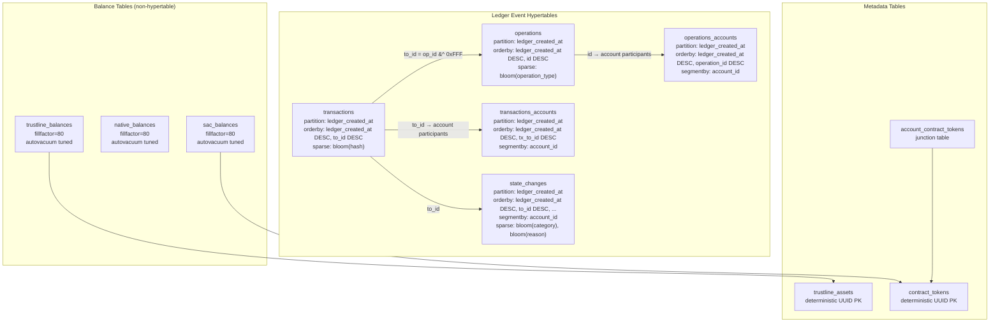
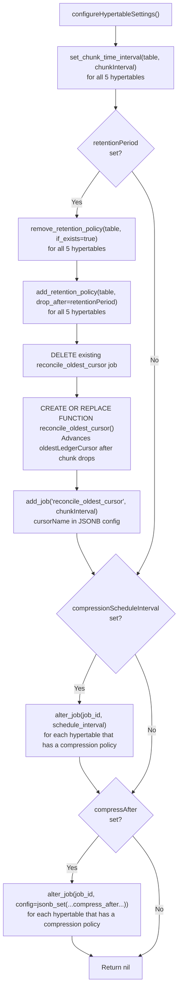
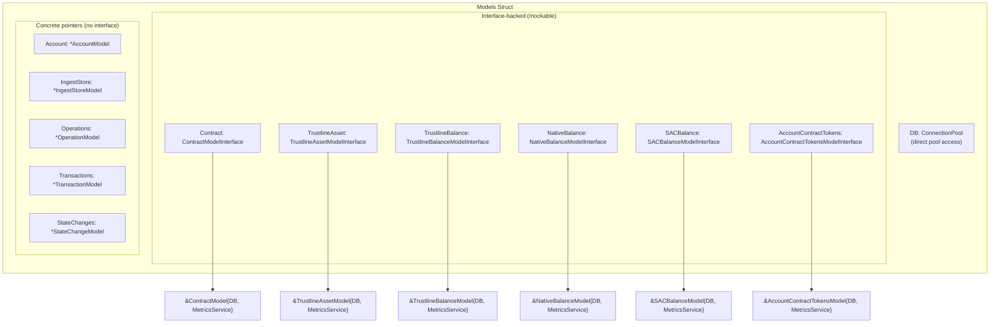
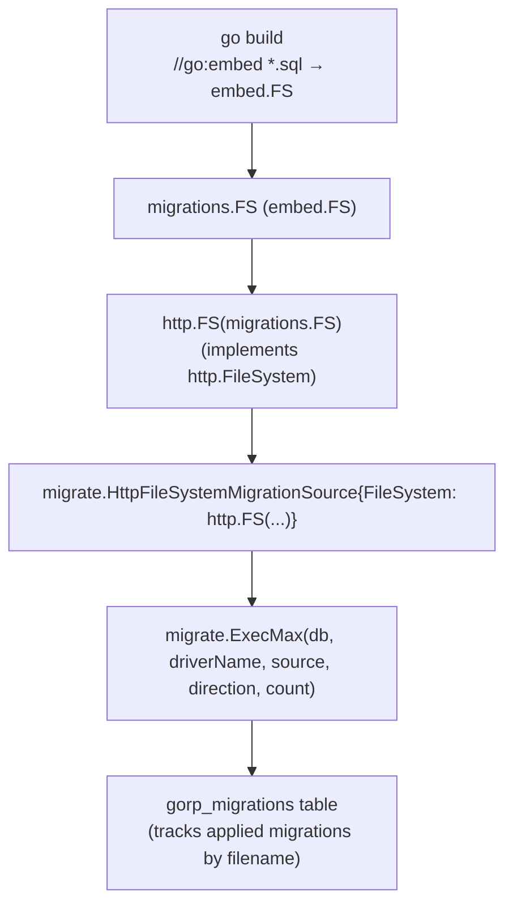
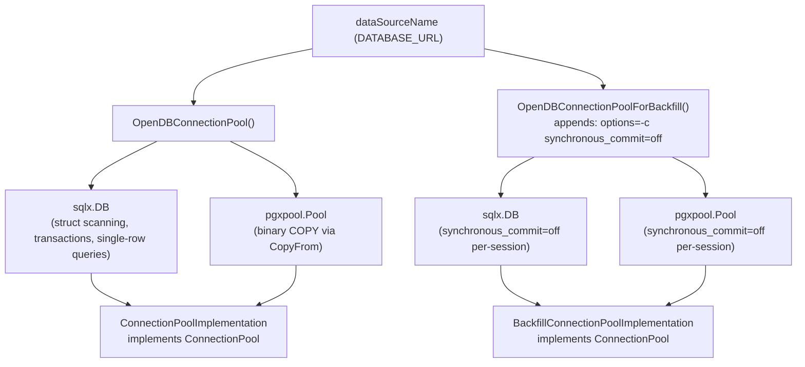
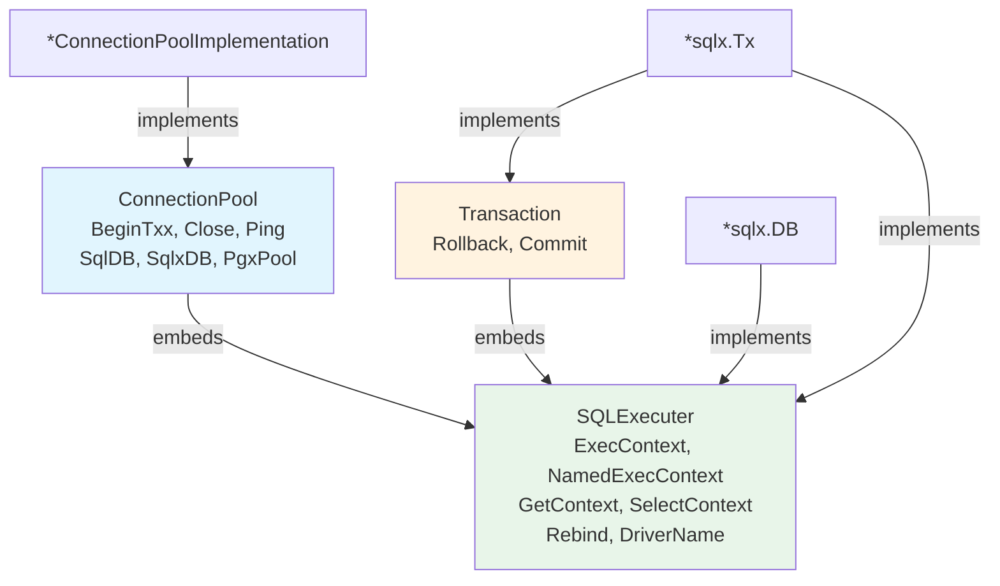
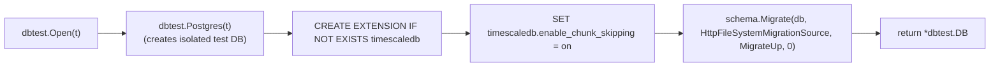
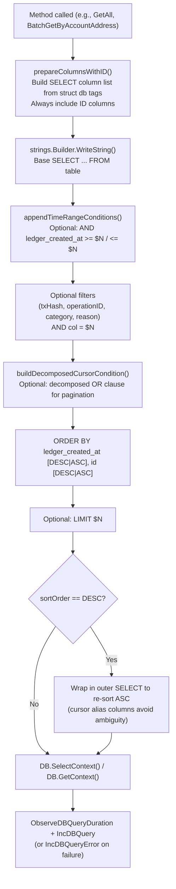

# Data Layer Architecture

## TimescaleDB Setup

The wallet-backend stores all ledger event data in five TimescaleDB hypertables. All hypertables partition on `ledger_created_at`, enabling TimescaleDB chunk pruning on time-range queries.

### Hypertable Overview



### Hypertable Reference

| Table | Partition Column | Chunk Interval | `orderby` | `segmentby` | Sparse Index | Chunk Skipping |
|-------|-----------------|----------------|-----------|-------------|--------------|----------------|
| `transactions` | `ledger_created_at` | 1 day | `ledger_created_at DESC, to_id DESC` | — | `bloom(hash)` | `to_id` |
| `transactions_accounts` | `ledger_created_at` | 1 day | `ledger_created_at DESC, tx_to_id DESC` | `account_id` | — | `tx_to_id` |
| `operations` | `ledger_created_at` | 1 day | `ledger_created_at DESC, id DESC` | — | `bloom(operation_type)` | `id` |
| `operations_accounts` | `ledger_created_at` | 1 day | `ledger_created_at DESC, operation_id DESC` | `account_id` | — | `operation_id` |
| `state_changes` | `ledger_created_at` | 1 day | `ledger_created_at DESC, to_id DESC, operation_id DESC, state_change_order DESC` | `account_id` | `bloom(state_change_category), bloom(state_change_reason)` | `to_id`, `operation_id` |

**Design decisions:**
- **Why `ledger_created_at` for partitioning**: Every event has a ledger timestamp. This allows TimescaleDB to prune entire chunks for time-bounded queries, which is the dominant query pattern for the API.
- **Why `segmentby = account_id` on join tables**: Join tables (`transactions_accounts`, `operations_accounts`, `state_changes`) are frequently queried per-account. Segmenting collocates rows from the same account in the same column group, enabling vectorized filtering without scanning other accounts' data.
- **Why `sparse_index = bloom(hash)` on `transactions`**: The bloom filter indexes `hash` within each chunk, allowing the columnar scan engine to skip chunks that provably don't contain a given hash. This accelerates `GetByHash` on large tables.
- **Why 1-day default chunks**: Stellar produces ~17,280 ledgers/day. One day's data fits comfortably in a single chunk without making chunk management expensive. The chunk interval affects only future chunks and is runtime-configurable.

For the state change concept, category/reason taxonomy, and producing processors, see [[references/state-changes]].

### Runtime Configuration: `configureHypertableSettings()`

At ingest startup, `internal/ingest/timescaledb.go:configureHypertableSettings()` applies runtime settings to all five hypertables. This is idempotent on restart.



**Key design notes:**
- Retention removal is idempotent (`if_exists => true`), making restarts safe.
- The `reconcile_oldest_cursor` job runs on the same cadence as the chunk interval and advances the `oldestLedgerCursor` in `ingest_store` after retention drops old chunks, keeping the cursor in sync with actual data.
- `compressionScheduleInterval` and `compressAfter` update existing compression policy jobs — they do not create new policies. Policies are created by migrations.

### Balance Tables (Non-Hypertable)

`trustline_balances`, `native_balances`, and `sac_balances` are standard PostgreSQL tables, not hypertables. They store current-state balances (not time-series event data), so TimescaleDB chunking would add overhead without benefit.

All three tables share the same aggressive autovacuum tuning, required because balance rows are updated every ledger:

| Setting | Value | Default | Why |
|---------|-------|---------|-----|
| `fillfactor` | 80 | 100 | Reserves 20% page space for HOT (Heap-Only Tuple) updates — avoids dead tuples on non-indexed column updates |
| `autovacuum_vacuum_scale_factor` | 0.02 | 0.20 | Vacuum triggers at 2% dead rows instead of 20% |
| `autovacuum_analyze_scale_factor` | 0.01 | 0.10 | Statistics refresh at 1% change to prevent stale query plans |
| `autovacuum_vacuum_cost_delay` | 0 | 2ms | No sleep between vacuum cycles — finishes faster |
| `autovacuum_vacuum_cost_limit` | 1000 | 200 | 5x default page budget per cycle |

## Model Interface Pattern

`internal/data/models.go` aggregates all 11 data models into a single `Models` struct injected into services.

### Models Struct Architecture



### Model Inventory

| Model | Interface? | Key Methods | Table(s) |
|-------|-----------|-------------|----------|
| `AccountModel` | No | `IsAccountFeeBumpEligible`, `BatchGetByToIDs`, `BatchGetByOperationIDs` | `channel_accounts` |
| `ContractModel` | `ContractModelInterface` | `GetExisting`, `BatchInsert` | `contract_tokens` |
| `TrustlineAssetModel` | `TrustlineAssetModelInterface` | `BatchInsert` | `trustline_assets` |
| `TrustlineBalanceModel` | `TrustlineBalanceModelInterface` | `GetByAccount`, `BatchUpsert`, `BatchCopy` | `trustline_balances` |
| `NativeBalanceModel` | `NativeBalanceModelInterface` | `GetByAccount`, `BatchUpsert`, `BatchCopy` | `native_balances` |
| `SACBalanceModel` | `SACBalanceModelInterface` | `GetByAccount`, `BatchUpsert`, `BatchCopy` | `sac_balances` |
| `AccountContractTokensModel` | `AccountContractTokensModelInterface` | `GetByAccount`, `BatchInsert` | `account_contract_tokens` |
| `IngestStoreModel` | No | `Get`, `Update`, `UpdateMin`, `GetLedgerGaps` | `ingest_store` |
| `OperationModel` | No | `GetByID`, `GetAll`, `BatchGetByToIDs`, `BatchGetByAccountAddress`, `BatchCopy` | `operations`, `operations_accounts` |
| `TransactionModel` | No | `GetByHash`, `GetAll`, `BatchGetByAccountAddress`, `BatchGetByOperationIDs`, `BatchGetByStateChangeIDs`, `BatchCopy` | `transactions`, `transactions_accounts` |
| `StateChangeModel` | No | `GetAll`, `BatchGetByAccountAddress`, `BatchGetByToID`, `BatchGetByToIDs`, `BatchGetByOperationID`, `BatchGetByOperationIDs`, `BatchCopy` | `state_changes` |

**Why some models have interfaces and others don't**: Interface-backed models (balance and metadata models) are mocked in unit tests because their logic involves non-trivial business rules or they're called from services with injectable dependencies. The three hypertable models (`TransactionModel`, `OperationModel`, `StateChangeModel`) are tested against real TimescaleDB instances via `dbtest.Open(t)` because their queries use TimescaleDB-specific features that mocks can't validate.

For full documentation of `StateChangeModel` query methods and the state change subsystem — concept, taxonomy, builder pattern, ordering, and schema — see [[references/state-changes]].

### Code Pattern

Every model follows this pattern:

```go
// Interface (for mockable models only)
type FooModelInterface interface {
    BatchInsert(ctx context.Context, dbTx pgx.Tx, items []Foo) error
}

// Concrete struct with compile-time interface check
type FooModel struct {
    DB             db.ConnectionPool
    MetricsService metrics.MetricsService
}

var _ FooModelInterface = (*FooModel)(nil) // compile-time check
```

### Deterministic UUID Pattern

`TrustlineAssetModel` and `ContractModel` compute their primary key UUIDs before inserting — no DB roundtrip needed:

```go
// trustline_assets: UUID v5 from "CODE:ISSUER" string
var assetNamespace = uuid.NewSHA1(uuid.NameSpaceDNS, []byte("trustline_assets"))
func DeterministicAssetID(code, issuer string) uuid.UUID {
    return uuid.NewSHA1(assetNamespace, []byte(code+":"+issuer))
}

// contract_tokens: UUID v5 from contract_id string
var contractNamespace = uuid.NewSHA1(uuid.NameSpaceDNS, []byte("contract_tokens"))
func DeterministicContractID(contractID string) uuid.UUID {
    return uuid.NewSHA1(contractNamespace, []byte(contractID))
}
```

This allows `BatchInsert` to use `ON CONFLICT (code, issuer) DO NOTHING` idempotently during streaming ingestion without needing to query for existing IDs first. Callers must set the `ID` field via these functions before calling `BatchInsert`.

## Migration System

All SQL migrations are embedded at compile time via `//go:embed` and applied using `rubenv/sql-migrate`.

### Migration Flow



**Key source files:**
- `internal/db/migrations/main.go` — Declares the `embed.FS` (one line: `//go:embed *.sql; var FS embed.FS`)
- `internal/db/migrate.go` — `Migrate()` function: opens pool → wraps FS → calls `migrate.ExecMax`
- `cmd/migrate.go` — Cobra commands: `migrate up [count]` and `migrate down <count>`

### Migration File Inventory

| File | Description |
|------|-------------|
| `2024-04-29.0-initial.sql` | Intentionally empty — initial migration anchor |
| `2024-05-22.0-ingest.sql` | Creates `ingest_store` key-value table for cursor tracking |
| `2024-06-12.0-channe_accounts.sql` | Creates `channel_accounts` table (keypair + lock columns) |
| `2024-08-07.0-keypairs.sql` | Creates `keypairs` table for distribution account keypairs |
| `2025-01-22.0-add_locked_tx_hash_to_channel_accounts.sql` | Adds `locked_tx_hash` column + index to `channel_accounts` |
| `2025-06-10.0-create_function_refresh_updated_at_column.sql` | Creates `refresh_updated_at_column()` PL/pgSQL trigger function |
| `2025-06-10.1-create_set_updated_at_triggers.sql` | Attaches `updated_at` trigger to `keypairs` and `channel_accounts` |
| `2025-06-10.2-transactions.sql` | Creates `transactions` and `transactions_accounts` hypertables |
| `2025-06-10.3-operations.sql` | Creates `operations` and `operations_accounts` hypertables |
| `2025-06-10.4-statechanges.sql` | Creates `state_changes` hypertable |
| `2025-06-13.0-contract_tokens.sql` | Creates `contract_tokens` table with `updated_at` trigger |
| `2025-12-14.0-trustline_assets.sql` | Creates `trustline_assets` table with deterministic UUID PK |
| `2026-01-12.0-trustline_balances.sql` | Creates `trustline_balances` with HOT-update optimized storage |
| `2026-01-12.1-account_contract_tokens.sql` | Creates `account_contract_tokens` junction table |
| `2026-01-15.0-native_balances.sql` | Creates `native_balances` with HOT-update optimized storage |
| `2026-01-16.0-sac-balances.sql` | Creates `sac_balances` with HOT-update optimized storage |

### CLI Usage

```bash
# Apply all pending migrations (count optional — omit to apply all)
go run main.go migrate up
go run main.go migrate up 3   # apply at most 3

# Roll back exactly N migrations (count required)
go run main.go migrate down 1
```

**Key difference**: `up [count]` makes count optional (0 = all migrations); `down <count>` requires an explicit count to prevent accidental full rollback.

### Naming Convention

```
YYYY-MM-DD.N-description.sql
```

`N` is a 0-based sequence number for migrations on the same date. Each file must contain both sections:
```sql
-- +migrate Up
-- (forward DDL here)

-- +migrate Down
-- (rollback DDL here)
```

Multi-statement DDL (e.g., stored procedures) requires `-- +migrate StatementBegin` / `-- +migrate StatementEnd` delimiters to prevent the parser from splitting on semicolons.

## Connection Pool Architecture

Every service receives a `ConnectionPool`, which wraps two underlying connection pools serving different purposes.

### Dual-Pool Design



**Why two pools**: `sqlx.DB` provides ergonomic struct scanning (`GetContext`, `SelectContext`) but uses text-format wire protocol. `pgxpool.Pool` uses binary wire format for `CopyFrom`, which is significantly faster for bulk ingestion. The backfill variant adds `synchronous_commit=off` at the connection-string level so every connection in the pool inherits it without requiring per-query hints.

**Backfill session setup**: After creating a backfill pool, callers optionally call `ConfigureBackfillSession(ctx, db)` which executes `SET session_replication_role = 'replica'` to disable FK constraint checking during bulk load. This cannot be set via connection string and requires superuser or replication role.

### Interface Hierarchy



All compile-time checks use blank-identifier assertions (`var _ ConnectionPool = (*ConnectionPoolImplementation)(nil)`), ensuring the code won't compile if an interface is broken.

### Pool Constants

| Constant | Value | Purpose |
|----------|-------|---------|
| `MaxOpenDBConns` | 30 | Maximum simultaneous DB connections |
| `MaxIdleDBConns` | 20 | Warm connections held open between queries |
| `MaxDBConnIdleTime` | 10s | Idle connection recycled after this |
| `MaxDBConnLifetime` | 5m | Connection recycled after this, even if active |

### Transaction Helpers

| Helper | Signature | Returns |
|--------|-----------|---------|
| `RunInTransaction` | `(ctx, pool, opts, func(Transaction) error)` | `error` |
| `RunInTransactionWithResult[T]` | `(ctx, pool, opts, func(Transaction) (T, error))` | `(T, error)` |
| `RunInPgxTransaction` | `(ctx, pool, func(pgx.Tx) error)` | `error` |

`RunInTransactionWithResult[T]` is a generic helper (Go 1.18+) that avoids the `interface{}` return type when the caller needs a typed result from inside the transaction. `RunInPgxTransaction` uses the `pgxpool.Pool` path for operations that require pgx-native types (e.g., after a `CopyFrom`).

All helpers auto-rollback via `defer` on error and log the rollback error without overriding the original error.

### Test Isolation: `dbtest.Open(t)`



`dbtest.OpenWithoutMigrations(t)` also exists for migration-testing scenarios — it enables the extension and sets `enable_chunk_skipping` at the database level (via `ALTER DATABASE`) so that connections opened later (including the migration runner) inherit the setting.

## Query Patterns

All queries use raw SQL built with `strings.Builder` and positional `$N` parameters — no query builder library. This gives full control over TimescaleDB-specific constructs that no general-purpose query builder would generate.

### Query Construction Pipeline



### Pagination Cursors

All cursor-based pagination uses `buildDecomposedCursorCondition()` from `internal/data/query_utils.go`. The cursor columns determine the cursor type:

| Cursor Type | Columns | Used By |
|-------------|---------|---------|
| `CompositeCursor` (2-col) | `ledger_created_at`, `to_id` / `id` | `GetAll`, `BatchGetByAccountAddress` on transactions and operations |
| `StateChangeCursor` (4-col) | `ledger_created_at`, `to_id`, `operation_id`, `state_change_order` | All state change queries |
| Simple 3-col (no time) | `to_id`, `operation_id`, `state_change_order` | `BatchGetByToID`, `BatchGetByOperationID` (scoped within one tx/op) |

### Decomposed Cursor Condition

The key TimescaleDB optimization. Instead of:
```sql
WHERE ROW(ledger_created_at, to_id) < ROW($1, $2)
```

The code generates:
```sql
WHERE (ledger_created_at < $1
  OR (ledger_created_at = $1 AND to_id < $2))
```

TimescaleDB's ColumnarScan cannot push `ROW()` tuple comparisons into vectorized filters, but it **can** push simple column comparisons. The decomposed form allows the engine to prune chunks by `ledger_created_at` independently of `to_id`.

### MATERIALIZED CTE + LATERAL Join

Used in `TransactionModel.BatchGetByAccountAddress` and `OperationModel.BatchGetByAccountAddress` for account-scoped queries:

```sql
WITH account_txns AS MATERIALIZED (
    SELECT tx_to_id, ledger_created_at
    FROM transactions_accounts
    WHERE account_id = $1
    -- (optional time range and cursor conditions here)
    ORDER BY ledger_created_at DESC, tx_to_id DESC
    LIMIT $N
)
SELECT {columns}, t.ledger_created_at, t.to_id
FROM account_txns ta,
LATERAL (SELECT * FROM transactions t
         WHERE t.to_id = ta.tx_to_id
           AND t.ledger_created_at = ta.ledger_created_at
         LIMIT 1) t
ORDER BY ...
```

**Why MATERIALIZED**: Forces TimescaleDB to plan and execute the CTE separately, enabling `ChunkAppend` on the `transactions_accounts` hypertable with `ledger_created_at` as the leading `ORDER BY` column. Without `MATERIALIZED`, the planner might merge the CTE into the outer query and lose the chunk-pruning opportunity.

**Why LATERAL**: The 1:1 join to `transactions` uses the exact `(to_id, ledger_created_at)` primary key, which is O(1) per row. A regular join would require the planner to choose a join strategy that may not optimize as well.

### ROW_NUMBER PARTITION BY (DataLoader Queries)

`StateChangeModel.BatchGetByToIDs` and `BatchGetByOperationIDs` use a CTE with `ROW_NUMBER()` for balanced per-parent pagination:

```sql
WITH
    inputs (to_id) AS (SELECT * FROM UNNEST($1::bigint[])),
    ranked AS (
        SELECT sc.*, ROW_NUMBER() OVER (PARTITION BY sc.to_id ORDER BY ...) AS rn
        FROM state_changes sc
        JOIN inputs i ON sc.to_id = i.to_id
    )
SELECT ... FROM ranked WHERE rn <= {limit}
```

**Why PARTITION BY**: A global `LIMIT` would return all rows from the first few parents and none from later ones. `ROW_NUMBER() PARTITION BY parent_id` guarantees each parent gets at most `limit` rows, giving the DataLoader balanced results across N parents in a single query.

### TOID Bit-Masking (SEP-35)

`TransactionModel.BatchGetByOperationIDs` derives the transaction `to_id` from an operation ID using bitwise masking:

```sql
SELECT ... FROM operations o
INNER JOIN transactions
ON (o.id & (~x'FFF'::bigint)) = transactions.to_id
WHERE o.id = ANY($1)
```

**Why this works**: Per [SEP-35](https://github.com/stellar/stellar-protocol/blob/master/ecosystem/sep-0035.md), TOID encodes `(ledger_seq, tx_order, op_index)` in 64 bits. The lower 12 bits are the operation index. Masking them (`&^ 0xFFF`) yields the transaction's TOID (operation index = 0). This avoids a separate lookup table.

### Batch Insert Strategies

| Strategy | Method | Use Case | Conflict Handling |
|----------|--------|----------|-------------------|
| `pgx.CopyFrom` (binary) | `BatchCopy` on Transactions, Operations, StateChanges | Backfill bulk inserts — no duplicates expected | None — COPY fails on conflict |
| `UNNEST + ON CONFLICT DO NOTHING` | `BatchInsert` on ContractModel, TrustlineAssetModel | Idempotent metadata inserts | Skips existing rows |
| `pgx.Batch` (upsert + delete) | `BatchUpsert` on balance models | Live ingestion: upsert changes, delete removals | `ON CONFLICT ... DO UPDATE` |
| `pgx.CopyFrom` (initial population) | `BatchCopy` on balance models | `PopulateAccountTokens()` initial snapshot | None — called on first run only |

### Error Handling and Metrics

All queries follow the same instrumentation pattern:

```go
start := time.Now()
err := m.DB.SelectContext(ctx, &results, query, args...)
duration := time.Since(start).Seconds()
m.MetricsService.ObserveDBQueryDuration("MethodName", "table_name", duration)
if err != nil {
    m.MetricsService.IncDBQueryError("MethodName", "table_name", utils.GetDBErrorType(err))
    return nil, fmt.Errorf("context description: %w", err)
}
m.MetricsService.IncDBQuery("MethodName", "table_name")
```

`GetDBErrorType()` (`internal/utils/db_errors.go`) categorizes errors for Prometheus labels:

| Category | PostgreSQL Code | Meaning |
|----------|----------------|---------|
| `no_rows` | `sql.ErrNoRows` | Empty result |
| `unique_violation` | `23505` | Duplicate key |
| `foreign_key_violation` | `23503` | FK constraint |
| `serialization_failure` | `40001` | Transaction conflict |
| `deadlock` | `40P01` | Deadlock detected |
| `query_canceled` | `57014` | Statement timeout |
| `connection_error` | `08000/08003/08006` | Connection lost |
| `context_canceled` | — | Request canceled |

Errors are always wrapped with `fmt.Errorf("context: %w", err)` per the `wrapcheck` linter rule, enabling `errors.Is/As` unwrapping by callers.

**Key source files:**
- `internal/data/models.go` — `Models` struct and `NewModels` constructor
- `internal/data/query_utils.go` — `buildDecomposedCursorCondition`, `appendTimeRangeConditions`, `CursorColumn`
- `internal/data/transactions.go` — `TransactionModel` (MATERIALIZED CTE + LATERAL, TOID masking)
- `internal/data/statechanges.go` — `StateChangeModel` (4-col cursor, ROW_NUMBER PARTITION BY)
- `internal/data/operations.go` — `OperationModel` (TOID encoding documentation)
- `internal/utils/db_errors.go` — `GetDBErrorType` error classification
- `internal/db/db.go` — `ConnectionPool`, `SQLExecuter`, `Transaction`, transaction helpers
- `internal/db/migrate.go` — `Migrate()` function
- `internal/db/dbtest/dbtest.go` — `Open(t)` test database helper
- `internal/ingest/timescaledb.go` — `configureHypertableSettings()` runtime configuration


---

**Topics:** [[entries/index]] | [[entries/data-layer]]
