# Ingestion Pipeline Architecture

## High-Level Overview

The ingestion pipeline reads Stellar ledger data and persists it into TimescaleDB. It runs as two independent modes — **live** and **backfill** — that share a common Indexer core.

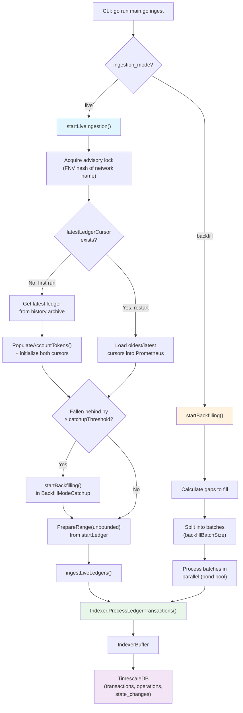

**Key source files:**
- `internal/ingest/ingest.go` — Entry point, dependency wiring, config
- `internal/services/ingest.go` — Core: `Run()`, `processLedger()`, retry logic
- `internal/services/ingest_live.go` — Live: `startLiveIngestion()`, `PersistLedgerData()`
- `internal/services/ingest_backfill.go` — Backfill: `startBackfilling()`, parallel batch processing
- `internal/indexer/indexer.go` — Transaction processing, processor fan-out
- `internal/indexer/indexer_buffer.go` — Memory-efficient canonical pointer buffer

## Live Ingestion Flow

### Startup Decision Tree

Live ingestion acquires a PostgreSQL advisory lock (deterministic FNV hash of `"wallet-backend-ingest-<network>"`) to prevent concurrent instances, then determines how to initialize.

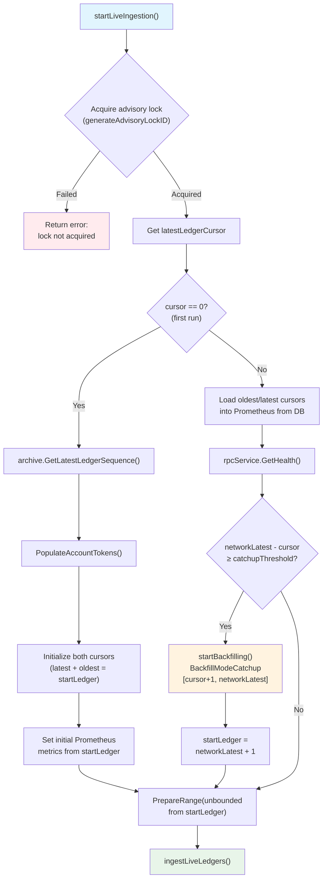

### Per-Ledger Processing Loop

Once initialized, live ingestion enters an unbounded loop processing one ledger at a time:

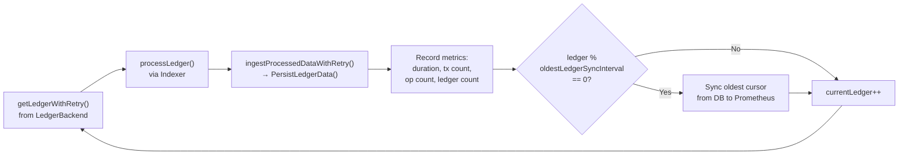

**Timing metrics recorded per ledger:**
- `process_ledger` — Time spent in Indexer processing
- `insert_into_db` — Time spent in DB transaction (PersistLedgerData)
- Total ingestion duration — End-to-end for the ledger

### PersistLedgerData Atomic Transaction

All data for a single ledger is persisted in one atomic database transaction. This ensures either all data for a ledger is committed or none of it is.

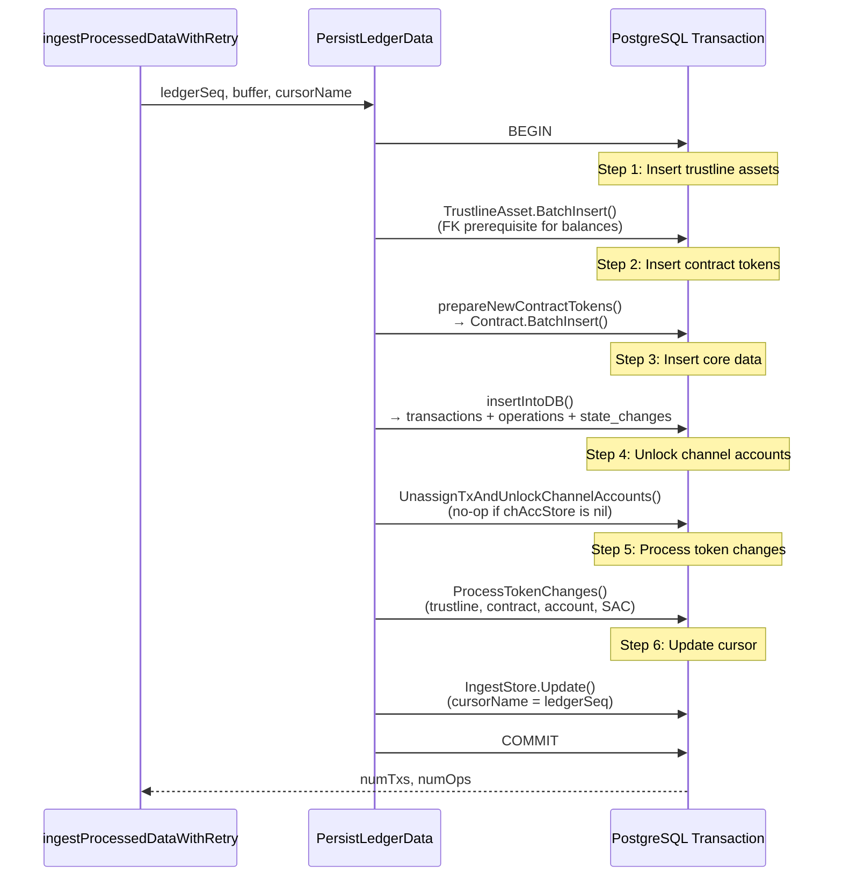

**Key design decisions:**
- **Advisory lock**: Uses `pg_try_advisory_lock` with a deterministic FNV-64a hash of `"wallet-backend-ingest-<network>"`. Different networks (testnet, pubnet) get separate locks.
- **First-run initialization**: On first run, starts from the latest history archive ledger rather than genesis. `PopulateAccountTokens()` snapshots current token holdings before ingestion begins.
- **Catchup threshold**: Configurable via `CatchupThreshold` (default: 100). If the service restarts and is more than this many ledgers behind the network tip, it uses parallel backfill instead of sequential processing.
- **Oldest ledger sync**: Every `oldestLedgerSyncInterval` (100) ledgers, the live process reads the `oldestLedgerCursor` from DB to pick up progress from concurrent backfill jobs.

## Backfill Ingestion Flow

### Mode Selection and Gap Calculation

Backfill operates in two modes with different gap calculation strategies:

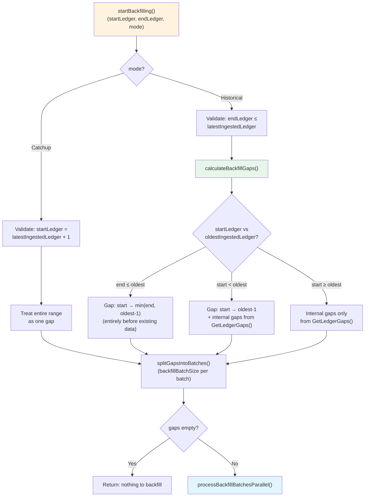

**Gap detection SQL** (`GetLedgerGaps`):
```sql
SELECT gap_start, gap_end FROM (
    SELECT
        ledger_number + 1 AS gap_start,
        LEAD(ledger_number) OVER (ORDER BY ledger_number) - 1 AS gap_end
    FROM (SELECT DISTINCT ledger_number FROM transactions) t
) gaps
WHERE gap_start <= gap_end
ORDER BY gap_start
```

### Single Batch Processing Pipeline

Each batch is processed by a dedicated goroutine with its own `LedgerBackend` instance (backends are not thread-safe):

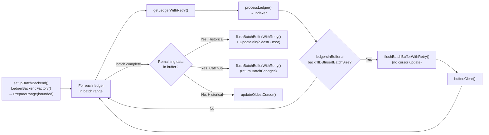

### Post-Backfill Processing

After all parallel batches complete, the post-processing diverges based on mode:

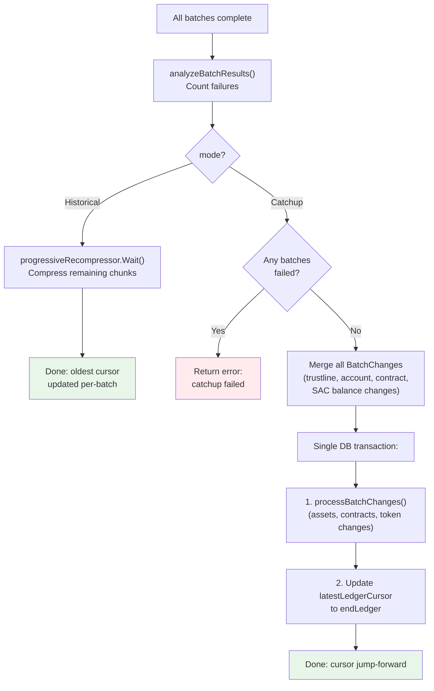

**Key design details:**

- **Worker pool**: Uses `pond.Pool` with configurable size (`BackfillWorkers`, default: `runtime.NumCPU()`). Each goroutine gets its own `LedgerBackend` via `LedgerBackendFactory`.
- **Batch sizing**: `backfillBatchSize` (default: 250) controls how many ledgers per batch. `backfillDBInsertBatchSize` (default: 50) controls periodic DB flushes within a batch to bound memory.
- **Merge logic**: Catchup mode collects `BatchChanges` from each batch and merges them. Merge uses highest-OperationID-wins semantics with ADD→REMOVE no-op detection (if a trustline/account is created and removed within the same range, the net effect is nothing).
- **Progressive recompression**: Historical backfill inserts data uncompressed (faster writes), then the `progressiveRecompressor` compresses TimescaleDB chunks as contiguous batches complete. It uses a watermark — batch 0 must complete before any compression starts, then chunks are compressed as the watermark advances. A final verification pass catches boundary chunks.

## Indexer Architecture

### Processor Fan-Out

The Indexer processes all transactions in a ledger in parallel using a `pond.Pool`. Each transaction is processed independently, producing a per-transaction `IndexerBuffer` that is merged into the ledger-level buffer after all transactions complete.

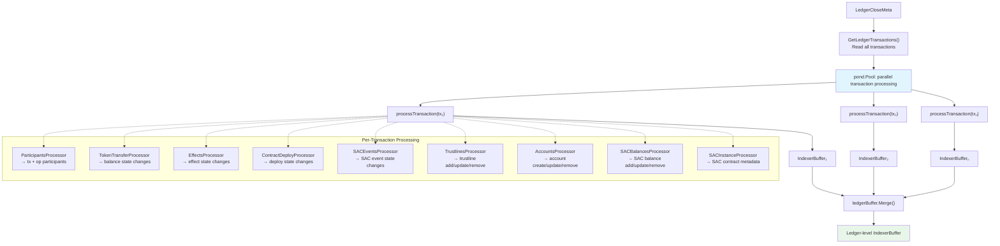

### Processor Reference

| Processor | Interface | Level | Output | Description |
|-----------|-----------|-------|--------|-------------|
| `ParticipantsProcessor` | `ParticipantsProcessorInterface` | Transaction | Participant sets | Extracts Stellar addresses involved in each transaction and operation |
| `TokenTransferProcessor` | `TokenTransferProcessorInterface` | Transaction | `[]StateChange` | Produces balance-category state changes from token transfer events |
| `EffectsProcessor` | `OperationProcessorInterface` | Operation | `[]StateChange` | Extracts effects (payments, trades, etc.) as state changes |
| `ContractDeployProcessor` | `OperationProcessorInterface` | Operation | `[]StateChange` | Detects Soroban contract deployments |
| `SACEventsProcessor` | `OperationProcessorInterface` | Operation | `[]StateChange` | Processes Stellar Asset Contract events |
| `TrustlinesProcessor` | `LedgerChangeProcessor[TrustlineChange]` | Operation | `[]TrustlineChange` | Tracks trustline creation, update, and removal from ledger changes |
| `AccountsProcessor` | `LedgerChangeProcessor[AccountChange]` | Operation | `[]AccountChange` | Tracks account creation, update, and removal from ledger changes |
| `SACBalancesProcessor` | `LedgerChangeProcessor[SACBalanceChange]` | Operation | `[]SACBalanceChange` | Tracks SAC balance add/update/remove from ledger changes |
| `SACInstanceProcessor` | `LedgerChangeProcessor[*data.Contract]` | Operation | `[]*data.Contract` | Extracts SAC contract metadata from contract instance entries |

**Parallelism model**: Transactions within a ledger are processed in parallel (via `pond.Pool` with unbounded workers). Within each transaction, the 3 `OperationProcessorInterface` processors run sequentially per operation (creating a pool per-operation adds overhead with only 3 processors). The `LedgerChangeProcessor` processors also run sequentially per operation.

For comprehensive documentation of the state change subsystem — the category/reason taxonomy, producing processors, builder pattern, ordering, and schema — see [[references/state-changes]].

## IndexerBuffer Architecture

### Two-Layer Memory Architecture

The `IndexerBuffer` uses a canonical pointer pattern to avoid duplicating large XDR-heavy structs when multiple participants reference the same transaction or operation.

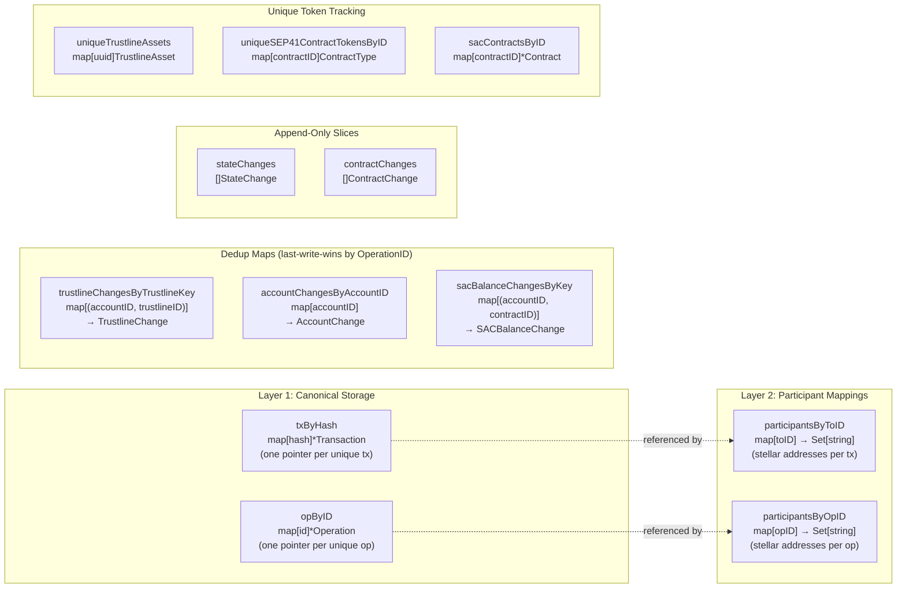

**Design rationale:**
- **Canonical pointers**: Transaction structs contain large XDR fields (10-50+ KB each). When multiple participants interact with the same transaction, they all point to the SAME canonical pointer in `txByHash` instead of storing duplicate copies.
- **Thread safety**: All public methods use `sync.RWMutex`. Per-transaction buffers are created independently in parallel goroutines, then merged into the ledger buffer sequentially.
- **Deduplication strategy**: Dedup maps use highest-OperationID-wins semantics. ADD→REMOVE pairs within the same buffer are detected and deleted (net no-op). This applies to trustlines, accounts, and SAC balances.
- **Clear for reuse**: The `Clear()` method resets all maps and slices but preserves allocated backing arrays, avoiding GC pressure during backfill batch processing.

## Retry Logic & Cursor Management

### Retry State Machine

The pipeline has two retry loops with exponential backoff, used at different stages:

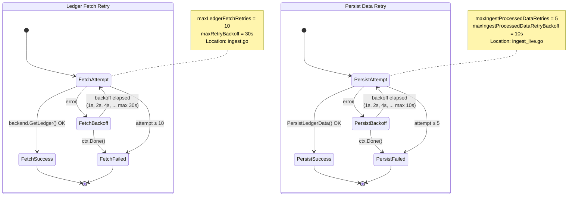

### Retry Constants

| Constant | Value | Location | Used By |
|----------|-------|----------|---------|
| `maxLedgerFetchRetries` | 10 | `ingest.go` | `getLedgerWithRetry()` — both live and backfill |
| `maxRetryBackoff` | 30s | `ingest.go` | `getLedgerWithRetry()` — max backoff cap |
| `maxIngestProcessedDataRetries` | 5 | `ingest_live.go` | `ingestProcessedDataWithRetry()` and `flushBatchBufferWithRetry()` |
| `maxIngestProcessedDataRetryBackoff` | 10s | `ingest_live.go` | Max backoff cap for persist retries |
| `oldestLedgerSyncInterval` | 100 | `ingest_live.go` | Sync oldest cursor metric every N ledgers |

### Cursor Operations

The `IngestStoreModel` manages cursor state in the `ingest_store` key-value table:

| Method | SQL Pattern | Used By |
|--------|-------------|---------|
| `Get(cursorName)` | `SELECT value FROM ingest_store WHERE key = $1` | Startup: check if first run; load cursor positions |
| `Update(cursorName, ledger)` | `INSERT ... ON CONFLICT DO UPDATE SET value = $2` | Live: advance latest cursor after each ledger |
| `UpdateMin(cursorName, ledger)` | `UPDATE ... SET value = LEAST(value::integer, $2)` | Backfill: move oldest cursor backward (only if new value is lower) |
| `GetLedgerGaps()` | Window function on `transactions.ledger_number` | Historical backfill: find gaps in ingested data |

### Crash Recovery

- **Live ingestion**: On restart, reads `latestLedgerCursor` and resumes from `cursor + 1`. The advisory lock prevents concurrent instances. If a crash occurs mid-ledger, no data is committed (atomic transaction), so the same ledger is simply re-processed.
- **Backfill**: Each batch atomically updates the `oldestCursor` with its final flush. Completed batches are durable. Incomplete batches are simply re-processed on next backfill run (gap detection will find them).
- **Catchup**: If any batch fails, the entire catchup fails and the `latestLedgerCursor` is NOT advanced. The next restart will attempt catchup again for the same range.

## Ledger Backend

### Backend Selection and Factory Pattern

The pipeline supports two backend types for fetching ledger data, selected via the `LedgerBackendType` config:

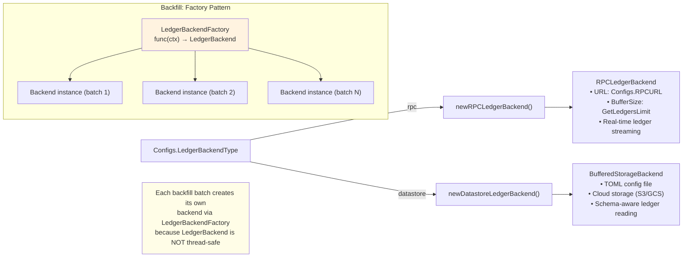

**LedgerBackend interface** (from `go-stellar-sdk/ingest/ledgerbackend`):
- `PrepareRange(ctx, Range)` — Initialize the backend for a bounded or unbounded ledger range
- `GetLedger(ctx, seq)` — Fetch a single ledger's `LedgerCloseMeta`
- `Close()` — Release resources

**Backend details:**

| Backend | Config | Use Case |
|---------|--------|----------|
| **RPC** (`rpc`) | `RPCURL`, `GetLedgersLimit` (buffer size) | Live ingestion (real-time streaming from Stellar RPC) |
| **Datastore** (`datastore`) | `DatastoreConfigPath` (TOML file) | Backfill from cloud storage (S3/GCS pre-exported ledgers) |

**Thread-safety constraint**: `LedgerBackend` instances are NOT thread-safe. Live ingestion uses a single instance for sequential processing. Backfill creates a new instance per batch via `LedgerBackendFactory`, which calls `NewLedgerBackend()` for each batch. This is why the factory pattern exists — it allows each goroutine in the `pond.Pool` to have its own isolated backend.


---

## Adding a New Processor

To add a new data processor to the indexer fan-out:

1. Create the processor in `internal/indexer/processors/`
2. Implement the processor interface (`OperationProcessorInterface`, `LedgerChangeProcessor[T]`, or `TokenTransferProcessorInterface` depending on data type)
3. Register it in the indexer's processor list (`internal/indexer/indexer.go`)
4. Create the corresponding DB model and migration in `internal/db/migrations/`
5. Add GraphQL schema + resolvers if the data needs to be queryable

---

**Topics:** [[entries/index]] | [[entries/ingestion]]
