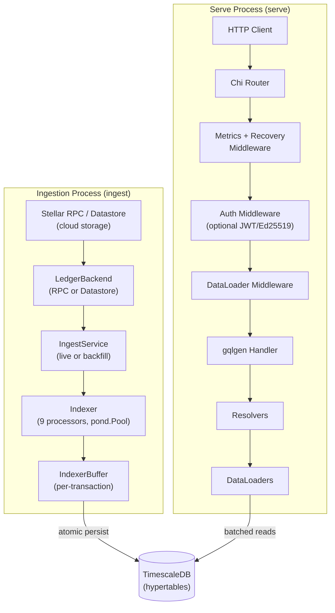
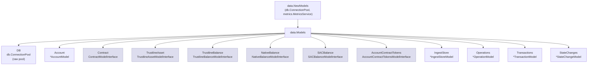
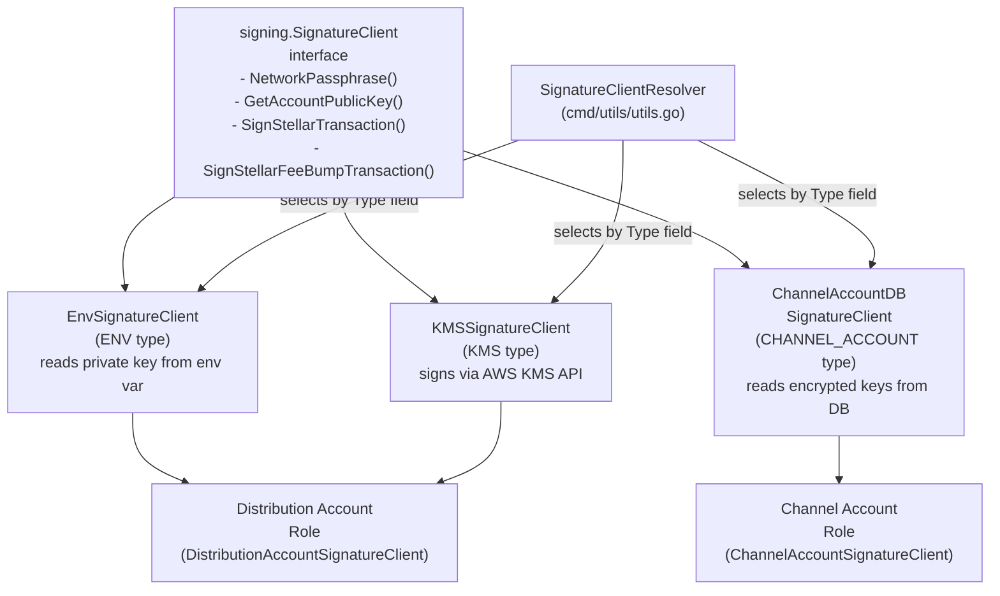
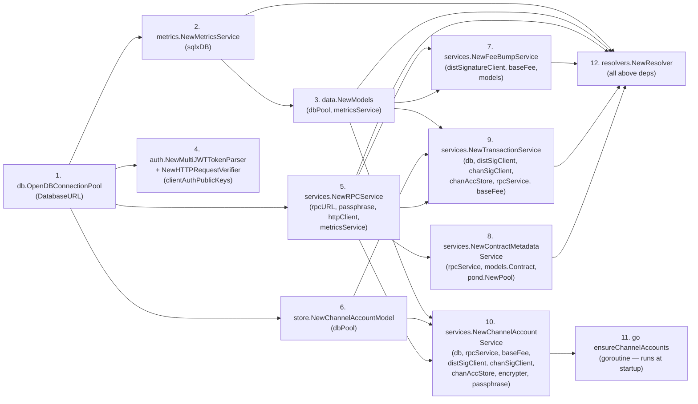
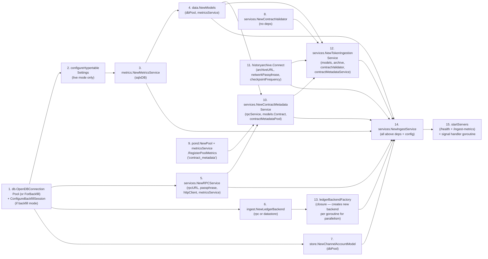

# Architecture Overview

## High-Level Data Flow

The wallet-backend runs as two separate OS processes that share a TimescaleDB database. Neither process talks directly to the other — the database is the integration point.



| Process | Command | Default Port | Purpose | Deep-Dive |
|---------|---------|-------------|---------|-----------|
| `serve` | `go run main.go serve` | 8001 | GraphQL API + transaction submission | `graphql-api.md`, `services.md` |
| `ingest` | `go run main.go ingest` | 8002 (metrics) | Ledger ingestion, backfill | `ingestion-pipeline.md` |

**Key source files**: `cmd/serve.go`, `cmd/ingest.go`, `internal/serve/serve.go`, `internal/ingest/ingest.go`

---

## Two Main Processes

### Serve Process

The serve process validates flags, wires dependencies, then runs an HTTP server for the lifetime of the process.

```mermaid
flowchart LR
    A["PersistentPreRunE\n(cmd/serve.go)"] --> B["Validate flags\n+ SetValues"]
    B --> C["Open DB pool\n(db.OpenDBConnectionPool)"]
    C --> D["SignatureClientResolver\n(distribution account)"]
    D --> E["sentry.NewSentryTracker"]
    E --> F["NewChannelAccountDB\nSignatureClient"]
    F --> G["serve.Serve(cfg)"]
    G --> H["initHandlerDeps(ctx, cfg)"]
    H --> I["handler(deps)"]
    I --> J["supporthttp.Run\n(blocks forever)"]
```



Key CLI flags and defaults:

| Flag | Default | Purpose |
|------|---------|---------|
| `--port` | `8001` | HTTP listen port |
| `--graphql-complexity-limit` | `1000` | Max query complexity score |
| `--max-graphql-worker-pool-size` | `100` | pond.Pool size for resolver parallelism |
| `--max-accounts-per-balances-query` | `20` | Balance query cardinality cap |
| `--client-auth-max-timeout-seconds` | `15` | JWT token max age |
| `--client-auth-max-body-size-bytes` | `102400` (100 KB) | Max body size for auth check |
| `--number-channel-accounts` | `15` | Minimum channel account count |
| `--max-sponsored-base-reserves` | `15` | Max reserves sponsored per distribution account |
| `--client-auth-public-keys` | *(empty)* | If empty, auth is **disabled** |

**Authentication is opt-in**: if `--client-auth-public-keys` is not set, the `AuthenticationMiddleware` is skipped entirely. This design lets the serve process run without auth in development.

**Source files**: `cmd/serve.go`, `internal/serve/serve.go:Serve()`, `internal/serve/serve.go:initHandlerDeps()`

---

### Ingest Process

The ingest process has a more complex startup because the DB connection pool is configured differently depending on ingestion mode, and hypertable settings are only applied in live mode.

```mermaid
flowchart LR
    A["PersistentPreRunE\n(cmd/ingest.go)"] --> B["Validate flags\n+ SetValues"]
    B --> C["sentry.NewSentryTracker"]
    C --> D["ingest.Ingest(cfg)"]
    D --> E["setupDeps(cfg)"]
    E --> F{ingestion-mode?}
    F -->|"backfill"| G["OpenDBConnectionPool\nForBackfill\n(synchronous_commit=off,\nFK checks disabled)"]
    F -->|"live"| H["OpenDBConnectionPool\n(standard)"]
    G --> I["configureHypertable\nSettings\n(live mode only)"]
    H --> I
    I --> J["NewMetricsService\n+ NewModels\n+ NewRPCService\n+ NewLedgerBackend"]
    J --> K["NewContractMetadata\nService + NewArchive\n+ NewTokenIngestion\nService"]
    K --> L["ledgerBackendFactory\n(closure for parallel backfill)"]
    L --> M["services.NewIngestService"]
    M --> N["startServers\n(/health + /ingest-metrics)"]
    N --> O["signal handler goroutine\n(SIGINT/SIGTERM)"]
    O --> P["ingestService.Run(ctx,\nstart, end)"]
```



Key CLI flags and defaults:

| Flag | Default | Purpose |
|------|---------|---------|
| `--ingestion-mode` | `live` | `live` or `backfill` |
| `--ledger-backend-type` | `datastore` | `rpc` or `datastore` (cloud storage) |
| `--backfill-workers` | `NumCPU` (0=auto) | Concurrent batch workers during backfill |
| `--backfill-batch-size` | `250` | Ledgers per batch |
| `--backfill-db-insert-batch-size` | `100` | Ledgers before flushing to DB |
| `--catchup-threshold` | `100` | Ledgers behind tip before triggering parallel backfill |
| `--skip-tx-meta` | `true` | Skip storing `meta_xdr` (storage/performance trade-off) |
| `--skip-tx-envelope` | `true` | Skip storing `envelope_xdr` |
| `--chunk-interval` | `1 day` | TimescaleDB chunk time interval |
| `--retention-period` | *(empty)* | Data retention; empty = keep forever |
| `--compression-compress-after` | *(empty)* | Delay before chunk becomes eligible for compression |
| `--compression-schedule-interval` | *(empty)* | How often compression policy job runs |
| `--checkpoint-frequency` | `64` | History archive checkpoint frequency (8 for integration tests) |
| `--datastore-config-path` | `config/datastore-pubnet.toml` | Path to TOML config for datastore backend |

> **Design decision — mode-specific DB pools**: Backfill uses `OpenDBConnectionPoolForBackfill`, which sets `synchronous_commit=off` and attempts to disable FK constraint checking. This trades ACID durability for insert throughput. Live mode keeps full ACID guarantees. The FK disable is best-effort — it logs a warning if it fails (requires superuser) but continues with other optimizations.

> **Hypertable config is only applied in live mode**: `configureHypertableSettings` configures chunk intervals, retention, and compression policies. It runs once at startup in live mode. Backfill intentionally skips it to avoid overwriting settings during historical data loading.

**Source files**: `cmd/ingest.go`, `internal/ingest/ingest.go:setupDeps()`, `internal/ingest/ingest.go:startServers()`

---

## Directory Structure

```
cmd/                           CLI commands (Cobra): serve, ingest, migrate, channel-account, distribution-account
internal/
  serve/                       HTTP layer (Chi router)
    httphandler/               HTTP handlers (currently just health check)
    middleware/                 Auth (JWT/Ed25519), metrics, recovery, GraphQL middleware
    graphql/
      schema/*.graphqls        GraphQL schema definitions (source of truth)
      generated/               Auto-generated code (DO NOT edit) — run `make gql-generate`
      resolvers/               Resolver implementations (follow-schema layout)
      dataloaders/             DataLoader batching to prevent N+1 queries
      scalars/                 Custom scalar types (UInt32)
  services/                    Business logic (TransactionService, RPCService, FeeBumpService, IngestService, etc.)
  data/                        Database models and queries (interface-based for testability)
  db/
    dbtest/                    Test database helpers (auto-creates TimescaleDB + runs migrations)
    migrations/*.sql           SQL migrations (format: YYYY-MM-DD.N-description.sql)
  indexer/                     Ledger event processing and type definitions
  signing/                     Pluggable signature providers: ENV (env var), KMS (AWS), ChannelAccount (DB-encrypted)
    store/                     Channel account DB storage
    utils/                     Key encryption utilities
  entities/                    Domain models (Asset, Signer, RPC types, pagination)
  metrics/                     Prometheus metrics collection
  apptracker/                  Error tracking (Sentry integration)
  integrationtests/            End-to-end tests with Docker containers (testcontainers-go)
pkg/                           Public packages: client library, auth utilities, Soroban auth
```

---

## Dependency Wiring

### Construction Patterns

Five patterns appear across the codebase for constructing services and models:

| Pattern | Example | Usage |
|---------|---------|-------|
| `Options` struct + `ValidateOptions()` | `TransactionServiceOptions`, `ChannelAccountServiceOptions` | Services with 5+ dependencies requiring validation |
| `Config` struct (no Validate method) | `IngestServiceConfig`, `serve.Configs`, `ingest.Configs` | Entry-point configs wired directly from CLI flags |
| `Options` struct + `Validate()` (method receiver) | `FeeBumpServiceOptions` | Simpler services |
| Direct constructor params | `services.NewRPCService(url, passphrase, httpClient, metricsService)` | Services with few, obvious deps |
| Zero external deps (receives only DB/metrics) | `data.NewModels(db, metricsService)` | Data layer — all models in one aggregate |

Every `NewXxx` constructor returns `(concrete, error)` — errors bubble up to the `setupDeps`/`initHandlerDeps` caller which exits the process.

**Cross-reference**: see `services.md` for the full service inventory and their Options patterns.

---

### The Models Aggregate

`data.Models` is a single struct that aggregates all database model interfaces and the raw connection pool. It is created once and passed by pointer to everything that needs DB access.



*Blue-shaded nodes are interfaces (mockable in tests). Concrete `*XxxModel` types are used directly because tests exercise them via `dbtest.Open`.*

Every model receives both `db.ConnectionPool` and `metrics.MetricsService` — the metrics service records per-query latency histograms at the model layer.

**Source file**: `internal/data/models.go`

---

### Signing Provider Strategy

`signing.SignatureClient` is an interface with two usage roles: the **distribution account** (signs fee-bumps and sponsors) and the **channel account** (signs the inner transaction). Both roles are injected separately via `serve.Configs`.



`SignatureClientResolver` is called in `cmd/serve.go:PersistentPreRunE` for the distribution account, and `signing.NewChannelAccountDBSignatureClient` is called directly for the channel account (channel accounts are always DB-backed). The two resulting clients are stored in `serve.Configs` and threaded through `initHandlerDeps` into `TransactionService`, `FeeBumpService`, and `ChannelAccountService`.

**Source files**: `internal/signing/signature_client.go`, `cmd/utils/utils.go:SignatureClientResolver`

---

### Full Dependency Graphs

#### Serve Process — `initHandlerDeps` (12 steps)



**Source file**: `internal/serve/serve.go:initHandlerDeps()`

---

#### Ingest Process — `setupDeps` (15 steps)



**Source file**: `internal/ingest/ingest.go:setupDeps()`

---

## Key Architectural Patterns

### Dependency Injection via Options Structs

Services with many dependencies use an `Options` struct rather than positional constructor arguments. The struct is passed by value and a `ValidateOptions()` or `Validate()` method checks for nil/invalid fields before construction proceeds. This pattern makes missing dependencies a compile-time-visible struct field rather than a runtime nil panic.

See section "Construction Patterns" above and `services.md` for the full service inventory.

---

### Interface-Based Data Models

Every data model that needs to be mocked in tests implements a Go interface (e.g., `ContractModelInterface`, `TrustlineBalanceModelInterface`). Concrete implementations live in `internal/data/` alongside their interfaces. Test code uses `dbtest.Open(t)` for integration-style tests and mock implementations for unit tests. All interfaces are aggregated in `data.Models`.

See `data-layer.md` for the full model inventory, hypertable schema, and query patterns.

---

### Schema-First GraphQL

The `.graphqls` schema files in `internal/serve/graphql/schema/` are the **single source of truth** for the API contract. Running `make gql-generate` regenerates `internal/serve/graphql/generated/` from those schemas. **Never edit generated files directly.** Resolvers are implemented in `internal/serve/graphql/resolvers/` following the schema layout.

See `graphql-api.md` for request flow, resolver patterns, dataloader batching, and complexity limits.

---

### Signing Strategy Pattern

`signing.SignatureClient` decouples the signing mechanism from the transaction building logic. The distribution account can use ENV (dev) or KMS (prod) without changing any transaction code. Channel accounts always use the DB-backed implementation. Both are injected at startup via `cmd/serve.go:PersistentPreRunE`.

See "Signing Provider Strategy" above and `signing-and-channels.md` for the full signing flow, key lifecycle, and channel account design.

---

### Factory Pattern for Non-Thread-Safe Resources

`ledgerbackend.LedgerBackend` is not goroutine-safe. Parallel backfill creates one backend per goroutine using a `ledgerBackendFactory` closure defined in `setupDeps`. The factory captures the `Configs` struct and calls `NewLedgerBackend(ctx, cfg)` for each new goroutine. This avoids a mutex on a hot path.

See `ingestion-pipeline.md` → "Factory Pattern for Non-Thread-Safe Resources" for details.

---

### Parallel Processing via pond.Pool

Four `pond.Pool` instances are registered with `metricsService` for observability:

| Pool | Location | Purpose |
|------|----------|---------|
| `indexer` | `services/ingest.go` | Parallel per-ledger transaction processing during ingestion |
| `backfill` | `services/ingest.go` | Parallel batch workers during historical backfill |
| `contract_metadata` | `ingest/ingest.go:setupDeps` | Async contract metadata fetches from RPC |
| Resolver pool | `serve/serve.go:handler` | Parallel GraphQL sub-resolver execution |

`metricsService.RegisterPoolMetrics(name, pool)` instruments each pool with Prometheus gauges for active workers, waiting tasks, and completed tasks.

---

### Hypertable Configuration at Startup

On live-mode startup, `configureHypertableSettings` applies TimescaleDB policies to five hypertables: `transactions`, `operations`, `state_changes`, `account_balances`, and `account_contract_tokens`. The settings (chunk interval, retention, compression schedule) come from CLI flags so operators can tune them per deployment without code changes.

Backfill mode skips this call to avoid overwriting a running live instance's settings.

See `data-layer.md` for the full hypertable schema, chunk strategy, and compression details.

---

## Cross-Reference Index

| Subsystem | Reference Doc | Key Topics |
|-----------|--------------|-----------|
| Ingestion pipeline | `ingestion-pipeline.md` | Live/backfill flows, Indexer processors, retry logic, gap detection |
| GraphQL API | `graphql-api.md` | Request flow, schema organization, resolvers, dataloaders, complexity |
| Data layer | `data-layer.md` | TimescaleDB hypertables, model interfaces, migrations, connection pool |
| Signing & channels | `signing-and-channels.md` | Signing providers (ENV/KMS), channel account lifecycle, key encryption |
| Services | `services.md` | Service pattern, full service inventory, Options struct examples |
| Authentication | `authentication.md` | JWT/Ed25519 auth flow, client library usage |
| State changes | `state-changes.md` | State change categories, XDR processing, storage model |
| Architecture overview | *(this file)* | 30,000-foot view, startup flows, dependency wiring |

---

**Topics:** [[entries/index]]
