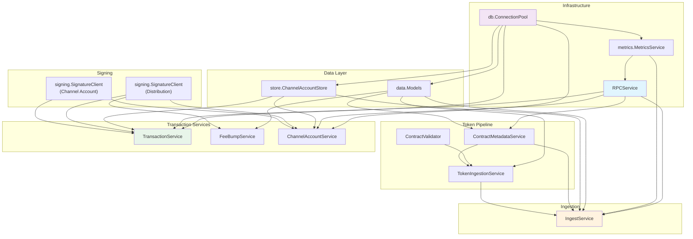
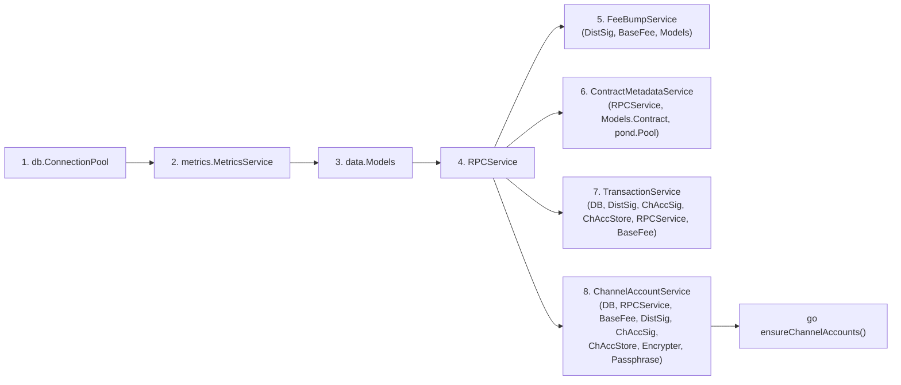
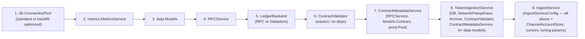

# Services Architecture

## Service Pattern

Services in this codebase follow two construction patterns, chosen by dependency count. Both patterns validate eagerly at startup.

### Pattern A: Options Struct + Validate (complex services, 5+ deps)

Used by `TransactionService`, `ChannelAccountService`, `FeeBumpService`, and `IngestService`. Dependencies are grouped into a named Options struct with a dedicated `Validate()` or `ValidateOptions()` method. The constructor calls `Validate()` before constructing the struct, failing fast on misconfiguration.

```go
// Pattern A: Options struct (TransactionService example)
type TransactionServiceOptions struct {
    DB                                 db.ConnectionPool
    DistributionAccountSignatureClient signing.SignatureClient
    ChannelAccountSignatureClient      signing.SignatureClient
    ChannelAccountStore                store.ChannelAccountStore
    RPCService                         RPCService
    BaseFee                            int64
}

func (o *TransactionServiceOptions) ValidateOptions() error {
    if o.DB == nil {
        return fmt.Errorf("DB cannot be nil")
    }
    if o.DistributionAccountSignatureClient == nil {
        return fmt.Errorf("distribution account signature client cannot be nil")
    }
    if o.RPCService == nil {
        return fmt.Errorf("rpc client cannot be nil")
    }
    if o.ChannelAccountSignatureClient == nil {
        return fmt.Errorf("channel account signature client cannot be nil")
    }
    if o.ChannelAccountStore == nil {
        return fmt.Errorf("channel account store cannot be nil")
    }
    if o.BaseFee < int64(txnbuild.MinBaseFee) {
        return fmt.Errorf("base fee is lower than the minimum network fee")
    }
    return nil
}

func NewTransactionService(opts TransactionServiceOptions) (*transactionService, error) {
    if err := opts.ValidateOptions(); err != nil {
        return nil, fmt.Errorf("validating transaction service options: %w", err)
    }
    return &transactionService{/* copy fields from opts */}, nil
}
```

### Pattern B: Direct Parameters + Inline Validation (simple services)

Used by `RPCService`, `ContractMetadataService`, `KMSImportService`, `TokenIngestionService`, and `ContractValidator`. Validation is done inline in the constructor body. This style is preferred when the service has 4 or fewer required dependencies, or when the parameters are primitive types (strings, URLs).

```go
// Pattern B: Direct parameters (NewRPCService example)
func NewRPCService(rpcURL, networkPassphrase string, httpClient utils.HTTPClient, metricsService metrics.MetricsService) (*rpcService, error) {
    if rpcURL == "" {
        return nil, errors.New("rpcURL is required")
    }
    // ... inline checks per parameter
    return &rpcService{...}, nil
}
```

`ContractValidator` is a special case: it takes no dependencies at all (the `wazero` WASM runtime is initialized internally) and uses `NewContractValidator() ContractValidator`.

### Why this pattern

- **Explicit dependency declaration**: all required collaborators are visible at the call site
- **Fail-fast misconfiguration**: validation happens at startup, not at first use
- **Testability**: every dependency is an interface, so tests can substitute mock implementations
- **Interface-hidden implementation**: constructors return the interface type (or the concrete type with an unexported struct `transactionService`), so callers are decoupled from internals

**Key source files:**
- `internal/services/transaction_service.go` — canonical Options + ValidateOptions example (lines 52–101)
- `internal/services/fee_bump_service.go` — Validate variant (method name differs from ValidateOptions)
- `internal/services/rpc_service.go` — direct params example (lines 53–77)
- `internal/services/contract_validator.go` — zero-dep constructor (lines 147–155)

---

## Service Inventory

All 9 services live in `internal/services/`. The table shows the constructor style and public interface:

| Service | File(s) | Purpose | Constructor Style |
|---------|---------|---------|-------------------|
| **RPCService** | `rpc_service.go` | Stellar RPC client: get/send transactions, health, ledgers, ledger entries, simulation, heartbeat | Direct params |
| **TransactionService** | `transaction_service.go` | Build and sign transactions with a channel account; Soroban fee adjustment | Options struct |
| **FeeBumpService** | `fee_bump_service.go` | Wrap inner transactions in fee-bump envelopes; sponsorship eligibility checks | Options struct |
| **ChannelAccountService** | `channel_account_service.go` | Ensure N channel accounts exist on-chain; create/delete in batches | Options struct |
| **IngestService** | `ingest.go` + `ingest_live.go` + `ingest_backfill.go` | Orchestrate live and backfill ingestion; retry logic; cursor management | Config struct |
| **TokenIngestionService** | `token_ingestion.go` | Process trustline / native / SAC balance changes; populate initial token snapshot | Direct params |
| **ContractMetadataService** | `contract_metadata.go` | Fetch SEP-41 and SAC contract metadata via RPC simulation; cache in DB | Direct params |
| **ContractValidator** | `contract_validator.go` | Validate WASM contract code for SEP-41 compliance using wazero runtime | No deps |
| **KMSImportService** | `kms_import_key_service.go` | Import distribution account private key into AWS KMS | Direct params |

### Key Public Methods

**RPCService** (interface — 10 methods):
- `GetTransaction(hash)` / `GetTransactions(startLedger, cursor, limit)` — query submitted transactions
- `SendTransaction(xdr)` — submit a transaction to the network
- `GetHealth()` — poll RPC node health
- `GetLedgers(start, limit)` / `GetLedgerEntries(keys)` — ledger and state fetches
- `SimulateTransaction(xdr, resourceConfig)` — simulate Soroban transaction for fee estimation
- `GetHeartbeatChannel()` — chan for async health notifications
- `NetworkPassphrase()` — returns configured network passphrase

**TransactionService** (interface — 2 methods):
- `BuildAndSignTransactionWithChannelAccount(ctx, tx, simulationResponse)` — assigns channel account as source, validates operations, adjusts Soroban fees, signs
- `NetworkPassphrase()` — delegates to DistributionAccountSignatureClient

**FeeBumpService** (interface — 2 methods):
- `WrapTransaction(ctx, tx, feePayer)` — wraps inner transaction in a fee-bump envelope
- `GetMaximumBaseFee()` — returns configured BaseFee

**ChannelAccountService** (interface — 1 method):
- `EnsureChannelAccounts(ctx, count)` — creates or deletes channel accounts until the count matches

**IngestService** (interface — 2 methods):
- `Run(ctx)` — starts live or backfill ingestion based on `IngestionMode`
- `PersistLedgerData(ctx, seq, buffer, cursorName)` — atomically writes one ledger to DB

**TokenIngestionService** (interface — 2 methods):
- `PopulateAccountTokens(ctx)` — snapshot current token balances from history archive (first-run)
- `ProcessTokenChanges(ctx, txDB, changes)` — apply trustline, native, SAC, contract balance changes

**ContractMetadataService** (interface — 3 methods):
- `FetchSep41Metadata(ctx, contractID)` — fetch name/symbol/decimals via RPC simulation
- `FetchSACMetadata(ctx, contractID)` — fetch SAC asset info via RPC simulation
- `FetchSingleField(ctx, contractID, field)` — fetch one contract field

**ContractValidator** (interface — 2 methods):
- `ValidateFromContractCode(ctx, wasmHash, code)` — validate WASM binary for SEP-41 interface compliance
- `Close()` — release wazero runtime resources

**KMSImportService** (interface — 1 method):
- `ImportDistributionAccountKey(ctx, privateKey)` — import key material into KMS; validates key matches configured public key

---

## Dependency Graph

### Full Dependency Diagram



### Serve Path

`internal/serve/serve.go:initHandlerDeps` constructs services in this order:



Services wired in the serve path: `RPCService`, `FeeBumpService`, `ContractMetadataService`, `TransactionService`, `ChannelAccountService`.

**Not wired in serve path:** `IngestService`, `TokenIngestionService`, `ContractValidator`, `KMSImportService`.

### Ingest Path

`internal/ingest/ingest.go:setupDeps` constructs services in this order:



Services wired in the ingest path: `RPCService`, `ContractValidator`, `ContractMetadataService`, `TokenIngestionService`, `IngestService`.

**Not wired in ingest path:** `FeeBumpService`, `TransactionService`, `ChannelAccountService`, `KMSImportService`.

### Shared Dependencies

The following dependencies are constructed once and shared across multiple services in both paths:

| Dependency | Shared By | Notes |
|-----------|-----------|-------|
| `db.ConnectionPool` | Models, ChAccStore, TxService, ChAccService | Backfill mode uses a different pool variant (`OpenDBConnectionPoolForBackfill`) with async commit and `work_mem` tuning |
| `metrics.MetricsService` | RPCService, IngestService | Created from `sqlxDB`; RPCService uses it for RPC latency histograms |
| `data.Models` | FeeBumpService, ContractMetadataService, TokenIngestionService, IngestService | All model access goes through `Models`; constructed once per process |
| `RPCService` | TransactionService, FeeBumpService (indirect), ChannelAccountService, ContractMetadataService, IngestService | Single instance per process — `GetHeartbeatChannel()` is a shared broadcast channel |
| `ContractMetadataService` | TokenIngestionService, IngestService | Constructed once; shared pool (`pond.Pool`) for parallel simulation calls |

**Key source files:**
- `internal/services/ingest.go` — `IngestServiceConfig` struct (lines 42–78), `IngestService` interface
- `internal/serve/serve.go:initHandlerDeps` — serve-path construction order (lines 120–212)
- `internal/ingest/ingest.go:setupDeps` — ingest-path construction order (lines 115–251)
- `internal/signing/signature_client.go` — `SignatureClient` interface (cross-ref for DistSig/ChAccSig)


---

**Topics:** [[entries/index]] | [[entries/services]]
