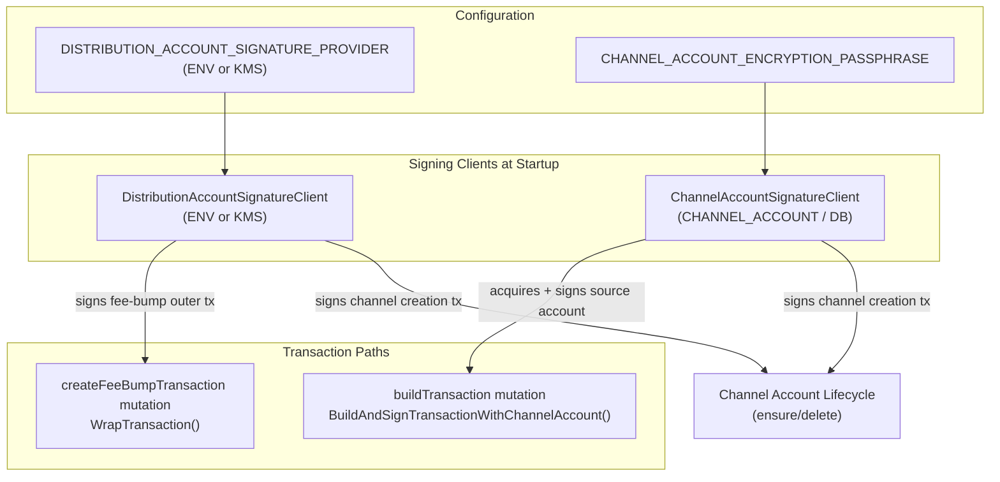
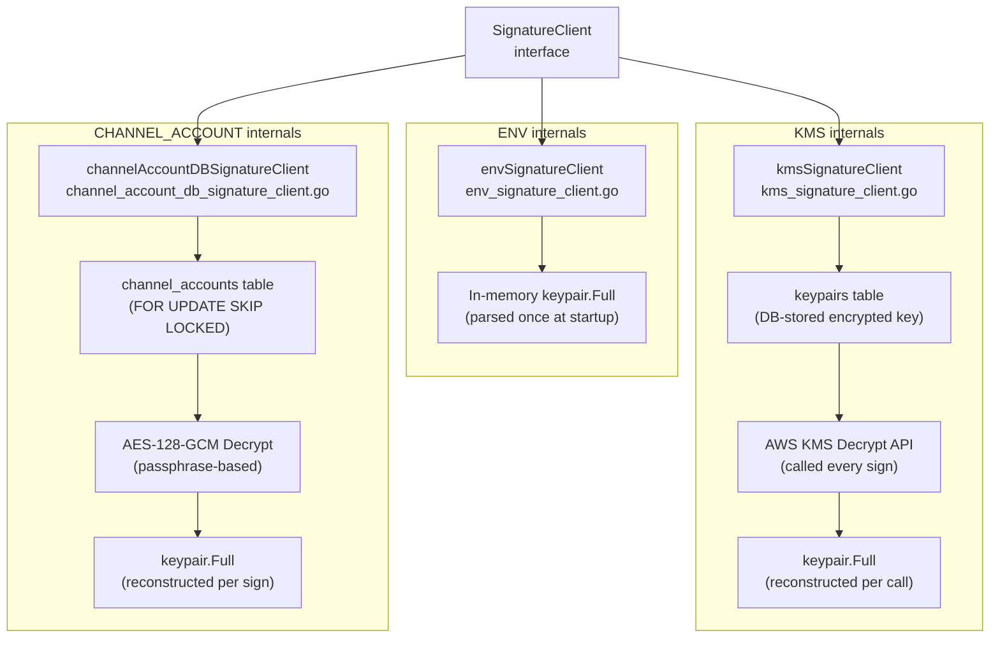
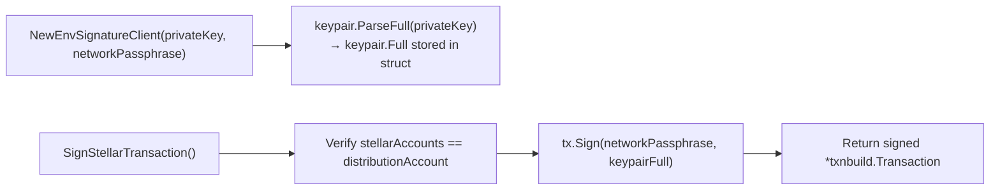
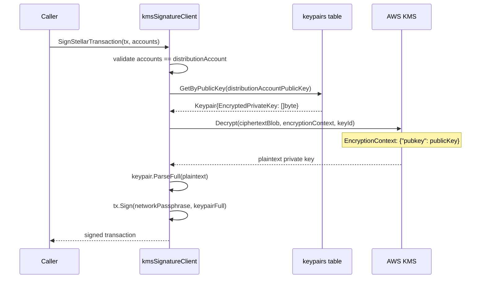
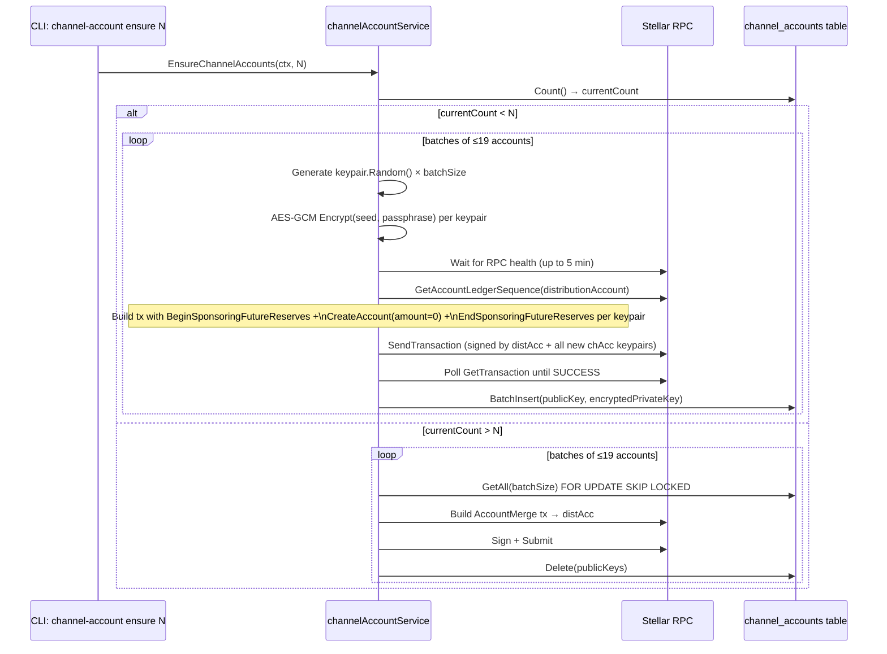
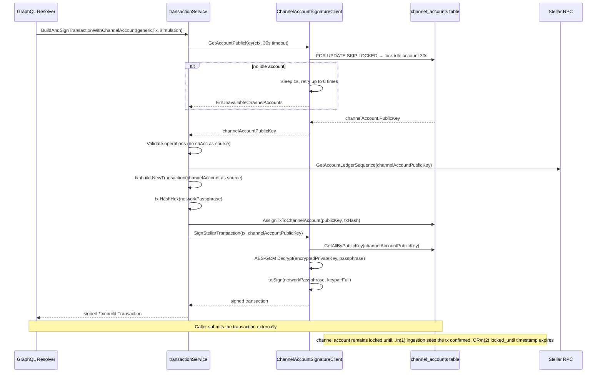
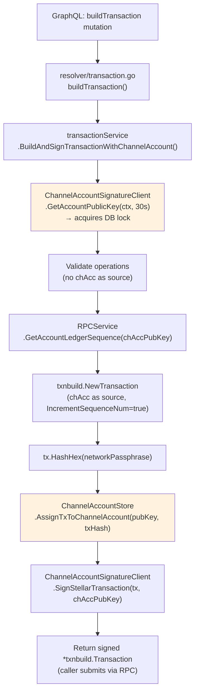
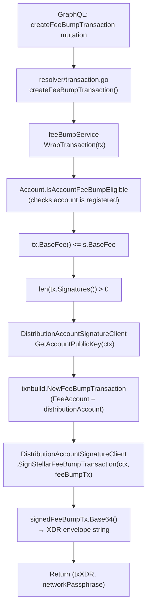
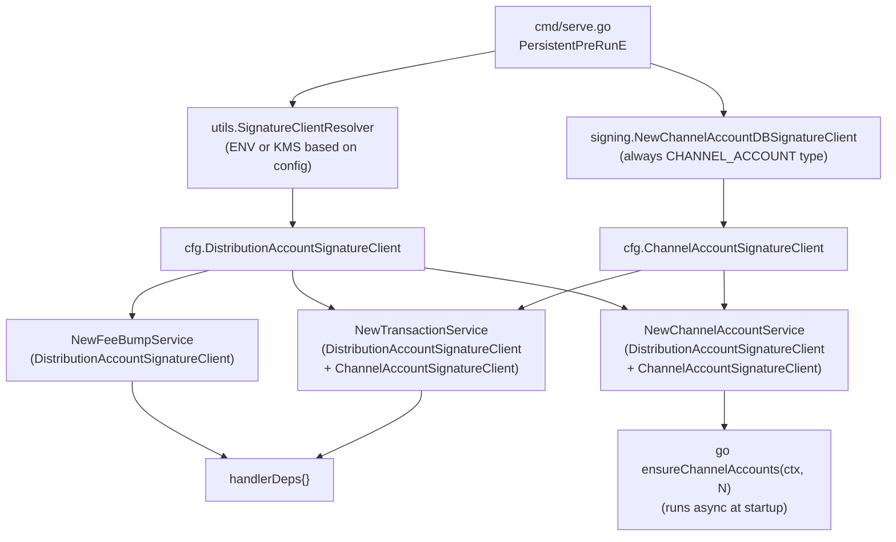

# Signing & Channel Accounts Architecture

## High-Level Overview

The signing subsystem is split into two independent signing identities that serve different purposes:

- **Distribution account** — sponsors channel account creation, pays fee-bump fees, holds the operator's main Stellar account. Uses ENV or KMS provider.
- **Channel accounts** — serve as source accounts for built transactions, enabling concurrent submission. Always uses the CHANNEL_ACCOUNT provider backed by DB-encrypted keypairs.



The two clients are constructed at `cmd/serve.go` startup and injected into every service that needs them. The distribution client type is resolved by `cmd/utils/utils.go:SignatureClientResolver` based on `DISTRIBUTION_ACCOUNT_SIGNATURE_PROVIDER`. The channel account client is always `NewChannelAccountDBSignatureClient`.

---

## SignatureClient Interface

All three providers implement the same 4-method interface:

```go
type SignatureClient interface {
    NetworkPassphrase() string
    GetAccountPublicKey(ctx context.Context, opts ...int) (string, error)
    SignStellarTransaction(ctx context.Context, tx *txnbuild.Transaction, stellarAccounts ...string) (*txnbuild.Transaction, error)
    SignStellarFeeBumpTransaction(ctx context.Context, feeBumpTx *txnbuild.FeeBumpTransaction) (*txnbuild.FeeBumpTransaction, error)
}
```

The `opts ...int` variadic in `GetAccountPublicKey` is a channel-account-specific extension: when called with an integer, it sets `locked_until` to that many seconds from now (default: 60s). The ENV and KMS providers ignore this parameter.



### Provider Comparison

| Aspect | ENV | KMS | CHANNEL_ACCOUNT |
|---|---|---|---|
| Key storage | Environment variable | AWS KMS + `keypairs` DB table | `channel_accounts` DB table |
| Key material in memory | Yes (at startup) | No (decrypted per call) | No (decrypted per sign) |
| Caching | Permanent (process lifetime) | None | None |
| `SignStellarFeeBumpTransaction` | Supported | Supported | `ErrNotImplemented` |
| `GetAccountPublicKey` behavior | Returns fixed public key | Returns fixed public key | Acquires a lock on an idle account |
| Intended for | Distribution account (simple ops) | Distribution account (production) | Channel accounts only |

### Sentinel Errors (`signature_client.go`)

| Error | When |
|---|---|
| `ErrInvalidTransaction` | `nil` transaction passed to any Sign method |
| `ErrNotImplemented` | `SignStellarFeeBumpTransaction` called on channel account client |
| `ErrInvalidSignatureClientType` | `SignatureClientResolver` receives unknown type string |

### `SignatureClientType` Enum

```go
EnvSignatureClientType            SignatureClientType = "ENV"
KMSSignatureClientType            SignatureClientType = "KMS"
ChannelAccountSignatureClientType SignatureClientType = "CHANNEL_ACCOUNT"
```

**Source files:** `internal/signing/signature_client.go`

---

## ENV Provider

The simplest provider. The private key is parsed once at startup from `DISTRIBUTION_ACCOUNT_PRIVATE_KEY` into a `keypair.Full` stored in struct memory.



Key behaviors:
- `SignStellarTransaction` rejects any `stellarAccounts` that aren't the distribution account — prevents misuse as a general-purpose signer.
- No DB access, no network calls — all signing is purely in-memory.
- `GetAccountPublicKey` returns `distributionAccountFull.Address()` — trivial, always succeeds.

**Source file:** `internal/signing/env_signature_client.go`

---

## KMS Provider

Production-grade provider. The private key is stored encrypted in the `keypairs` table; AWS KMS decrypts it on every signing call. There is **no caching** — each `SignStellarTransaction` or `SignStellarFeeBumpTransaction` call reads from DB and calls the KMS API.



### Encryption Context

The KMS `DecryptInput` always includes an encryption context: `{"pubkey": <distributionAccountPublicKey>}`. This context was set during the original KMS `Encrypt` call. If the public key doesn't match, KMS will reject the decryption — binding the ciphertext to a specific Stellar account.

```go
// awskms/utils.go
const PrivateKeyEncryptionContext = "pubkey"

func GetPrivateKeyEncryptionContext(publicKey string) map[string]*string {
    return map[string]*string{
        PrivateKeyEncryptionContext: aws.String(publicKey),
    }
}
```

### KMS Client Construction

`awskms.GetKMSClient(awsRegion)` creates an AWS session with the specified region and returns a `*kms.KMS`. The `kmsSignatureClient` takes a `kmsiface.KMSAPI` interface, making it testable without real AWS credentials.

**Source files:** `internal/signing/kms_signature_client.go`, `internal/signing/awskms/utils.go`

---

## Channel Account Lifecycle

Channel accounts are Stellar accounts whose keypairs are stored encrypted in the `channel_accounts` table. They serve as source accounts for built transactions, allowing many transactions to be submitted concurrently (one channel account per in-flight transaction).

### Provisioning Flow

Run once via `go run main.go channel-account ensure <N>`:



**Key constant:** `MaximumCreateAccountOperationsPerStellarTx = 19` — each sponsored account creation requires 3 operations (`BeginSponsoringFutureReserves`, `CreateAccount`, `EndSponsoringFutureReserves`), so 19 is the practical limit before hitting Stellar's ~100-operation payload cap; it's also driven by signature count limits.

Channel accounts are created with `amount = "0"` — the reserve is sponsored by the distribution account via `BeginSponsoringFutureReserves`.

### Transaction Submission Flow (Acquire → Build → Sign → Release)



### Locking SQL

Channel account acquisition is a single atomic SQL statement using `FOR UPDATE SKIP LOCKED`:

```sql
UPDATE channel_accounts
SET
    locked_tx_hash = NULL,
    locked_at = NOW(),
    locked_until = NOW() + INTERVAL '<N> seconds'
WHERE public_key = (
    SELECT
        public_key
    FROM channel_accounts
    WHERE
        locked_until IS NULL
        OR locked_until < NOW()
    ORDER BY random()
    LIMIT 1
    FOR UPDATE SKIP LOCKED
)
RETURNING *;
```

`ORDER BY random()` distributes load across channel accounts rather than always hitting the same one. `SKIP LOCKED` ensures concurrent callers never block each other — they simply skip rows held by another transaction.

### Release Mechanisms

Two independent release paths ensure accounts aren't permanently stuck:

| Mechanism | Trigger | SQL |
|---|---|---|
| **Ingestion-based (primary)** | Ledger is ingested; tx confirmed on-chain | `UnassignTxAndUnlockChannelAccounts()` — sets `locked_tx_hash=NULL`, `locked_at=NULL`, `locked_until=NULL` WHERE `locked_tx_hash = ANY(txHashes)` |
| **Time expiry (fallback)** | `locked_until < NOW()` at next acquisition attempt | The `GetAndLockIdleChannelAccount` WHERE clause naturally reclaims expired locks |

The ingestion path runs inside `PersistLedgerData` → `unlockChannelAccounts()` within the same database transaction that writes the ledger data. This guarantees that channel accounts are released exactly when the confirming ledger is committed to the DB.

Unlock is keyed on **inner transaction hashes** — for fee-bumped transactions, the channel account's `locked_tx_hash` matches the inner transaction hash, not the outer fee-bump hash.

### Retry Configuration (`channelAccountDBSignatureClient`)

| Constant | Value | Description |
|---|---|---|
| `DefaultRetryCount` | 6 | Max acquisition attempts before returning error |
| `DefaultRetryInterval` | 1s | Sleep between attempts |
| `lockedUntil` default | 60s | Lock duration when `GetAccountPublicKey` called without opts |
| `timeoutInSecs` in BuildAndSign | 30s | Lock duration passed from `transactionService` |

After 6 retries (6 seconds total), returns `ErrUnavailableChannelAccounts`. The distinction between `ErrNoIdleChannelAccountAvailable` (accounts exist but are all locked) and `ErrNoChannelAccountConfigured` (table is empty) guides operators in diagnosing the cause.

**Source files:** `internal/signing/channel_account_db_signature_client.go`, `internal/signing/store/channel_accounts_model.go`, `internal/services/channel_account_service.go`, `internal/services/ingest_live.go`

---

## Encryption

### AES-128-GCM (`internal/signing/utils/encrypter.go`)

Channel account private keys are encrypted with AES-128-GCM before being stored in the database.

```mermaid
flowchart TD
    subgraph "Encrypt(message, passphrase)"
        P1["passphrase"] --> H1["SHA-256 hash"]
        H1 --> K1["key = hash[:16]\n(first 16 bytes = 128-bit key)"]
        K1 --> AES1["aes.NewCipher(key)"]
        AES1 --> GCM1["cipher.NewGCM(block)"]
        GCM1 --> Nonce1["rand.Read(nonce)\nnonce size from GCM"]
        Nonce1 --> Seal["gcm.Seal(nonce, nonce, message, nil)\nnonce prepended to ciphertext"]
        Seal --> B64["base64.StdEncoding.Encode\n→ stored string"]
    end

    subgraph "Decrypt(encryptedMessage, passphrase)"
        P2["passphrase"] --> H2["SHA-256 hash"]
        H2 --> K2["key = hash[:16]"]
        K2 --> AES2["aes.NewCipher(key)"]
        AES2 --> GCM2["cipher.NewGCM(block)"]
        B641["base64.Decode(encryptedMessage)"] --> Split["Split: nonce = decoded[:nonceSize]\nciphertext = decoded[nonceSize:]"]
        GCM2 --> Open["gcm.Open(nil, nonce, ciphertext, nil)"]
        Split --> Open
        Open --> Plain["plaintext private key (string)"]
    end
```



**Key derivation:** `SHA-256(passphrase)[:16]` — takes the first 16 bytes of the SHA-256 hash of the passphrase to get a 128-bit AES key. This is why the constant is `keyBytes = 16`.

**Nonce:** Random per encryption call, prepended to the ciphertext blob before base64 encoding. GCM nonce size is always 12 bytes.

**Output format:** `base64(nonce || gcm_ciphertext_with_tag)` — the GCM authentication tag is embedded in the ciphertext by `Seal`.

### `PrivateKeyEncrypter` Interface

```go
type PrivateKeyEncrypter interface {
    Encrypt(ctx context.Context, message, passphrase string) (string, error)
    Decrypt(ctx context.Context, encryptedMessage, passphrase string) (string, error)
}
```

`DefaultPrivateKeyEncrypter{}` is the sole implementation. The interface exists for testability — mocks can return controlled plaintexts without real encryption.

### Channel Account vs KMS Encryption

| | Channel Account keys | KMS distribution key |
|---|---|---|
| Algorithm | AES-128-GCM (Go stdlib) | AWS KMS Encrypt/Decrypt |
| Key derivation | `SHA-256(passphrase)[:16]` | AWS manages the key material |
| Stored in | `channel_accounts.encrypted_private_key` (text) | `keypairs.encrypted_private_key` (bytes) |
| Encryption triggered by | `EnsureChannelAccounts` at provisioning time | External AWS tooling before storing in DB |
| Decryption triggered by | Every `SignStellarTransaction` call on channel client | Every `SignStellarTransaction` / `SignStellarFeeBumpTransaction` call on KMS client |
| Passphrase source | `CHANNEL_ACCOUNT_ENCRYPTION_PASSPHRASE` | AWS KMS key ARN + encryption context |

**Source file:** `internal/signing/utils/encrypter.go`

---

## Transaction Signing Flows

### `buildTransaction` — Channel Account Path

End-to-end flow from GraphQL mutation to signed transaction envelope:



The `MaxTimeoutInSeconds = 300` constant caps the transaction's time bounds to 5 minutes, regardless of what the caller requests. This prevents channel accounts from being locked indefinitely if a client submits a transaction with a far-future timeout.

### `createFeeBumpTransaction` — Distribution Account Path



The inner transaction must already be signed by the caller — `feeBumpService` only adds the distribution account's fee-bump signature. `ErrNoSignaturesProvided` is returned if the inner transaction has no signatures.

### Dependency Wiring at Startup (`cmd/serve.go` → `internal/serve/serve.go`)



`ensureChannelAccounts` runs in a goroutine at startup — it doesn't block the HTTP server from starting, so the API is immediately available even while channel accounts are being provisioned.

**Source files:**
- `cmd/serve.go` — serve command DI wiring
- `cmd/utils/utils.go` — `SignatureClientResolver` factory
- `internal/serve/serve.go` — `initHandlerDeps` service construction
- `internal/services/transaction_service.go` — `BuildAndSignTransactionWithChannelAccount`
- `internal/services/fee_bump_service.go` — `WrapTransaction`

---

**Topics:** [[entries/index]] | [[entries/signing]]
