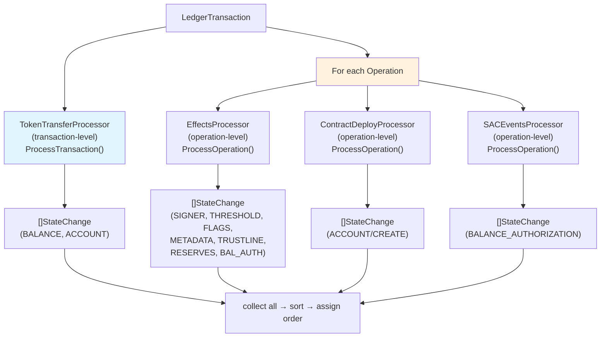
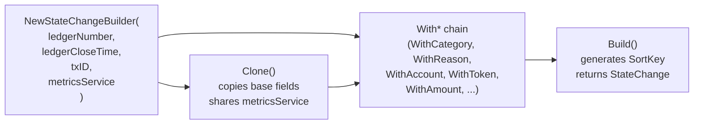
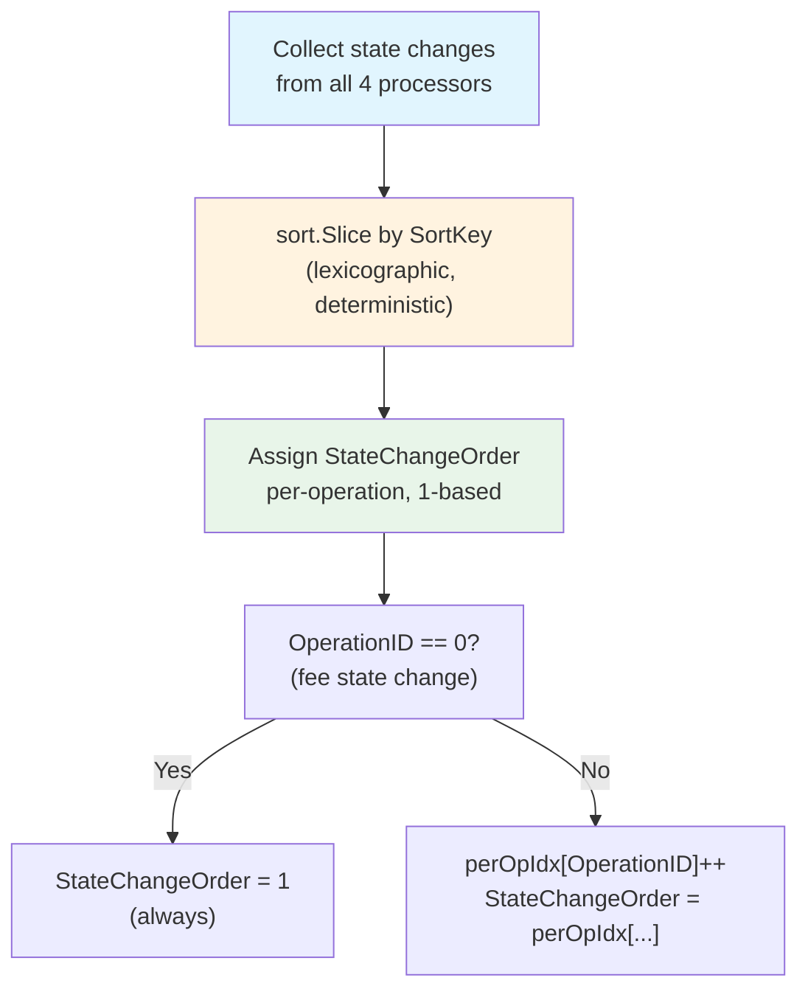
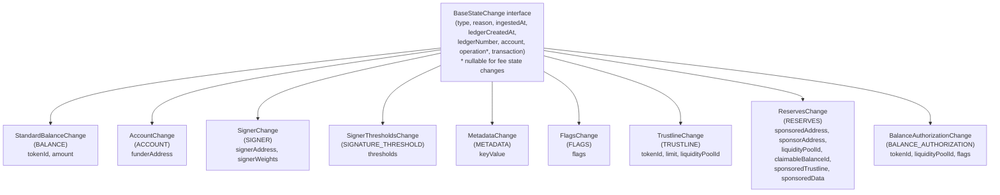

# State Changes

State changes are the fundamental unit of account history in wallet-backend. Every payment, signer update, flag change, and sponsorship event becomes one or more `StateChange` records in the `state_changes` hypertable.

## What State Changes Are

A `StateChange` represents a discrete mutation to blockchain state — one event in an account's history. Every state change belongs to exactly one account (`account_id`), one transaction (`to_id`), and optionally one operation (`operation_id = 0` for fee state changes). State changes are the only data type that stores _what changed_, not just _what happened_.

**Critical distinction — two different "change" concepts:**

| Concept | Producers | Stored in | Purpose |
|---------|-----------|-----------|---------|
| **StateChange** | 4 state change processors | `state_changes` hypertable | Account history: payments, signers, flags, sponsorships |
| **LedgerChangeProcessor outputs** | `TrustlinesProcessor`, `AccountsProcessor`, `SACBalancesProcessor` | `trustline_balances`, `native_balances`, `sac_balances` | Current token holdings snapshot |

The `LedgerChangeProcessor` outputs (`TrustlineChange`, `AccountChange`, `SACBalanceChange`) track **token lifecycle** (trustline add/remove, balance upserts). They are NOT state changes and never flow to `state_changes`.

**Key source files:**
- `internal/indexer/types/types.go` — `StateChange` struct, `StateChangeCategory`, `StateChangeReason` constants (lines 439–475)
- `internal/indexer/indexer.go` — `getTransactionStateChanges()`, `processTransaction()` ordering logic

## Two-Axis Taxonomy

Every state change has exactly two axes of classification: **Category** (what kind of entity changed) and **Reason** (how it changed).

```mermaid
graph TD
    SC["StateChange"]
    SC --> CAT["Category (what changed)"]
    SC --> RSN["Reason (how it changed)"]

    CAT --> BALANCE["BALANCE"]
    CAT --> ACCOUNT["ACCOUNT"]
    CAT --> SIGNER["SIGNER"]
    CAT --> SIG_THRESH["SIGNATURE_THRESHOLD"]
    CAT --> METADATA["METADATA"]
    CAT --> FLAGS["FLAGS"]
    CAT --> TRUSTLINE["TRUSTLINE"]
    CAT --> RESERVES["RESERVES"]
    CAT --> BAL_AUTH["BALANCE_AUTHORIZATION"]
    CAT --> AUTH["AUTHORIZATION"]

    RSN --> CREATE["CREATE"]
    RSN --> MERGE["MERGE"]
    RSN --> DEBIT["DEBIT"]
    RSN --> CREDIT["CREDIT"]
    RSN --> MINT["MINT"]
    RSN --> BURN["BURN"]
    RSN --> ADD["ADD"]
    RSN --> REMOVE["REMOVE"]
    RSN --> UPDATE["UPDATE"]
    RSN --> LOW["LOW"]
    RSN --> MEDIUM["MEDIUM"]
    RSN --> HIGH["HIGH"]
    RSN --> HOME_DOMAIN["HOME_DOMAIN"]
    RSN --> SET["SET"]
    RSN --> CLEAR["CLEAR"]
    RSN --> DATA_ENTRY["DATA_ENTRY"]
    RSN --> SPONSOR["SPONSOR"]
    RSN --> UNSPONSOR["UNSPONSOR"]
```



### Category → Reason → Producer Mapping

| Category | Valid Reasons | Producing Processor |
|----------|--------------|---------------------|
| `BALANCE` | `DEBIT`, `CREDIT`, `MINT`, `BURN` | `TokenTransferProcessor` |
| `ACCOUNT` | `CREATE`, `MERGE` | `TokenTransferProcessor` + `ContractDeployProcessor` |
| `SIGNER` | `ADD`, `REMOVE`, `UPDATE` | `EffectsProcessor` |
| `SIGNATURE_THRESHOLD` | `LOW`, `MEDIUM`, `HIGH` | `EffectsProcessor` |
| `METADATA` | `HOME_DOMAIN`, `DATA_ENTRY` | `EffectsProcessor` |
| `FLAGS` | `SET`, `CLEAR` | `EffectsProcessor` |
| `TRUSTLINE` | `ADD`, `REMOVE`, `UPDATE` | `EffectsProcessor` |
| `RESERVES` | `SPONSOR`, `UNSPONSOR` | `EffectsProcessor` |
| `BALANCE_AUTHORIZATION` | `SET`, `CLEAR` | `EffectsProcessor` + `SACEventsProcessor` |

**Note on BALANCE_AUTHORIZATION overlap:** The `EffectsProcessor` handles classic trustline authorization (G... address, `EffectTrustlineFlagsUpdated`). The `SACEventsProcessor` handles Soroban SAC authorization (`set_authorized` events). Both emit `BALANCE_AUTHORIZATION` state changes, but via different code paths for different address types.

**Constants source:** `internal/indexer/types/types.go` lines 439–475

## Producing Processors

State changes are produced by four processors. The `TokenTransferProcessor` is **transaction-level** (processes an entire transaction at once via `ProcessTransaction`). The other three are **operation-level** (implement `OperationProcessorInterface` with `ProcessOperation`).



### TokenTransferProcessor

**Source:** `internal/indexer/processors/token_transfer.go`

Processes an entire transaction using `eventsProcessor.EventsFromTransaction()` from the Stellar SDK. Converts token transfer events (transfer, mint, burn, clawback) into `BALANCE` and `ACCOUNT` state changes.

**Fee events** are a special case: the processor collects all fee events for the transaction, sums them to a net fee amount, and emits a single `BALANCE/DEBIT` state change with `OperationID = 0`. This is the only case where `OperationID` is zero in the normal flow.

**Non-fee events** are routed by event type:
- `Transfer` → `BALANCE/DEBIT` for sender + `BALANCE/CREDIT` for receiver
- `Mint` → `BALANCE/MINT` for recipient
- `Burn` → `BALANCE/BURN` for holder
- `Clawback` → `BALANCE/BURN` from holder, `BALANCE/CREDIT` to issuer
- `AccountMerge` → `ACCOUNT/MERGE` for merged account

### EffectsProcessor

**Source:** `internal/indexer/processors/effects.go`

Derives effects from ledger changes using `Effects(opWrapper)`. Handles 7 of the 9 categories. Each effect maps to a state change category and reason through a switch on `EffectType`.

Key behaviors:
- **Signer effects** (`EffectSignerCreated/Removed/Updated`): extracts signer address and weight old/new from ledger changes
- **Threshold effects** (`EffectAccountThresholdsUpdated`): emits up to three separate state changes — one per threshold level (LOW/MEDIUM/HIGH) that changed
- **Trustline flag effects** (`EffectTrustlineFlagsUpdated`): note that `effect.Address` is the operation source (issuer), not the trustor; the processor extracts the actual trustor from `effect.Details`
- **New trustline** (`EffectTrustlineCreated`): emits both a `TRUSTLINE/ADD` and a `BALANCE_AUTHORIZATION/SET` (the initial authorization flags)
- **Sponsorship effects**: 15 effect variants covering account, claimable balance, data, signer, and trustline sponsorships

### ContractDeployProcessor

**Source:** `internal/indexer/processors/contract_deploy.go`

Only processes `InvokeHostFunction` operations. Emits `ACCOUNT/CREATE` state changes for contract deployments, including sub-invocations (walks the authorization tree). The deployer address is recorded in `DeployerAccountID`.

### SACEventsProcessor

**Source:** `internal/indexer/processors/contracts/sac.go`

Processes `set_authorized` Soroban events from SAC (Stellar Asset Contract) operations. Emits `BALANCE_AUTHORIZATION` state changes.

Handles both address types differently:
- **Contract addresses** (C...): extracts authorization from contract data ledger changes via `extractContractAuthorizationChanges()`
- **Classic addresses** (G...): extracts authorization from trustline ledger changes via `extractTrustlineFlagChanges()`

## StateChangeBuilder Pattern

All four processors use `StateChangeBuilder` to construct state changes via a fluent API.



**Source:** `internal/indexer/processors/state_change_builder.go`

`Clone()` is used extensively when a processor needs to produce multiple state changes from a shared base (e.g., fee + operation changes from the same transaction, or multiple threshold changes from the same effect). The clone copies the base struct, so any `With*` calls on the clone don't affect the original.

### SortKey

`Build()` calls `generateSortKey()` to produce an 18-field deterministic string:

```
{toID}:{category}:{reason}:{accountID}:{tokenID}:{amount}:{signerID}:{spenderID}:{sponsoredID}:{sponsorID}:{signerWeightOld}:{signerWeightNew}:{thresholdOld}:{thresholdNew}:{trustlineLimitOld}:{trustlineLimitNew}:{flags}:{keyValue}
```

The SortKey is only used for ordering within `processTransaction()` and is never persisted to the database.

## Ordering: SortKey → StateChangeOrder

After collecting all state changes from all processors, `processTransaction()` in `internal/indexer/indexer.go` sorts and assigns orders:



**Why deterministic ordering matters:** Re-ingestion of the same ledger must produce identical `StateChangeOrder` values — the 4-column composite primary key `(to_id, operation_id, state_change_order, ledger_created_at)` would be violated by inconsistent ordering. The SortKey encodes enough content to guarantee stable ordering regardless of processor execution order or Go map iteration order.

**Fee state changes always get `StateChangeOrder = 1`** because they have `OperationID = 0` and the per-operation counter only applies to operation-scoped state changes.

**Source:** `processTransaction()` in `internal/indexer/indexer.go` lines 264–280

## Database Schema

The `state_changes` hypertable is created by `internal/db/migrations/2025-06-10.4-statechanges.sql`:

```sql
PRIMARY KEY (to_id, operation_id, state_change_order, ledger_created_at)
```

**Key schema decisions:**

| Aspect | Value | Rationale |
|--------|-------|-----------|
| Partition column | `ledger_created_at` | Time-range pruning (dominant query pattern) |
| `segmentby` | `account_id` | Collocates same-account rows for vectorized filtering |
| Sparse index | `bloom(state_change_category), bloom(state_change_reason)` | Allows chunk-level skipping for category/reason filters |
| Chunk skipping | `to_id`, `operation_id` | Enables `enable_chunk_skipping` for lookup by transaction/operation |
| `state_change_order` CHECK | `>= 1` | Enforces 1-based ordering invariant |
| Category CHECK | 10 values | Schema-level validation of the taxonomy |
| Reason CHECK | 18 values (or NULL) | Reason is nullable (some categories omit it) |

**The fat-row design:** The `state_changes` table stores all possible fields for all categories in a single wide table. Most fields are nullable — each row only populates the subset relevant to its category. This simplifies queries (one table, no joins) at the cost of nullable columns. See the `StateChange` struct comment at `types.go:534` for the full field-usage-by-category breakdown.

**`operation_id = 0`** is the sentinel for fee state changes. These state changes have no associated operation (they arise from transaction fee processing). The `operation` field in GraphQL is nullable for exactly this reason.

**Cross-reference:** See [[references/data-layer]] for the full hypertable comparison table, decomposed cursor optimization, and ROW_NUMBER PARTITION BY pattern used by `StateChangeModel.BatchGetByToIDs`.

## GraphQL Type Hierarchy

The single `StateChange` Go struct is dispatched to 9 concrete GraphQL types at the resolver boundary:



**Type dispatch:** `convertStateChangeTypes()` in `internal/serve/graphql/resolvers/utils.go` switches on `StateChangeCategory` and returns the appropriate concrete model struct. The `AUTHORIZATION` category has no concrete type and returns `nil` (default case).

**Source:** `internal/serve/graphql/schema/statechange.graphqls`, `internal/serve/graphql/resolvers/utils.go`

### Access Patterns

State changes are accessible from four entry points:

| Entry Point | Filter Support | Notes |
|-------------|----------------|-------|
| Root `stateChanges` | None (global) | `queries.graphqls` |
| `Account.stateChanges` | `AccountStateChangeFilterInput` (category + reason + time range) | `account.graphqls` |
| `Transaction.stateChanges` | None | `transaction.graphqls` |
| `Operation.stateChanges` | None | `operation.graphqls` |

**Cross-reference:** See [[references/graphql-api]] for dataloaders (`StateChangesByToIDLoader`, `StateChangesByOperationIDLoader`), cursor encoding, and complexity limits.

## Query Methods

`StateChangeModel` in `internal/data/statechanges.go` provides:

| Method | Use Case | Cursor Type |
|--------|----------|-------------|
| `GetAll` | Root `stateChanges` query | 4-col: `(ledger_created_at, to_id, operation_id, state_change_order)` |
| `BatchGetByAccountAddress` | `Account.stateChanges` resolver | 4-col (same) |
| `BatchGetByToID` | `Transaction.stateChanges` (single tx) | 3-col: `(to_id, operation_id, state_change_order)` |
| `BatchGetByToIDs` | DataLoader: batch tx → state changes | 3-col with ROW_NUMBER PARTITION BY |
| `BatchGetByOperationID` | `Operation.stateChanges` (single op) | 3-col: `(to_id, operation_id, state_change_order)` |
| `BatchGetByOperationIDs` | DataLoader: batch op → state changes | 3-col with ROW_NUMBER PARTITION BY |
| `BatchCopy` | Backfill bulk insert via `pgx.CopyFrom` | — |

The 4-column cursor (`ledger_created_at, to_id, operation_id, state_change_order`) is unique to state changes — it's the most complex cursor in the system. `BatchGetByToIDs` and `BatchGetByOperationIDs` use a 3-column cursor within a parent scope because `ledger_created_at` is implicit when scoped to a single transaction or operation.

**Cross-reference:** See [[references/data-layer]] for the decomposed cursor SQL optimization that replaces `ROW()` tuple comparisons with OR-expanded column comparisons for TimescaleDB chunk pruning.

---

**Topics:** [[entries/index]] | [[references/ingestion-pipeline]] | [[references/data-layer]] | [[references/graphql-api]]
