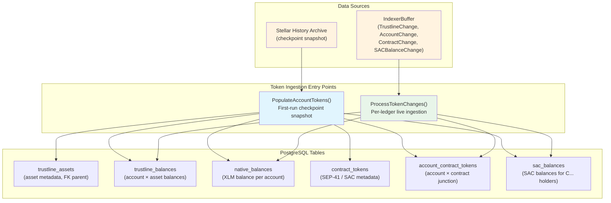
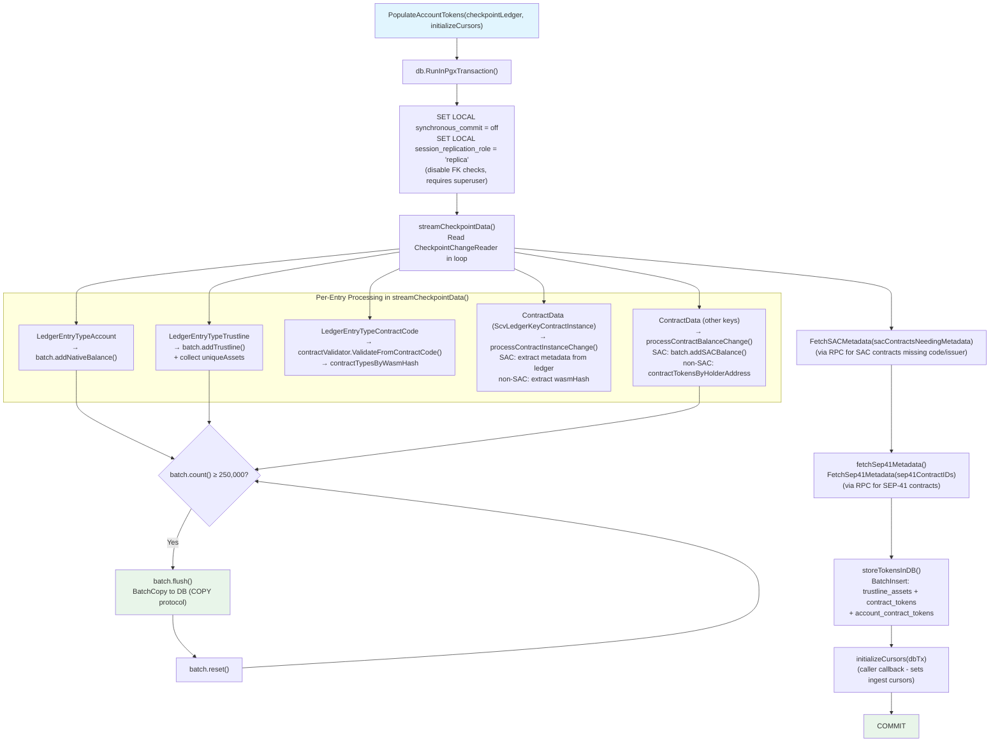
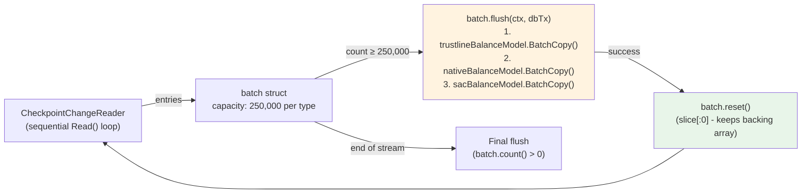
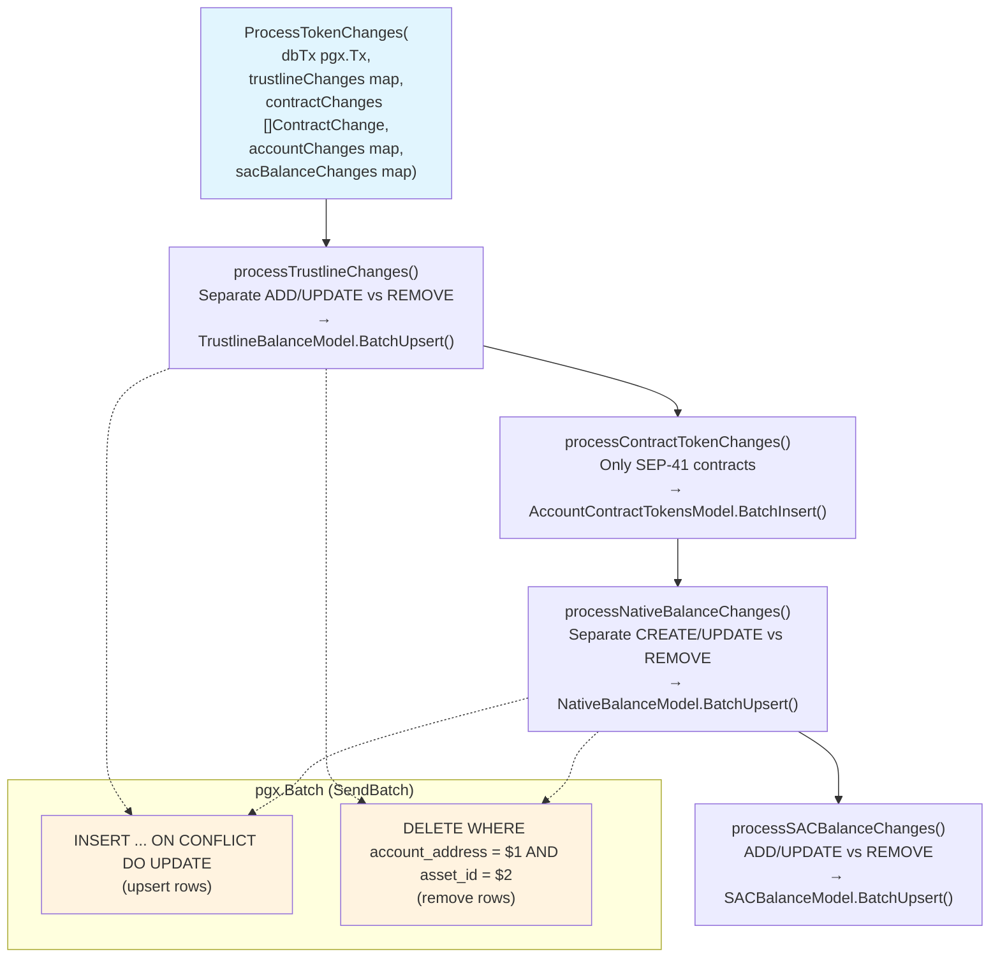
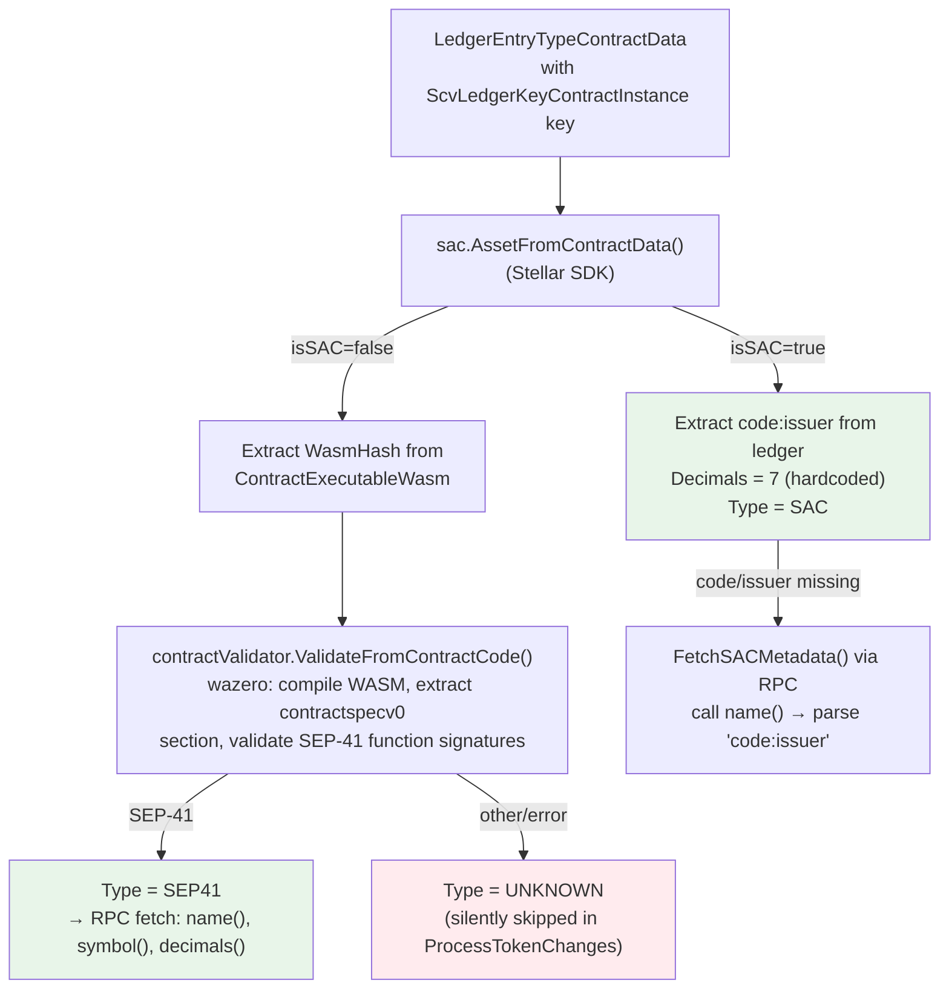
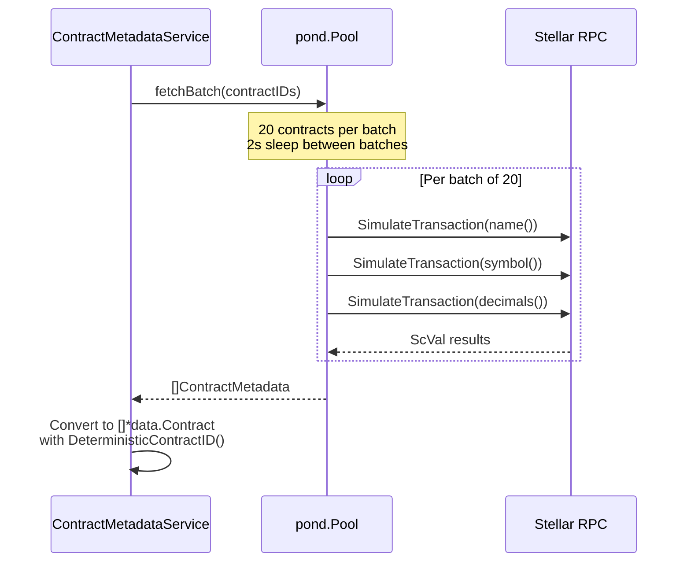
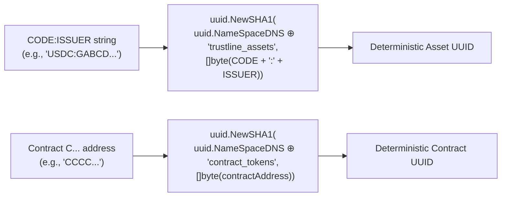
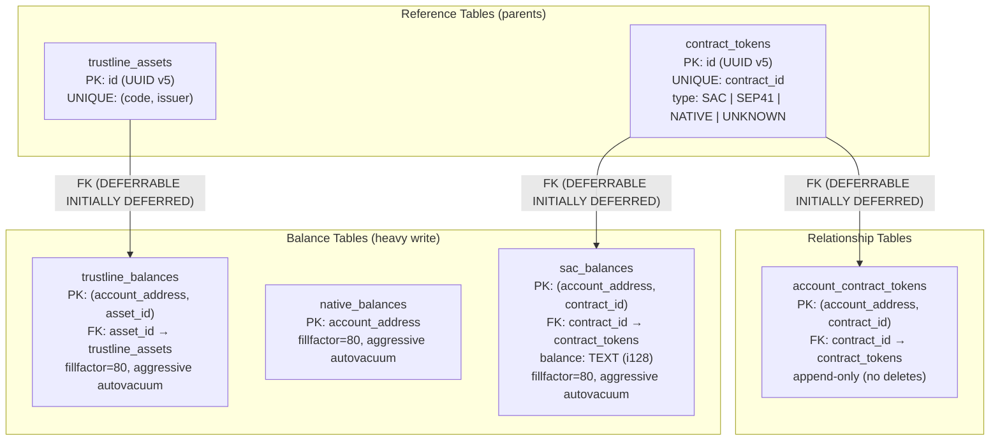

# Token Ingestion Subsystem

## Overview

The token ingestion subsystem manages PostgreSQL storage of **account token holdings**: native XLM balances, classic Stellar trustlines, SAC (Stellar Asset Contract) balances for contract addresses, and SEP-41 contract token relationships. It operates in two distinct modes — checkpoint population (initial snapshot) and live ingestion (per-ledger streaming) — exposed through a single `TokenIngestionService` interface.



**Key source files:**
- `internal/services/token_ingestion.go` — `TokenIngestionService` interface + both modes
- `internal/services/contract_validator.go` — WASM-based SEP-41 contract spec validation
- `internal/services/contract_metadata.go` — RPC-based metadata fetcher (name, symbol, decimals)
- `internal/data/trustline_balances.go`, `native_balances.go`, `sac_balances.go` — balance models
- `internal/data/contract_tokens.go`, `account_contract_tokens.go`, `trustline_assets.go` — token models

---

## Token Type Taxonomy

The subsystem tracks three distinct token types with separate storage semantics:

| Token Type | Holder Types | Storage Table | Ingestion Mode |
|-----------|-------------|---------------|---------------|
| **Native XLM** | G... accounts only | `native_balances` | Checkpoint + Live |
| **Classic Trustlines** | G... accounts only | `trustline_balances` (FK→ `trustline_assets`) | Checkpoint + Live |
| **SAC Balances** | **C... contracts only** | `sac_balances` (FK→ `contract_tokens`) | Checkpoint + Live |
| **SEP-41 Relationships** | G... and C... | `account_contract_tokens` (junction) | Checkpoint + Live |

**Critical distinction**: G-addresses holding SAC tokens (Stellar Asset Contracts) store their balances in `trustline_balances` — not `sac_balances`. The `sac_balances` table is exclusively for contract addresses (C...) holding SAC positions. This split mirrors how Stellar's ledger represents SAC state: G-address SAC holdings appear as standard trustlines.

---

## Checkpoint Population Flow (First Run)

`PopulateAccountTokens()` runs exactly once on first start to snapshot the entire ledger state from the Stellar history archive.



### Streaming Batch Architecture

To handle 30M+ trustline entries without exhausting memory, the checkpoint reader uses a streaming batch pattern:



- `flushBatchSize = 250,000` — threshold before flushing to DB
- `batch.reset()` uses `slice[:0]` semantics to reuse backing arrays and avoid GC pressure
- All three balance types are flushed together in a single `flush()` call
- `BatchCopy` uses `pgx.CopyFrom` (PostgreSQL binary COPY protocol) for maximum throughput

### FK Constraint Strategy

The checkpoint transaction disables FK checks (`session_replication_role = 'replica'`) because balance entries may appear in the ledger *before* their parent contract instance entries. The code guarantees integrity: all parent rows (`trustline_assets`, `contract_tokens`) are collected and inserted via `storeTokensInDB()` before the transaction commits.

---

## Live Ingestion Flow (Per-Ledger)

`ProcessTokenChanges()` is called by `ingest_live.go:PersistLedgerData()` inside the per-ledger atomic transaction. It processes changes emitted by the indexer's four change processors.



### Change Type Handling

| Change Map | Source Processor | Semantics |
|-----------|-----------------|-----------|
| `trustlineChangesByTrustlineKey` | `TrustlinesProcessor` | `ADD`/`UPDATE` → upsert; `REMOVE` → delete |
| `contractChanges` | `SACInstanceProcessor` | Only `SEP41` type appended to `account_contract_tokens` |
| `accountChangesByAccountID` | `AccountsProcessor` | `CREATE`/`UPDATE` → upsert; `REMOVE` → delete |
| `sacBalanceChangesByKey` | `SACBalancesProcessor` | `ADD`/`UPDATE` → upsert; `REMOVE` → delete |

All four `BatchUpsert` methods use `pgx.Batch.SendBatch()` — a pipeline of multiple SQL statements sent in a single round-trip.

---

## Contract Classification Pipeline

Contract tokens require a two-stage classification before storage:



### SEP-41 Validation Logic

The `ContractValidator` uses `wazero` (a pure-Go WASM runtime) to:
1. Compile the WASM bytecode
2. Extract the `contractspecv0` custom section (XDR-encoded)
3. Unmarshal `ScSpecEntry` entries
4. Verify all 10 required function signatures match SEP-41:

| Function | Required Inputs | Output |
|---------|----------------|--------|
| `balance` | `id: Address` | `i128` |
| `allowance` | `from: Address, spender: Address` | `i128` |
| `decimals` | _(none)_ | `u32` |
| `name` | _(none)_ | `String` |
| `symbol` | _(none)_ | `String` |
| `approve` | `from, spender: Address, amount: i128, expiration_ledger: u32` | _(void)_ |
| `transfer` | `from, to: Address, amount: i128` OR `from: Address, to_muxed: MuxedAddress, amount: i128` (CAP-67) | _(void)_ |
| `transfer_from` | `spender, from, to: Address, amount: i128` | _(void)_ |
| `burn` | `from: Address, amount: i128` | _(void)_ |
| `burn_from` | `spender, from: Address, amount: i128` | _(void)_ |

The `transfer` function accepts both the classic and CAP-67 `MuxedAddress` variant.

### RPC Metadata Fetching

`ContractMetadataService` fetches `name`, `symbol`, and `decimals` by simulating RPC calls:



- `simulateTransactionBatchSize = 20` — parallel contracts per batch
- `batchSleepDuration = 2s` — delay between batches to avoid RPC overload
- A **dummy keypair** (`keypair.MustRandom()`) is used as the transaction source account since simulation does not validate signatures or balances

---

## Deterministic ID System

Both trustline assets and contract tokens use UUID v5 (SHA-1) for deterministic ID generation, enabling batch inserts without DB round-trips:



Both IDs are stable: the same input always produces the same UUID across restarts, nodes, and runs. This enables `ON CONFLICT DO NOTHING` upserts without needing to SELECT first.

---

## Database Schema



### Autovacuum Tuning

All three balance tables share identical aggressive autovacuum settings (tuned for rows updated every ledger):

| Parameter | Value | Default | Rationale |
|-----------|-------|---------|-----------|
| `fillfactor` | 80 | 100 | 20% free space enables HOT updates (no dead tuple per update) |
| `autovacuum_vacuum_scale_factor` | 0.02 | 0.20 | Trigger at 2% dead rows instead of 20% |
| `autovacuum_analyze_scale_factor` | 0.01 | 0.10 | Refresh stats at 1% change |
| `autovacuum_vacuum_cost_delay` | 0 | 2ms | No throttle between vacuum cycles |
| `autovacuum_vacuum_cost_limit` | 1000 | 200 | 5× page budget per cycle |

The FK constraints use `DEFERRABLE INITIALLY DEFERRED` so they are checked at transaction COMMIT rather than per-statement — essential for the checkpoint population flow where balance rows are inserted before their parent rows.

---

## Interface Reference

### `TokenIngestionService`

```
PopulateAccountTokens(ctx, checkpointLedger uint32, initializeCursors func(pgx.Tx) error) error
ProcessTokenChanges(ctx, dbTx pgx.Tx,
    trustlineChangesByTrustlineKey map[indexer.TrustlineChangeKey]types.TrustlineChange,
    contractChanges []types.ContractChange,
    accountChangesByAccountID map[string]types.AccountChange,
    sacBalanceChangesByKey map[indexer.SACBalanceChangeKey]types.SACBalanceChange) error
```

Two constructors exist:
- `NewTokenIngestionService()` — full constructor for live ingestion (requires archive, validator, metadata service)
- `NewTokenIngestionServiceForLoadtest()` — minimal constructor for load testing (no archive/validator/metadata; supports `ProcessTokenChanges` only)

### Data Model Interfaces

| Interface | Key Methods | Table |
|----------|------------|-------|
| `TrustlineAssetModelInterface` | `BatchInsert()` | `trustline_assets` |
| `TrustlineBalanceModelInterface` | `GetByAccount()`, `BatchUpsert()`, `BatchCopy()` | `trustline_balances` |
| `NativeBalanceModelInterface` | `GetByAccount()`, `BatchUpsert()`, `BatchCopy()` | `native_balances` |
| `SACBalanceModelInterface` | `GetByAccount()`, `BatchUpsert()`, `BatchCopy()` | `sac_balances` |
| `ContractModelInterface` | `GetExisting()`, `BatchInsert()` | `contract_tokens` |
| `AccountContractTokensModelInterface` | `GetByAccount()`, `BatchInsert()` | `account_contract_tokens` |

### Write Method Comparison

| Method | Protocol | Used By | Conflict Strategy |
|--------|---------|---------|------------------|
| `BatchCopy` | PostgreSQL COPY (binary) | Checkpoint population | None (FK checks disabled) |
| `BatchUpsert` | `pgx.Batch` (`SendBatch`) | Live ingestion per-ledger | `ON CONFLICT DO UPDATE SET` |
| `BatchInsert` (assets/contracts) | UNNEST upsert | Both modes | `ON CONFLICT DO NOTHING` |
| `BatchInsert` (account_contract_tokens) | UNNEST upsert | Both modes | `ON CONFLICT DO NOTHING` |

---

## Constants

| Constant | Value | Location | Description |
|---------|-------|----------|-------------|
| `flushBatchSize` | 250,000 | `token_ingestion.go` | Max entries before batch flush during checkpoint |
| `simulateTransactionBatchSize` | 20 | `contract_metadata.go` | Parallel RPC simulations per batch |
| `batchSleepDuration` | 2s | `contract_metadata.go` | Delay between RPC simulation batches |
| `contractSpecV0SectionName` | `"contractspecv0"` | `contract_validator.go` | WASM custom section name for contract spec |

---

**Topics:** [[entries/index]] | [[entries/ingestion]] | [[entries/data-layer]]
