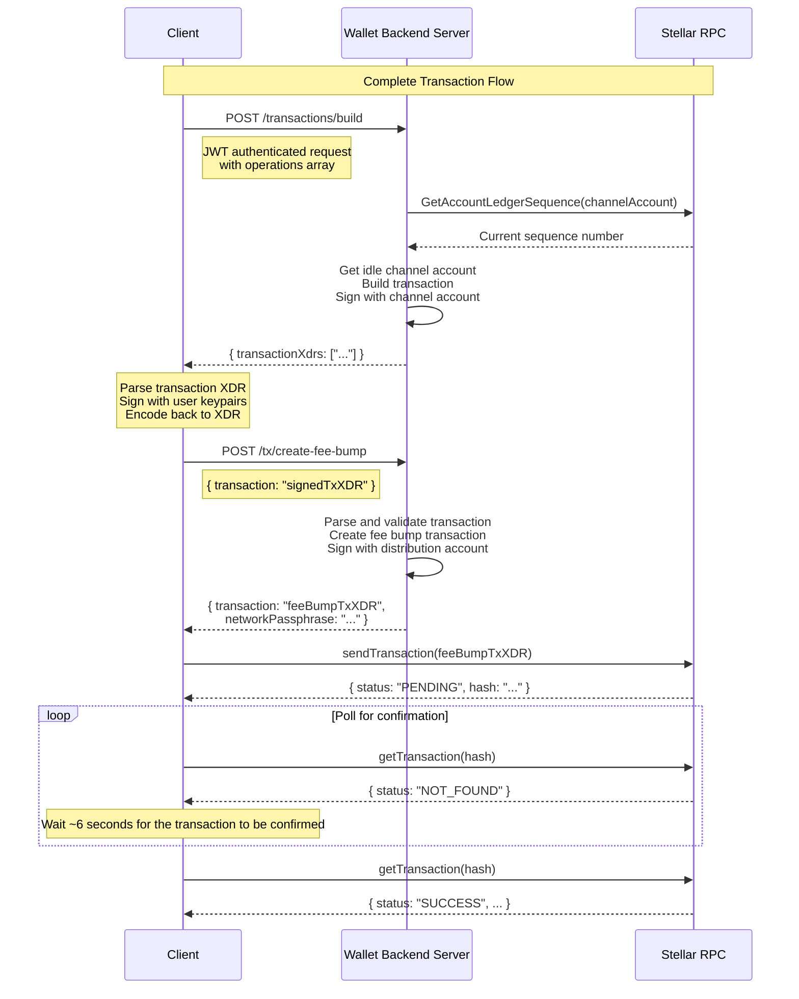

# API Reference

The wallet-backend provides two core API services that simplify Stellar transaction management for wallet applications.

**In this document:**
- [Transaction Building and Fee Bump](#transaction-building-and-fee-bump)
- [GraphQL API](#graphql-api)

## Transaction Building and Fee Bump

1. **Transaction Building** (`POST /transactions/build`):
   - Uses pre-funded channel accounts to handle sequence numbers automatically
   - Provides high throughput by eliminating client-side sequence number management
   - Returns signed transaction XDRs ready for client signature

2. **Fee Bump Transactions** (`POST /tx/create-fee-bump`):
   - Automatically creates and signs fee bump transactions
   - Uses a distribution account to cover transaction fees
   - Returns a complete fee bump transaction ready for submission

### Complete Transaction Flow

The following diagram illustrates the complete transaction lifecycle:



## GraphQL API

The wallet-backend provides a powerful GraphQL API that enables flexible querying of blockchain data including transactions, operations, accounts, and state changes. The GraphQL API is designed for applications that need efficient, customizable data retrieval with strong typing and introspection capabilities.

**Key Benefits:**
- **Flexible Queries**: Request exactly the data you need, nothing more
- **Strong Typing**: Full type safety with schema introspection
- **Efficient Data Loading**: Built-in DataLoaders prevent N+1 queries
- **Cursor-based Pagination**: Relay-style pagination for all list queries
- **Rich Relationships**: Easily traverse relationships between accounts, transactions, operations, and state changes

**In this section:**
- [Getting Started](#getting-started)
- [Queries](#queries)
- [Mutations](#mutations)
- [Pagination](#pagination-1)
- [State Changes](#state-changes)
- [Error Handling](#error-handling)
- [Performance Features](#performance-features)

### Getting Started

**Endpoint**: `POST /graphql`

**Authentication**: All GraphQL requests require JWT authentication. See the [Authentication](../../../README.md#authentication) section in the main README for details.

**Quick Example:**

```bash
curl -X POST http://localhost:8080/graphql \
  -H "Content-Type: application/json" \
  -H "Authorization: Bearer YOUR_JWT_TOKEN" \
  -d '{
    "query": "{ transactionByHash(hash: \"abc123...\") { hash ledgerNumber envelopeXdr } }"
  }'
```

**Schema Introspection:**

You can explore the full schema using GraphQL introspection:

```graphql
query {
  __schema {
    types {
      name
      description
    }
  }
}
```

## Queries

The GraphQL API provides eight root queries for accessing blockchain data:

| # | Query | Description |
|---|-------|-------------|
| 1 | [`transactionByHash`](#1-get-transaction-by-hash) | Get a specific transaction by its hash |
| 2 | [`transactions`](#2-list-all-transactions) | List all transactions with pagination |
| 3 | [`accountByAddress`](#3-get-account-by-address) | Get account info and related data |
| 4 | [`operations`](#4-list-all-operations) | List all operations with pagination |
| 5 | [`operationById`](#5-get-operation-by-id) | Get a specific operation by ID |
| 6 | [`stateChanges`](#6-list-state-changes) | List all state changes with pagination |
| 7 | [`balancesByAccountAddress`](#7-get-account-balances) | Get all token balances for an account |
| 8 | [`balancesByAccountAddresses`](#8-get-multiple-account-balances) | Get token balances for multiple accounts |

### 1. Get Transaction by Hash

Retrieve a specific transaction by its hash.

```graphql
query GetTransaction {
  transactionByHash(hash: "abc123...") {
    hash
    envelopeXdr
    feeCharged
    resultCode
    metaXdr
    ledgerNumber
    ledgerCreatedAt
    isFeeBump
    ingestedAt

    # Related data
    accounts {
      address
    }

    operations(first: 10) {
      edges {
        node {
          id
          operationType
        }
      }
    }
  }
}
```

### 2. List All Transactions

Query transactions with cursor-based pagination.

```graphql
query ListTransactions {
  transactions(first: 10, after: "cursor123") {
    edges {
      node {
        hash
        ledgerNumber
        ledgerCreatedAt
      }
      cursor
    }
    pageInfo {
      hasNextPage
      hasPreviousPage
      startCursor
      endCursor
    }
  }
}
```

**Pagination Parameters:**
- `first: Int` - Return the first N items (forward pagination)
- `after: String` - Return items after this cursor
- `last: Int` - Return the last N items (backward pagination)
- `before: String` - Return items before this cursor

Note that you can only use `first/after` and `last/before`. Any other combination will result in an error.

### 3. Get Account by Address

Retrieve account information and related data.

```graphql
query GetAccount {
  accountByAddress(address: "GABC...") {
    address

    # Related transactions
    transactions(first: 10) {
      edges {
        node {
          hash
          ledgerNumber
        }
      }
      pageInfo {
        hasNextPage
      }
    }

    # Related operations
    operations(first: 20) {
      edges {
        node {
          id
          operationType
          operationXdr
        }
      }
    }

    # Related state changes with optional filtering
    stateChanges(
      filter: {
        transactionHash: "abc123..."  # Filter by transaction hash
        operationId: 12345            # Filter by operation ID
        category: "BALANCE"           # Filter by state change category
        reason: "CREDIT"              # Filter by state change reason
      }
      first: 50
    ) {
      edges {
        node {
          ... on StandardBalanceChange {
            type
            reason
            tokenId
            amount
            ledgerNumber
          }
          ... on SignerChange {
            type
            reason
            signerAddress
            signerWeights
          }
        }
      }
    }
  }
}
```

**State Changes Filter Parameters:**

The `stateChanges` field on Account supports an optional `filter` parameter with the following fields:

| Field | Type | Description |
|-------|------|-------------|
| `transactionHash` | `String` | Filter by transaction hash - returns only state changes from this transaction |
| `operationId` | `Int64` | Filter by operation ID - returns only state changes from this operation |
| `category` | `String` | Filter by state change category (e.g., `BALANCE`, `ACCOUNT`, `SIGNER`, `TRUSTLINE`, `RESERVES`) |
| `reason` | `String` | Filter by state change reason (e.g., `CREDIT`, `DEBIT`, `CREATE`, `MERGE`, `ADD`, `REMOVE`) |

### 4. List All Operations

Query operations across all transactions.

```graphql
query ListOperations {
  operations(first: 20) {
    edges {
      node {
        id
        operationType
        operationXdr
        resultCode
        successful
        ledgerNumber
        ledgerCreatedAt

        # Parent transaction
        transaction {
          hash
          envelopeXdr
        }

        # Related accounts
        accounts {
          address
        }
      }
      cursor
    }
    pageInfo {
      hasNextPage
      endCursor
    }
  }
}
```

**Operation Types:**

The `operationType` field supports all Stellar operation types:
- `CREATE_ACCOUNT`, `PAYMENT`, `PATH_PAYMENT_STRICT_RECEIVE`, `PATH_PAYMENT_STRICT_SEND`
- `MANAGE_SELL_OFFER`, `CREATE_PASSIVE_SELL_OFFER`, `MANAGE_BUY_OFFER`
- `SET_OPTIONS`, `CHANGE_TRUST`, `ALLOW_TRUST`, `ACCOUNT_MERGE`
- `MANAGE_DATA`, `BUMP_SEQUENCE`
- `CREATE_CLAIMABLE_BALANCE`, `CLAIM_CLAIMABLE_BALANCE`
- `BEGIN_SPONSORING_FUTURE_RESERVES`, `END_SPONSORING_FUTURE_RESERVES`, `REVOKE_SPONSORSHIP`
- `CLAWBACK`, `CLAWBACK_CLAIMABLE_BALANCE`, `SET_TRUST_LINE_FLAGS`
- `LIQUIDITY_POOL_DEPOSIT`, `LIQUIDITY_POOL_WITHDRAW`
- `INVOKE_HOST_FUNCTION`, `EXTEND_FOOTPRINT_TTL`, `RESTORE_FOOTPRINT` (Soroban)

### 5. Get Operation by ID

Retrieve a specific operation by its ID.

```graphql
query GetOperation {
  operationById(id: 12345) {
    id
    operationType
    operationXdr
    resultCode
    successful
    ledgerNumber
    ledgerCreatedAt

    transaction {
      hash
      ledgerNumber
    }

    accounts {
      address
    }

    stateChanges(first: 10) {
      edges {
        node {
          ... on StandardBalanceChange {
            tokenId
            amount
          }
        }
      }
    }
  }
}
```

### 6. List State Changes

Query all state changes.

```graphql
query ListStateChanges {
  stateChanges(first: 50) {
    edges {
      node {
        # Common fields (available on all state change types)
        type
        reason
        ledgerNumber
        ledgerCreatedAt
        ingestedAt

        account {
          address
        }

        operation {
          id
          operationType
        }

        transaction {
          hash
        }

        # Type-specific fields using fragments
        ... on StandardBalanceChange {
          tokenId
          amount
        }

        ... on AccountChange {
          funderAddress    # Address that funded the account (for CREATE reason)
        }

        ... on SignerChange {
          signerAddress
          signerWeights
        }

        ... on SignerThresholdsChange {
          thresholds
        }

        ... on MetadataChange {
          keyValue
        }

        ... on FlagsChange {
          flags
        }

        ... on TrustlineChange {
          tokenId
          limit
          keyValue         # JSON containing additional trustline data
        }

        ... on ReservesChange {
          sponsoredAddress
          sponsorAddress
          keyValue         # JSON containing additional reserve data
        }

        ... on BalanceAuthorizationChange {
          tokenId
          flags
          keyValue
        }
      }
      cursor
    }
    pageInfo {
      hasNextPage
      endCursor
    }
  }
}
```

### 7. Get Account Balances

Retrieve all token balances for an account, including native XLM, classic trustlines, and contract tokens.

```graphql
query GetAccountBalances {
  balancesByAccountAddress(address: "GABC...") {
    __typename
    tokenId
    tokenType
    balance

    ... on NativeBalance {
      minimumBalance
      buyingLiabilities
      sellingLiabilities
      lastModifiedLedger
    }

    ... on TrustlineBalance {
      code
      issuer
      type
      limit
      buyingLiabilities
      sellingLiabilities
      lastModifiedLedger
      isAuthorized
      isAuthorizedToMaintainLiabilities
    }

    ... on SACBalance {
      code
      issuer
      decimals
      isAuthorized
      isClawbackEnabled
    }

    ... on SEP41Balance {
      name
      symbol
      decimals
    }
  }
}
```

**Balance Types:**

The query returns different balance types based on the token:

| Type | Description | Key Fields |
|------|-------------|------------|
| `NativeBalance` | XLM (native asset) | `balance`, `tokenId`, `tokenType`, `minimumBalance`, `buyingLiabilities`, `sellingLiabilities`, `lastModifiedLedger` |
| `TrustlineBalance` | Classic Stellar trustlines | `code`, `issuer`, `limit`, `isAuthorized`, liabilities |
| `SACBalance` | Stellar Asset Contract (wrapped classic assets) | `code`, `issuer`, `decimals`, `isAuthorized`, `isClawbackEnabled` |
| `SEP41Balance` | Custom contract tokens (SEP-41 standard) | `name`, `symbol`, `decimals` |

**Common Fields (all balance types):**
- `balance: String!` - Current balance amount
- `tokenId: String!` - Contract ID (C...) for the token
- `tokenType: TokenType!` - One of: `NATIVE`, `CLASSIC`, `SAC`, `SEP41`

**NativeBalance-specific Fields:**
- `minimumBalance: String!` - Minimum balance required for reserves
- `buyingLiabilities: String!` - Liabilities from buy offers
- `sellingLiabilities: String!` - Liabilities from sell offers
- `lastModifiedLedger: UInt32!` - Ledger number when account was last modified

**Token Types:**
- `NATIVE` - XLM (Stellar's native asset)
- `CLASSIC` - Classic Stellar trustline assets
- `SAC` - Stellar Asset Contract (classic assets wrapped for Soroban)
- `SEP41` - Custom fungible tokens implementing SEP-41

**Example: Query with Type Fragments:**

```graphql
query GetDetailedBalances {
  balancesByAccountAddress(address: "GABC...") {
    tokenId
    balance
    tokenType

    ... on NativeBalance {
      minimumBalance
      buyingLiabilities
      sellingLiabilities
      lastModifiedLedger
    }

    ... on TrustlineBalance {
      code
      issuer
      limit
      isAuthorized
    }

    ... on SACBalance {
      code
      issuer
      decimals
    }

    ... on SEP41Balance {
      name
      symbol
      decimals
    }
  }
}
```

**Response Example:**

```json
{
  "data": {
    "balancesByAccountAddress": [
      {
        "tokenId": "CDLZFC3SYJYDZT7K67VZ75HPJVIEUVNIXF47ZG2FB2RMQQVU2HHGCYSC",
        "balance": "100.0000000",
        "tokenType": "NATIVE",
        "minimumBalance": "1.0000000",
        "buyingLiabilities": "0.0000000",
        "sellingLiabilities": "0.0000000",
        "lastModifiedLedger": 12345678
      },
      {
        "tokenId": "CAQCMV4JFG4EZXQEAV7TUV2E52DMSO2LQKBOSA7UM3B4NIP4DQJ3JHQJ",
        "balance": "500.0000000",
        "tokenType": "CLASSIC",
        "code": "USDC",
        "issuer": "GBBD47IF6LWK7P7MDEVSCWR7DPUWV3NY3DTQEVFL4NAT4AQH3ZLLFLA5",
        "limit": "922337203685.4775807",
        "isAuthorized": true
      },
      {
        "tokenId": "CCVLZ3SQWV4R5OYTXM7FYNVJLUBXZ3FXOVQXMKIFXFPJT3YNG3HLKXPS",
        "balance": "1000.0000000",
        "tokenType": "SEP41",
        "name": "Example Token",
        "symbol": "EXT",
        "decimals": 7
      }
    ]
  }
}
```

**How It Works:**

This query leverages the Account Token Cache (see [Account Token Cache](../../../README.md#account-token-cache) in the main README) to efficiently retrieve balances:

1. Fetches token identifiers from Redis cache (trustlines and contracts)
2. Retrieves contract metadata from PostgreSQL (for SAC/SEP-41 tokens)
3. Builds ledger keys and queries Stellar RPC for current balances
4. Parses XDR entries and returns typed balance responses

**Supported Address Types:**
- **G-addresses**: Returns native XLM, trustlines, SAC, and SEP-41 balances
- **C-addresses** (contract addresses): Returns SAC and SEP-41 balances only

**Error Handling:**

This query returns structured GraphQL errors with error codes in the `extensions` field:

| Error Code | Description |
|------------|-------------|
| `INVALID_ADDRESS` | The provided address is not a valid Stellar account (G...) or contract (C...) address |
| `RPC_UNAVAILABLE` | Failed to fetch balance data from Stellar RPC |
| `INTERNAL_ERROR` | An unexpected error occurred while processing the balance request |

**Error Response Example:**

```json
{
  "errors": [
    {
      "message": "invalid address format: must be a valid Stellar account (G...) or contract (C...) address",
      "extensions": {
        "code": "INVALID_ADDRESS",
        "address": "invalid-address"
      },
      "path": ["balancesByAccountAddress"]
    }
  ],
  "data": null
}
```

### 8. Get Multiple Account Balances

Retrieve token balances for multiple accounts in a single request. This query fetches balances for up to 20 accounts (configurable) with parallel processing for optimal performance.

```graphql
query GetMultipleAccountBalances {
  balancesByAccountAddresses(addresses: ["GABC...", "GDEF...", "CXYZ..."]) {
    address
    balances {
      __typename
      tokenId
      tokenType
      balance

      ... on NativeBalance {
        minimumBalance
        buyingLiabilities
        sellingLiabilities
        lastModifiedLedger
      }

      ... on TrustlineBalance {
        code
        issuer
        limit
        isAuthorized
      }

      ... on SACBalance {
        code
        issuer
        decimals
      }

      ... on SEP41Balance {
        name
        symbol
        decimals
      }
    }
    error
  }
}
```

**Response Type:**

The query returns an array of `AccountBalances` objects, one per requested address:

| Field | Type | Description |
|-------|------|-------------|
| `address` | `String!` | The Stellar account or contract address |
| `balances` | `[Balance!]!` | List of balances for this account (empty if not found) |
| `error` | `String` | Error message if balance fetch failed for this account |

**Response Example:**

```json
{
  "data": {
    "balancesByAccountAddresses": [
      {
        "address": "GABC...",
        "balances": [
          {
            "tokenId": "CDLZFC3SYJYDZT7K67VZ75HPJVIEUVNIXF47ZG2FB2RMQQVU2HHGCYSC",
            "balance": "100.0000000",
            "tokenType": "NATIVE",
            "minimumBalance": "1.0000000",
            "buyingLiabilities": "0.0000000",
            "sellingLiabilities": "0.0000000",
            "lastModifiedLedger": 12345678
          },
          {
            "tokenId": "CAQCMV4JFG4EZXQEAV7TUV2E52DMSO2LQKBOSA7UM3B4NIP4DQJ3JHQJ",
            "balance": "500.0000000",
            "tokenType": "CLASSIC",
            "code": "USDC",
            "issuer": "GBBD47IF6LWK7P7MDEVSCWR7DPUWV3NY3DTQEVFL4NAT4AQH3ZLLFLA5",
            "limit": "922337203685.4775807",
            "isAuthorized": true
          }
        ],
        "error": null
      },
      {
        "address": "GDEF...",
        "balances": [],
        "error": "account not found on the network"
      },
      {
        "address": "CXYZ...",
        "balances": [
          {
            "tokenId": "CCVLZ3SQWV4R5OYTXM7FYNVJLUBXZ3FXOVQXMKIFXFPJT3YNG3HLKXPS",
            "balance": "1000.0000000",
            "tokenType": "SEP41",
            "name": "Example Token",
            "symbol": "EXT",
            "decimals": 7
          }
        ],
        "error": null
      }
    ]
  }
}
```

**Error Handling:**

This query uses **per-account error handling**, meaning failures for individual accounts don't fail the entire request:

- **Per-account errors**: Stored in the `error` field of each `AccountBalances` object. Other accounts still return their balances successfully.
- **Query-level errors**: Only occur for validation failures (e.g., exceeding address limit, empty address array, invalid address format).

**Query-Level Error Codes:**

| Error Code | Description |
|------------|-------------|
| `EMPTY_ADDRESSES` | No addresses provided in the request |
| `TOO_MANY_ADDRESSES` | Number of addresses exceeds the configured limit (default: 20) |
| `INVALID_ADDRESS` | One or more addresses have invalid format (not G... or C...) |
| `RPC_UNAVAILABLE` | Failed to fetch balance data from Stellar RPC |
| `INTERNAL_ERROR` | Unexpected server error during processing |

**Key Features:**

- **Parallel Processing**: Balances for multiple accounts are fetched concurrently using worker pools
- **Single RPC Call**: All ledger entries are retrieved in a single RPC request for efficiency
- **Address Deduplication**: Duplicate addresses in the input are automatically deduplicated
- **Empty Results**: Returns empty `balances` array (not an error) when an account is not found

**Supported Address Types:**
- **G-addresses**: Returns native XLM, trustlines, SAC, and SEP-41 balances
- **C-addresses** (contract addresses): Returns SAC and SEP-41 balances only

**Configuration:**

The maximum number of addresses per query is configurable via the `--max-accounts-per-balances-query` flag or `MAX_ACCOUNTS_PER_BALANCES_QUERY` environment variable (default: 20).

## Mutations

The GraphQL API provides four mutations for managing accounts and transactions:

### 1. Register Account

Register an account to start tracking its state changes.

```graphql
mutation RegisterAccount {
  registerAccount(input: { address: "GABC..." }) {
    success
    account {
      address
    }
  }
}
```

**Error Codes:**
- `ACCOUNT_ALREADY_EXISTS` - Account is already registered
- `INVALID_ADDRESS` - Invalid Stellar address format
- `ACCOUNT_REGISTRATION_FAILED` - Registration failed

### 2. Deregister Account

Remove an account from tracking.

```graphql
mutation DeregisterAccount {
  deregisterAccount(input: { address: "GABC..." }) {
    success
    message
  }
}
```

**Error Codes:**
- `ACCOUNT_NOT_FOUND` - Account does not exist
- `ACCOUNT_DEREGISTRATION_FAILED` - Deregistration failed

### 3. Build Transaction

Build and sign a transaction using channel accounts.

```graphql
mutation BuildTransaction {
  buildTransaction(
    input: {
      transactionXdr: "AAAAA..."
      simulationResult: {
        transactionData: "AAA..."
        minResourceFee: "100"
        latestLedger: 12345
        events: ["event1", "event2"]
        results: ["result1"]
      }
    }
  ) {
    success
    transactionXdr
  }
}
```

**Input Fields:**
- `transactionXdr` (required): Base64-encoded transaction envelope XDR
- `simulationResult` (optional): For Soroban transactions, include simulation results
  - `transactionData`: Base64-encoded Soroban transaction data
  - `minResourceFee`: Minimum resource fee as string
  - `latestLedger`: Latest ledger number from simulation
  - `events`: Array of event XDRs
  - `results`: Array of result XDRs
  - `error`: Error message if simulation failed

**Error Codes:**
- `INVALID_TRANSACTION_XDR` - Cannot parse transaction XDR
- `INVALID_OPERATION_STRUCTURE` - Invalid operation structure (timeout, missing source, etc.)
- `INVALID_SOROBAN_TRANSACTION` - Invalid Soroban transaction (operation count, simulation issues)
- `CHANNEL_ACCOUNT_UNAVAILABLE` - No idle channel accounts available
- `FORBIDDEN_SIGNER` - Unauthorized signer for transaction
- `TRANSACTION_BUILD_FAILED` - General build failure

### 4. Create Fee Bump Transaction

Wrap a signed transaction in a fee bump transaction and sign it using the wallet backend's distribution account.

```graphql
mutation CreateFeeBump {
  createFeeBumpTransaction(input: { transactionXDR: "AAAAA..." }) {
    success
    transaction
    networkPassphrase
  }
}
```

**Error Codes:**
- `INVALID_TRANSACTION_XDR` - Cannot parse transaction XDR
- `FEE_BUMP_TX_NOT_ALLOWED` - Cannot wrap an existing fee bump transaction
- `INVALID_TRANSACTION` - Invalid transaction structure
- `FEE_EXCEEDS_MAXIMUM` - Fee exceeds maximum allowed (includes `maximumBaseFee` in extensions)
- `NO_SIGNATURES_PROVIDED` - Transaction has no signatures
- `ACCOUNT_NOT_ELIGIBLE_FOR_BEING_SPONSORED` - Account cannot be sponsored
- `FEE_BUMP_CREATION_FAILED` - General creation failure

## Pagination

The API uses **Relay-style cursor-based pagination** for all list queries. This provides stable pagination even when data changes.

**Forward Pagination:**

```graphql
# Get first page
query {
  transactions(first: 10) {
    edges {
      node { hash }
      cursor
    }
    pageInfo {
      hasNextPage
      endCursor
    }
  }
}

# Get next page
query {
  transactions(first: 10, after: "endCursorFromPreviousPage") {
    edges {
      node { hash }
      cursor
    }
    pageInfo {
      hasNextPage
      endCursor
    }
  }
}
```

**Backward Pagination:**

```graphql
# Get last page
query {
  transactions(last: 10) {
    edges {
      node { hash }
      cursor
    }
    pageInfo {
      hasPreviousPage
      startCursor
    }
  }
}

# Get previous page
query {
  transactions(last: 10, before: "startCursorFromCurrentPage") {
    edges {
      node { hash }
      cursor
    }
    pageInfo {
      hasPreviousPage
      startCursor
    }
  }
}
```

**PageInfo Fields:**
- `hasNextPage: Boolean!` - True if more items exist after the current page
- `hasPreviousPage: Boolean!` - True if more items exist before the current page
- `startCursor: String` - Cursor of the first item in the page
- `endCursor: String` - Cursor of the last item in the page

## State Changes

State changes represent modifications to an account's state. The API uses an **interface-based design** where all state changes implement the `BaseStateChange` interface.

**State Change Categories:**

| Category | Types | Description |
|----------|-------|-------------|
| `BALANCE` | `StandardBalanceChange` | Changes to an account's balance (payments, mints, burns, clawbacks) |
| `ACCOUNT` | `AccountChange` | Account creation or merge operations |
| `SIGNER` | `SignerChange` | Signer additions/removals |
| `SIGNATURE_THRESHOLD` | `SignerThresholdsChange` | Threshold changes (low/medium/high) |
| `METADATA` | `MetadataChange` | Account metadata/data entries |
| `FLAGS` | `FlagsChange` | Account flag changes |
| `TRUSTLINE` | `TrustlineChange` | Trustline limit changes |
| `RESERVES` | `ReservesChange` | Sponsorship relationships for an account's base reserves |
| `BALANCE_AUTHORIZATION` | `BalanceAuthorizationChange` | Balance authorization for trustlines and contract accounts |

**State Change Reasons:**

Reasons provide context for why a state change occurred:
- `CREATE`, `MERGE` - Account lifecycle
- `DEBIT`, `CREDIT` - Balance decreases/increases
- `MINT`, `BURN` - Token creation/destruction
- `ADD`, `REMOVE` - Adding/removing signers, trustlines
- `UPDATE` - Updates to the state. Could be account flags, reserves etc...
- `LOW`, `MEDIUM`, `HIGH` - Threshold levels
- `HOME_DOMAIN` - Home domain changes
- `SET`, `CLEAR` - Setting/clearing values
- `DATA_ENTRY` - Data entry operations
- `SPONSOR`, `UNSPONSOR` - Sponsorship relationship changes

**State Change Type-Specific Fields:**

| Type | Fields | Description |
|------|--------|-------------|
| `StandardBalanceChange` | `tokenId`, `amount` | Token identifier and change amount |
| `AccountChange` | `funderAddress` | Address that funded the account (for CREATE reason) |
| `SignerChange` | `signerAddress`, `signerWeights` | Signer address and weight changes |
| `SignerThresholdsChange` | `thresholds` | Threshold configuration changes |
| `MetadataChange` | `keyValue` | Metadata key-value changes |
| `FlagsChange` | `flags` | Array of flag names |
| `TrustlineChange` | `tokenId`, `limit`, `keyValue` | Trustline configuration and additional data |
| `ReservesChange` | `sponsoredAddress`, `sponsorAddress`, `keyValue` | Reserve sponsorship and additional data |
| `BalanceAuthorizationChange` | `tokenId`, `flags`, `keyValue` | Balance authorization flags |

**Example: Querying Specific State Change Types:**

```graphql
query GetBalanceChanges {
  stateChanges(first: 100) {
    edges {
      node {
        type
        reason

        ... on StandardBalanceChange {
          tokenId
          amount
          account {
            address
          }
          transaction {
            hash
          }
        }
      }
    }
  }
}
```

**Example: Querying state changes for a specific account:**

```graphql
query GetAccountStateChanges {
  accountByAddress(address: "GABC...") {
    stateChanges(first: 50) {
      edges {
        node {
          type
          reason
          ledgerNumber

          ... on StandardBalanceChange {
            tokenId
            amount
          }

          ... on SignerChange {
            signerAddress
            signerWeights
          }
        }
      }
    }
  }
}
```

**Field Structure Details:**

Several state change fields return JSON-formatted strings containing old and new values. Here are the structures:

1. **signerWeights** (SignerChange):
   - For new signers: `{"new": 1}`
   - For updated signers: `{"old": 1, "new": 2}`
   - For removed signers: `{"old": 1}`

2. **thresholds** (SignerThresholdsChange):
   - Format: `{"old": "10", "new": "20"}`
   - Values represent threshold weights as strings

3. **trustlineLimit** (TrustlineChange):
   - For new trustlines: `{"limit": {"new": "1000"}}`
   - For updated trustlines: `{"limit": {"old": "1000", "new": "2000"}}`

4. **keyValue** (MetadataChange, TrustlineChange, ReservesChange, and BalanceAuthorizationChange):
   - For MetadataChange (home domain): `{"home_domain": "example.com"}`
   - For MetadataChange (data entry): `{"entry_name": {"old": "base64OldValue", "new": "base64NewValue"}}`
   - For BalanceAuthorizationChange (liquidity pools): `{"liquidity_pool_id": "pool_id"}`
   - For TrustlineChange: Additional trustline configuration data
   - For ReservesChange: Additional reserve data

5. **flags** (FlagsChange and BalanceAuthorizationChange):
   - Array of flag names that were set or cleared
   - See Flag Values Reference below for possible values

**Flag Values Reference:**

*Account Flags (FlagsChange):*
- `auth_required_flag` - Authorization required for accounts to hold assets
- `auth_revocable_flag` - Issuer can revoke authorization
- `auth_immutable_flag` - Authorization flags cannot be changed
- `auth_clawback_enabled_flag` - Issuer can clawback assets

*Trustline/Balance Authorization Flags (BalanceAuthorizationChange):*
- `authorized` - Trustline is authorized to hold assets
- `authorized_to_maintain_liabilites` - Can maintain liabilities but not increase balance
- `clawback_enabled_flag` - Asset issuer can clawback this balance
- `auth_revocable_flag` - Authorization can be revoked
- `auth_immutable_flag` - Authorization flags are immutable

## Error Handling

The GraphQL API returns structured errors with detailed information:

**Error Response Format:**

```json
{
  "errors": [
    {
      "message": "Account already exists",
      "extensions": {
        "code": "ACCOUNT_ALREADY_EXISTS"
      },
      "path": ["registerAccount"]
    }
  ],
  "data": null
}
```

**Error with Additional Context (Extensions):**

Some errors include additional context in the `extensions` field. For example, when a fee exceeds the maximum:

```json
{
  "errors": [
    {
      "message": "Transaction fee exceeds maximum allowed",
      "extensions": {
        "code": "FEE_EXCEEDS_MAXIMUM",
        "maximumBaseFee": "10000"
      },
      "path": ["createFeeBumpTransaction"]
    }
  ],
  "data": null
}
```

## Performance Features

The GraphQL API is optimized for production use with several performance enhancements:

### 1. DataLoader Pattern

Prevents N+1 query problems by batching and caching database requests. When querying related data across multiple nodes, DataLoaders automatically:
- Batch multiple requests into a single database query
- Cache results within a single request
- Reduce database roundtrips

For example, without dataloader, the following query would:
1. First fetch first 5 transactions
2. For each transaction, make an individual DB call to get the operations

However, with dataloader, the individual DB calls to get operations get converted to a single DB call for all batched operations for all transactions.
```graphql
query ListTransactions {
  transactions(first: 5, after: "cursor123") {
    edges {
      node {
        operations {
          id
          operationType
          operationXdr
          ledgerNumber
          ledgerCreatedAt
        }
      }
    }
  }
}
```

### 2. Complexity Limits

Queries are limited by a configurable complexity score (default: **1000**) to prevent resource exhaustion. Complexity is calculated based on:
- Number of fields requested
- Pagination parameters (`first`/`last` multiplied by field complexity)

The complexity limit can be configured via the `--graphql-complexity-limit` flag or the `GRAPHQL_COMPLEXITY_LIMIT` environment variable.

If a query exceeds the limit, you'll receive an error:
```json
{
  "errors": [
    {
      "message": "operation has complexity 1100, which exceeds the limit of 1000"
    }
  ]
}
```

### 3. Automatic Persisted Queries (APQ)

Reduces bandwidth by allowing clients to send query hashes instead of full query strings:

```bash
# First request: Send full query with hash
POST /graphql
{
  "query": "{ transactions(first: 10) { ... } }",
  "extensions": {
    "persistedQuery": {
      "version": 1,
      "sha256Hash": "abc123..."
    }
  }
}

# Subsequent requests: Send only hash
POST /graphql
{
  "extensions": {
    "persistedQuery": {
      "version": 1,
      "sha256Hash": "abc123..."
    }
  }
}
```

### 4. Field Selection Optimization

The API only queries database columns that are requested in the GraphQL query, reducing unnecessary data transfer:

```graphql
# Only queries 'hash' and 'ledgerNumber' columns
query {
  transactions(first: 10) {
    edges {
      node {
        hash
        ledgerNumber
      }
    }
  }
}
```

**Best Practices:**

1. **Request only needed fields** - Don't query `envelopeXdr`, `metaXdr` unless required
2. **Use reasonable pagination limits** - Start with `first: 10-50` and increase if needed
3. **Leverage DataLoaders** - Query related data in a single request rather than multiple sequential queries
4. **Consider APQ for production** - Reduces bandwidth for frequently-executed queries
5. **Monitor complexity** - Break complex queries into multiple smaller queries if needed
